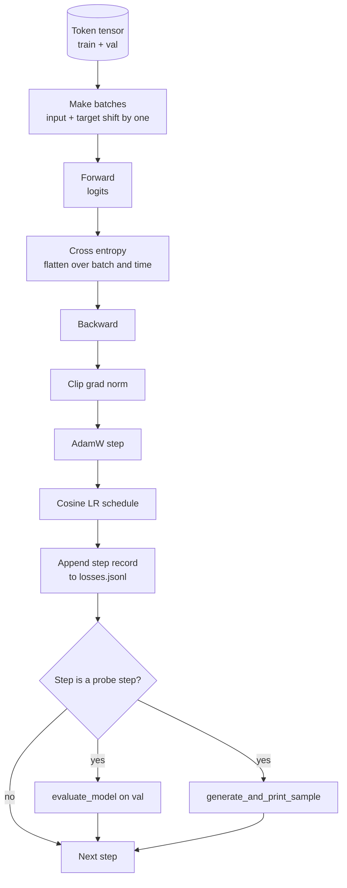

# دوره آموزش و ارزیابی

> یک حلقه ای که اندازه گیری نمی کند یک حلقه ای است که دروغ می گوید. این درس حلقه آموزشی را که مدل GPT را هدایت می کند ایجاد می کند: AdamW با تقسیم کاهش وزن، گرم شدن به علاوه برنامه یادگیری سرعت کوسین، یک `calc_loss_batch`کمک کننده`evaluate_model`انتقال داده های بازده شده،`generate_and_print_sample`هر مرحله K را با یک بررسی کوالتیتیتیو و یک دفترچه JSONL از خسارت ها که می توانید پس از آن نقشه برداری کنید. همان اسکلت هر کدگر LLM را آموزش می دهد که تا به حال ساخته اید.

**Type:** Build
**Languages:** Python
**Prerequisites:** Phase 19 lessons 30 to 35
**Time:** ~90 minutes

## اهداف یادگیری

- یک حلقه آموزشی بسازید که با ورود و هدف مناسب برای پیش بینی توکن بعدی، از دست دادن انتروپی را محاسبه کند.
- تنظیم کردن AdamW با کاهش وزن به تنسورهای وزن اعمال شده و نه به LayerNorm یا تنسورهای تعصب.
- برنامه ی سرعت یادگیری را با گرم شدن خطی و تجزیه کوسین اجرا کنید و LR حاصل را در طول زمان بخوانید.
- بر اساس تقسیم بندی طولانی با `evaluate_model`بنابراین از دست دادن ارزیابی قابل مقایسه در میان اجراها است.
- هر مرحله K نمونه کوالتی را با `generate_and_print_sample`تا قبل از منحنی خسارت انحراف را تشخیص دهد.
- در هر مرحله از دست دادن به JSONL ادامه دهید تا بتوانید روزنامه آموزش را به عنوان یک تحویل باز بارگذاری، نقشه برداری و ارسال کنید.

## مشکل

یک اسکریپت آموزش که از دست دادن را چاپ می کند اما هیچ کاری انجام نمی دهد سه راه شکست می خورد. این نمی تواند به شما بگوید که آیا از دست دادن به دلیل درستی کاهش می یابد (نموذج می تواند مجموعه آموزش را بیش از حد متناسب کند و هرگز یاد بگیرد). این نمی تواند به شما بگوید که آیا یک انحراف شروع شده است (خسارت می تواند برای یک قدم افزایش یابد و بهبود یابد، یا یک قدم و سقوط). این نمی تواند به شما بگوید که مدل چه چیزی آموخته است (خسارت یک مقیاس است؛ نمونه تولید شده یک پاراگراف است). هر سه شکست هم مگر اینکه حلقه اندازه گیری شود پنهان می شوند.

حلقه در این درس به سه راه اندازه گیری می شود. از دست دادن دسته آموزش در هر مرحله. از دست دادن دسته نگه داشته در هر مرحله K. یک ادامه تولید شده از یک پرامپت ثابت در هر مرحله K. دفترچه آموزش در JSONL فرود می آید بنابراین آثار هنری شهادت حلقه است.

## مفهوم



دو قطعه غیر واضح هماهنگی خسارت و شکاف تجزیه آدام و

### تعادل خسارت

مدل نشان دهنده نشان بعدی در هر موقعیت است. اگر دسته ورودی نشان ها باشد`[t0, t1, t2, t3]`، گروه هدف باید باشد`[t1, t2, t3, t4]`. انترپي کراس بر روي شکل صاف محاسبه مي شود`(batch * seq, vocab)`در مقابل هدف صاف`(batch * seq,)`. تغییر را فراموش کنید و شما مدل را برای پیش بینی خود آموزش می دهید که به صفر ضرر نزدیک می شود در حالی که هیچ چیز مفید را یاد نمی گیرد.

### تقسیم شدن آدم

کاهش وزن تنسورهای وزن را منظم می کند اما مقیاس های عادی سازی یا تعصب را نمی کند. قرار دادن تعصب در مقیاس LayerNorm به آرامی مقیاس را به صفر می رساند و عادی سازی را شکسته است. قرار دادن تعصب بر روی تعصب ریاضیات بی ضرر است اما یک ضایعات چرخه است. تقسیم استاندارد این است: تنسورهای شکل ماتریکس (وزن خطی، جدول های گنجان) از بین می روند، هر چیزی که شبیه مقیاس یا تغییر به نظر می رسد، از بین نمی رود.

### گرم شدن + برنامه ی کوسین

گرم کردن سرعت یادگیری را از صفر به هدف در چند صد مرحله افزایش می دهد تا حالت بهینه سازی زمان برای پر شدن داشته باشد. تجزیه کوزین سرعت یادگیری را به صفر در مراحل باقیمانده کاهش می دهد بنابراین مرحله نهایی وزن را در اندازه گام کوچک تنظیم می کند. ترکیب رایج ترین برنامه در آموزش LLM با وزن باز است زیرا بیشتر لحظات شکننده را در هزار قدم اول و هزار قدم آخر حذف می کند.

### ارزیابی انجام شده

`evaluate_model`تعداد ثابت دسته ها از تقسیم اعتبار، جمع خسارت، تقسیم با تعداد دسته ها و بازپرداخت. هیچ گرادینت. هیچ ترک. تعداد قابل تکرار در میان اجرا داده شده به عنوان همان دانه و همان تقسیم. گزارش از دست دادن نگه داشته در کنار از دست دادن تمرین است که چگونه شما بیش از حد مناسب است.

### نمونه گیری کیفی به عنوان یک سیگنال اولیه

یک مدل که از دست دادن تمرین به خوبی کاهش می یابد اما نمونه های تولید شده آن یکسان است شکسته می شود. یک مدل که منحنی از دست دادن صاف به نظر می رسد اما نمونه های تولید شده آن به کلمات منسجم تبدیل می شود یادگیری است. سوند کوالیتیو سریع تر از خواندن منحنی کامل می رود و حالت های اسکالر را می گیرد.

```figure
cap-training-loop
```

## آن را بسازید

`code/main.py`ابزار:

- `make_batches(token_ids, batch_size, context_length)`که یک تنسور طولانی را به جفت ورودی و هدف تقسیم می کند.
- `calc_loss_batch(model, inputs, targets)`که به جلو، صاف می کند و انتروپی کراس اسکالری را باز می گرداند.
- `evaluate_model(model, val_loader, max_batches)`که تعداد ثابت از دسته های اعتبارسنجی را بدون درجه تکرار می کند و متوسط خسارت را باز می گرداند.
- `generate_and_print_sample(model, prompt, max_new_tokens)`که تابع درس 35 نسل را روی یک پرامپت ثابت اجرا می کند و نتیجه را چاپ می کند.
- `build_param_groups(model, weight_decay)`که لیست پارامتر های دو گروه AdamW را تولید می کند.
- `cosine_with_warmup(step, warmup_steps, total_steps, max_lr, min_lr)`که در مرحله ای مشخص LR را بازمی گرداند.
- `train(...)`که چرخه رو ادامه ميده ادامه ميده`outputs/losses.jsonl`، و از دست دادن ارزیابی و نمونه هر`eval_every`قدم ها
- یک نمایش که یک مدل کوچک را بر روی داده های مصنوعی برای تعداد کمی مراحل آموزش می دهد، یک دفترچه JSONL را می نویسد و از دست دادن ارزیابی و نمونه ای را در نقاط سوند چاپ می کند. نمایش در کمتر از یک دقیقه در CPU اجرا می شود.

اجرا کن

```bash
python3 code/main.py
```

تولید: در هر خط از دست دادن مرحله، از دست دادن ارزیابی هر مرحله ی ساند، یک نمونه تولید شده در هر مرحله ی ساند و یک نتیجه نهایی `outputs/losses.jsonl`میتونید با اون شارژ کنید`json.loads`هر خط

## دسته

- `torch`برای autograd، بهینه سازی و ماژول ها
- `main.py`درس 35 را دوباره اجرا می کند`GPTModel`و ماژول های پشتیبانی در سطح محلی.

## الگوهای تولید در طبیعت

سه الگوی، چرخه کتاب درسی را به چیزی تبدیل می کنند که می توانید یک شبه اجرا کنید.

**Gradient norm clipping is non negotiable.**یک دسته بد (دادهای غیرمعمول، یک اوج LR، یک قسمت حاشیه عددی) یک گرادینت بزرگ تولید می کند که ساعت ها تمرین را محو می کند. `torch.nn.utils.clip_grad_norm_(params, max_norm=1.0)`بعد از`backward`و قبل از آن`step`این یک پارامتر آزاد است؛ یکی از آنها پیش فرض است که بیشتر تنظیمات را از بین می برد.

**Resumable JSONL logging, not pickled state.**هر مرحله از دست دادن به عنوان`{"step": int, "train_loss": float, "lr": float}`خطوط در JSONL پایدار هستند: هر تصادف یک اثر قابل خواندن را ترک می کند، می توانید گرفت، می توانید با سی خط پایتون نقشه برداری کنید، و می توانید با خواندن آخرین مرحله آموزش را ادامه دهید. حالت پکل شما را به طرح ماژول دقیق که فایل را تولید کرده است، متصل می کند، که در سراسر ریفاکتورها شکننده است.

**Eval batches drawn from a fixed slice.**توکن های اعتبارسنجی در شروع اسکریپت به دسته ها برش می شوند، نه در پرواز. تولید مجدد بستگی به اینکه دسته های ارزیابی از اجرا به اجرا یکسان باشند؛ در غیر این صورت مقایسه از دست دادن ارزیابی بین دو اجرا، ترکیب دسته را به اندازه مدل اندازه می گیرد.

## ازش استفاده کن

- حلقه در این درس همان اسکلت است که مدل 124M را بر روی داده های واقعی آموزش می دهد.`datasets`-شرايط بارگيري و حلقه بدون تغییر اجرا ميشه
- دفترچه JSONL، نتیجه ای است که یک تمرین را به شواهد تبدیل می کند. درس بعدی از آن استفاده می کند تا یک نقطه بازرسی تازه آموزش دیده را با یک نقطه بازرسی پیش از آموزش مقایسه کند.
- نمونه ی کوالیتیو، چیزی است که از دست دادن اسکالری نمی تواند جایگزینش شود.

## تمرینات

1. اضافه کردن`weight_decay_groups()`آزمایشات واحد که پارامترهای مقیاس و تعصب را تایید می کنند در گروه بدون تجزیه و وزن خطی و ورودی در گروه تجزیه قرار می گیرند.
2. توکن های تصادفی مصنوعی را با بیت از یک فایل متن کوچک جایگزین کنید تا نمایش در چیزی قابل خواندن باشد. نمونه تولید شده از کاراکترهای موجود در فایل استفاده می کند.
3. اضافه کنید`min_lr`طبقه 10 درصد از`max_lr`به جدول برنامه و نقشه مجدد
4. هر بار یه نقطه بازرسی نگه دار`eval_every`مراحل اضافه به دفترچه JSONL. اضافه کنید `resume_from`پرچم که حالت مدل و حالت بهینه سازی را بارگذاری می کند.
5. در هر مرحله از تولید (توکین ها در ثانیه) در کنار از دست دادن ثبت کنید و تایید کنید که در یک باند ثابت باقی می ماند.

## اصطلاحات کلیدی

| Term | What people say | What it actually means |
|------|-----------------|------------------------|
| Loss alignment | "Shift by one" | Input tokens at positions 0..T-1, target tokens at positions 1..T; cross entropy is computed on flattened shapes |
| Decay split | "Two groups" | AdamW receives matrix shaped tensors with weight decay and scale or bias tensors with none |
| Warmup | "Ramp" | The learning rate climbs from zero to its target over a fixed number of steps so the optimizer state can populate |
| Eval batches | "Held out batches" | A fixed slice of the validation token tensor, sliced once at script start, used identically every probe |
| Qualitative probe | "Sample print" | A short generation from a fixed prompt printed every K steps to catch failure modes loss alone hides |

## خواندن بیشتر

- مرحله 19 درس 35 برای مدل که حلقه اجرا می کند
- مرحله 19 درس 37 برای بارگیری وزن های پیش از آموزش به همان مدل
- مرحله 10 درس 04 (GPT کوچک پیش از آموزش) برای روش داده های واقعی.
- مرحله 10 درس 10 (مقياس) برای سطح ارزیابی گسترده تر فراتر از از دست دادن آنترپی کراس.
