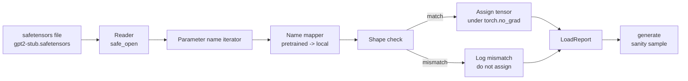

# بارگیری وزنه های پیش از تمرین

> آموزش 124 میلیون مدل پارامتر از ابتدا یک تصمیم بودجه ای است؛ بارگذاری یک نقطه بازرسی منتشر شده یک سه شنبه است. این درس وزن های سبک GPT-2 پیش از آموزش را از یک فایل سیفیتنسور به معماری دقیق از درس 35 بار می گیرد، نام پارامتر را قطعه به قطعه نقشه برداری می کند و عقل یک ادامه برای اثبات بار کار می کند. هیچ شبکه، هیچ بارنده شخص ثالث، هیچ جادوی نامشفق نیست.

**Type:** Build
**Languages:** Python
**Prerequisites:** Phase 19 lessons 30 to 36
**Time:** ~90 minutes

## اهداف یادگیری

- با اون فایل هاي سيفيتنسور رو بخونيد`safetensors`کتابخانه پایتون و اسم و شکل تنسورها رو بررسی کن
- هر نام پارامتر پیش از آموزش را بر روی پارامتر داخل مدل GPT درس 35 نقشه بزنید.
- دو توافق نامه نامی را که بین وزن های GPT-2 منتشر شده و مدل در این مسیر متفاوت است، اداره کنید: `wte/wpe/h.N.attn.c_attn/c_proj`و`mlp.c_fc/c_proj`در مقابل نام های محلی`tok_embed/pos_embed/blocks.N.attn.qkv/out_proj`و`mlp.fc1/fc2`. .
- تشخیص و رد یک عدم مطابقت شکل با یک خطا واضح قبل از هر گونه تحویل وزن اتفاق می افتد.
- یک ادامه کوتاه با وزن های بارگذاری شده ایجاد کنید و تایید کنید که توکن ها از توزیع بارگذاری شده، نه یکی که به طور تصادفی شروع شده است، آمده اند.

## مشکل

وزن های منتشر شده برای معماری شما بسته بندی نشده است. آنها نام های اجرا اولیه استفاده شده را دارند. فایل پیش از آموزش شده دارای `transformer.h.0.attn.c_attn.weight`شکل`(2304, 768)`؛ مدل شما انتظار داره`blocks.0.attn.qkv.weight`شکل`(2304, 768)`(که همان ماتریس در یک کنوانسیون طرح مختلف است) یا مدل شما استفاده می کند `nn.Linear`که ماتریس منتقل شده را ذخیره می کند. همان پارامتر با سه هویت متفاوت ظاهر می شود (نام، شکل، طرح باایت) و بارگذاری باید سه را هماهنگ کند.

یک بارگیری که به طور کوره ای کپی می کند، تنسور درست را در جای اشتباه قرار می دهد و شما یک مدل را دریافت می کنید که بی معنی تولید می کند. بارگیری که وقتی شکل متفاوت است، کپی کردن را انکار می کند اما هیچ چیز را ثبت نمی کند، شما را به حدس می اندازد که کدام تنسور به زمین نرسیده است. بارگیری در این درس واضح است: هر کار ثبت شده است، هر شکل بررسی شده است و یک`LoadReport`خلاصه ميکنه که چي شده، چي شده و چي شده

## مفهوم



نام نقشه برداری فقط یک تابع از رشته به رشته است. شکل بررسی یک اگر است. وظیفه در داخل اتفاق می افتد `torch.no_grad()`پس Autograd بار رو دنبال نميکنه. گزارش نتيجه هر اسم رو نگه داره.

### کنوانسیون نامگذاری GPT-2

وزن های GPT-2 منتشر شده تحت نام هایی مانند:

| Pretrained name | Shape | Meaning |
|-----------------|-------|---------|
| `wte.weight` | (50257, 768) | Token embedding |
| `wpe.weight` | (1024, 768) | Position embedding |
| `h.N.ln_1.weight` | (768,) | LayerNorm 1 scale at block N |
| `h.N.ln_1.bias` | (768,) | LayerNorm 1 shift at block N |
| `h.N.attn.c_attn.weight` | (768, 2304) | Fused QKV linear weight |
| `h.N.attn.c_attn.bias` | (2304,) | Fused QKV linear bias |
| `h.N.attn.c_proj.weight` | (768, 768) | Attention output projection |
| `h.N.attn.c_proj.bias` | (768,) | Attention output projection bias |
| `h.N.ln_2.weight` | (768,) | LayerNorm 2 scale |
| `h.N.ln_2.bias` | (768,) | LayerNorm 2 shift |
| `h.N.mlp.c_fc.weight` | (768, 3072) | MLP fc1 weight |
| `h.N.mlp.c_fc.bias` | (3072,) | MLP fc1 bias |
| `h.N.mlp.c_proj.weight` | (3072, 768) | MLP fc2 weight |
| `h.N.mlp.c_proj.bias` | (768,) | MLP fc2 bias |
| `ln_f.weight` | (768,) | Final LayerNorm scale |
| `ln_f.bias` | (768,) | Final LayerNorm shift |

دو تا غافلگير شدن براي برنامه ریزی`c_attn`،`c_proj`،`c_fc`خطی ها با ماتریس منتقل شده نسبت به چه چیزی ذخیره می شوند `nn.Linear.weight`انتظارات. بارنده در طول تحویل انتقال می دهد. سر LM در پرونده اصلا نیست. مدل بر روی وزن با `wte`، پس سرش با نام مستعار يک بار تنظیم ميشه`wte`زمین ها

### کنوانسیون نامگذاری محلی

مدل در این مسیر از نام های توصیفاتی استفاده می کند:

| Local name | Meaning |
|------------|---------|
| `tok_embed.weight` | Token embedding |
| `pos_embed.weight` | Position embedding |
| `blocks.N.ln1.scale` | LayerNorm 1 scale at block N |
| `blocks.N.ln1.shift` | LayerNorm 1 shift |
| `blocks.N.attn.qkv.weight` | Fused QKV |
| `blocks.N.attn.qkv.bias` | Fused QKV bias |
| `blocks.N.attn.out_proj.weight` | Attention output projection |
| `blocks.N.attn.out_proj.bias` | Output projection bias |
| `blocks.N.ln2.scale` | LayerNorm 2 scale |
| `blocks.N.ln2.shift` | LayerNorm 2 shift |
| `blocks.N.mlp.fc1.weight` | MLP fc1 |
| `blocks.N.mlp.fc1.bias` | MLP fc1 bias |
| `blocks.N.mlp.fc2.weight` | MLP fc2 |
| `blocks.N.mlp.fc2.bias` | MLP fc2 bias |
| `final_ln.scale` | Final LayerNorm scale |
| `final_ln.shift` | Final LayerNorm shift |

نقشه سازی یک تابع ثابت است. درس آن را به عنوان یک دستور ارسال می کند که بارگذاری تکرار می کند.

### ورق های چوبی

وزن واقعی GPT-2 0.5 GB است. دمو آنها را دانلود نمی کند؛ در اولین اجرا یک فکسچر سیفیتنسور کوچک تولید می کند، با کنوانسیون نامگذاری GPT-2 دقیق و اشکال مناسب برای یک مدل 12 بلوک در d_model 192 به جای 768.

```figure
cc-weight-remap
```

## آن را بسازید

`code/main.py`ابزار:

- نقل کوچکی از درس ۳۵`GPTModel`پس این درس خود را محدود می کند.
- `make_pretrained_to_local(num_layers)`که ورودی های هر لایه را گسترش می دهد.
- `load_safetensors(model, path)`که نام ها را تکرار می کند، آنها را نقشه می کشد، شکل را بررسی می کند، وزنه های سبک conv1d را انتقال می دهد و تحت `torch.no_grad()`. به یک`LoadReport`. .
- `make_stub_safetensors(path, cfg)`که یک فایل ثابت با کنوانسیون نامگذاری دقیق پیش از آموزش تولید می کند.
- يه نمايشي که مي سازد`outputs/gpt2-stub.safetensors`در اولین بار، یک مدل جدید ایجاد می کند، یک ادامه تولید شده را از random init ضبط می کند، ستون را بارگذاری می کند، یک ادامه دیگر را ضبط می کند، هر دو را چاپ می کند و تأیید می کند که دو مورد متفاوت هستند (حمله در واقع مدل را تغییر داد).

اجرا کن

```bash
python3 code/main.py
```

خروجی: مسیر ثابت، یک دفترچه بارگذاری به نام، یک `LoadReport`خلاصه، ادامه قبل از بار، ادامه پس از بار و عدم مطابقت شکل در یک تنسور عمداً بد تزریق شده به وسیله برای انجام مسیر شکست.

## دسته

- `safetensors`برای فرمت دیسک و یک خواننده جریان
- `torch`برای مدل و ریاضیات کار
- نه`transformers`نه`huggingface_hub`، هيچ تماس نيروي.

## الگوهای تولید در طبیعت

سه الگوي باعث ميشه بارگيري از تماس با وزنهايي که تو درست نکردي زنده بمونه

**Always validate the file before any assignment.**فایل را باز کنید، هر نام تنسور را با dtype و شکل آن لیست کنید، نقشه برداری کامل را با بررسی شکل اجرا کنید و تنها پس از موفقیت شروع به اختصاص می کنید. مدل های نیمه باردار ماشین های شکست خاموش هستند.

**Log every assignment with the source name and the destination name.**وقتی چیزی اشتباه به نظر می رسد، نوار به شما می گوید که کدام تنسور کجا فرود آمده است؛ گزینه ای خواندن هیکسدمپ است.`LoadReport`کلاس داده ها در این درس دنباله دار است`loaded`،`missing`،`unexpected`و`shape_mismatch`فهرست ها و خلاصه ای را در پایان چاپ می کند.

**The LM head is a weight tying alias, not a separate copy.**تنظیم کردن`model.lm_head.weight = model.tok_embed.weight`بعد از بارگذاری`tok_embed`نماد کاینونیک است. کپی کردن ماتریس ادغام به یک جدید`lm_head.weight`پارامتر با هم ارتباط برقرار ميکنه و تعداد پارامترات رو به آرامی دو برابر ميکنه

## ازش استفاده کن

- بارگذاریگر برای هر فایل سیفیتنسور که از کنوانسیون نامگذاری پیش از آموزش استفاده می کند کار می کند. فایل های واقعی GPT-2 (چیز / متوسط / بزرگ / XL) بدون تغییر کد کار می کنند؛ تنها پیکربندی مدل متفاوت است.
- همان الگوی به وزن های LLaMA، Mistral، Qwen گسترش می یابد هنگامی که نقشه نام را به روز می کنید.
- تولید هوشیاری پس از بارگذاری یک دروازه سریع است: اگر نمونه های پس از بارگذاری شبیه نمونه های قبل از بارگذاری هستند، بارگذاری مدل را تغییر نداد، به این معنی که نقشه برداری به طور ساکت هر تنسور را از دست داد.

## تمرینات

1. اضافه کنید`dtype`استدلال به بارنده که هر تنسور را به یک نوع d هدف (`bfloat16`،`float16`،`float32`) در طول کار.`float32`مدل رو می تونیم به پایین بکشیم`bfloat16`و هنوز هم تولید می کنند.
2. اضافه کردن یک`expected_layers`دلیل که از بارگذاری یک نقطه بازرسی که `h.N`شاخص ها با مدل ها مطابقت ندارند `num_layers`. .
3. بارگذاری را به تابع نسل درس 35 وصل کنید و دو نمونه در کنار هم تولید کنید: یکی از init تصادفی، یکی از دستگاه بارگذاری شده.
4. یک مسیر صادرات اضافه کنید: حالت فعلی مدل را به یک فایل سیفیتنسور جدید با استفاده از کنوانسیون نامگذاری پیش از آموزش وارد کنید. دور و عقب بارنده را دور کنید و تایید کنید که گزارش دارای عدم مطابقت شکل صفر است.
5. طولاني`NAME_MAP`برای مدیریت کنوانسیون نامگذاری LLaMA (بدون تعصب، RMSNorm، طرح qkv مخلوط) و بارگذاری مجدد بارگر را در یک ابزار LLaMA که شما تولید می کنید اجرا کنید.

## اصطلاحات کلیدی

| Term | What people say | What it actually means |
|------|-----------------|------------------------|
| Name map | "Key remapping" | The function from pretrained tensor names to local parameter names; usually a literal dict with one entry per layer index expanded over a loop |
| Shape mismatch | "Bad shape" | The pretrained tensor exists under the mapped name but its dimensions disagree with the local parameter; the loader refuses to assign and logs the pair |
| Transpose-on-load | "Conv1d layout" | Published GPT-2 stores attention and MLP projections in the transpose of what nn.Linear expects; the loader transposes during assignment |
| Weight tying alias | "Shared LM head" | Setting model.lm_head.weight = model.tok_embed.weight so the head and embedding share storage; the head is not in the file because of this |
| Load report | "Coverage summary" | A small dataclass that tracks loaded, missing, unexpected, and shape_mismatch lists; printing it is how you tell whether the load succeeded |

## خواندن بیشتر

- مرحله 19 درس 35 برای معماری که وزن ها را دریافت می کند.
- مرحله 19 درس 36 برای حلقه آموزش که یک نقطه بازرسی مشابه شکل تولید می کند.
- مرحله 10 درس 11 (کوانتيزيشن) براي انجام دادن با وزنهاي باردار وقتي حافظه تنگ باشه
- مرحله 10 درس 13 (بنیاد یک خط خط LLM کامل) برای کل چرخه زندگی در اطراف بار و نتیجه گیری.
