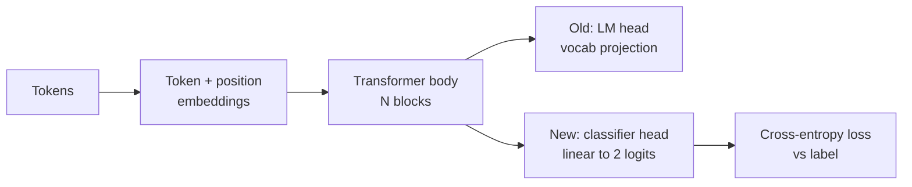
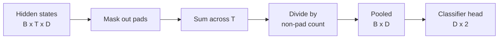
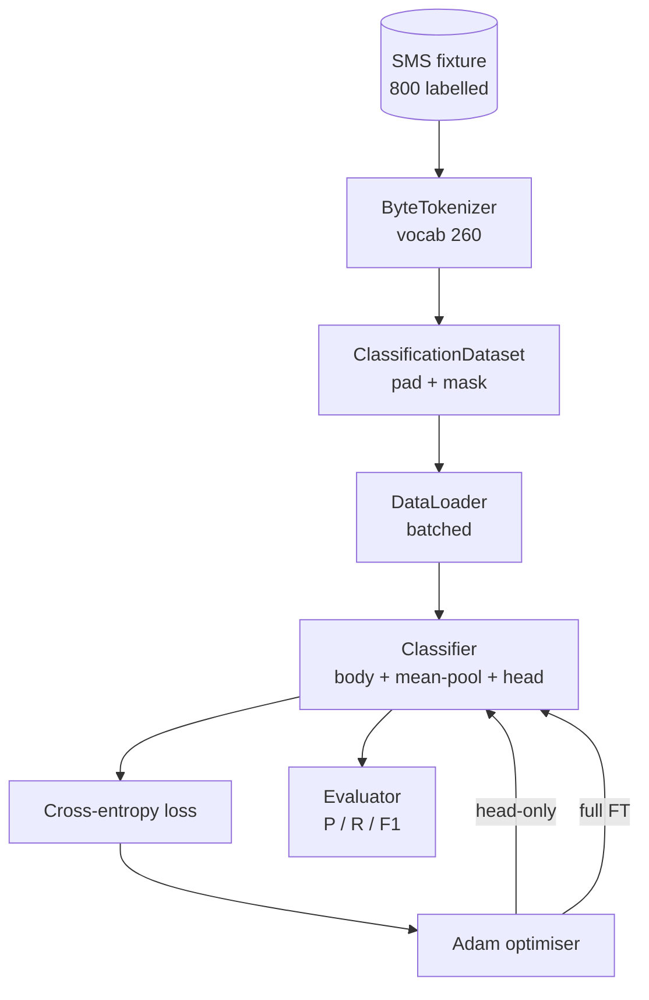

# درس 38: طبقه بندی کننده تنظیم دقیق با تغییر سر

> اولین سنگ پایانی مسیر بی یک مدل زبان پیش از آموزش یک دسته از بلوک های توجه به خود است که در یک سر پیش بینی نشانه ای پایان می یابد. وقتی میخوای اسپام مقابل خمیر، سر اشتباه است اما بدن بیشتر درست است. این درس سر را از بین می برد، یک لایه خطی دو طبقه را روی نمایش جمع شده چسب می دهد و طبقه بندی کننده را به دو روش مختلف آموزش می دهد: تنها لایه نهایی و تنظیم کامل. ارزیابی دقیق، بازنگری و F1 در یک تقسیم طولانی است. شما می آموزید که هر استراتژی چه چیزی را برای شما می خرید و چه چیزی را هزینه می کند.

**Type:** Build
**Languages:** Python (torch, numpy)
**Prerequisites:** Phase 19 lessons 30-37 (NLP LLM track: tokenizer, embedding table, attention block, transformer body, pre-training loop, checkpointing, generation, perplexity)
**Time:** ~90 minutes

## اهداف یادگیری

- سر مدل زبان را بدون شروع مجدد بدن با سر طبقه بندی جایگزین کنید.
- دو رژیم آموزش را اجرا کنید: بدن منجمد (تنها سر) و تنظیم کامل، با یک حلقه آموزش مشترک.
- یک خط داده آگاه از tokeniser بسازید که پوشک ها را پوشاند، پوشک ها را پوشاند و توجه را جمع کند.
- دقت محاسبه، بازپديد، F1 و ماتریس سردرگمی از logits خام.
- دلیل تعادل بین تعداد پارامتر ها، زمان آموزش و اتاق پیشرو

## مشکل

شما یک ترانسفارمر کوچک را در یک کورپوس عمومی پیش از آموزش داده اید. سر خروجی آخرین حالت پنهان را به یک لغت 1000 توکن نشان می دهد. شما اکنون 800 پیام SMS را با برچسب اسپم یا خمیر دارید و شما می خواهید یک طبقه بندی کننده دوگانه داشته باشید. سه گزینه وجود دارد.

گزینه اشتباه آموزش یک طبقه بندی کننده جدید از ابتدا در 800 نمونه است. بدن مدل پیش از آموزش قبلاً ساختار مفید را کدگذاری می کند: هویت کلمه، موقعیت، همدست بودن ساده. آن را از بین می برد و محاسباتی که آن را ساخته است را هدر می دهد.

دو گزینه مناسب است سر سوئیپ با بدن یخ زده و سر سوئیپ با بدن قابل آموزش. آموزش تنها سر سریع است، تقریبا آزاد در حافظه، و به ندرت با این داده های کوچک بیش از حد. تنظیم کامل آهسته تر است، می تواند روی داده های کوچک بیش از حد مناسب باشد، اما زمانی که دامنه زیر جریان از corpus پیش از آموزش منحرف می شود، دقت بیشتری را به دست می آورد.

این درس هر دو را می سازد، بنابراین شما می توانید آنها را در یک دستگاه مشابه مقایسه کنید.

## مفهوم



مدل یک تابع است`f_theta(tokens) -> hidden_states`سر يه وظيفه`g_phi(hidden) -> logits`. عوض کردن سر ها به معنی نگه داشتن`theta`و جایگزین کردن`g_phi`پارامترهای بدن بخش گران قیمت هستند سر یک لایه خطی است

دو مجموعه پارامتر قابل آموزش مهم است:

- `theta`(جسم): ده ها هزار وزن در هر بلاک توجه
- `phi`(سرش):`hidden_dim * num_classes`وزن و تعصب

در آموزش تنها با سر شما gradients را با حساب کنید`phi`و با آنها صفر کنیم`theta`. پيتورچ اجازه ميده اينکارو با تنظیم کردن`requires_grad=False`پس اونم فقط سر رو مي بينه و بدن هم منجمد ميشه

در تنظیم کامل شما اجازه می دهید gradients جریان به عقب از طریق کل استیک. وزن بدن حرکت به تناسب هدف طبقه بندی. خطر فاجعه بار فراموش کردن اطلاعات کوچک است: قبل از تمرین بدن توسط شور بیش از حد مناسب شسته می شود.

## پرسش جمع آوری

یک طبقه بندیگر به یک ویکتور در هر ردیف نیاز دارد نه به یک ویکتور در هر توکن. سه انتخاب رایج:

- **Mean pool**: متوسط حالت های پنهان در طول دنباله، با وزن ماسک توجه.
- **CLS pool**: یک توکن خاص را آماده کنید و فقط از تولید آن استفاده کنید. این کاری است که BERT انجام می دهد.
- **Last-token pool**این کاری است که طبقه بندی کنندگان کلاس GPT انجام می دهند.

این درس از جمع آوری میانگین با وزن ماسک توجه صریح استفاده می کند. این ساده ترین است، یک سیگنال پایدار در طول طول ردیف را می دهد و نیاز به آموزش قبل از یک توکن CLS ندارد.



## داده ها

800 پیام SMS، 400 اسپم و 400 خرم، به طور تعیین کننده در `code/main.py`. ژنراتور از یک دانه ثابت استفاده می کند، قالب ها را انتخاب می کند و پرکننده های اسلات را جایگزین می کند و پیام هایی بین 5 تا 25 توکن را ارسال می کند. مجموعه داده های واقعی دارای صدا هستند که این سازنده انجام نمی دهد. هدف از سازنده بازیافت است.

داده ها 80/20: 640 قطار، 160 آزمون تقسیم می شوند. تقسیم ها طبقه بندی می شوند تا مجموعه آزمایش تعادل 50/50 را حفظ کند. مجموعه ای که با تعادل شناخته شده است اجازه می دهد دقت و یادآوری به عنوان اعداد صادقانه خوانده شود.

## متریک ها

طبقه بندی دوگانه با کلاس 1 به عنوان کلاس مثبت (سپام) شمارش:

- `TP`: اسپم پیش بینی شده، اسپم بود.
- `FP`: اسپم پیش بینی شده، گوشت بود
- `FN`: پیش بینی شده که گوشت گوشت، اسپم بود.
- `TN`: پیش بینی شده که گوشت خوک، گوشت خوک بود

سه شاخص اصلی:

- `precision = TP / (TP + FP)`از پيام هاي اسپام نشان داده شده، چه فرقي در واقع هستند؟
- `recall = TP / (TP + FN)`از اسپام واقعی، چه شکافي از پرچم مدل شده؟
- `F1 = 2 * P * R / (P + R)`. متوسط هماهنگ دوتا

یک ماتریکس سردرگمی چهار عدد را به عنوان یک شبکه 2x2 چاپ می کند. دمو این را برای هر دو رژیم آموزش می نویسد.

```figure
cap-classifier-head-swap
```

## معماری



بدن یک ترانسفورماتور کوچک است: لغت 260، پنهان 64، 4 سر، 2 بلوک، حداکثر ترتیب 32. آن را به اندازه کافی کوچک است تا هر دو رژیم را به تقلب در عرض نه دقیقه در CPU آموزش دهد. آن را در درس پیش آموزش داده نمی شود؛ در عوض، `pretrain_quick`کمک کننده پنج دوره آموزش LM را بر روی متن همان دستگاه انجام می دهد تا به بدن یک نقطه شروع غیر معمولی بدهد. این درس را در خود نگه می دارد.

## چه چیزی می سازید

اجرای این برنامه یک`main.py`علاوه بر یک ماژول آزمایش (`code/tests/test_main.py`)

1. `ByteTokenizer`: نقشه بايت ها به شناسه ها، رزرو شناسه پاد
2. `Block`: یک بلوک ترانسفورماتور با توجه چند سر و یک لایه تغذیه ای.
3. `LMBody`: توکن + موقعیت گنجانده شده به علاوه یک دسته از بلوک. حالت پنهان را باز می کند.
4. `MeanPool`: متوسط وزن شده ماسک در طول محور دنباله.
5. `Classifier`بدن، پول، سر خطی. بدن در تمام رژیم ها یکسان است.
6. `freeze_body`و`unfreeze_body`: تگگ`requires_grad`در مورد پارامترهای بدن
7. `train_classifier`: یک حلقه مشترک. مدل و یک بهینه ساز را برای هر گروه پارامتر قابل آموزش می پذیرد.
8. `evaluate`: مجموعه تست رو اجرا ميکنه و بازمياد`Metrics(precision, recall, f1, confusion)`. .
9. `run_demo`: قبل از تمرین بدن به مدت کوتاهی، سپس آموزش و ارزیابی فقط سر، سپس کامل، چاپ هر دو گزارش، و خروج صفر.

## چرا مقایسه مهم است

در این دستگاه، شما معمولاً دقت نزدیک به 0.9 را می بینید و پس از بیست دوره آموزش تنها با سر نزدیک به 0.85 را به یاد می آورید. تنظیم کامل حدود سه برابر طول می کشد و به هر دو جهت به چند نقطه می رسد، بسته به دانه تصادفی.

درسی برنده را انتخاب نمی کند. به شما یاد می دهد که اعداد و هزینه را بخوانید. در 800 نمونه و یک بدن کوچک، تنها سر انتخاب درست است. در 80,000 نمونه و یک بدن بزرگتر، کامل تنظیم دقیق شروع به پرداخت هزینه می کند. قرارداد شما از این درس است API: همان `train_classifier`تابع هر دو را اداره می کند و سوگل یک تماس است.

## اهداف را به دست آورید

- یک رژیم سوم اضافه کنید که فقط آخرین بلوک را از یخ زدایی می کند. این گاهی اوقات به عنوان تنظیم جزئی نامیده می شود. هزینه کمتری نسبت به FT کامل دارد و بیشتر از تنها سر می آموزد.
- اضافه کردن یک برنامه ریزی نرخ یادگیری. یک برنامه cosine در سر و یک نرخ ثابت کوچکتر در بدن یک تنظیمات تولید رایج است.
- جمع کردن متوسط را با یک مجموعه توجه آموخته جایگزین کنید: یک لایه توجه کوچک با یک سوال آموخته. این اغلب در دنباله های طولانی تر از جمع متوسط می شود.

اجرا به شما هک می دهد تست ها قرارداد را می بندند اعداد شما هستند که باید فشار دهید
