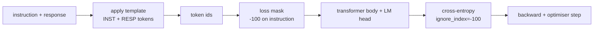
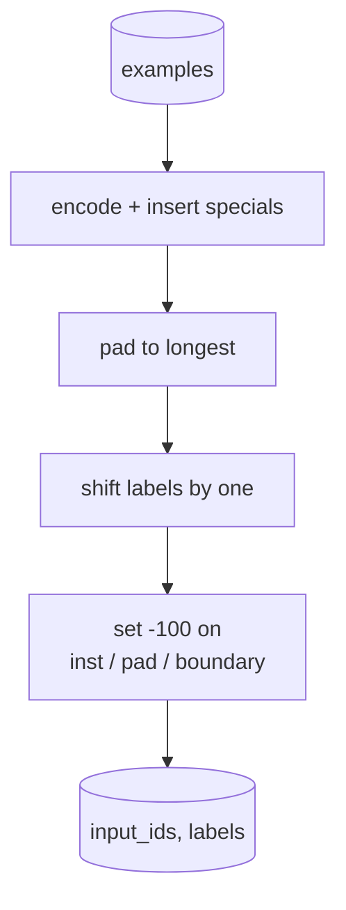
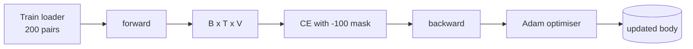

# درس 39: تنظیم دستورالعمل با تنظیم دقیق تحت نظارت

> یک مدل پایه پیش از آموزش می تواند یک دنباله را گسترش دهد اما نمی تواند از دستورالعمل پیروی کند. تنظیم دقیق تحت نظارت کوچکترین تغییر است که این را حل می کند: نمونه های یک دستورالعمل و پاسخ مطلوب را به مدل تغذیه کنید و بدن را برای پیش بینی نمادهای پاسخ آموزش دهید. نکته اینه که فقط میخوای از دست دادن به خاطر پاسخ حساب بشه نه دستور این درس یک حلقه SFT سبک آلباکا با یک تابع جمع بندی سفارشی که نشان های دستورالعمل را با `ignore_index=-100`، در 200 جفت آموزش و پاسخ، و ارزیابی در یک تقسیم نگه داشته با استفاده از مطابقت دقیق.

**Type:** Build
**Languages:** Python (torch, numpy)
**Prerequisites:** Phase 19 lessons 30-37 (NLP LLM track: tokenizer, embedding table, attention block, transformer body, pre-training loop, checkpointing, generation, perplexity)
**Time:** ~90 minutes

## اهداف یادگیری

- فرمت داده های جفتی دستورالعمل-جواب به یک ردیف علت واحد با توکن های مرزی صریح.
- یک تابع جمع بندی بسازید که توکن های دستورالعمل را پنهان کند تا تکان های پاسخ فقط با توکن های عبور محاسبه شود.
- يه بدن کوچولو ترانسفورماتور رو تحت هدف SFT آموزش بده و حرکت متريک ارز رو تماشا کن
- تولید طمع و نمونه گیری دمایی را اجرا کنید که به مرز پاسخ و شروع احترام بگذارد.
- محاسبه مطابقت دقیق در تکمیل تولید شده

## مشکل

مدل پایه ای که با پیش بینی توکن بعدی آموزش دیده است هیچ ایده ای از اینکه دستورالعمل چیست ندارد.`"What is the capital of France?"`و این سوال را ادامه می دهد یا یک جمله جدید را اختراع می کند. مدل زبان را دارد اما قرارداد فرمت را ندارد.

قرارداد SFT یک قالب رشته است. هر مثال آموزش به یک ردیف واحد با سه منطقه تبدیل می شود:

```text
<INST> What is the capital of France? <RESP> The capital of France is Paris.
```

توکن های مرزی توکن های ویژه ای هستند که در زمان آموزش ذخیره می شوند. مدل می آموزد که همه چیز بعد از آموزش`<RESP>`هدف بعدی نماد پایه هنوز هم اعمال می شود؛ فقط در یک کورپوس آموزش داده می شود که هر نمونه این شکل را دارد.

اما یک مشکل وجود دارد. اگر کل دنباله را به یک از دست دادن آنترپی واسطه وانیلا تغذیه کنید، شما مدل را برای پیش بینی نشانه های دستورالعمل آموزش می دهید. دستورالعمل داده می شود. شما می خواهید گرادیو صفر در این موقعیت ها باشد. راه حل ماسک است.

## مفهوم



`ignore_index`این ویژگی`torch.nn.functional.cross_entropy`هر موقعیتی که به `ignore_index`به صفر از دست دادن و صفر گرادینت کمک می کند.`-100`. تابع کلات دو تنسور ایجاد می کند مثلا: `input_ids`(تسلسل کامل) و`labels`(کاپی از `input_ids`با موقعیت های آموزش که توسط `-100`)

مدل تمام دنباله را در طول عبور جلو می بیند؛ توجه می تواند به دستورالعمل توجه کند. از دست دادن فقط نمادهای پاسخ را می شمرد. این دقیقاً چیزی است که شما می خواهید: شرایط در دستورالعمل، پیش بینی پاسخ.

## داده ها

دوصد جفت دستور و پاسخ به طور تعیین کننده در `main.py`اونها شش نوع وظیفه رو پوشش ميدن:

- یک شات واقعی (پرداخت X)
- ریاضیات
- استخراج لیست
- خلاصه ی یک جمله
- کد (پرداخت، مرتب کردن)
- تعریف

هر کار دارای یک دستورالعمل قالب بندی شده و یک پاسخ تعیین کننده است. این عمدا ساده است. مطابقت دقیق شکننده است و درس از یک وسیله استفاده می کند که پاسخ صحیح یک رشته خاص است. مجموعه داده های واقعی SFT نیاز به متریک های مبهم دارند؛ اصل یکسان است.

تقسیم ها 160 قطار، 40 آزمون است. مجموعه آزمون شامل تمام شش نوع وظیفه است تا هر دسته می تواند مطابق دقیق گزارش شود.

## نشان دادن و پوشاندن

توکنيزر بايت سطح با سه مخصوص مخصوص:

- `INST_ID = 256`: آغاز منطقه آموزش را نشان می دهد.
- `RESP_ID = 257`: مرز بین آموزش و پاسخ را نشان می دهد.
- `PAD_ID = 258`: پوشیدن برای دسته های با طول متغیر

ترتیبش اینه`[INST] inst_bytes [RESP] resp_bytes [PAD]*`. عملکرد جمع بندی:

1. هر مثال رو نشان ميده
2. هر نمونه ای را در دسته به طولانی ترین ردیف در دسته قرار می دهد.
3. ساختمان ها`labels`= `input_ids`با یک تغییر (هدف LM علل) ، با:
   - منطقه دستورالعمل جایگزین شده با `-100`. .
   - منطقه ی پر کردن جایگزین شده توسط `-100`. .
   - .`RESP_ID`موقعیت مرزی خودش با `-100`(شما مدل را برای پیش بینی نشانه مرزی آموزش نمی دهید؛ آن چیزی را پیش بینی می کند که بعد از آن می آید).



تغییر روش علتي استاندارد است: موقعیت`i`از`input_ids`موقعیت پیش بینی می کند`i+1`، پس`labels[i] = input_ids[i+1]`(با سقوط موقعیت نهایی از ورودی و اولین سقوط از هدف) ماسک پس از تغییر به سمت سمت راست قرار می گیرد.

## آموزش



این حلقه حلقه استاندارد PyTorch SFT است. آدم، سرعت یادگیری در حدود 3e-4 تا 1e-3, ده تا بیست دوره در این سازنده، هیچ برنامه ریزی کننده ای. مدل به اندازه کافی کوچک است (پوشیده 96، 2 بلوک، حداکثر طول 64) تا در عرض دو دقیقه به کنورژن در CPU آموزش دهد.

هر پنجم دوره حلقه یک ارزیابی کوچک در مجموعه نگه داشته شده اجرا می کند و مطابقت دقیق را چاپ می کند. دیدن مطابقت دقیق از 0.0 در دوره یک به چیزی شبیه به 0.85 در دوره پانزدهم، پاداش درس است: شما می توانید مدل را ببینید که در همان زمان فرمت و پاسخ را یاد می گیرد.

## نسل

در زمان ارزیابی مدل پیشگویی دستورالعمل را دریافت می کند`[INST] inst_bytes [RESP]`و توکن ها را تولید می کند تا هر دو:

- دنباله به دست می رسد`max_len`یا
- مدل یک stop heuristic خاص را منتشر می کند: دو بایت متوالی پایان جمله (`.`،`!`،`?`)

درسی ها کدگذاری طمع و نمونه گیری دمایی اختیاری را ارسال می کنند. درست مطابقت طمع را استفاده می کند زیرا دمای میترک را استوکاستیک می کند. سیستم های واقعی اغلب نمونه گیری می کنند، سپس به طور مبهم قضاوت می کنند؛ این لوله درس 41 است.

## ارزیابی دقیق مطابقت

مطابقت دقیق سخت ترین متریک متن است. رشته پاسخ پیش بینی شده عادی سازی می شود (بخش کم، فضای سفید، فضاهای دوگانه سقوط) و در مقایسه با پاسخ مرجع، به همان شیوه عادی سازی می شود. متریک به عنوان مثال 1 یا 0 است. مجموع متوسط است.

لوله های SFT واقعی تطابق دقیق را با F1 سطح توکن (درس 41) و یک مدل قاضی تکمیل می کنند. تطابق دقیق همچنان مفید است زیرا واضح است؛ اگر 0.7 می گوید، دقیقا 70 درصد از دستورالعمل های آزمایش کاراکتر پاسخ طلا را برای شخصیت تولید می کنند.

```figure
cc-sft-loss-mask
```

## چه چیزی می سازید

اجرای این برنامه یک`main.py`و تست ها

1. `InstructionTokenizer`: کدگر باط سطح با ویژه های مخصوص. کد یا یک پیشگویی دستورالعمل یا یک جفت کامل.
2. `make_dataset`: 200 جفت در شش نوع وظیفه با یک دانه ثابت تولید می کند.
3. `SFTDataset`: بازپرداخت`(input_ids, labels)`مثلاً، قبلاً ماسک آماده شده.
4. `sft_collate`: پودر پویا، ساخت تنسور دسته، مجموعه ها `-100`در موقعیت های آموزش و پوش
5. `TinyGPT`: بدن ترانسفورماتور و سر LM بسته یا آزاد
6. `train_sft`: حلقه SFT، با هک های ارزیابی دوره ای.
7. `generate`: کد علت از یک پیشگویی، طمع یا نمونه گیری، با توقف heuristic.
8. `exact_match`: مقایسه با رشته های عادی، بازده ها در `[0, 1]`. .
9. `run_demo`: داده ها را جمع آوری می کند، قطار برای بیست دوره، ارزیابی می کند، تجزیه و تحلیل هر دسته را چاپ می کند، موفقیت را صفر می کند.

## چرا ماسک مهمه

بدون ماسک، از دست دادن به توکن های دستورالعمل به عنوان هدف قرار می گیرد. مدل یاد می گیرد که دستورالعمل را پیش بینی کند. این یک هدف متفاوت است و به دو روش یک مدل بدتر را تولید می کند. اول، ظرفیت مدل به صرفه جویی در بازسازی ورودی که کاربر همیشه ارائه می دهد. دوم، از دست دادن پاسخ در مجموع گرادیانت کمتر است زیرا توکن های دستورالعمل تعداد توکن های پاسخ در اکثر دسته ها را از دست می دهند؛ نرخ یادگیری موثر بهینه کننده در بخش مورد علاقه شما کمتر از آنچه قصد داشتید است. ماسک پولش نیست، هدفش اینه

## اهداف را به دست آورید

- اضافه کردن گرما در سرعت یادگیری و سپس تجزیه کوسین. SFT نسبت به LR حساس تر از قبل از تمرین است.
- اضافه کردن ثبت خسارت در هر توکن و نقشه منحنی خسارت در طول آموزش. توجه داشته باشید که دوره های اولیه توسط توکن های قالب (`<RESP>`در زمان های بعد، نمادهای پاسخ واقعی برتری دارند.
- ارزیابی را به BLEU-1 یا chrF گسترش دهید. مطابقت دقیق مدل هایی را که یک پارافرز با همان پاسخ تولید می کنند، دست کم می گیرد.
- یک قالب چت با فرمت چند نوبت اضافه کنید و روی یک فکسچر که شامل پیگیری ها است، تمرین کنید.

اجرای شما قرارداد فرمت، ماسک و حلقه را می دهد. تغییر هدف از مدل پایه به دنبال کننده دستورالعمل یک عملکرد جمع بندی است.
