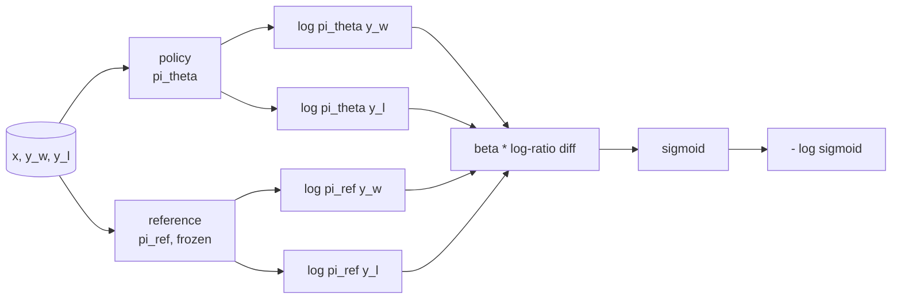
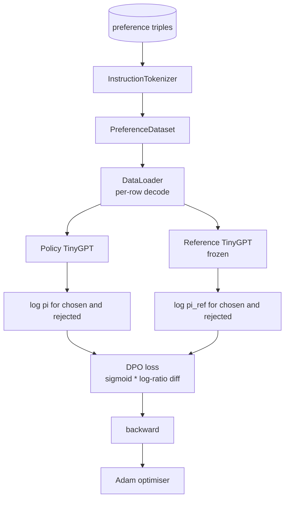

# درس 40 Capstone: بهینه سازی مستقیم ترجیح از ابتدا

> مدل های پاداش و PPO، مجموعه کلاسیک RLHF هستند. DPO این دسته را به یک خسارت تحت نظارت واحد که مستقیماً با یک سیاست در برابر زوج های اولویت مطابقت دارد، فرو می ریزد. این درس از دست دادن DPO از هویت تفاوت پاداش، یک مدل مرجع کاری و مدل سیاست را ارسال می کند، احتمالات ثبت هر توکن را محاسبه می کند و یک ترانسفورماتور کوچک را بر روی یک تنظیمات ترجیح تکمیل های انتخاب شده و رد شده آموزش می دهد. تست ها ریاضیات خسارت و جهت گرادینت را مشخص می کنند تا بدانید که اجرای آن با کاغذ مطابقت دارد.

**Type:** Build
**Languages:** Python (torch, numpy)
**Prerequisites:** Phase 19 lessons 30-37 (NLP LLM track: tokenizer, embedding table, attention block, transformer body, pre-training loop, checkpointing, generation, perplexity)
**Time:** ~90 minutes

## اهداف یادگیری

- از دست دادن DPO به عنوان یک سیگمائید بر روی یک تفاوت ترازو شده در نسبت ثبت را اخذ کنید و آن را به پاداش ضمنی متصل کنید.
- یک مدل مرجع + مدل سیاست با یک مرجع منجمد و یک سیاست قابل آموزش ایجاد کنید.
- احتمالات ثبت در سطح ردیابی را در هر دو مدل محاسبه کنید، توکن های فوری را پنهان کنید.
- آموزش سیاست در`(prompt, chosen, rejected)`سه برابر و نگاه کنين که سوابق انتخاب شده نسبت به رد شده بالا ميره
- رفتار پاین با آزمایشات ریاضی از دست دادن، نشانه گرادینت و عدم تغییر مرجع.

## مشکل

شما یک مدل SFT دارید. این دستورالعمل را دنبال می کند، اما خروجی آن نامساوی است؛ برخی از تکمیل ها واضح هستند، برخی از کامل ها صریح یا نادرست هستند. شما همچنین مجموعه داده های کوچک از زوج های اولویت را دارید: برای یک پرامپت، یک انسان یک تکمیل را به عنوان انتخاب و دیگری را به عنوان رد نشان می دهد.

پاسخ کلاسیک RLHF یک خط لوله دو مرحله ای است. یک مدل پاداش را بر اساس ترجیحات آموزش دهید. سیاست را در برابر پاداش با PPO بهینه سازی کنید. این کار می کند اما گران است: دو مدل در حافظه در طول PPO، کنترل KL برای نگه داشتن سیاست در نزدیکی مرجع، هک پاداش زمانی که مدل پاداش شکننده است.

DPO هر دو مرحله را با یک ضرر تحت نظارت جایگزین می کند. مدل پاداش هرگز به طور صریح وجود ندارد. سیاست مستقیماً بر روی زوج های ترجیح آموزش داده می شود، با مجازات KL صریح در برابر مرجع SFT. همان راه حل بهینه تحت مدل ترجیح برادی-ترری، کد بسیار کمتر است.

## مفهوم

از مدل برادلي-تيري شروع کنيد.`x`و دو تا تکمیلش`y_w`(تخيلي شده) و`y_l`(منفي شد) احتمالي که انسان ترجیح ميده`y_w`است

```text
P(y_w > y_l | x) = sigmoid( r(x, y_w) - r(x, y_l) )
```

کجا`r`يه تابع پاداش پنهان هست`r`از ترجیحات، سپس آموزش سیاست`pi`برای حداکثر کردن`r`با لنگر KL:

```text
max_pi   E_{x, y~pi} [ r(x, y) ] - beta * KL(pi || pi_ref)
```

اخذ DPO نشان می دهد که سیاست مطلوب`pi*`در این هدف، شکل بسته ای دارد که در نظر گرفته می شود`r`:

```text
pi*(y | x) = (1/Z(x)) * pi_ref(y | x) * exp( r(x, y) / beta )
```

دوباره ترتيبش بده`r`:

```text
r(x, y) = beta * ( log pi*(y | x) - log pi_ref(y | x) ) + beta * log Z(x)
```

.`log Z(x)`اصطلاح برای هر دو مورد یکسان است`y_w`و`y_l`(باید بستگی به`x`نه`y`), پس وقتی تفاوت ترجیح را محاسبه می کنید، آن را لغو می کند:

```text
r(x, y_w) - r(x, y_l) = beta * ( log pi_theta(y_w|x) - log pi_ref(y_w|x)
                                - log pi_theta(y_l|x) + log pi_ref(y_l|x) )
```

جایگزینش کن به سگمید بریلی-ترری و احتمال منفی ثبت را بر روی زوج های ترجیح بردار:

```text
L_DPO(theta) = - E_{(x, y_w, y_l)} [
  log sigmoid( beta * ( log pi_theta(y_w|x) - log pi_ref(y_w|x)
                       - log pi_theta(y_l|x) + log pi_ref(y_l|x) ) )
]
```

این یک ضایعه است. این یک سیگمائید بر روی یک مقیاس واحد است به عنوان مثال، از چهار احتمال ثبت محاسبه شده است. هیچ مدل پاداش جداگانه ای. هیچ PPO. هیچ اصطلاح KL در ضایعه نیست. محدودیت KL به مشتق شکل بسته پخته شده است.



## نشانه ی درجه بندی

قبل از هر مسابقه تمرین، یک بررسی عقل مفید داشته باشید.`log pi_theta(y_w | x)`:

```text
d L_DPO / d log pi_theta(y_w | x) = - beta * (1 - sigmoid(z))
```

کجا`z`این برای همه منفی است`z`، که به این معنی است: افزایش احتمال ثبت سیاست از تکمیل انتخاب شده کاهش می یابد.`log pi_theta(y_l | x)`مثبت است: افزایش احتمال رد شده روزنامه، افزایش خسارت است. آموزش، انتخاب شده را بالا و رد شده را پایین می کشد. مرجع منجمد است؛ حرکت نمی کند.

## داده ها

12 تا از اولویت ها با درس سه برابر میشن`(prompt, chosen, rejected)`. تکمیل انتخاب شده کوتاه و دقیق است. آنچه رد شده است کلامی، غیر موضوعی یا اشتباه است. زوج ها شامل خانواده های وظیفه مشابه درس 39 (سرمایه، حساب، لیست) می شوند، بنابراین یک سیاست که از یک پایه SFT آغاز شده است، نقطه شروع معقول دارد.

این سازنده عمداً کوچک است. DPO بر روی ده ها هزار جفت در تولید کار می کند؛ اینجا، نکته این است که ریاضیات از دست دادن و حلقه در یک مجموعه داده کوچک از انتها به انتها اجرا می شود و شکاف انتخاب شده در مقابل رد شده به طور قابل مشاهده افزایش می یابد.

## تغییر نامناسب

یک پیاده سازی DPO باید مدل مرجع را با دقت اداره کند. مرجع مدل SFT است که در محل آن منجمد شده است. سه ویژگی باید داشته باشد:

- پارامترهای مرجع هیچ وقت گرادینتی دریافت نمی کنند.
- احتمالات روزنامه مرجع هیچوقت بین دوره ها تغییر نمی کند.
- سیاست از همان وزنهای مرجع شروع می شود.`theta`این مرجع و همچنین یک به روز رسانی آموخته شده است؛ شروع سیاست به عنوان یک کپی از مرجع شروع به خوبی تعریف شده است.)

اجرای این مقررات با:

- بسته بندی مرجع در `torch.no_grad()`در طول گذرگاه های جلو
- تنظیم کردن`requires_grad=False`در هر پارامتر مرجع
- ساخت سیاست از طریق `policy.load_state_dict(reference.state_dict())`پس از اینکه مرجع ساخته شده است.

```figure
cap-dpo-preference
```

## معماری



مدل همان TinyGPT است که در درس 39 استفاده شده است (تنها برای کپیکن، علت، نشانه های بائتی).

## چه چیزی می سازید

اجرای این برنامه یک`main.py`و تست ها

1. `InstructionTokenizer`: باط tokeniser با `INST`و`RESP`شکل مشابه درس 39
2. `TinyGPT`شکل مشابه با درس 39 است بنابراین درس خودآموزی است حتی اگر 39 را رد کنید
3. `make_preferences`: 12 باز می گردد`(prompt, chosen, rejected)`سه برابر
4. `sequence_log_prob`: به صورت مدل، یک پیشگویی سریع و یک تکمیل، مجموعه احتمالات log-token بعدی را در طول تکمیل (هیچ سهم موقعیت سریع) باز می گرداند.
5. `dpo_loss`: چهار احتمالات ثبت را می گیرد و`beta`, تنسور از دست دادن هر نمونه و دلتا پاداش ضمنی برای ثبت را باز می گرداند.
6. `train_dpo`: per-epoch حلقه که محاسبه انتخاب شده و رد شده log-سپرود تحت سیاست و مرجع، اعمال از دست دادن و مراحل آدم.
7. `evaluate_margins`: بازمی گردد میانگین بازمی گردد احتمال ثبت نام انتخاب شده در هر نقطه از سیاست.
8. `run_demo`: از یک برنامه کوچک قبل از گرمایش، منابع و سیاست را ایجاد می کند، وزنه ها را کپی می کند، قطار ها را برای سی مرحله، از دست دادن و حاشیه هر مرحله را چاپ می کند و از صفر در موفقیت خارج می شود.

## چرا DPO کار می کند

DPO به لحاظ ریاضی معادل RLHF در مدل اولویت برادلی-ترری است، تا به پارامترسازی پاداش. پاداش ضمنی `r(x, y) = beta * (log pi(y|x) - log pi_ref(y|x))`از اولویت ها تا تابع `x`، که تفاوت را لغو می کند. سیاست فرم بسته به شما اجازه می دهد که از مدل پاداش صریح خارج شوید. محدودیت KL به طور ساختاری اعمال می شود: هر انحراف از`pi`از`pi_ref`این نسبت به روزگار بزرگتر می شود و سیگمائید اشباع می شود که وقتی سیاست خیلی دور می رود، گرادینتی را خنک می کند.

## اهداف را به دست آورید

- یک نرمال سازی طول به مجموعه احتمال ثبت اضافه کنید: تقسیم با طول تکمیل. تعصب طول یک حالت شکست DPO شناخته شده است که در آن مدل ترجیحاً تکمیل های کوتاه تر را انتخاب می کند زیرا احتمال ثبت آنها در شرایط مطلق بزرگتر است.
- اضافه کردن ویرانه IPO از خسارت: جایگزین sigmoid + log با `(z - 1)^2`.با هم تراز در دستگاه مقایسه کنید
- یک پارامتر نرم کردن برچسب را اضافه کنید که بین برچسب سخت انتخاب شده و رد شده و یک استاندارد 0.5 بین قرار می گیرد.
- مرجع را با مدل ارزان تر کوچکتر جایگزین کنید (ذوق لثه دانش).

اجرا به شما بازده، عدم تغییر مرجع و حلقه آموزش می دهد. ریاضی درس است. کد ریاضی را مشخص می کند.
