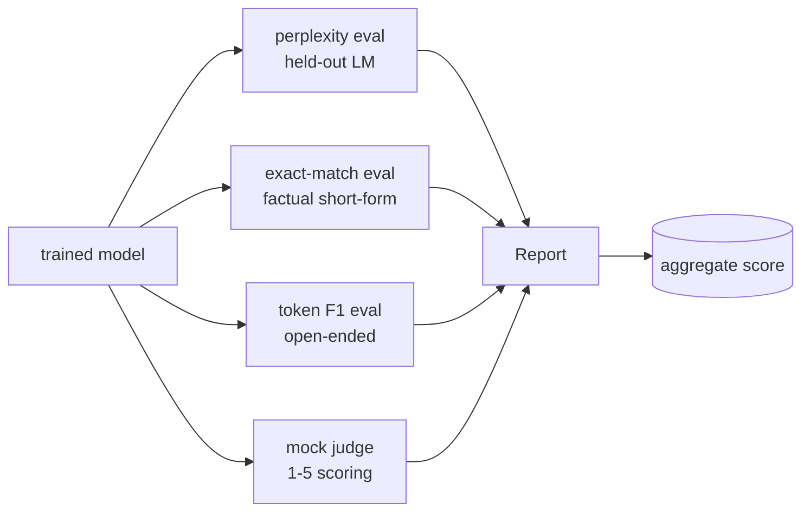
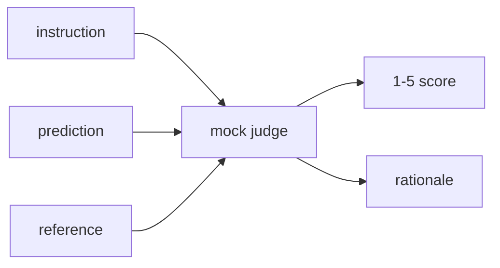
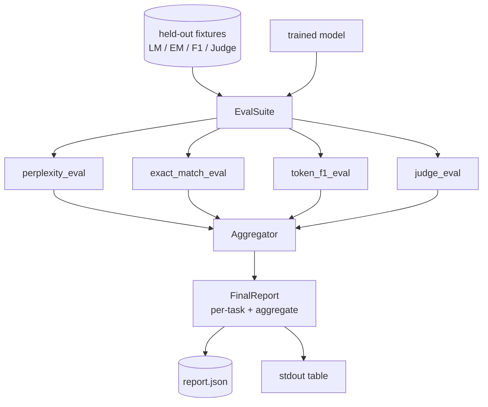

# درس 41: خط لوله ارزیابی کامل

> آموزش بخش است که شما می توانید با منحنیات از دست دادن نظارت کنید. ارزیابی بخشی است که باید طراحی کنید. این درس یک خط پایپلین ارزیابی یکپارچه را ایجاد می کند که هر مدل زبان آموزش دیده را می گیرد، چهار ارزیابی متغیر را روی آن اجرا می کند، نتایج را به یک گزارش در هر کار جمع می کند و یک محاکمه محلی LLM به عنوان قاضی را ارسال می کند تا حلقه بدون شبکه اجرا شود. چهار ارزیابی شامل ابعاد مورد نیاز هر مدل حمل و نقل می شود: مدل سازی زبان (عجیب بودن) ، درست بودن شکل کوتاه (مطابق دقیق) ، شباهت شکل باز (توکین F1) و امتیازاتی کیفی (حکیم).

**Type:** Build
**Languages:** Python (torch, numpy)
**Prerequisites:** Phase 19 lessons 30-37 (NLP LLM track: tokenizer, embedding table, attention block, transformer body, pre-training loop, checkpointing, generation, perplexity)
**Time:** ~90 minutes

## اهداف یادگیری

- تعصب رو با حسابداري توکن مخفي در ترانسفورماتور کوچولو محاسبه کن
- بر اساس اطلاعات کوتاه، یک ارزیابی دقیق انجام دهید.
- F1 سطح توکن را بین رشته های پیش بینی شده و مرجع با استاندارد سازی محاسبه کنید.
- يه محلي ساختگي LLM به عنوان قاضي بسازيد که نمره هاي نماد رو در مقیاس 1-5 نمره کنه
- چهار ارزیابی را به یک گزارش با وزن با تجزیه هر وظیفه جمع آوری کنید.

## مشکل

یک متریک هرگز یک مدل زبان را توصیف نمی کند. حیرانی می گوید که این مدل چقدر با توزیع زبان مطابقت دارد اما هیچ چیز درباره اینکه آیا پاسخ به سوالات می دهد، نمی گوید. تعادل دقیق میگه آیا مدل رشته طلایی را تولید می کنه اما فرقه های درست را مجازات می کنه توکن F1 از استعاره ها عذر می کنه اما با تعویض لغوی با محتوای اشتباه فریب داده میشه LLM به عنوان قاضی ابعاد کوالیتی را ضبط می کند اما گران و استوکاستیک است.

هر ارزیابی شامل یک ابعاد است که دیگران از آن غافل هستند. هر یک از آن ها بر روی زیر مجموعه ای از داده های ذخیره شده برای آن متریک اجرا می شود. گزارش نهایی نشان می دهد اعداد هر کار در کنار هم و یک مجموعه است، بنابراین یک بازرس می تواند به یک نگاه ببیند که مدل چه تعادلاتی را ایجاد می کند.

این درس این خط لوله را، از پایان به آخر، در یک فایل می سازد.

## مفهوم



هر eval یک تابع از `(model, dataset) -> EvalResult`. نتیجه دارای مقدار متریکی، جزئیات برای هر نمونه برای بازرسی و نام برای مجموعه است. لوله آن ها را با یک پیکربندی تشکیل می دهد که می گوید کدام ارزیابی ها باید اجرا شوند و چگونه آنها را وزن کنید.

## پیچیدگی، به درستی محاسبه شده

حيرانگردي`exp(mean negative log-likelihood per token)`. اجرای این برنامه دو تله دارد:

- متوسط باید بیش از موقعیت های واقعی نشانه باشد نه بیش از سری دسته *. توکن های پدیدار باید از نامگذاری حذف شوند یا پیچیدگی بهتر از آن به نظر می رسد.
- مدل نشان دهنده علامت بعدی است، پس به موقعیت خود می رسد`i`پیش بینی نشان در موقعیت`i+1`اشتباهات ساده در اینجا خاموش هستند: خسارت هنوز در حال حرکت است، اما اندازه گیری بدون معنی می شود.

ارزیابی مجموعات هر دسته را محاسبه می کند.`-log p(token)`این رقم از نظر عددی امن تر از متوسط تعصبات در هر دسته است (که به دنباله های کوتاه وزن می کند) و با تعریف کتاب درسی مطابقت دارد.

## مطابقت دقیق با استاندارد سازی

این آستین هم پیش بینی و هم مرجع را قبل از مقایسه عادی می کند:

- حرف های کوچک
- پستهاي اطراف فضاي سفيد
- فضای سفید داخلی سقوط به یک فضای واحد می رود.
- خط خط خط خط خط خط خط خط خط خط خط خط خط خط خط خط خط خط خط خط خط خط خط خط خط خط خط خط خط خط خط خط خط خط خط خط خط خط خط خط خط خط خط خط خط خط خط خط خط خط خط خط خط خط خط خط خط خط خط خط خط خط خط خط خط خط خط خط خط خط خط خط خط خط خط خط خط خط خط خط خط خط خط خط خط خط خط خط خط خط خط خط خط خط خط خط خط خط خط خط خط خط خط خط خط خط خط خط خط خط خط خط خط خط خط خط خط خط خط خط خط خط خط خط خط خط خط خط خط خط خط خط خط خط خط خط خط خط خط خط خط خط خط خط خط خط خط خط خط خط خط خط خط خط خط خط خط خط خط خط خط خط خط خط خط خط خط خط خط خط خط خط خط خط خط خط خط خط خط خط خط خط خط خط خط خط خط خط خط خط خط خط خط خط خط خط خط خط خط خط خط خط خط خط خط خط خط خط خط خط خط خط خط خط خط خط خط خط خط خط خط خط خط خط خط خط خط خط خط خط خط خط خط خط خط خط خط خط خط خط خط خط خط خط خط خط خط خط خط خط خط خط خط خط خط خط خط خط خط خط خط خط خط خط خط خط خط خط خط خط خط خط خط خط خط خط خط خط خط خط خط خط خط خط خط خط خط خط خط خط خط خط خط خط خط خط خط خط خط خط خط خط خط خط خط خط خط خط خط خط خط خط خط خط خط خط خط خط خط خط خط خط خط خط خط خط خط خط خط خط خط خط خط خط خط خط خط خط خط خط خط خط خط خط خط خط خط خط خط خط خط خط خط خط خط خط خط خط خط خط خط خط خط خط خط خط خط خط خط خط خط خط خط خط خط خط خط خط خط خط خط خط خط خط خط خط خط خط خط خط خط خط خط خط خط خط خط خط خط خط خط خط خط خط خط خط خط خط خط خط خط خط خط خط خط خط خط خط خط خط خط خط خط خط خط خط خط خط خط خط خط خط خط خط خط خط خط خط خط خط خط خط خط خط خط خط خط خط خط خط خط خط خط خط خط خط خط خط خط خط خط خط خط خط خط خط خط خط خط خط خط خط خط خط خط خط خط خط خط خط خط خط خط خط خط خط خط خط خط خط خط خط خط خط خط خط خط خط خط خط خط خط خط خط خط خط خط خط خط خط`.`،`!`،`?`) اگر هر دو طرف تنها با قطعنامه متفاوت باشند.

عادی سازی باعث می شود که مطابقت دقیق در عمل مفید باشد.`"Paris"`درست است، یکی که میگه`"Paris."`درست است؛ یکی که میگه`"  paris  "`این متریک هنوز هم نیاز دارد که پاسخ بعد از نرمال شدن همان رشته باشد.

## توکن F1، راه درست

توکن F1 متوسط هماهنگ دقت و بازپس گرفتن است که بر روی کیف توکن محاسبه می شود.

1. پیش بینی و مرجع را عادی سازی کنید (همان قاعده با مطابقت دقیق).
2. هر یک را به یک لیست از توکن ها تقسیم کنید (توکنیزاسیون فضای سفید).
3. . تقاطع چند مجموعه را بشمار
4. دقت = `intersection_count / len(pred_tokens)`. یادآوری کنید = `intersection_count / len(ref_tokens)`F1 = متوسط هماهنگ

اگر هر دو پیش بینی و مرجع خالی باشد، F1 1 (مطابق خالی) است. اگر تنها یک خالی باشد، F1 0 است. این الگوی با مرجع ارزیابی SQuAD مطابقت دارد و اعداد ثابت را در سراسر پارافرز ها تولید می کند.

## محلي محاکمه حقوق بشر به عنوان قاضي

یک قاضی واقعی یک مدل مرزی پشت یک API است. برای این درس قاضی باید از اینترنت خارج شود. قاضی جعلی یک نمره تعیین کننده است که دستورالعمل، پیش بینی مدل و مرجع را می گیرد و نمره را در `{1, 2, 3, 4, 5}`و یک خط استدلال. قوانین امتیاز واضح هستند:

- 5 اگر پیش بینی عادی برابر با مرجع عادی باشد.
- 4 اگر F1 بین پیش بینی و مرجع حداقل 0.8 باشد.
- 3 اگه F1 رمز شده باشه`[0.5, 0.8)`. .
- 2 اگه F1 رمز شده باشه`[0.2, 0.5)`. .
- در غیر این صورت

این یک قاضی واقعی نیست، اما این رابط درست دارد. بعد از تغییر یک تابع در یک مدل واقعی تغییر دهید. لوله اهمیتی نمی دهد.



## جمع بندی

مجموعی یک میانگین وزن شده از نمرات ارزیابی استاندارد است.`[0, 1]`:

- حرج: به طور معمول`1 / (1 + log(perplexity))`. یک پیچیدگی از 1 نقشه به 1 نقشه های بی نهایت به 0.
- دقیقاً همچين: قبلاً وارد شد`[0, 1]`. .
- نماد F1: قبلاً وارد شد`[0, 1]`. .
- قاضي: به پنج تقسیم کن

وزن ها قابل تنظیم هستند. ترکیبی پیش فرض 0.2 تعصب، 0.3 مطابقت دقیق، 0.3 توکن F1، 0.2 قاضی است. انتخاب وزن یک تصمیم محصول است؛ درس تکمه را نشان می دهد تا شما بتوانید آزمایش کنید.

```figure
cg-eval-quadrant
```

## معماری



.`EvalSuite`هر ارزیابی فردی یک تابع آزاد است که می گیرد`(model, tokenizer, dataset, config)`و بهشون برگردونه`EvalResult`.`Aggregator`نتایج را جمع آوری می کند و گزارش نهایی را تولید می کند. دمو جدول را چاپ می کند و یک کپی JSON را می نویسد که CI زیر جریان می تواند مصرف کند.

## چه چیزی می سازید

اجرای این برنامه یک`main.py`و تست ها

1. `TinyGPT`: همان معماری فقط از طریق دیکوتر که در درس 38 تا 40 استفاده شده است، شامل شده است، بنابراین درس به تنهایی ایستاده است.
2. `InstructionTokenizer`: بایت توکنر با INST / RESP / PAD ویژه.
3. چهار دستگاه: یک LM corpus، یک EM مجموعه، یک F1 مجموعه و یک قاضی مجموعه.
4. `perplexity_eval`: بازپرداخت`EvalResult`با ارزش حیرانی و هیستogram از دست دادن هر توکن.
5. `exact_match_eval`: بازپرداخت متوسط EM و ثبت هر نمونه
6. `token_f1_eval`: بازمی گردد متوسط نشانه F1 و ثبت هر نمونه.
7. `mock_judge`و`judge_eval`: در هر نمونه نمره و استدلال، نمره متوسط در مجموعه.
8. `Aggregator.normalise`: قانون عادی سازی در طول سال
9. `Aggregator.aggregate`: متوسط وزن شده و گزارش جمع آوری شده
10. `run_demo`: یک مدل کوچک را به طور خلاصه آموزش می دهد، چهار ارزیابی را اجرا می کند، جدول گزارش را چاپ می کند و JSON را می نویسد، در موفقیت صفر را ترک می کند.

## خواندن گزارش

گزارش سه لایه دارد. بالای آن نمره مجموعی است. زیر آن چهار عدد در هر دوره است. زیر این نمره ها در هر نمونه برای تشخیص است. یک اجرا CI شکست خورده به طور معمول می خواهد که مجموعه را، اما یک بازرس دنبال بازگشت می خواهد که هر نمونه تجزیه برای دیدن کدام ورودی مدل اشتباه است.

JSON dump از کلید های ثابت استفاده می کند تا یک داشبورد CI بتواند خطوط روند را در سراسر نسخه ها نشان دهد. جدول چاپ شده برای انسان هایی است که پس از یک تمرین به ترمینال نگاه می کنند.

## اهداف را به دست آورید

- یک ارزیابی کالیبریشن اضافه کنید: آیا احتمالات نرم حداکثر مدل با دقت آن مطابقت دارد؟ پیش بینی های سطل با اطمینان و گزارش دقیق تجربی هر سطل.
- یک ارزیابی قویی اضافه کنید: هر مثال را با یک اختلال (تایپو، پارافرز، اختلال) برچسب بزنید و از کاهش متریک در هر اختلال گزارش کنید.
- جایگزین قاضی جعلی با یک مدل واقعی پشت یک تماس HTTP کنید. امضای تابع تغییر نمی کند.
- اضافه کردن یادگیری وزن در هر کار: به جای وزن های ثابت، وزن ها را به ترتیب اولویت های هدف نسبت به مدل ها تنظیم کنید.

پیاده سازی به شما چهار ارزیابی، جمع کننده و گزارش می دهد. لوله های ارزیابی واقعی ابعاد بیشتری را در بالای لایه قرار می دهند؛ الگوی یکسان است: یک تابع در هر ارزیابی، یک جمع کننده، یک گزارش.
