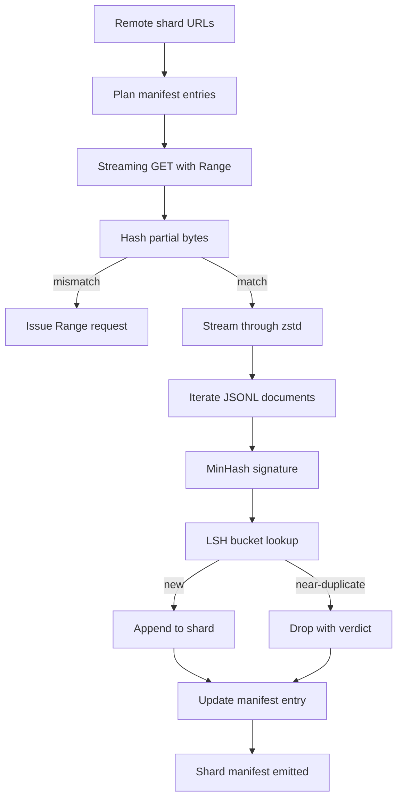

# دانلودگر بزرگ Corpus

> آموزش یک مدل زبان قبل از اولین عبور به جلو شروع می شود. این کارپو باید روی دیسک فرود بیاید، فشرده، تخفیف شده و قابل آدرس، و داستان رزومه قبل از اینکه شبکه به ۴ درصد کاهش یابد، آماده شده است. این درس یک دانلودگر جریان را ایجاد می کند که قطعات فشرده شده را کشیده، با Zstandard در پرواز آن را فشرده می کند، اثر انگشت ها تقریباً از طریق MinHash و همچنین هش حساس به محل، دوگونی می شود و یک شارت را می نویسد که بقیه خط لوله می توانند به آن اعتماد کنند.

**Type:** Build
**Languages:** Python
**Prerequisites:** Phase 19 lessons 30-37
**Time:** ~90 minutes

## اهداف یادگیری

- از راه دور شارت ها رو پخش کن`urllib`و با `zstandard`بدون اینکه تمام فایل رو به حافظه بفر کنیم
- بازخورد پاره ای با ارسال HTTP `Range`درخواست های مقابل یک تعویض بایت تایید شده.
- هر سندي يه امضا "مين هاش" بسازيد و با "لشت"ش با آن مخلوط شويد تا دوچلوپيكه نزديک به هم برخورد کنن
- یک مینیست شارت با محتوای هش، اندازه بائیت، تعداد اسناد و حکم dedup منتشر کنید.

## مشکل

اولین بار که روی یک 200 گیگابایت کارپوس تمرین می کنی شبکه به 41 درصد کاهش می یابد و اسکریپت با یک`urllib`استثنا. دومین بار به ۷۸ درصد کاهش می یابد. به ۹۹ درصد شما سه بار حلقه را دوباره نوشتید. دو شکست که باید از دقیقه اول برای آن طراحی کنید، رزومه جزئی دانلود و حذف اسناد تکراری است. هر دو راه حل شناخته شده دارند؛ هر دو به طور معمول از بین می روند زیرا لوله به عنوان یک خط شروع می شود.`requests.get`به اون زن که دندان بزرگ کرده زنگ بزن

رزومه يه مشکل HTTPه. سرور بايد احترام بذاره`Range`اگر نوسازی و فایل حتی با یک بایت هم متفاوت باشند، بارگیری مجدد زباله می نویسد و corpus به گونه ای فاسد می شود که فقط در هنگام توکن شدن ظاهر می شود.

تخفیف یک مشکل امضا است. تخفیف دقیق هاش تقریباً دوگانه را از دست می دهد: یک مقاله ویکی پدیا با سه پاورپوینت مختلف نمایش داده می شود، یک فایل کد با یک سرنامه مجوز متفاوت، یک پست وبلاگ با یک پارامتر ردیابی در هر لینک. MinHash به علاوه LSH این ها را با هزینه زیر خطی دریافت می کند. هزینه یک امضا برای هر سند و یک جستجوی سطل برای هر امضا است.

## مفهوم



### پخش با `urllib`

کتابخانه استاندارد`urllib.request.urlopen`يه فايل شبيه به فايل باز مياد.`zstandard.ZstdDecompressor().stream_reader`بائتهای از شبکه از طریق decompressor به iterator سند بدون اینکه هرگز شارت فشرده شده یا شارت فشرده شده در حافظه را به وجود آورد. تنها هزینه حافظه بازخورد خط، امضای MinHash برای سند فعلی و شاخص LSH است.

### ادامه مطلب با `Range`

دانلودر دو فایل را برای هر شارت می نویسد: شارت خود و یک `.partial.json`.مراقب .مراقب`verified_bytes`،`expected_size`،`sha256_prefix`(برابر اولین محاسبه)`verified_bytes`باایت ها) و URL منبع. در هنگام شروع دانلودگر نقطه کنترل را می خواند و دوباره محاسبه می کند `sha256_prefix`باط های روی دیسک، و فقط اگر هشت های محاسبه شده مطابقت داشته باشد، باز می گردد. اگر هشت اشتباه باشد، بخش جزئی رد می شود و دانلود از بیت صفر شروع می شود. فساد سکوت غیرممکن است زیرا باط های تایید شده بررسی می شوند، نه فرض می شود.

### MinHash + LSH

MinHash تخمین می زند که دو مجموعه در فضای ثابت مشابهی با Jaccard دارند. برای یک سند مجموعه شینگل (n-گرام های متناوب) متن آن است. امضا این است.`k`حداقل ارزش هاش، یک برای هر تابع مستقل هاش. دو سند با شباهت جکارد `s`احتمالي داشته باشين`s`توافق در مورد هر بخش واحد از امضا

بعد LSH گروه ها را جمع می کند`k`اجزای در `b`دسته های `r`هر یک از صف ها، کجا`k = b * r`دو سند با حداقل يک باند با احتمال برخورد ميکنن`1 - (1 - s^r)^b`, که یک حد حاشیه در اطراف ارزش `s`تو صداي`(b, r)`حد برای تخفیف معمولی کورپوس`s = 0.8`، که ادبیات تحقیقاتی LSH با آن ها می رسد`k = 128`،`b = 32`،`r = 4`. .

### شارت مینیست به عنوان قرارداد

تنها خروجی پایدار دانلودگر، مانیست است. در مانیست، در هر شیش، URL، شمار بائتهای فشرده شده، شمار اسناد، شمار اسناد منحصر به فرد پس از حذف، و sha256 فایل شیش نهایی وجود دارد. توکنز در جریان پایین، فهرست فهرست را نمی خواند. اگر یک شکه از دست رفته یا شکل ۲۵۶ آن اشتباه باشد، مانیفیت به مرحله بعدی می گوید که شروع را رد کند. این مانیست، حاشیه ی تعیین کننده بین "داده ها دانلود می شوند" و "داده ها دانلود و قابل تأیید هستند".

```figure
cap-corpus-downloader
```

## آن را بسازید

`code/main.py`ابزار:

- `ShardPlanner`- یک لیست از URL های شارت را می خواند و ورودی های برنامه ریزی شده را تولید می کند.
- `StreamingDownloader`- باز مي کنه`urllib`جریان با گزینه ای `Range`، به یک فایل موقت می نویسد، به روز رسانی می کند`.partial.json`چک پوند در هر قطعه و تاییدش از قبلش Sha256 در رزومه
- `ZstdDocIterator`- جریان فایل مانند را در می گیرد`zstandard.ZstdDecompressor`و به هر خط یک سند می دهد.
- `MinHasher`- تولید می کند`k`- امضای یک عنصر برای یک رشته با استفاده از یک خانواده ثابت از دانه های هش.
- `LSHIndex`- دستخط هاي گروه و گزارش برخورد
- `Dedup`- ترکیب هاشر و انندکس برای برچسب گذاری هر سند`keep`یا`near_duplicate`همراه با شناسه ي همپاينده شارت
- `ManifestWriter`- آمار هر بخش را جمع آوری می کنه و می نویسد`manifest.json`. .

یک نمایش در پایین فایل یک جسم مصنوعی کوچک را روی دیسک ایجاد می کند و آن را با `zstandard`، از طریق یک `file://`URL، کپی کردن و چاپ کردن مانیف

اجرا کن

```bash
python3 code/main.py
```

اسکریپت صفر را ترک می کند و خلاصه ای آشکار چاپ می کند.

## الگوهای تولید

چهار الگوي اين درس رو به صورت واقعي به صورت بزرگي مي بندازن

**Checkpoint before write.**.`.partial.json`بايد باشه`fsync`-ed قبل از بائتهای به شارت اضافه شده است. در غیر این صورت یک از دست دادن قدرت ترتیب را معکوس می کند: بائتهای شارت در دیسک، نقطه چک بدون آنها، ادامه کار بعدی معتقد است بائتهای تأیید شده کمتر از آن است، بائتهای دوگونی پس از آن فایل را خراب می کند. نقطه چک اول، سپس نوشتن. این همان رشته ای است که یک دفترچه پیش نویس است.

**Sharded LSH index.**یک شاخص LSH در کل کورپوس در RAM در مقیاس 200 GB قرار نمی گیرد. شاخص LSH را با اولین باند هش تقسیم کنید، پارتیشن ها را روی دیسک ذخیره کنید و فقط به پارتیشن که یک امضا جدید وارد می شود مراجعه کنید. هزینه یک دیسک اضافی برای هر سند است؛ مزایای این است که شاخص LSH دیگر یک سقف حافظه سخت نیست.

**Tombstone, not delete.**کپي هاي گم شده در دفترچه ثبت شده و حکم صادر شده`near_duplicate`و شناسه کليد سندي که با آن برخورد کردند. حذف آنها ارتباط بين دوگوني و نگهبان آن را از دست مي دهد. سنگ قبر نگه داشتن مسیر حسابرسي و اجازه می دهد تا یک عبور در راه پايين در مورد حد نظر خود را تغییر دهد.

**Per-shard sha256 in the manifest, plus a manifest sha256.**خود مانیفیت یک هشت محتوا دریافت می کند. مراحل پایین تر از این که به ورودی های هر بخش اعتماد کنند، هشت مانیفیت را تأیید می کنند. بدون این مانیفیت سطح حمله خاموش است: یک مهاجم که می تواند یک فایل را ویرایش کند می تواند کل لوله را خراب کند.

## ازش استفاده کن

الگوهای تولید:

- **Resume on every CI run.**.دارنده هاي اطلاعات اطلاعاتي فوري هستند . دانلودگر بايد هر بار يه ديسک تازه داشته باشه و از كاش يا ريمويت بازيافت کنه`--cache-dir`يه پرچم درجه اوله
- **Dedup before tokenization.**توکن سازی گران است. اجرا آن دو بار در یک سند دو برابر هزینه برای منحنی ضرر مشابه است. Dedup در جریان توکن سازی است، نه در جریان پایین.
- **Manifest as merge gate.**در جریان آموزش، manifest sha256 از یک commit pinned خوانده می شود. یک نسخه جدید مجموعه داده نیاز به یک commit manifest جدید دارد. ارتباط بین کد و داده ها git است، نه فولکلور.

## -باده

`outputs/skill-corpus-downloader.md`در یک پروژه واقعی، توصیف می کند که کدام URL ها را به دانلودگر می دهند، نحوه تنظیم دایرکتوری نقطه بازرسی، عرض شینگل و `(k, b, r)`در اين درس موتور را به سرعت در حال حرکت مي کند

## تمرینات

1. اضافه کنید`--shingle-width`نشان دادن و اندازه گیری چگونگی تغییر حکم dedup در عرض 3, 5, 9. دفاع از پیش فرض انتخاب شده.
2. پشتیبانی از gzip را به کنار zstd با بوی بائتهای جادویی اضافه کنید. دانلودگر نباید از تماس گیرنده برای مشخص کردن کدک نیاز داشته باشد.
3. اضافه کنید`--resume-only`حالت که اگر هیچ نقطه بازرسی پیدا نشود شروع بارگیری مجدد را رد می کند. مفید در CI برای جلوگیری از یک اجرا از تصادفی کشیدن مجدد 200 جی بی.
4. شاخص LSH را به یک فایل قفسه یا sqlite منتقل کنید و تولید را در مقایسه با ویرانت حافظه اندازه گیری کنید.
5. یک مانیست sha256 را در هنگام راه اندازی اضافه کنید. دانلودگر باید در صورت عدم توافق مانیست روی دیسک با هش مانیست در `manifest.lock`. .

## اصطلاحات کلیدی

| Term | What people say | What it actually means |
|------|-----------------|------------------------|
| Shard | "A file" | A self-contained slice of the corpus with its own sha256, used as the unit of resume and dedup |
| MinHash signature | "Fingerprint" | A `k`-component sketch of a set, where each component is the minimum of one independent hash over the set |
| LSH band | "Bucket" | A group of `r` signature components used as a single bucket key for collision detection |
| Verified bytes | "Resume offset" | Bytes on disk whose sha256 prefix matches the checkpoint; the only safe offset to resume from |
| Manifest | "The index" | The single durable record of what the downloader produced, including content hashes |

## خواندن بیشتر

- [RFC 7233](https://datatracker.ietf.org/doc/html/rfc7233)- درخواست های HTTP Range، پروتکل رزومه
- [Zstandard format specification](https://datatracker.ietf.org/doc/html/rfc8478)- فرمت قاب که باعث می شود خنثی سازی جریان امن باشد
- [MinHash](https://en.wikipedia.org/wiki/MinHash)- خانواده امضا که این درس ازش استفاده می کنه
- [Locality-sensitive hashing](https://en.wikipedia.org/wiki/Locality-sensitive_hashing)- طرح بند بندی پشت سر سرآمدی کاهش
- مرحله 19 · 43 - HDF5 توکن شده corpus دانلودگر تغذیه
- مرحله 19 · 44 - برنامه کوسین که روی کورپوس تمرین می کند
- مرحله 19 · 45 - حلقه AMP که برنامه را مصرف می کند
