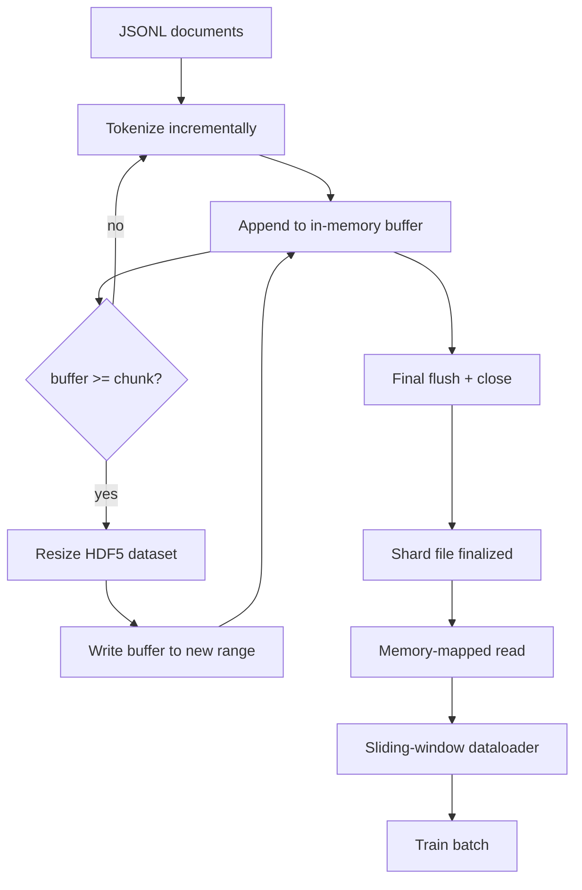

# HDF5 نشان دهنده کارپوس

> کارپوس دانلود شده باید در یک طرح فرود بیاید که مربی می تواند از آن در سرعت خط جریان داشته باشد. JSONL در دیسک از 16 کارگر بارگذاری داده ها زنده نمی ماند. HDF5 با یک مجموعه داده های کامل قابل تغییر اندازه، به صورت قطعه ای انجام می دهد. این درس توکن سازی جریان را به یک مجموعه داده های HDF5 قابل تغییر اندازه، نوشتن قطعه ای در چندین فایل، خواندن حافظه نقشه برداری در زمان آموزش و یک بارگذاری داده پنجره ای که به دنباله دار های طول ثابت با بسته بندی مناسب تولید می کند، می سازد.

**Type:** Build
**Languages:** Python
**Prerequisites:** Phase 19 lessons 30-37
**Time:** ~90 minutes

## اهداف یادگیری

- اسناد را به مجموعه داده های کامل HDF5 قابل تغییر اندازه با قطع بندی تعیین کننده جریان دهید.
- نوشتن را در چندین فایل HDF5 تقسیم کنید تا شکست محدود شود و موازی ممکن باشد.
- توکن ها رو از طریق طرح های زیرنویس صفحه ای HDF5 باز بخونید تا فایل ها فقط در زمان بسته به بازخورد دسته ها کپی شوند.
- پیاده سازی یک فایل پرتاب داده پنجره ای که به دنباله های آموزش با طول ثابت با قوانین بسته بندی صریح را منتشر می کند.

## مشکل

یک دوره آموزش زبان مدرن به صورت مدل به صدها هزار نمونه در ثانیه در میان ده ها کارگر، توکن ها را می خواند. JSONL در دیسک در اولین خطا صفحه سرد کش می میرند: پارسر JSON کند است، مرزهای سند قابل آدرس نیست و برای "نمونه 4,217,884" نیاز به اسکن فایل دارد. حتی پارکت که فشرده سازی خوبی دارد، مناسب نیست زیرا مربی ستون ها را نمی خواهد؛ او یک جریان نماد مسطح با O(1) دسترسی تصادفی را می خواهد.

HDF5 مناسب است زیرا یک مجموعه داده های قطعی، قابل تغییر اندازه، تنها عدد را ارائه می دهد که قطعات آن در زمان خواندن با صفحه های ذخیره سازی سازگار هستند. مربی از یک قطعه از `tokens[3,200,000 : 3,200,8192]`و HDF5 hyperslab مورد نیاز را از کیش صفحه به یک آرایه NumPy تازه اختصاص داده شده کپی می کند. هزینه یک دستی فایل باز و یک نقش کیش صفحه در اندازه یک قطعه برای هر کارگر است، که در مقایسه با هزینه رمزگذاری JSONL، نادیده گرفته می شود.

مشکل ساخت اینه که طرف نوشتن صادق باشه مجموعه داده های قابل اندازه گیری آسان است که از آنها سوءاستفاده شود: یک سند را در یک زمان بنویسید و فایل HDF5 به حدی شکسته شده است که غیرقابل استفاده است. تمام اسناد رو در يک اندازه بنویسيد و در يک مرگ فرآیند تمام شکه ها از دست مياد نظم درست بازخورد و سپس گسترش است، با اندازه بازخورد که با اندازه قطعه مطابقت دارد، و نوشتن پاره شده که بار کار را در فایل ها تقسیم می کند، بنابراین یک خرابی حداکثر یک پاره را از دست می دهد.

## مفهوم



### اندازه گیری HDF5 درست انجام شده

مجموعه داده های رمزگذاری با `maxshape=(None,)`و یک ثابت`chunks=(chunk_size,)`. نوشتن درآمد با بفر کردن توکن ها در یک سری طول NumPy`chunk_size`وقتی که بفر پر شود، مجموعه داده ها به اندازه ی دقیق تغییر می کنند`chunk_size`و بازخورد به محدوده جدید نوشته می شود. در پایان بخش بازخورد باقی مانده به محدوده جزئی نهایی نوشته می شود. هر نوشته متصل و قطعه ای با هم متصل است به جز آخرین، که به خواننده گفته می شود در ثبت شده کوتاه کند.`token_count`در ویژگی های HDF5 شارت.

### نوشته های پاره شده

یک فایل HDF5 یک نقطه شکست است. لوله به طور موازی شارت ها را می نویسد: هر شارت ورودی از مرحله 19 درس 42 یک شارت خروجی HDF5 را تولید می کند.`shards.json`ثبتات شاخصي، هر شارت، مسیر فایل، تعداد توکن ها، تعداد اسناد و sha256 بر روی توکن ها.`shards.json`برای محاسبه تعویضات جهانی و تأیید corpus.

### خواندن نقشه حافظه

در زمان آموزش هر کارگر سهم خود را از فایل های HDF5 در `swmr=True`حالت و درخواست ها`tokens[start:stop]`طرح بخش HDF5 باعث می شود که این صفحه یک صفحه ذخیره سازی پشتیبان باشد. کارگر هرگز کل فایل را به صورت واقعی نمی کند: قطعه به بفر دسته بار داده ها کاپی می شود که سپس بار داده ها به یک تنسور آموزش حافظه گیر شده در زمان دسته ها کاپی می شود. مسیر گرم دارای یک سیسکل در هر انتقال بخش است؛ همه چیز دیگر دسترسی به رام است.

### بارگذاری داده پنجره های اسلاید

Dataloader تنها مرحله ای است که در مورد طول آموزش-سلسلانی می داند. آن را انتخاب یک شاخص شروع تصادفی در جریان توکن جهانی، می خواند `window_size + 1`توکن ها و بازپرداخت ها`(input, target) = (tokens[:-1], tokens[1:])`. مرز اسناد اعمال نمی شود: یک پنجره ممکن است دو سند را با یک صریح`boundary_token_id`این قانون استاندارد بسته بندی است؛ این نیز قانون است که یک مبتدی فراموش می کند، و به پایان می رسد با یک کورپوس که 8 درصد از توکن های مرزی آموزش و 92 درصد متن طبیعی است.

```figure
cc-hdf5-corpus
```

## آن را بسازید

`code/main.py`ابزار:

- `Tokenizer`- یک توکنیزر تعیین کننده باط سطح به اندازه کافی خوب برای نمایش.`encode(text) -> list[int]`و`vocab_size`. .
- `HDF5ShardWriter`- یک مجموعه داده های عددی قابل تغییر اندازه را باز می کند، توکن های باز کننده را به اندازه قطعه می کند، اندازه را تغییر می دهد و در مراحل اندازه ثابت می نویسد، ثبت می کند `token_count`و`sha256`به عنوان ویژگی های HDF5 در نزدیک.
- `ShardedTokenizationPipeline`- اسناد ورودی را تکرار می کند، آنها را به یک نویسنده هدایت می کند و یک `shards.json`شاخص
- `MmapTokenStore`- فایل های شارد را برای خواندن نقشه برداری شده در حافظه باز می کند، تعدیل های جهانی را محاسبه می کند، یک واحد را نشان می دهد `get_slice(start, stop)`.آپي
- `SlidingWindowDataloader`- پنجره های تصادفی را از جریان جهانی انتخاب می کند و بازده می کند `(input_ids, target_ids)`-مجموعه های NumPy

یک نمایش در پایین فایل یک کورپوس کوچک حافظه را ایجاد می کند، به دو قسمت نشان داده می شود، آنها را از طریق نقشه حافظه باز می کند، پوشه داده را برای 10 دسته اجرا می کند و شکل هر دسته و یک رقم چک را چاپ می کند.

اجرا کن

```bash
python3 code/main.py
```

اسکریپت صفر را ترک می کند و مجموعه های چک را چاپ می کند.

## الگوهای تولید

چهار الگويي که اين درس رو به يه راهبرد واقعي تبديل ميکنه

**Chunk size equals the typical read.**مربی میخواد`window_size + 1`توکن ها در هر نمونه.`window_size`و خواندن ها با صفحه های زیرنویس هماهنگ هستند. قطعات نامتناسب تولید را به نصف کاهش می دهند چون هر نمونه به دو قطعه می رسد.

**Token count in attributes, not in the dataset.**قطعه عقب مجموعه داده ها ممکن است تا حدودی پر باشد زیرا اندازه قطعه مرز سند را تقسیم نمی کند.`token_count`در این حالت، خواننده از پایان به توکن های صفر پوشانده می رود و مدل می آموزد که صفر را پیش بینی کند.

**Sharded sha256 with parallel verification.**هر شارت دارای sha256 خود را در بایت های رمزنگاری شده است. مربی می تواند تمام شارت ها را قبل از شروع تمرین به طور موازی تأیید کند. یک sha256 اشتباه در زمان شروع کار شکست می خورد، نه در دوره سه بعد از شصت ساعت.

**`swmr=True` on both sides, with `libver="latest"` on the writer.**حالت تک نویسنده- چند خواننده به نویسنده نیاز دارد تا با `libver="latest"`، هر مجموعه داده رو از پیش بسازید، سپس تنظیم کنید`file.swmr_mode = True`بعد از اون نویسنده بايد زنگ بزنه`dataset.flush()`پس از هر تغییر اندازه پس از کارکنان خواننده (باز شده با `swmr=True`) مشاهده داده های سازگار.`libver="latest"`یا فعال کردن SWMR پس از تغییرات ساختاری یک منبع رایج از شکست های "فایل قفل شده" است.

## ازش استفاده کن

الگوهای تولید:

- **One HDF5 per source shard.**دانلودر (درسی 42) یک شیش در هر URL را منتشر می کند؛ توکن سازی (این درس) یک HDF5 را در هر شیش منبع منتشر می کند. نقشه برداری 1:1 باعث می شود که رزومه و بازیابی شکست جزئی غیر مهم باشد.
- **Boundary token id.**رمز مرزی بخشی از لغت توکنایزر است و تنها رمز است که بارگذاری داده ها تزریق می کند. اگر مدل فرض می کند آن را نادیده بگیرد، ضایعات آموزشی رمز مرزی را پنهان می کند؛ در غیر این صورت یاد می گیرد که از آن به عنوان یک جدا کننده ردیف استفاده کند.
- **`shards.json` as the source of truth.**اضافه کردن یک شیرد جدید به معنای نوشتن HDF5، محاسبه sha256 آن و اضافه کردن یک ورودی است. مربی یک بار در راه اندازی فایل را می خواند و هرگز به لیست دایرکتوری دست نمی زند.

## -باده

`outputs/skill-hdf5-tokenized-corpus.md`در یک پروژه واقعی، توصیف کنید که کدام توکنیزر لوله را تغذیه می کند، چه اندازه قطعه ای با پنجره مربی مطابقت دارد، کجا`shards.json`در مورد اینکه چگونه کارگران فایل ها در میان فایل ها تقسیم می شوند، این درس موتور را تقویت می کند.

## تمرینات

1. اضافه کنید`--compression gzip`نشان دادن به HDF5 نویسنده و اندازه گیری هزینه تولید در demo corpus. دفاع از انتخاب پیش فرض.
2. یک دانه تعیین کننده را به پرنده داده پنجره حرکت اضافه کنید و دو بار با تولید دانه های یکسان، دسته های یکسان را تأیید کنید.
3. اضافه کنید`--validate`حالت که هر شکه رو میخواد، sha256 رو بر روی توکنش محاسبه میکنه و با`shards.json`. اطلاعاتي بايد قبل از شروع آموزش اينو آزمايش کنه
4. در مقایسه با حجم فایل ها، حجم قطعات برابر، نصف و دو برابر اندازه پنجره، گزارش اثر ذخیره سازی صفحه.
5. اضافه کنید`--max-document-tokens`پرچم که اسناد بسیار طولانی را در زمان نوشتن کوتاه می کند. دفاع از معامله در برابر تصمیم گیری در زمان خواندن.

## اصطلاحات کلیدی

| Term | What people say | What it actually means |
|------|-----------------|------------------------|
| Resizable dataset | "Append-only" | An HDF5 dataset with `maxshape=(None,)` that grows via `resize` calls in chunk-sized strides |
| Chunked layout | "How HDF5 stores it" | Fixed-size on-disk pages that the kernel can memory-map and the dataloader can read contiguously |
| `swmr` mode | "Read-while-write" | Single-Writer-Multiple-Reader mode that lets dataloader workers share the file safely |
| Shard index | "shards.json" | The durable index of all token shards with offsets and content hashes |
| Sliding window | "Training sample" | A fixed-length slice of the global token stream that the trainer pairs with its shift-by-one target |

## خواندن بیشتر

- [HDF5 chunking documentation](https://support.hdfgroup.org/documentation/hdf5/latest/hdf5_chunking.html)- طرح داده های کوچک و قابل تغییر اندازه که این درس از آن استفاده می کند
- [h5py user guide](https://docs.h5py.org/en/stable/)- پیتون های مرتبط با HDF5
- [NumPy memory mapping](https://numpy.org/doc/stable/reference/generated/numpy.memmap.html)- افشاگر اولیه HDF5 از طریق h5py
- مرحله 19 · 42 - دانلودگر که درآمده این درس نشان دهنده آن است
- مرحله 19 · 44 - برنامه cosine که مصرف این dataloader
- مرحله 19 · 45 - حلقه AMP که مرحله آموزش را به پایان می رساند
