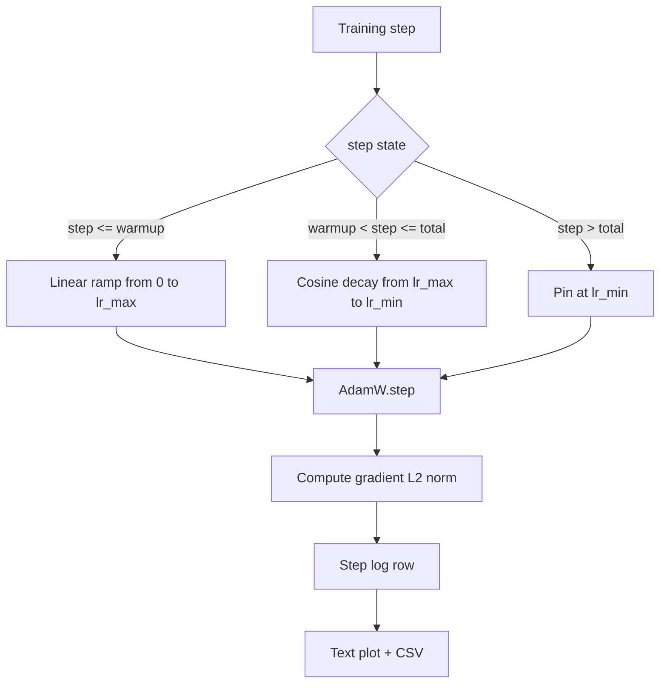

# کوزین LR با گرم کردن خطی

> برنامه ی نرخ یادگیری دومین تصمیم مهم بعد از عملکرد از دست دادن است. AdamW با تجزیه کوسین و گرم شدن خطی پیش فرض مدرن برای آموزش مدل زبان است زیرا به مدل اجازه می دهد در طول اولین هزار بروزرسانی شکننده یک اندازه کوچک موثر را ببیند، به یک اوج پیکربندی می رسد و به راحتی به سمت صفر کاهش می یابد. این درس برنامه را می سازد، منحنی را بر روی مراحل تمرین نشان می دهد، قوانین گرادینتی را در کنار برنامه ثبت می کند و ثابت می کند که برنامه مرزهای گرم شدن، اوج و تجزیه را رعایت می کند.

**Type:** Build
**Languages:** Python
**Prerequisites:** Phase 19 lessons 30-37
**Time:** ~90 minutes

## اهداف یادگیری

- پیاده سازی یک بهینه ساز AdamW که به یک برنامه یادگیری با سرعت کوسین با گرم شدن خطی متصل است.
- ارزش دقیق برنامه را در هر مرحله بدون حرکت نقطه شناور در میان مسیرها محاسبه کنید.
- درجه ی L2 استاندارد به کنار سرعت یادگیری است بنابراین سلامت آموزش قابل مشاهده است.
- جدول را به یک نقشه متن که چشم می تواند بخواند و یک CSV که هر ابزار می تواند مصرف کند، برگردانید.

## مشکل

اولين هزار روزگيري از آموزش ها بلند ترينه وزن مدل هنوز نزديک شروع شدن تخمین دوهم لحظه ی کار بهینه ساز ثابت نشده نورم گرادینت بزرگ و شورآمیز است. اگر نرخ یادگیری در طول این بروزرسانی ها در اوج باشد، مدل یا کاملاً منحرف می شود یا به یک سطح بالا از دست دادن می رسد که هرگز از آن فرار نمی کند. دو راه حل شناخته شده، کپی گرادینت است که موضوع درس 45 مرحله 19 است و یک برنامه یادگیری که شروع کوچک و بالا می رود.

برنامه ی "کوسین با گرم شدن" سه منطقه دارد. از مرحله صفر تا مرحله`warmup_steps`سرعت یادگیری خطی از صفر تا اوج پیک پیک شده است `lr_max`از قدم`warmup_steps`قدم زدن`total_steps`سرعت یادگیری در نیمه بالا منحنی کوسین است و از `lr_max`به`lr_min`بعدش`total_steps`نرخ یادگیری به `lr_min`پس یک مربی اشتباه که بیش از حد می گذرد به طور ساکت از برنامه خارج نمی شود.

مشکل ساخت این است که برنامه ها به راحتی با یک اشتباه می شوند. برنامه های خارج از یک به شش ساعت در یک دوره آموزشی به عنوان یک درصد بیش از حد بالا یا بیش از حد پایین در لحظه ای که مدل شروع به بیش از حد مناسب می شود، نشان می دهد، که غیر از زمانی که برنامه به طور کامل در مرزها آزمایش شود، نامرئی است.

## مفهوم



### فرمول گرم کردن

برای`step`در`[0, warmup_steps]`با`warmup_steps > 0`، نرخ یادگیری`lr_max * step / warmup_steps`. . . . . . . . . . . . . . . . . . . . . . . . . . . . . . . . . . . . . . . . . . . . . . . . . . . . . . . . . . . . . . . . . . . . . . . . . . . . . . . . . . . . . . . . . . . . . . . . . . . . . . . . . . . . . . . . . . . . . . . . . . . . . . . . . . . . . . . . . . . . . . . . . . . . . . . . . . . . . . . . . . . . . . . . . . . . . . . . . . . . . . . . . . . . . . . . . . . . . . . . . . . . . . . . . . . . . . . . . . . . . . . . . . . . . . . . . . . . . . . . . . . . . . . . . . . . . . . . . . . . . . . . . . . . . . . . . . . . . . . . . . . . . . . . . . . . . . . . . . . . . . . . . . . . . . . . . . . . . . . . . . . . . . . . . . . . . . . . . . . . . . . . . . . . . . . . . . . . . . . . . . . . . . . . . . . . . . . . . . . . . . . . . . . . . . . . . . . . . . . . . . . . . . . . . . . . . . . . . . . . . . . . . . . . . . . . . . . . . . . . . . . . . . . . . . . . . . . . . . . . . . . . . . . . . . . . . . . . . . . . . . . . . . . . . . . . . . . . . . . . . . . . . . . . . .`warmup_steps = 0`این پرونده به عنوان "حتی گرم شدن" مورد استفاده قرار می گیرد: برنامه مستقیماً در `lr_max`در مرحله صفر و بلافاصله وارد تجزیه کوسین می شود.`warmup_steps = 0`برای بررسی برنامه هنوز منحنی قابل استفاده تولید می کند.

### فرمول کوسین

برای`step`در`(warmup_steps, total_steps]`نرخ یادگیری`lr_min + 0.5 * (lr_max - lr_min) * (1 + cos(pi * progress))`کجا`progress = (step - warmup_steps) / max(1, total_steps - warmup_steps)`. در`step = warmup_steps`کوسین به `cos(0) = 1`، که به ما میگه`lr_max`، دقیقاً با نقطه گرم شدن مطابقت داره`step = total_steps`کوسین به `cos(pi) = -1`، که به ما میگه`lr_min`، دقیقاً با نقطه پایان تجزیه مطابقت داره

ادامه در هر دو نقطه پایان تصادفی نیست. این دلیل است که برنامه به عنوان یک تابع واحد در طول اجرا می شود.`step`، نه به عنوان سه تابع مختلف به هم چسبیده شده. یک برنامه چسبیده یک مرز را در اولین بار از دست می دهد`lr_max`تغییر کرده

### طبقه بعد از کل پله ها

برای`step > total_steps`نرخ یادگیری در `lr_min`. قرارداد صریح است: برنامه اشتباه نمی کند و خارج نمی شود؛ آن را در زمین می کند و اجازه می دهد تا مربی هشدار را ثبت کند. مربی که نیاز به تمدید آموزش دارند برنامه را تغییر می دهند `total_steps`نه حلقه

### ثبت استاندارد درجه ای در کنار نرخ

برنامه نصف سلامتی تمرین است. استاندارد گرادینت نیمه دیگر است. چرخه تمرین هر دو را در هر مرحله ثبت می کند. یک دوره تمرین متفاوت نشان می دهد که درجه گرادینت قبل از کاهش افزایش می یابد. گرمایش خوب باعث می شود که درجه گرامی به صورت خطی با سرعت افزایش یابد. یک اوج بیش از حد تهاجمی به عنوان یک استاندارد ظاهر می شود که پس از گرم شدن بالا باقی می ماند. مجموعه داده های روی دیسک`step, lr, grad_l2_norm, loss`. CSV تنها سوابق دوامداره

```figure
cap-cosine-warmup
```

## آن را بسازید

`code/main.py`ابزار:

- `CosineWithWarmup`- یک تابع بی کشور`lr(step) -> float`بر اساس برنامه تنظیم شده.
- `TrainState`- مدل رو بسته می کنه`AdamW`بهینه سازی، و برنامه به یک تابع یک مرحله.
- `TrainState.step`- یک گذرگاه جلو و یک گذرگاه عقب را اجرا می کند، استاندارد گرادیو L2 را ثبت می کند و اعمال می شود`lr(step)`به اصلاح کننده
- `plot_schedule_ascii`- برنامه رو به عنوان نقشه متن که چشم می تونه بخونه بازگو مي کنه
- `write_schedule_csv`- در هر مرحله با سرعت یادگیری یک ردیف را منتشر می کند.

یک نمایش در پایین فایل ساخت یک کوچک `nn.Linear`مدل، قطار ها برای 20 مرحله در یک دسته ورودی ثابت، و سرعت یادگیری در هر مرحله، نرمه گرادینت و از دست دادن را چاپ می کند. برنامه همچنین به عنوان یک نقشه متن برای بررسی عقل بصری ارائه می شود.

اجرا کن

```bash
python3 code/main.py
```

اسکریپت صفر را ترک می کند و یک دفترچه تمرینات در هر مرحله و نقشه برنامه را چاپ می کند.

## الگوهای تولید

چهار الگوی برنامه را به یک اثر هنری تولید می کنند.

**Schedule lives in a config, not in code.**مربی میخواد`warmup_steps`،`total_steps`،`lr_max`،`lr_min`از یک پیکربندی YAML یا JSON که به git اختصاص داده شده است. برنامه بازیافت می شود زیرا پیکربندی با محتوای مخاطب است؛ برنامه قابل بررسی است زیرا پیکربندی بخشی از تفاوت PR است.

**Step counter is monotonic and decoupled from epochs.**برخی از چارچوب ها مرحله و دوره را اشتباه می گیرند وقتی مجموعه داده ها پاره شده یا بارگذاری داده ها دوباره شروع می شود. جدول می گوید `global_step`از نقطه کنترل مربی، نه از یک کنتر محلی. یک راه اندازی مجدد در موقعیت برنامه مناسب ادامه می یابد زیرا کنتر قدم محور پایدار است.

**Schedule plot in the run directory.**هر دوره آموزش نوشته شده`outputs/lr_schedule.png`یک بازرس که دایرکتوری را بازبینی می کند می تواند بدون اینکه چیزی را دوباره اجرا کند، برنامه را با عقل بررسی کند. این کلاس خطای برنامه را در زمان روابط عمومی می گیرد.

**Log row schema is fixed.** `step, lr, grad_l2_norm, loss`یک دفترچه یادداشت یا داشبورد پایین تر، طرح را می خواند؛ نامگذاری مجدد یک ستون بدون اینکه نسخه ای را تضاد کند، تمام داشبورد های موجود را باطل می کند.

## ازش استفاده کن

الگوهای تولید:

- **Sweep peak before sweeping anything else.** `lr_max`اول آن را روی یک مدل کوچک پاک کنید، بهترین`lr_max`با اندازه مدل ضعیف است، بنابراین پاک کردن مدل کوچک یک پیش فرض قوی است.
- **Warmup is a fraction of total steps, not an absolute count.**یک دو میلیون مرحله با دو هزار مرحله گرمایش تقریباً بلافاصله در اوج شروع می شود؛ یک دو هزار مرحله با همان تعداد گرمایش به ۱۰ درصد می رسد. گرمایش را به عنوان یک بخش تشکیل دهید (معمولاً: ۱ تا ۳ درصد) بنابراین برنامه با طول تمرین متناوب است.
- **`lr_min` is non-zero on purpose.**طبقه ای که 10 درصد از`lr_max`این روش باعث می شود که بهینه سازی کننده در طول دم طولانی یادگیری داشته باشد.`lr_min = 0`برنامه برنامه ای که منحنی آموزش را تولید می کند که در یک نقشه عالی به نظر می رسد و یک مدل که در واقع آموزش را تمام نکرده است.

## -باده

`outputs/skill-cosine-warmup.md`در یک پروژه واقعی، توصیف می کند که کدام پیکربندی برنامه را حمل می کند، از کدام مرحله آموزشگاه شمارش جهانی خوانده می شود و چه چیزی `lr_max`این درس موتور را می برد.

## تمرینات

1. یک ویرانت برعکس ریشه مربع از برنامه اضافه کنید و آن را در یک راه اندازی تمرین بازی 200 مرحله مقایسه کنید. کدام منحنی باعث کاهش ضرر نهایی می شود؟
2. اضافه کنید`--restart`پرچم که گرم شدن دوم را اضافه می کند`total_steps / 2`. دفاع از اینکه آیا شروع مجدد گرم بهبود یا آسیب در راه رفتن اسباب بازی.
3. یک آزمون واحد اضافه کنید که برنامه مداوم باشد: برای هر مرحله در `[0, total_steps]`تفاوت`|lr(step+1) - lr(step)|`با `lr_max / warmup_steps`. .
4. برنامه رو به يه خط وصل کن`torch.optim.lr_scheduler.LambdaLR`درسی از یک تابع ساده قدم استفاده می کند؛ بسته بندی چه چیزی را تغییر می دهد؟
5. اضافه کنید`--plot-png`پرچم که نقشه ای واقعی را از طریق`matplotlib`. دفاع از اینکه آیا متن متن درس یا PNG برای اجرای CI بهتر است.

## اصطلاحات کلیدی

| Term | What people say | What it actually means |
|------|-----------------|------------------------|
| Warmup | "Slow start" | Linear ramp from zero to `lr_max` over the first `warmup_steps` updates |
| Cosine decay | "Smooth drop" | Upper-half cosine curve from `lr_max` to `lr_min` over the remaining steps |
| Floor | "After training" | The fixed `lr_min` value the schedule pins at past `total_steps` |
| Gradient norm | "L2 of grads" | The Euclidean norm of the concatenated gradient vector, logged each step |
| Global step | "Schedule axis" | A monotonic step counter that survives restarts and drives the schedule |

## خواندن بیشتر

- [Loshchilov and Hutter, SGDR: Stochastic Gradient Descent with Warm Restarts (arXiv 1608.03983)](https://arxiv.org/abs/1608.03983)- ورق مرجع جدول cosine
- [Loshchilov and Hutter, Decoupled Weight Decay Regularization (arXiv 1711.05101)](https://arxiv.org/abs/1711.05101)- مقاله مرجع آدام
- [PyTorch torch.optim.lr_scheduler](https://docs.pytorch.org/docs/stable/optim.html#how-to-adjust-learning-rate)- چگونگی ترکیب عملکردهای مرحله ای با برنامه های چارچوب
- مرحله 19 · 42 - دانلود کننده که این جدول از آن استفاده می کند
- مرحله 19 · 43 - بارگذاری داده برنامه در هم تکامل می یابد
- مرحله 19 · 45 - تراش gradient و AMP، لایه بعدی در حلقه
