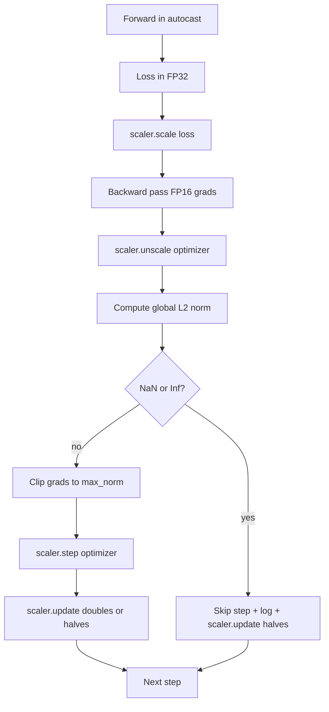

# برش درجه ای و دقت مخلوط

> بهینه ساز و برنامه در درس قبلی فرض می کنند که گرادینت ها سالم هستند. معمولاً اینطور نیستن یک دسته ی بد می تواند نرمی گرادینت را سه درجه از شدت افزایش دهد. آموزش دقیق مخلوط این را با معرفی FP16 بیش از حد در سمت از دست دادن تقویت می کند. این درس دو کمربند ایمنی را ایجاد می کند که آموزش تولید بدون آن نمی تواند ارسال شود: تراز gradient به یک استاندارد جهانی L2 پیکربندی شده، و یک حلقه دقیق مخلوط با آٹو کاست و GradScaler که NaN و Inf را تشخیص می دهد، قدم را تمیزانه رد می کند و عامل مقیاس را برای پزشکی قانونی ثبت می کند.

**Type:** Build
**Languages:** Python
**Prerequisites:** Phase 19 lessons 30-37
**Time:** ~90 minutes

## اهداف یادگیری

- استاندارد جهانی L2 را بر روی تمام گرادیانت پارامتر و کلیپ در محل محاسبه کنید وقتی که آن حد تنظیم شده را فراتر می برد.
- يه مرحله آموزش رو به صورت اتوماتيك و يه GradScaler ببند تا FP16 به جلو و عقب از آب عبور کنه
- تشخیص NaN و Inf در ضایعات یا گرادینت، حذف مرحله بهینه سازی، و ثبت skip.
- هر قدم فاکتور مقیاس GradScaler رو گزارش کن تا یک سری بلند از پرش ها فوراً قابل مشاهده باشه

## مشکل

يه تمرین که ديروز به صورت شفاف انجام شد منحني از دست دادن رو به سمت عمودي در مرحله 8217 پيدا ميکنه مقصر تنها دسته ای است که نورم گرادینتش ۴۲۰۰، بیست برابر اوج قبلی است. بدون برش، بهینه سازی یک مرحله را اعمال می کند که هر یادگیری را که مدل در ساعت قبلی انجام داده بود، تنظیم می کند. با یک کلپ جهانی L2 در نورم 1.0, همان دسته به یک روزرسانی استاندارد واحد کمک می کند؛ زیان در خط روند خود باقی می ماند؛ راه ادامه می یابد.

آموزش دقیق مخلوط، با محاسبه عبور جلو و بیشتر عبور عقب در FP16، تولید را 2-3 برابر افزایش می دهد. هزینه این است که FP16 دارای محدوده معروض تنگ است. یک گرادینت معمولی که در FP16 بیش از حد جریان دارد به Inf ارزیابی می شود، که از طریق لایه های بعدی به عنوان NaN گسترش می یابد، که هر وزن را در مرحله بهینه سازی بعدی به NaN تنظیم می کند. GradScaler PyTorch این مسئله را با ضرب خسارت با یک عامل مقیاس بزرگ قبل از عبور به عقب و تقسیم گرادینتها با همان عامل قبل از مرحله بهینه سازی حل می کند. اگر هر گرادیوتی در زمان غیر مقیاس Inf یا NaN باشد، مقیاس کننده مرحله را رد می کند و عامل مقیاس را به نصف کاهش می دهد؛ اگر مراحل N قبلی پاک بوده، مقیاس کننده عامل را دو برابر می کند. در طول آموزش این فاکتور بالاترین مقدار FP16 را پیدا می کند.

مشکل ساخت این است که دو را به درستی به هم متصل کنید. کلپ قبل از غیر مقیاس بندی و حد در گرادینت های مقیاس بندی است؛ کلپ پس از غیر مقیاس بندی و ترتیب عملیات در مورد GradScaler مهم است. ترتیب درست این است: `scaler.scale(loss).backward()`، پس`scaler.unscale_(optimizer)`، پس`clip_grad_norm_`، پس`scaler.step(optimizer)`، پس`scaler.update()`هر نظم ديگه اي يه حلقه خاموشي شکسته رو ميده

## مفهوم



### استاندارد جهانی L2

استاندارد جهانی L2 استاندارد اوکلیدین متری گرادینت مخلوط شده است، نه استاندارد هر پارامتر. PyTorch این را به عنوان `torch.nn.utils.clip_grad_norm_(parameters, max_norm)`. تابع نرمی پیش از کلیک را باز می گرداند تا درس بتواند هر دو ارزش طبیعی و کلیک را ثبت کند، که برای تشخیص "ما در هر مرحله کلیک می کنیم" ضروری است.

### آٹو کاست و گراد اسکالر

`torch.amp.autocast(device_type)`مدیر زمینه ای است که به صورت انتخابی عملیات واجد شرایط را (زیادہ تر عملیات کلاس ماتمل) در QP16 اجرا می کند. `torch.amp.GradScaler(device_type)`کمک کننده است که از دست دادن قبل از عقب و برعکس مقیاس گرادینت ها قبل از مرحله بهینه سازی است. این دو با هم طراحی شده اند؛ استفاده از یکی بدون دیگری یک خطا پیکربندی است که تست باید تشخیص دهد.

درسی از کاربری خودکار CPU استفاده می کند زیرا این چیزی است که در CI اجرا می شود؛ همان الگوی به صورت لفظی به CUDA با تغییر انتقال می دهد `device_type="cpu"`به`device_type="cuda"`GradScaler در CPU یک Stub است (CPU autocast قبلا در BF16 به طور پیش فرض کار می کند و به مقیاس پذیری از دست دادن نیاز ندارد) ، اما درس شامل سایت های تماس است بنابراین سیم کشی با حلقه GPU یکسان است.

### تشخیص NaN و Inf

کشف در دو مکان اتفاق می افتد. اول، خود از دست دادن با بررسی می شود.`torch.isfinite`قبل از عقب رفتن، یک ضایعات Inf یا NaN gradients مفید تولید نمی کند و بدون ورود به بهینه سازی، رد می شود.`scaler.unscale_(optimizer)`درس به سمت تراشه های بدون مقیاس با `has_non_finite_grad(...)`این دو چک هم به صورت مشترک شامل حالت های شکست عبور جلو و پس از آن می شود.

### تشخیص عوامل مقیاس بندی

عامل مقیاس گذاری حالت داخلی GradScaler است.`scaler.get_scale()`و آن را در کنار نرخ یادگیری و گرادینت نورم ثبت می کند. یک اجرا سالم نشان می دهد که عامل مقیاس در قدرت دو تا آن را اشباع نزدیک`2^17`یا`2^18`. یک کار بد رفتار نشان می دهد که عامل بین مقادیر بالا و پایین نوسان می کند، که این نشانه ای است که گرادینت های مدل گاهی در محدوده و گاهی در محدوده هستند. تشخیص بدون ثبت نام نام نامرئی است.

```figure
grad-clip-monitor
```

## آن را بسازید

`code/main.py`ابزار:

- `clip_global_l2_norm`- يه بسته بندي در اطرافش`torch.nn.utils.clip_grad_norm_`که هر دو قبل از فیلم و پس از فیلم نرمی را باز می گرداند.
- `has_non_finite_grad`- يه کمک کننده که gradient ها رو براي NaN و Inf اسکن مي کنه
- `AmpTrainState`- مدل رو بسته می کنه`AdamW`یک بهینه ساز، یک GradScaler و یک دستگاه آٹو کاست.`step(inputs, targets)`که کل خط لوله برش، مقیاس بندی و پرتاب NaN را اجرا می کند.
- `StepLog`و`SkipLog`- ثبتات ساختاری در هر مرحله
- يه نمايشي که يه بچه کوچولو رو آموزش ميده`nn.Linear`مدل برای 20 مرحله، یک Inf را به گرادینت در مرحله 5 تزریق می کند تا مسیر تخلیه را تمرین کند و دفترچه نتیجه را چاپ می کند.

اجرا کن

```bash
python3 code/main.py
```

اسکریپت صفر را ترک می کند و یک دفترچه در هر مرحله با هر ردیف برچسب شده چاپ می کند`STEP`یا`SKIP`حداقل یک ردیف یک است`SKIP`. .

## الگوهای تولید

چهار الگوی حلقه را به مرحله آموزش تولید می رساند.

**Skip counter as an alert, not a log line.**چند گام از هر مرحله تمرین به خوبی است. صدها گام از هر دوره یک هشدار سخت است: مدل در یک رژیم FP16 نمی تواند نگه دارد و حلقه به طور ساکت شکست می خورد. درس یک نرخ حرکت 1000 قدم را ردیابی می کند و در تولید، در نرخ بالای 5 درصد صفحه می گذارد.

**Clip threshold lives in the config.** `max_norm = 1.0`این استاندارد استاندارد مدرن برای آموزش مدل زبان است. ابتدا آن را روی یک مدل کوچک پاک کنید؛ آستانه های بزرگتر اجازه می دهند که مدل از دسته های واقعا دشوار بهبود یابد؛ آستانه های کوچکتر بدترین مورد را با هزینه منحنی ضرر شور تر محدود می کند. آستانه در همان YAML یا JSON تشکیل شده است که برنامه از درس 44 است.

**Norm log goes to a CSV with the schedule.**ستون های CSV هستند`step, lr, grad_l2_pre_clip, grad_l2_post_clip, loss, skipped, skip_reason, scaler_scale`یک بازرس که فایل را باز می کند، جدول، داستان گرادینت، عامل مقیاس بندی و نتیجه skip (با دلیل آن) را در یک ردیف می بیند. تقسیم ستون ها در میان فایل ها یک دستور برای تجزیه و تحلیل های اشتباه است.

**`scaler.update()` runs every step, even on skip.**در یک مرحله تمیز، مقیاس دهنده شمارشگر بدون اطلاعات را می خواند، آن را افزایش می دهد و احتمالاً عامل را دو برابر می کند. در یک مرحله تخفیف شده، مقیاس دهنده عامل را به نصف می کند و شمارشگر را تنظیم می کند. فراموش کردن `update()`در مسیر تخلیه، خطای موجود وجود دارد که "فاکتور مقیاس گذاری هرگز تغییر نکرده است".

## ازش استفاده کن

الگوهای تولید:

- **Autocast device matches optimizer device.** `torch.amp.autocast(device_type="cuda")`برای آموزش GPU`torch.amp.autocast(device_type="cpu")`برای CPU. دستگاه های مخلوط کننده یک خطای نوع خاموش تولید می کنند که به عنوان منحنی از دست دادن ظاهر می شود که خوب به نظر می رسد اما یک مدل که یادگیری نیست.
- **Loss check before backward.** `torch.isfinite(loss).all()`این یک کاهش تنسور است، هزینه اش قابل توجهی است و پس انداز بر روی یک از دست دادن NaN یک مرحله آموزش کامل است. همیشه آن را اجرا کنید.
- **`set_to_none=True` in `zero_grad`.**gradients را به `None`به جای صفر، که به بهینه سازی اجازه می دهد که محاسبه برای گروه های پارامتر بدون تأثیر را رد کند. تنظیم یک بهبود آزاد در تولید و کاهش کمی سطح خطا است.

## -باده

`outputs/skill-clip-amp.md`در یک پروژه واقعی، توصیف می کند که کدام حد کلیپ و دستگاه آٹو کاست مرحله آموزش استفاده می کند، CSV در مرحله در کنترل نسخه زندگی می کند و حد هشدار تولید سرعت تخفیف چیست. این درس موتور را حمل می کند.

## تمرینات

1. تزریق مصنوعی Inf را با یک افزایش واقعی از دست دادن جایگزین کنید (هدف یک دسته را با 1e8 ضرب کنید) و محرک های مسیر تخلیه را بررسی کنید.
2. اضافه کنید`--bf16`حالت که به جای FP16 به BF16 تغییر می دهد. BF16 دارای محدوده نمایه گسترده تر از FP16 است و به ندرت نیاز به مقیاس خسارت دارد. بررسی کنید که نرخ تخفیف به صفر در همان نمایش داده شده است.
3. یک آزمایش واحد اضافه کنید که بسته بندی کلیپ گرادینت، استاندارد قبل از کلیپ و پس از کلیپ را به درستی به هنگام قطع، به ارمغان بیاورد.
4. اضافه کردن یک محاسبه نرخ تخفیف پنجره چرخنده و یک پرچم CLI که در صورت عدم اجرا، اگر نرخ بیش از یک حد تنظیم شده برای 100 مرحله متوالی باشد.
5. به صورت حلقه ای برای نوشتن CSV کانونیکی (`step, lr, grad_l2_pre_clip, grad_l2_post_clip, loss, skipped, skip_reason, scaler_scale`) و تایید کنید که فایل از یک Ctrl-C زنده می ماند با شلیک کردن پس از هر ردیف.

## اصطلاحات کلیدی

| Term | What people say | What it actually means |
|------|-----------------|------------------------|
| Global L2 norm | "Clip target" | Euclidean norm of the concatenated gradient vector across all trainable parameters |
| autocast | "Mixed precision" | Selective FP16 (or BF16) execution of eligible operations inside a `with` block |
| GradScaler | "Loss scaler" | Helper that multiplies the loss before backward and inverse-scales gradients before the optimizer step |
| Skip | "Bad step" | An optimizer step refused because the gradient or loss was non-finite; the scaler halves the factor |
| Scaling factor | "Scaler state" | The GradScaler's current multiplier; doubles after clean stretches and halves on every skip |

## خواندن بیشتر

- [Micikevicius et al., Mixed Precision Training (arXiv 1710.03740)](https://arxiv.org/abs/1710.03740)- پیشنهاد اولیه برای مقیاس خسارت
- [Pascanu, Mikolov, Bengio, On the difficulty of training recurrent neural networks (arXiv 1211.5063)](https://arxiv.org/abs/1211.5063)- کاغذ مرجع برش گرادینت
- [PyTorch torch.amp.GradScaler](https://docs.pytorch.org/docs/stable/amp.html)- اين آموزش با اين API که اين کلاس رو ميخواد
- [PyTorch torch.nn.utils.clip_grad_norm_](https://docs.pytorch.org/docs/stable/generated/torch.nn.utils.clip_grad_norm_.html)- اون کلپ اولیه که این درس استفاده می کنه
- مرحله 19 · 42 - دانلودگر که بدنش به حلقه تغذیه می کند
- مرحله 19 · 43 - بارگذاری داده که حلقه مصرف می کند
- مرحله 19 · 44 - جدول که این حلقه با
