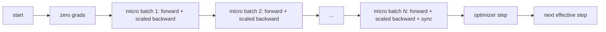
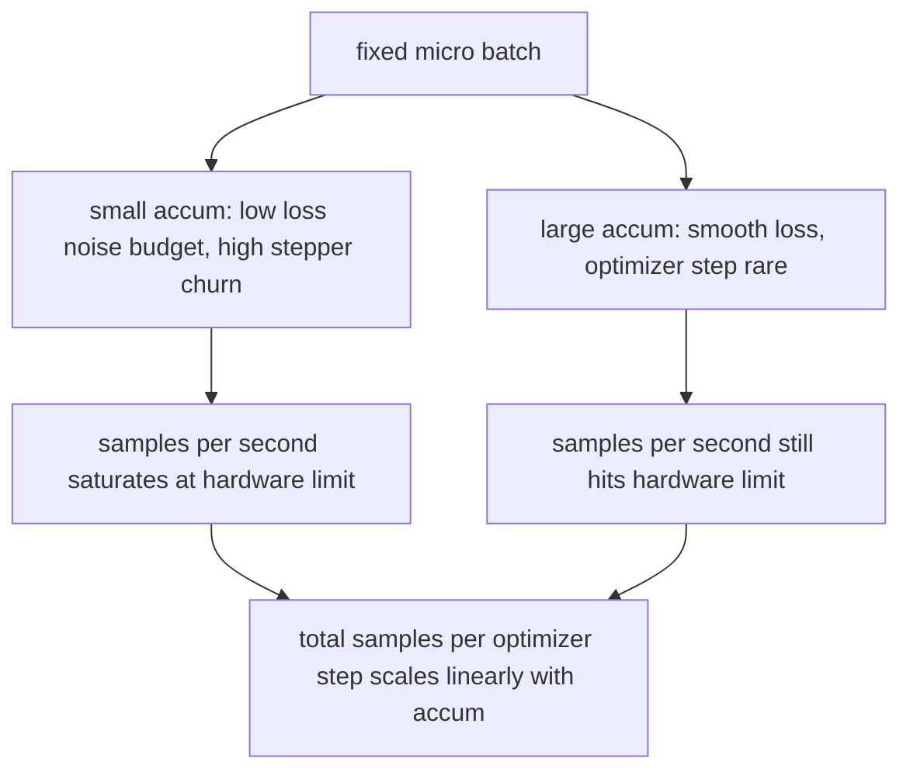

# جمع بندی تدریجی

> با دسته ای که نمی توانید هزینه اش را داشته باشید، یک دسته کوچک در یک زمان تمرین کنید.

**Type:** Build
**Languages:** Python
**Prerequisites:** Phase 19 lessons 42 to 45
**Time:** ~90 minutes

## اهداف یادگیری

- هویت واقعی دسته را بدست آورید: `effective_batch = micro_batch * accum_steps`. .
- مقیاس خسارت در هر دسته کوچک را پیاده سازی کنید تا گرادینت جمع شده با یک دسته کامل عقب باشد.
- همگام سازی بهینه سازی را تا آخرین دسته کوچک (همگام سازی در آخرین مرحله) رد کنید.
- یک تولید را در مقابل منحنیات موثر دسته بخوانید و بازده کاهش یافته را توضیح دهید.

## مشکل

شما می خواهید در یک دسته موثر از 512 تمرین کنید چون منحنی از دست دادن آسان تر است و مرحله بهینه سازی در این مقیاس منطقی تر است. سرعت دهنده روی میز 32 نمونه رو نگه می داره قبل از اینکه حافظه اش تموم بشه دو برابر کردن دسته یک گزینه نیست. نصف کردن مدل یک گزینه نیست. ترفند که این میدان در سال 2017 به آن دست یافت و هرگز از آن استفاده نکرد، 16 عبور به عقب انجام دادن است، اجازه دهید گرادینت ها در داخل بازدارنده پارامتر جمع شوند و تنها زمانی که شمارش به هدف برسد، بهینه سازی را پیاده کنید.

خطر این است که از دست دادن دیگر همان تعداد است که در دسته بزرگتر. انتروپی کراس 16 دسته کوچک به صورت نابینا جمع شده 16 برابر از دست دادن یک دسته کامل است. بدون مقیاس، جهت گرادینت درست است اما اندازه اشتباه است، و مرحله بهینه سازی 16 برابر بیش از حد بزرگ است. اصلاح یک تقسیم است. اصلاح نیز آسان است برای فراموش کردن است.

## مفهوم



قرارداد کوتاهه:

- خسارت هر دسته کوچک به  تقسیم می شود`accum_steps`قبل از`backward()`.پایتورچ گرادینته ها رو به`param.grad`به طور پیش فرض؛ تقسیم مبلغ جاری را به مقیاس درست برگرداند.
- مرحله بهینه سازی یک بار در هر دسته موثر، پس از آخرین میکرو-بچ عقب می کشد. مرحله در وسط جمع آوری هر پارامتر باقی مانده از اجرا بستگی دارد.
- حالت بهینه ساز (بفر های لحظه ای، لحظه های آدم) یک بار در هر مرحله موثر، نه یک بار در هر دسته کوچک پیشرفت می کند. متوسط های متحرک نمایی در غیر این صورت فرکانس اشتباه را می بینند و از طریق برنامه می سوزند.
- در یک دستگاه واحد این حسابداری است. در یک کلستر چند درجه همان الگوی بسته بندی میکرو-بارت های غیر نهایی در یک`no_sync`در یک متن که گرادینت را رد می کند همه کاهش می یابد؛ آخرین میکرو-بچ در یک گذر به جای پرداخت هزینه شبکه N بار گرادینت کامل جمع آوری شده را کاهش می دهد.

### اثبات معادلیت در کد

```python
loss = criterion(model(x_full), y_full)
loss.backward()
opt.step()
```

برابر با

```python
for x, y in chunks(x_full, y_full, n):
    scaled = criterion(model(x), y) / n
    scaled.backward()
opt.step()
```

تا به ترتیب جمع بندی نقطه شناور. گراژینت جمع شده در پایان حلقه همان تنسور است که یک دسته کامل به عقب تولید می کند. کد درس این را با تفاوت حداکثر abs تحت 1e-4 در`equivalence_check`. .

### کجا هزینه می رود

هر دسته کوچک یک دسته به جلو و یک دسته به عقب هزینه می کند. با تجمع شما حافظه را با زمان عوض می کنید. منحنی تولید در`outputs/accum-curve.json`نشان می دهد که چه اتفاقی می افتد در حالی که دسته موثر در دسته کوچک ثابت رشد می کند:



هیچ ناهار رایگان وجود نداره دو برابر`accum_steps`در این مقاله، در مورد این موضوع، در مورد این موضوع بحث می شود که آیا این روش برای بررسی و بررسی یک مشکل بزرگ و کوچک است. در این مقاله، در مورد این موضوع بحث می شود که آیا این روش برای بررسی و بررسی یک مشکل بزرگ و کوچک است.

```figure
cc-grad-accumulation
```

## آن را بسازید

`code/main.py`این اثر قابل اجرا است. این سه چیز را انجام می دهد.

### مرحله اول: بررسی معادلیت

`equivalence_check()`دو نسخه از یک شبکه با همان دانه را ایجاد می کند. یکی یک دسته 16 نمونه را در یک گذر جلو می بیند. دیگری چهار دسته 4 نمونه را با از دست دادن به چهار تقسیم می کند. تابع بازنده های گرادینت را قبل از مرحله بهینه سازی و پارامترهای بعد مقایسه می کند. ادعا این است`max_abs_diff < 1e-4`. .

### مرحله دوم: الگوی همگام سازی در آخرین مرحله

`train_one_optimizer_step`براي هر ميکروباتچ به جز آخرين بار که وارد ميشه`no_sync_context(model)`در یک فرآیند واحد، زمینه بدون عملیات است؛ در DDP این جایی است که گرادینت تمام کاهش را رد می کند. حسابداری یکسان است.`sync_counter`تعداد بار هایی که از محدوده no_sync خارج شدیم را ثبت می کند. برای N میکرو دسته ها شمارش یک برای هر مرحله موثر است، نه N.

### مرحله سوم: منحنی تولید

`sweep_effective_batches`با یک دسته کوچک ثابت و یک لیست مراحل جمع آوری، برای هر تنظیم، آن را ثبت می کند:

- `samples_per_sec`: کل نمونه های دیده شده به زمان دیوار تقسیم شده است
- `median_step_ms`: 50 درصد در هر مرحله موثر
- `sync_calls`: نقاط جمعی که اعمال شده است
- `avg_loss`: متوسط در مراحل بهینه سازی پاکش

تولیدات در `outputs/accum-curve.json`و از یک دفترچه قابل استفاده مجدد است.

اجرا کن

```bash
python3 code/main.py
```

اسکریپت تفاوت معادل، سپس جدول پاک کردن، سپس مسیر JSON را چاپ می کند. کد خروج صفر.

## ازش استفاده کن

در آموزش تولید، تراکم گرادینت در پشت یک دکمه زندگی می کند.`accumulation_steps = effective_batch // (micro_batch * world_size)`چارچوب هایی که اجازه استفاده از آنها را ندارید در اینجا همان حلقه را بسته می کنند، اما مراحل یکسان هستند: مقیاس خسارت، همگام سازی را در میکروهای غیر نهایی رد کنید، جمع آوری کنید، یک قدم.

سه الگوی در طبیعت:

- اندازه مايکرو باتش براي پر کردن حافظه دستگاه انتخاب شده هر چيزي كه کوچکتر باشه زباله هاي تسريع دهنده رو مي ذاره هر چيزي که بزرگتر باشه خراب ميشه
- دسته موثر از یک برنامه نرخ یادگیری انتخاب می شود. دسته های موثر بزرگ نیاز به نرخ یادگیری مقیاس پذیر و گرم شدن دارند. این قانون مقیاس بندی خطی است که از سال 2017 مورد بحث قرار گرفته است.
- تعداد تراکم پل بین این دو و تنها دکمه ای است که شما آزاد هستید بدون نوشتن مجدد بارگذاری داده ها در زمان اجرا تنظیم کنید.

## -باده

`outputs/skill-gradient-accumulation.md`نسخه رو ضبط ميکنه تا يه همسالش بتونه اونو به يه repo جديد بذاره`accum_steps`، همگام سازی بهینه سازی را در میکروس غیر نهایی ، یک بار در هر دسته موثر ، حرکت بهینه سازی را رد کنید ، تولید را با دسته موثر به عنوان JSON ثبت کنید تا تجارت قابل مشاهده باشد.

## تمرینات

1. دوباره با `--num-steps 100`و نمونه های نقشه در ثانیه با دسته موثر. منحنی به کجا صاف می شود؟
2. یک ویرانت مقیاس بندی اشتباه (هیچ تقسیم) را اضافه کنید و پارامتر تفاوت را در مرحله 1 در برابر مرجع نشان دهید.
3. SGD را با AdamW عوض کنید و تایید کنید که حالت بهینه سازی یک بار در هر مرحله موثر پیشرفت می کند نه یک بار در هر دسته کوچک.
4. يه " واقعي " رو معرفي کن`DistributedDataParallel`بسته بندی و مسیر`no_sync_context`به روشش. تایید کن sync_calls به N-1 در هر دسته موثر کاهش می یابد.
5. چک معادلیت را برای مقایسه دو تقسیم کوچک مختلف (2 با 8 در مقابل 4 با 4) تغییر دهید و هر گونه تحمل لازم برای استراحت را توضیح دهید.

## اصطلاحات کلیدی

| Term | What people say | What it actually means |
|------|-----------------|------------------------|
| Micro batch | The batch you forward | The slice that fits in memory in a single forward pass |
| Accum steps | Backward passes per step | Number of backwards summed before one optimizer step |
| Effective batch | The batch | Micro batch times accum steps times data parallel world size |
| Loss scaling | Divide by N | Per-micro-batch division so summed gradients match full batch |
| Sync on last | Skip the rest | Only run the gradient collective on the last backward in the window |

## خواندن بیشتر

- اسناد پيتورچ در`DistributedDataParallel.no_sync`برای نسخه تولید از ترفند همگام سازی در مرحله آخر
- گوئل و همکارانش، 2017، در مورد مقیاس خطی برای آموزش دسته های بزرگ، دلیل قانونی برای مراقبت از دسته های موثر.
- ردیاب انتشار PyTorch در تعاملات تراکم گرادینت با عدم مقیاس دقیق مخلوط.
- کلاس های مرحله ۱۹ ۴۲ تا ۴۵ شامل مدل، بارگذاری داده، بهینه سازی و کفش مربی این درس است.
- مرحله 19 درس 47 شامل نقطه بازرسی و ادامه است تا یک دوره طولانی جمع آوری از یک ساعت دیوار زنده بماند.
