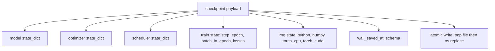
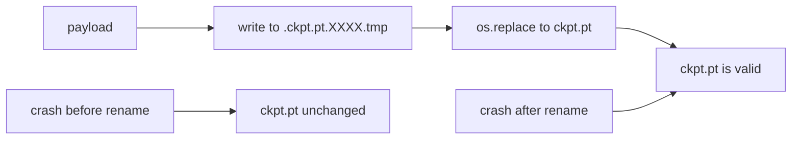
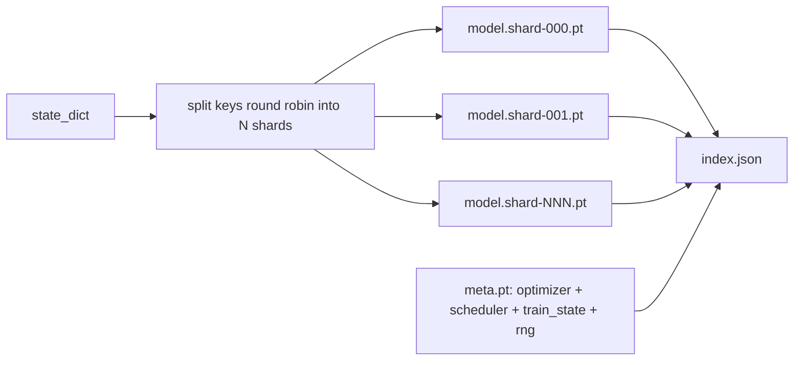

# نقطه بازرسی ذخیره و ادامه

> قطار قطع می کند، اجرا می کند، نقاط بازرسی اجازه می دهد آنها ادامه دهند. ذخیره مدل، بهینه سازی، برنامه ریزی، تاریخچه از دست دادن، شمارش مرحله، و حالت RNG، به صورت اتوماتیک، بنابراین یک قتل در هر لحظه یک فایل معتبر را در دیسک ترک می کند.

**Type:** Build
**Languages:** Python
**Prerequisites:** Phase 19 lessons 42 to 45
**Time:** ~90 minutes

## اهداف یادگیری

- کل حالت آموزش را به یک بار مفید که می تواند به یک فرآیند تازه بارگذاری شود، جذب کنید.
- از پس انداز اتم با نوشتن به زمان استفاده کنید و سپس نامش را تغییر دهید تا یک تصادف هرگز یک فایل نیمه نوشته را ترک نکند.
- حالت RNG را برای پایتون، NumPy و PyTorch بازگرداندن تا پس از بازتاب، از دست دادن مطابق با خط پایه بدون وقفه باشد.
- یک طرح شیش کنترل نقطه برای مدل هایی که دیگر در یک فایل واحد قرار ندارند، با شیش های هاش تایید شده و شاخص JSON ایجاد کنید.

## مشکل

تو يه شغل آموزش براي 18 ساعت قرار دادي ساعت دیوار 4 ساعت طول میکشه کلستر ساعت 11 باز شروع ميشه چون کسي بالاتر از درجه حقوق شما ارتقاء هسته رو تایید کرده بدون بازداشتگاهي از اول شروع ميکني بدون ادامه کار شما همچنین حالت بهینه سازی را که 11 ساعت اول برای یادگیری طول کشید، از دست می دهید، بنابراین حتی اگر وزن مدل زنده بماند، لحظات AdamW رفته اند و گام بعدی در جهت مسیر آموزش حرکت کرده است.

آرتیفاکت مناسب یک فایل واحد است که همه چیز لازم برای ادامه دارد: پارامترهای مدل، حالت بهینه سازی، حالت برنامه نویس، تاریخچه از دست دادن برای نقشه ها، مرحله فعلی و دوره و شمارشگر های دسته ای در دوره، و حالت RNG برای هر منبع تصادفی. بدون حالت RNG منحنی از دست دادن باز می گردد منحنی متفاوت است. همون مدل، همون داده، مخلوط مختلف، ماسک ترک مختلف، شماره مختلف روی داشبورد

ذخیره اتمی نیمه دیگر قرارداد است. نوشتن به نام فایل نهایی به معنای یک فایل خراب شده در نیمه نوشتن است؛ رزومه می خواند زباله. نوشتن به یک فایل موقت در همان دایرکتوری و سپس تغییر نام به معنای یک فایل خراب شده در نیمه نوشتن به معنای یک فایل خوب قبلی را بدون لمس می کند. نامگذاری اتمی در سیستم های فایل POSIX است.

## مفهوم



### پنج سطل دولت

| Bucket | Why it matters |
|--------|----------------|
| Model | Weights and buffers; what the model is. |
| Optimizer | Momentum and adaptive moments; without these the next step is a different optimization problem. |
| Scheduler | Where the learning rate is on its curve; cosine schedules in particular care. |
| Train counters | Step, epoch, batch-in-epoch, plus the loss history that draws the dashboard. |
| RNG state | Determinism for dropout, data shuffling, and any sampling inside the model. |

### ذخیره اتمی



دو قانون: اول، فایل موقت در همان دایرکتوری با هدف زندگی می کند بنابراین نام تغییر در همان سیستم فایل باقی می ماند؛ نام تغییر در دستگاه های مختلف اتمی نیست. دوم، نام موقت برای هر تلاش منحصر به فرد است بنابراین دو نویسنده دست به دست نمی آورند.

### نقاط بازرسی پاره شده

وقتی مدل بزرگ می شود، بار مفید یک فایل برای بارگذاری سریع، برای بازرسی بیش از حد بزرگ و دردناک می شود و وقتی یک شبکه در وسط خواندن شکاف را به اشتراک می گذارد. راه حل این است که حالت پارامتر را به قطعات تقسیم کنید و یک شاخص کوچک بنویسید که آنها را با هم متصل کند.



این شاخص تعداد شارت ها، sha256 هر شارت و sha256 فایل متا را ثبت می کند. بارگذاری کننده وقتی هر هش با هم مطابقت ندارد به شدت شکست می خورد. شارت ها می توانند روی دیسک های فیزیکی مختلف فرود آیند؛ میتا کوچک است و ابتدا می خواند.

### ادامه ادامه ی رزومه در وسط دوره

رزومه ای که با شروع عصر بعدی زباله ها در هر نقطه از دقیقه تا روز باشد.`(epoch, batch_in_epoch)`علاوه بر حالت RNG. پس از بارگذاری، حلقه آموزشی سریع به جلو ژنراتور شماره تصادفی از طریق دسته های مصرف شده در دوره فعلی و ادامه دارد`batch_in_epoch`. کد درس دقیقاً این کار را انجام می دهد؛ ادعا این است که مسیر خسارت پس از ادامه کار با خط پایه بدون وقفه در 1e-4 مطابقت دارد.

```figure
cc-atomic-checkpoint
```

## آن را بسازید

`code/main.py`چهار نوع اولیه و یک راننده دمو را ارائه می دهد.

### مرحله اول: ضبط و بازگرداندن حالت RNG

`capture_rng_state`با پايتون يک فرمان باز مياد`random.getstate`، "نمپي"`np.random.get_state`هر قطعه به عنوان اعداد ساده پایتون، tuples و لیست ها ذخیره می شود (آرایه کلید NumPy از طریق `tolist()`), بنابراین بارنده در مرحله 3 می تواند آن را بدون باز کردن اشیاء تعسفی دوباره بخواند. `restore_rng_state`تنسور پردازنده يه بازخورد بايت Uint8 است که RNG PyTorch مي داند چطور مصرف مي کنه

### مرحله دوم: ذخیره اتمی

`atomic_save`بار مفید را به یک فایل موقت در دایرکتوری هدف می نویسد، سپس `os.replace`به اسم آخرش عوض ميشه`atomic_write_json`برای شاخص پاره شده هم همین کار را می کند.

### مرحله سوم: سفر برگشت کامل

`save_checkpoint`مدل، بهینه ساز، برنامه نویس، حالت قطار و RNG را به یک فرمان بسته می کند. `load_checkpoint`اون رو برگردونه و برگردونه`TrainState`. میدان شیما هوک ارتقا است: تغییرات آینده در فرمت به رشته نسخه و بارگذاری ها می رسد.

`load_checkpoint`تماس ها`torch.load(..., weights_only=True)`.`.pt`پرونده يه جنجاليه و باز کردن پرونده ي غير قابل اعتماد با`weights_only=False`هر کد نام فایل را اجرا می کند. بارنده تنها وزن پذیرفته است تنسورها و ظرف های اولیه و رد همه چیز دیگر است که به همین دلیل مرحله 1 حالت RNG را در لیست های ساده نگه می دارد. بررسی های سالمیت افزایش می یابد`ValueError`به جای استفاده از`assert`، چون`python -O`از مشعل 2.6 یا جدیدتر استفاده کنید: قبل از این انتشار`weights_only=True`یک بازگذر شناخته شده (CVE-2025-32434) داشت، بنابراین تضمین این درس تنها از 2.6 ادامه دارد.

### مرحله 4: فرقه ی پاره شده

`save_sharded_checkpoint`کلید های پارامتر را در N شارت ها گرد می کند، هر شارت را با ذخیره ای اتمی خود می نویسد، یک فایل متا را با بهینه سازی و برنامه ریزی کننده و حالت قطار می نویسد و شاخص JSON را با شارت sha256s می نویسد. `load_sharded_checkpoint`قبل از ادغام هر قطعه را تأیید می کند و هر مسیر قطعه ای را که خارج از دایرکتوری نقطه بازرسی حل شود رد می کند.

### مرحله 5: نمایشی ادامه

`run_resume_demo`یک مدل کوچک برای`total_steps`، يه نقطه بازي در`interrupt_at`، سپس ادامه می یابد. یک فرآیند دوم نقطه بازرسی را بازگرداند و مراحل باقیمانده را اجرا می کند. تابع حداکثر تفاوت مطلق بین دو مسیر از دست دادن را پس از نقطه قطع باز می آورد. با بازپرداخت RNG، تفاوت صفر یا صدا نقطه شناور است.

اجرا کن

```bash
python3 code/main.py
```

دو پرونده و دو نمونه ی قطعه ای هم با حداکثر تفاوت تحت 1e-4 ارتباط دارند. خلاصه در `outputs/resume-demo.json`. .

## ازش استفاده کن

آموزش تولید، کنترل کنترل کشتی را به عنوان بخشی از مربی به وجود می آورد. شکل یکسان است: مدل + بهینه کننده + برنامه نویس + شمارنده + RNG، نوشته شده به صورت اتمی، نامگذاری شده به مرحله ای به طوری که آخرین آن را پیدا کردن آسان است. طرح های شکسته شده حمل مدل های بزرگ را با خواندن موازی تقویت می کنند؛ index.json چیزی است که باعث می شود این کار شود.

چهار الگوی برای اجرا:

- **Load with `weights_only=True`.**یک نقطه بازرسی که از یک دیسک مشترک یا یک دانلود گرفته شده است، ورودی غیرقابل اعتماد است. بارنده فقط وزن دارد که یک فایل مخرب را از اجرای کد در دستگاه که باز می گردد، نگه می دارد.
- **Schema is a string in the payload.**بدونش نميتوني بدون شکستن راه هاي قدیمی شکل رو توسعه بدي
- **Sha256 every shard.**دانلود خاموشی که کوتاه شده است بدترین نوع خطا است؛ بارگذاری سریع یا دیر به شکست می رسد.
- **Keep checkpoint cadence honest.**هر قدم N و هر دقیقه ساعت دیوار را نگه دارید، هر لحظه کوتاه تر باشد، در غیر این صورت قدم طولانی که سقوط می کند، پنجره ای کامل کار را از دست می دهد.

## -باده

`outputs/skill-checkpoint-save-resume.md`این نسخه برای هر اسکریپت آموزشی جدید است: شکل بار مفید، نوشتن اتمی، ضبط RNG، شاخص پاره شده. مهارت را به یک repo، سیم انداختن`save_checkpoint`در محل ذخیره سازی دوره ای، سیم`load_checkpoint`در شروع، و فرار از مرگ زنده می ماند.

## تمرینات

1. از پاره کردن گرد و گرد با پاره کردن با دسته بندی بر اساس پارامتر (طبقات که در `.weight`vs `.bias`چه زمانی هر طرحی ترجیح داده می شود؟
2. لوله ذخیره سازی را برای حفظ آخرین نقاط بازرسی K گسترش دهید و نقاط قدیمی را برش دهید.
3. اضافه کنید`--ckpt-every-seconds`پرچم که یک ذخیره را در یک فاصله ساعت دیوار، نه فقط شمارش مراحل فعال می کند.
4. یک مسیر تایید چک سوم را اضافه کنید که در زمان راه اندازی اجرا می شود، هر نقطه بازرسی را در دایرکتوری اسکن می کند و گزارش می دهد که کدام یک فاسد هستند.
5. اجرای یک`migrate_v1_to_v2`تابع که یک فیلدی جدید را به بار مفید اضافه می کند و رشته شیما را به هم می رساند.

## اصطلاحات کلیدی

| Term | What people say | What it actually means |
|------|-----------------|------------------------|
| Atomic save | "Write and pray" | Write to a temp file in the same directory, then os.replace into the target name |
| State dict | "The weights" | Model parameters and buffers, keyed by parameter name |
| Sharded checkpoint | "Big model file" | Multiple files, one per shard, plus a meta file and a JSON index with sha256s |
| RNG state | "Random seed" | Captured state for python random, numpy, torch CPU, torch CUDA; not just the seed |
| Mid-epoch resume | "Restart" | Fast-forward the RNG and continue from the next batch in the same epoch |

## خواندن بیشتر

- POSIX `rename`معنی گرایی برای اتمیت ادعا می کند که `os.replace`به اين مي پردازد
- اسناد PyTorch در مورد `torch.save`و`torch.load`، از جمله`map_location`برای بازیابی دستگاه های مختلف و`weights_only`برای بارگذاری فایل های غیر قابل اعتماد.
- مرحله 19 درس 46 شامل جمع آوری گرادینت است که بار مفید نقطه بازرسی این درس از طریق آن زنده می ماند.
- مرحله 19 درس 48 پوشش موشک های توزیع شده که شکل دولت آن را این طرح می پذیرد.
- هسته لینوکس`fsync`اسناد تضمین دوام پشت نامگذاری اتمی.
