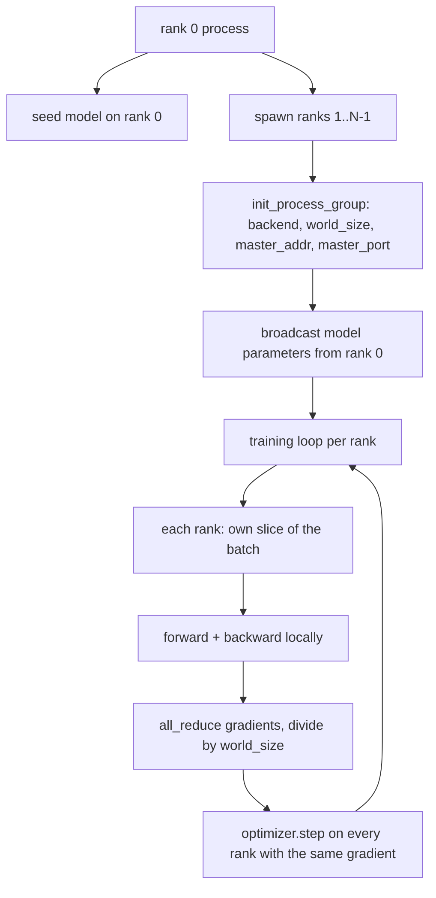
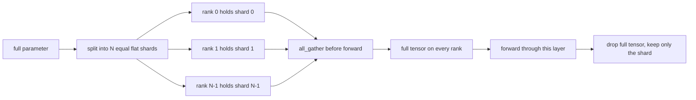

# داده های توزیع شده موازی و FSDP از ابتدا

> آموزش چند رتبه دو گروه و یک قانون است. پارامترها را در شروع پخش کنید، gradients را پس از عقب متوسط کنید، هرگز اجازه ندهید که رتبه ها در مورد مرحله ای که در آن هستند اختلاف کنند.

**Type:** Build
**Languages:** Python
**Prerequisites:** Phase 19 lessons 42 to 45
**Time:** ~90 minutes

## اهداف یادگیری

- گروه پروسه ای را در صف های N با `gloo`پشت سر، هیچ سخت افزار خاصی نیست.
- یک بسته بندی DDP کمترین را پیاده سازی کنید که پارامترهای ساخت را پخش می کند و گرادینت ها را پس از عقب کاهش می دهد.
- ثابت کنید که تمام کاهش گرادینت های هر رتبه با گرادینت یک فرآیند در ورودی یک زنجیره ای مطابقت دارد.
- طرح FSDP پارامتر شکاف: هر رده یک قطعه را نگه دارد، تنسور کامل برای عبور جلو جمع آوری شده و پس از آن رها می شود.

## مشکل

مدل به يک دستگاه ميگيره مجموعه داده ها اینطور نیست بودجه بهینه سازی می گوید شما می خواهید N ضرب نمونه ها در هر ثانیه دیوار ساعت را ببینید. اولین اهرم موازی داده ها است: هر رتبه مدل مشابه را در یک قسمت مختلف از دسته اجرا می کند، سپس gradients را قبل از مرحله بهینه سازی متوسط می کند. دومین لفت FSDP است: مدل نیز در یک دستگاه قرار ندارد، بنابراین هر رده بخشی از هر پارامتر را نگه می دارد و در طول عبور به جلو لایه به لایه تمام تنسور را بازسازی می کند.

درد حسابداری است. اگر پارامترها از میان صف ها حرکت کنند، اجرا به طور خاموش فاسد می شود. اگر گرادینت ها را متوسط کنید اما از دست دادن را نخورید، داشبورد دروغ می گوید. اگر پشت سر مجموعه نمی تواند در یک توپولوژی توافق کند، اجرا برای همیشه باقی می ماند. راه حل این است که مجموعه ها را یک بار به دست بنویسید و هرگز به یک بسته اعتماد نکنید که نمی توانید تولید کنید.

این درس روی CPU اجرا می شود CUDA فرض نمی شود`gloo`سفينهاي پشت سر با هر پيترچ ساخت و قبول`torch.multiprocessing`کارگران؛ همان کد به `nccl`در یک گره چندGPU بدون تغییر ساختار.

## مفهوم



### دو گروه مهم

| Collective | What it does | When |
|------------|--------------|------|
| `broadcast` | Copy a tensor from one rank to all others | Parameter init, scheduler state, any one-to-all sync |
| `all_reduce` | Sum (or mean, or max) a tensor across all ranks, every rank gets the result | Gradient averaging after backward |
| `all_gather` | Each rank contributes a tensor, every rank gets the concatenation | Logits collection, FSDP parameter unshard |

قرارداد DDP`broadcast`در ساخت و ساز و`all_reduce`بعد از عقب.`all_gather`قبل از گذر هر لایه به جلو

### متوسط درجه بندی مطابق با درجه بندی یک فرآیند

یک مدل که بر روی یک دسته از نمونه های B در سراسر صف های N آموزش داده شده است باید همان گرادینت را که یک فرآیند آموزش در یک دسته از N * B تولید کند. ترفند این است که جمع کردن گرادینت های هر درجه و تقسیم با N باعث می شود گرادینت متوسط از دست دادن شود، که این چیزی است که آنترپی کراس با کاهش متوسط در دسته کامل تولید می کند. کد درس این را با `max-abs-diff < 1e-3`بین گرادینت دستی تمام کاهش و گرادینت واحد فرآیند مرجع

### طرح FSDP



حافظه برنده دقیق است: حافظه در هر رتبه برای پارامترها به 1/N کاهش می یابد. هزینه جمع آوری است که هر گذرگاه پیشرو پرداخت می شود. تولید FSDP جمع آوری را با محاسبات لایه قبلی تعویض می کند بنابراین هزینه ساعت دیوار بسیار کوچکتر از پیش بینی حسابداری ساده است. درس در هر پارامتر سفر و بازگشت انجام می دهد و ادعا می کند بازسازی با بیت برابر با اصلی است.

### CPU و backend gloo

CUDA هدف تولید است، اما راه های کد مشابهی در CPU وجود دارد.`gloo`این پشت سرانه ی کلتیوی CPU است.`nccl`در GPU ها به ترتیب اندازه، اما سطح API یکسان است. گروه فرآیند درس با `backend="gloo"`و صفات به همراه آن ها به وجود می آید.`torch.multiprocessing`به جای`torchrun`؛ هر دو در يک زمان به پايان مي رسن`torch.distributed`در یک گره چندGPU، تنها تغییرات این است که`backend="nccl"`، تنسور دستگاه و`torchrun`تا شروع بشه

```figure
cg-allreduce-ring
```

## آن را بسازید

`code/main.py`این آثار قابل اجرا است.

### مرحله ی اول: گروه فرآیند را مطرح کنید

```python
os.environ["MASTER_ADDR"] = "127.0.0.1"
os.environ["MASTER_PORT"] = str(port)
dist.init_process_group(backend="gloo", rank=rank, world_size=world_size)
```

`MASTER_ADDR`و`MASTER_PORT`درسی یک پورت رایگان را با استفاده از یک ترفند بند و بسته برای جلوگیری از برخورد زمانی که چندین رند یک ماشین را به اشتراک می گذارند انتخاب می کند.

### مرحله دوم: پخش در ساخت

`MinimalDDP.__init__`تمام پارامتر ها و بازر و تماس ها رو رد ميکنه`dist.broadcast(tensor, src=0)`بدون این، هر رتبه با تخم خود شروع می شود و رتبه ها از مرحله اول منحرف می شوند.

### مرحله 3: تمام کاهش گرادینت ها پس از عقب

```python
def all_reduce_grads_(module, world_size):
    for p in module.parameters():
        if p.grad is None:
            p.grad = torch.zeros_like(p.data)
        dist.all_reduce(p.grad.data, op=dist.ReduceOp.SUM)
        p.grad.data.div_(world_size)
```

هر رتبه با همان gradient متوسط به پایان می رسد. مرحله بهینه سازی اکنون یک تابع از ورودی مشابه در هر رتبه است، به همین دلیل پارامترها در طول اجرا هم وقت باقی می مانند.

### مرحله 4: ثابت کردن معادلیت

`manual_all_reduce_matches_single_process`این مدل را در رتبه 0 ساخته و گرادیانت پس از همه کاهش را با گرادیانت مقایسه می کند که یک فرآیند در ورودی یکپارچه محاسبه می کند. تفاوت حداکثر-abs-diff حدود 1e-8 است.

### مرحله 5: سفر برگشت و بازگشت FSDP

`fsdp_round_trip_sketch`هر پارامتر رو صاف مي کنه، تا چند برابر بشه`world_size`، برش ها ، جمع آوری ها و باز کردن. بازسازی هر رتبه برابر با اصلی است. این مرحله غیر قطعه ای است. برعکس (از نو پس از پیش قطعه ای) یک قطعه از تنسور جمع شده است.

اجرا کن

```bash
python3 code/main.py
```

اندازه پیش فرض جهان 2 است. دو فرآیند CPU تولید می کنند، با هم حرف می زنند.`gloo`، و خروج صفر`outputs/ddp-demo.json`جمع پارامترها را در هر رتبه، استاندارد گرادینت پس از تمام کاهش، نتیجه سفر و بازگشت FSDP و تفاوت گرادینت دستی به نسبت مرجع ضبط می کند.

## ازش استفاده کن

دسته هاي آموزش توليدي همينه با اوليه ها تماس ميگيرن`DistributedDataParallel`اضافه می کند: پیچ های گریادینت پس از عقب که با تمام کاهش عقب، سطل تمام کاهش که چندین گرادینت کوچک را به یک کلکتوی ترکیب می کند، و `no_sync`متن درس 46 استفاده شده

FSDP PyTorch اضافه می کند: یک نمای پارامتر مسطح در هر لایه به طوری که هر رتبه یک بازخورد متصل را نگه می دارد، تعادل لایه بعدی از لایه ی جاری با محاسبه لایه ی فعلی و تخلیه CPU اختیاری برای لایه ها.

شکل همان باقی می ماند: پخش در شروع، کاهش پس از عقب، پارامتر های شارت زمانی که دیگر مناسب نیستند.

## -باده

`outputs/skill-distributed-fsdp-ddp.md`نسخه ی یک اسکریپت آموزشی جدید را در خود دارد: گروه فرآیند را با `gloo`برای CPU و `nccl`برای GPU، مدل را در یک پوسته DDP بسته کنید که در ساخت پخش می شود و پس از عقب، پارامترهای را با الگوی all_gather از طرح FSDP کاهش می دهد.

## تمرینات

1. با هم فرار کن`--world-size 4`و تایید کنید که پارام اسپرید در طول دوره تحت 1e-3 باقی می ماند.
2. متوسط دستی را با  جایگزین کنید`dist.all_reduce(op=dist.ReduceOp.AVG)`و زمان تفاوت رو مشخص کنه
3. یک هوک پس از عقب به بسته DDP اضافه کنید تا تمام کاهش با بقیه عقب بر هم قرار گیرد؛ بهبود ساعت دیواری را اندازه گیری کنید.
4. مرحله بازتشکین FSDP را اجرا کنید: پس از عبور به جلو، تنسور کامل را دوباره با شارد محلی جایگزین کنید. کاهش حافظه در هر رتبه را تایید کنید.
5. پشت سرش رو به  بگيريد`nccl`در جعبه CUDA توجه کنید که کدام متغیر محیط تغییر می کند و کدام یکسان باقی می ماند.

## اصطلاحات کلیدی

| Term | What people say | What it actually means |
|------|-----------------|------------------------|
| Backend | "gloo or nccl" | The library that implements the collective ops; gloo is CPU, nccl is GPU |
| World size | "Total ranks" | Number of processes in the group; the group is the unit collectives operate on |
| Rank | "Worker id" | Process identifier within the group, zero indexed |
| All-reduce | "Sum the grads" | Sum a tensor across all ranks, every rank ends with the same result |
| Unshard | "Gather the params" | Reconstruct the full tensor from per-rank slices via all_gather |

## خواندن بیشتر

- پیتورچ`torch.distributed`اسناد برای معنویات جمعی که این درس بر آن تکیه می کند.
- .`gloo`لیست جمعی کتابخانه، شکل مشابهی با لیست حمایت شده توسط CUDA`nccl`باطلي
- مرحله 19 درس 46 برای الگوی تراکم گرادینت که DDP را در تمام کاهش می کند`no_sync`. .
- مرحله 19 درس 47 برای طرح نقطه بازرسی که از DDP و FSDP فرار می کند.
- اسناد FSDP PyTorch برای اجرای تولید پارامتر شکاف در اینجا رسم شده است.
