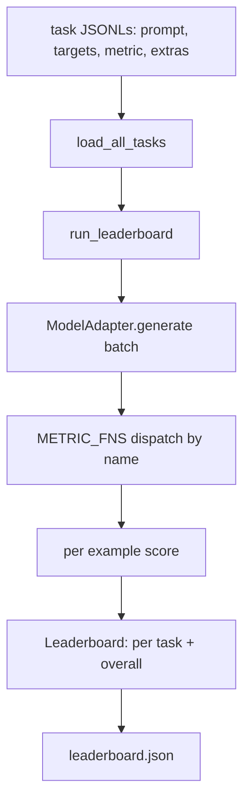
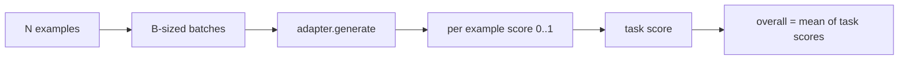

# استفاده از مدل ارزیابی زبان

> یک مدل که در یک کار که نمی توانید تعریف کنید، خوب انجام می دهد، یک مدل است که به طور تصادفی خوب انجام می دهد.

**Type:** Build
**Languages:** Python
**Prerequisites:** Phase 19 lessons 42 to 45
**Time:** ~90 minutes

## اهداف یادگیری

- یک وظیفه را به عنوان یک فایل JSONL با  تعریف کنید`prompt`،`targets`،`metric`، و اختیاری`extras`مثلاً
- پنج متریک را اجرا کنید: مطابقت دقیق، Rouge-l F1، چک قابل اجرا، انتخاب چندگانه، و زیرنسل حاوی است.
- یک رنر بسازید که نمونه ها را در هر کار دسته بندی کند و به یک آداپتور مدل قابل تعویض ارسال کند.
- یک JSON در رده بندی با امتیازات هر کار، تاخیر و متوسط کلی که قابل تکرار است، منتشر کنید.

## مشکل

هر هفته یک مدل زبان جدید در زمین قرار می گیرد. ادعای بازاریابی این است که این کار خوب می کند. سوال صادقانه این است: خوب در چه؟ پاسخ صادقانه این است که شما خود را در لیست رتبه بندی نوشتید، زیرا لیست رتبه بندی فروشنده آن است که آنها به آن گوش می دهند.

بدون یک هرنس در repo شما دو مدل را با ویب مقایسه می کنید. با یک هرنس شما آنها را با امتیاز در یک مجموعه کار ثابت با یک متریک ثابت مقایسه می کنید، در یک JSON شما می توانید تفاوت کنید. هرنس قرارداد بین اجرا دوشنبه و اجرا امروز است. بدون آن، بازگشت ها کشتی است.

این تله بیش از حد به یک مدل منحصر به فرد می پیوندد. راه حل همان تله برعکس است: هرنس به اندازه کافی کوچک است تا در ۱۵ دقیقه خوانده شود، وظایف به اندازه کافی کوچک هستند تا در repo ارسال شوند، متریکها از ابتدا نوشته شده اند تا یک همکار بتواند آنها را بررسی کند، و آداپتور تنها جایی است که کد خاص مدل زندگی می کند. آداپتور را عوض کنید، صفحه ی رتبه حرکت می کند؛ وظایف را عوض کنید، صفحه ی رتبه حرکت می کند. هيچ چيز ديگه اي نباید حرکت کنه

## مفهوم



### مشخصات وظیفه

هر مثال یک خط JSONL است:

```json
{"id": "arith-00", "prompt": "compute: 2 + 2", "targets": ["4"], "metric": "exact_match"}
```

برای اندازه گیری هایی که نیاز به کمک کننده های نمره دارند،`extras`حمل بار مفید جانبی:

```json
{
  "id": "code-00",
  "prompt": "python: write a function f that doubles its input",
  "targets": ["ok"],
  "metric": "code_exec",
  "extras": {"io_pairs": [[1, 2], [3, 6]]}
}
```

یک وظیفه یک وظیفه است`.jsonl`پرونده زیر`outputs/tasks/`. نام فایل نام کار است. همه نمونه ها در یک فایل یک متریک را به اشتراک می گذارند.

### پنج وظیفه ثابت

| Task | Metric | What it tests |
|------|--------|---------------|
| arithmetic | exact_match | Token-level correctness on a deterministic answer |
| summary | rouge_l | Longest common subsequence F1 against a one-line reference summary |
| code-exec | code_exec | Executable test: the predicted function must satisfy a list of input-output pairs |
| multiple-choice | multiple_choice | First letter of the prediction must match an allowed letter |
| generation | substring_contains | Free-form text must contain at least one target substring |

### قرارداد متریک

هر متریک تابع از`(prediction, targets, extras) -> float in [0.0, 1.0]`. هرنس به طور متوسط نمرات هر نمونه را برای بدست آوردن نمرات کار، سپس به طور متوسط نمرات کار را برای بدست آوردن کل. عملکردهای متریکی کوچک هستند:

- `exact_match`: کم حرف، سقوط فضای سفید، برابری
- `substring_contains`: همان نرمال سازی، تست زیر رشته
- `multiple_choice`: اولين حرف بالا
- `rouge_l`: طول LCS به طول پیش بینی و مرجع تقسیم شده، F1 دقیق و بازپس.
- `code_exec`: انجام پیش بینی در یک فضای نام محدود، تماس بگیرید `f(x)`در هر جفت ورودی-خروجی، تعادل ها را بشمارید.

متریک code_exec پیش بینی را در فضای نامگذاری های ساخته شده ای اجرا می کند. آزمون درس ادعا می کند که `import os`چون`os`در فضای نام وجود ندارد؛ شما نمی توانید از پیش بینی کد به سیستم فایل ها برسید.

### آداپتور مدل

```python
class ModelAdapter(Protocol):
    def generate(self, prompts: Sequence[str]) -> List[str]: ...
    @property
    def name(self) -> str: ...
```

آداپتور هم هستش، هم هستش، هم هستش`ToyAdapter`، یک متمایز کننده الگوی تعیین کننده است که برای هر پرامپت در پنج کار ثابت پاسخ درست را می دهد. یک آداپتور واقعی مدل را می خواند و تولید آن را می دهد.

### راننده

`run_task`دسته ها`batch_size`در هر زمان به سمت تابع متریک ارسال می شود. `run_leaderboard`هر کاري رو انجام ميده و به طور متوسط انجام ميده`write_leaderboard`JSON را با یک رشته شیما ارسال می کند تا تغییرات فرمت آینده در حال شکستن داشبورد به طور خاموشی نباشد.



```figure
eval-harness-matrix
```

## آن را بسازید

`code/main.py`این آثار قابل اجرا است.

### مرحله ی اول: وظایف نصب دانه

`seed_fixture_tasks(target_dir)`پنج تا رو مي نويسه`.jsonl`پرونده ها. اولین سری از`main.py`وقتی که دایرکتوری خالی باشه بذره ها رو می زاره

### مرحله دوم: وظایف بارگذاری

`load_all_tasks(task_dir)`هر لحظه میخواد`.jsonl`و یک دستور از نام کار به یک لیست از `Example`سوابق.خط هاي نظر شروع به `#`و خطوط خالی را رد می کنند تا متقاضیان بتوانند فایل ها را یادداشت کنند.

### مرحله 3: متریک ها را پیاده سازی کنید

هر متریک یک تابع کوچک با یک آزمون واحد است. مجموعه آزمون درس شامل 13 مورد شامل نرمال سازی، تعادل جزئی، اجرای کد و رد کد غیر امن است.

### مرحله 4: راننده را بنویسید

`run_task`تکرار دسته ها و تولید یک `TaskResult`با نمره، شمارش درست، شمارش کل و تاخير`run_leaderboard`تمام کارها رو انجام ميده و مياد`Leaderboard`با متوسط کلی.

### مرحله 5: JSON ارسال کنید

`write_leaderboard`.درستهاي خطي را به صورت سريالي ميذاره`--include-per-example`پرچم پرونده های هر نمونه را رها می کند تا شما بتوانید پیش بینی های خود را با اجرا قبلی متمایز کنید وقتی نمرات حرکت می کنند.

اجرا کن

```bash
python3 code/main.py
```

اسکریپت در اولین اجرا، وسایل را تخم می دهد، با آداپتور اسباب بازی (که هر وسیله را درست می کند) آنها را نمره می دهد و می نویسد `outputs/leaderboard.json`. نمره کل 1.0 با آداپتور اسباب بازی`test_main.py`نشان می دهد که همان آرم 0.0 را تولید می کند وقتی آداپتور نمی تواند پاسخ دهد.

## ازش استفاده کن

براي وصل کردن يه مدل واقعي، يه آداپتور بنويسيد

```python
class HttpAdapter:
    name = "vendor.v1"

    def __init__(self, endpoint, api_key):
        self.endpoint = endpoint
        self.api_key = api_key

    def generate(self, prompts):
        out = []
        for prompt in prompts:
            response = http_post(self.endpoint, prompt, self.api_key)
            out.append(response["text"])
        return out
```

عوضش کن`ToyAdapter`برای`HttpAdapter`در بالای`main()`.تسلط، وظایف، مقادیر و جدول رتبه ها یکسان باقی می مانند

سه الگوی برای اجرای هنگام حمل و نقل هرنس در یک پروژه واقعی:

- **Pin the task files.**در صفحه ی رتبه بندی.json محتوای کاری که با هشتگ پینت شده است یا JSONL ها را در کنار آن حمل می کند؛ در غیر این صورت امتیاز زمانی که فایل کاری انجام می شود حرکت می کند و نمی توانید بگویید کدام.
- **Diff predictions, not just scores.**.`--include-per-example`پرچم به شما اجازه می دهد ببینید که مدل در روز نمره کاهش یافته چه گفت.
- **Cap the batch size.**آداپتورهای واقعی محدودیت های سرعت دارند. اندازه ی دسته کوچک باعث می شود که هرنس در بین فروشندگان سازگار باشد.

## -باده

`outputs/skill-lm-eval-harness.md`نسخه: JSONL Task Specific، پنج متریک، آداپتور قابل تعویض، Batched Runner، JSON با رشته شیما. فایل های وظیفه در `outputs/tasks/`این وسایل، برای شروع، به یک پروژه واقعی تبدیل می شوند.

## تمرینات

1. یک کار ششم را با یک متریک سفارشی که از ابتدا می نویسید اضافه کنید (بلو مانند همپوشانی، امتیاز مرجع مانند بلورت، هر چیزی با قرارداد واضح).
2. طولاني`code_exec`برای گرفتن استدوت و قبول کردن لیست از استدوت های انتظار می رود به عنوان اهداف.
3. اضافه کردن یک دستور تفاوت جدول رتبه بندی: داده دو `leaderboard.json`پرونده ها، چاپ کنید که کدام وظایف حرکت کرده و چقدر.
4. مثلاً تاخیر محدود. تماس آداپتور را در یک زمان توقف، سطح جداگانه ای `timeouts`ستون در جدول رتبه بندی
5. محتوای وظیفه را با sha256 در جدول رتبه بندی بنویسید تا خواننده آینده بتواند بررسی کند که آنها همان وظایف را انجام داده اند.

## اصطلاحات کلیدی

| Term | What people say | What it actually means |
|------|-----------------|------------------------|
| Task spec | "The eval format" | JSONL file with prompt, targets, metric, optional extras per example |
| Metric | "How you score" | Function from (prediction, targets, extras) to a float in [0, 1] |
| Adapter | "The model client" | Object with a generate(prompts) -> list[str] method; the only model-specific code |
| Leaderboard | "The scoreboard" | JSON with per-task scores, total counts, latency, and an overall average |
| Code exec metric | "Run it and check" | Execute the prediction in a restricted namespace, compare against input-output pairs |

## خواندن بیشتر

- آرمینای اصلی ارزیابی lm برای مرجع تولید، بسیار بزرگتر اما شکل مشابه
- از HuggingFace برای اجرای جایگزین همان قرارداد درخواست می کنم
- مرحله 19 درس 46 شامل الگوهای تراکم گرادینت استفاده شده در استیک تمرین در نمرات هرنس است.
- مرحله 19 درس 47 شامل فرمت نقطه بازرسی است که با آن امتیاز می دهید؛ هشتگ نقطه بازرسی را در جدول رتبه بندی ثبت کنید.
- مرحله 19 درس 48 شامل دسته آموزش توزیع شده است که مدل مورد آزمایش را تولید کرده است.
