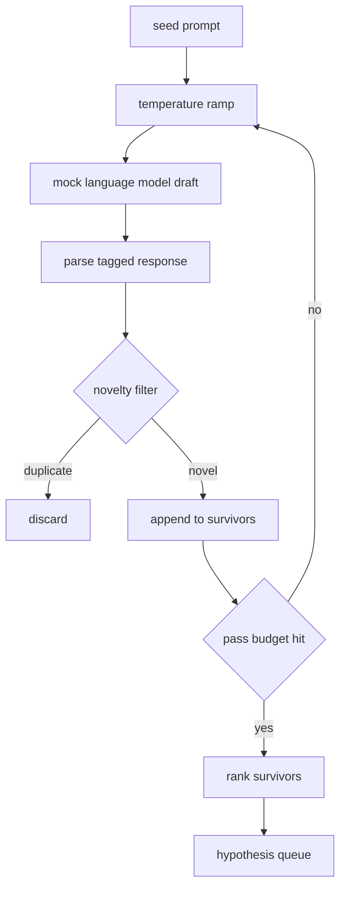

# ژنراتور فرضیه

> يه مامور تحقيقي که دو بار سوال ي مشابه رو بپرسد توکن ها رو ضايع ميکنه

**Type:** Build
**Languages:** Python
**Prerequisites:** Phase 19 Track A lessons 20-29
**Time:** ~90 minutes

## اهداف یادگیری
- یک نمونه را از یک نمونه دانه هدایت کنید و تولیدات آن را به پرونده های فرضیه تایپ شده تبدیل کنید.
- دمای نمونه را در هر گذرگاه افزایش دهید تا مسود بعدی از آخرین حرکت کند.
- فیلتر نزدیک دوگونی با یک مدل کوچک ادغام و یک حد فاصله cosine.
- بقایای زنده ماندگان را با یک تابع نمره ای که نوین، خاصیت و قابل آزمایش را ترکیب می کند، رتبه بندی کنید.
- هر گام رو تعیین کننده نگه دار تا همون دانه همیشه همون صف رو تولید کنه

## چرا تولید، پس فیلتر

یک برنامه نویس که یک بار از یک مدل سوال می کند یک فرضیه دریافت می کند. برای یک مثال کار شده این خوب است. برای یک حلقه تحقیقاتی این شکل اشتباه است. حلقه یک صف مرتب با عمق را می خواهد، بنابراین وقتی فرضیه اول شکست می خورد، دوچرخه بعدی را بدون پرداخت هزینه کامل نمونه گیری دیگر آماده می کند.

دو ایده برای ایجاد این صف ترکیب می شوند. اولین مورد افزایش دمای است: هر گذر از طریق نمونه برداری دمای را یک گره بالا می برد، بنابراین طرح های بعدی تشویق می شوند تا دور و بر شوند. دوم، فیلتر کردن نوینتی است: پس از هر طرح، ژنراتور فاصله ی گنجاندن از هر زنده مانده قبلی را اندازه گیری می کند و هر چیزی را در داخل خوشه رد می کند.

درسی یک مدل زبان جعلی را ارسال می کند که دنباله های توکن اسکریپت را برای پیام های ثابت باز می گرداند. جعلی برای تمرین مسیر کامل کافی است: پیام تخم وارد، رمپ دمای اعمال شده، نامزدهای تجزیه و تحلیل شده، فیلتر جدید اجرا شده، صف خارج شده.

## شکل فرضیه

```text
Hypothesis
  id             : int           (monotonic within a run)
  text           : str           (the claim)
  variables      : list[str]     (what changes between conditions)
  metric         : str           (what the runner will measure)
  baseline_ref   : str | None    (which paper or run the comparison cites)
  draft_pass     : int           (which sampler pass produced this)
  temperature    : float         (the sampler setting at draft time)
  novelty_score  : float         (distance from prior survivors, 0..1)
  rank_score     : float         (weighted sum used for ordering)
```

`variables`و`metric`در کلاس 52، رانر این زمینه ها را مستقیماً وقتی که پیکربندی آزمایش را ایجاد می کند می خواند.

`baseline_ref`در درس 53، ارزیابی کننده نیاز به یک خط پایه برای مقایسه دارد. اگر فرضیه یک را حذف کند، ارزیابی کننده به راه اندازی قبلی بر روی همان متریک باز می گردد.

```figure
cg-novelty-ramp
```

## معماری



حلقه رو به جلو میذارم. بخش جالب اینه که هر جعبه یه قرارداد سخت داره.

## رمپ دمای

از شروع`t_min`، پایانش در`t_max`، مرحله`(t_max - t_min) / (n_passes - 1)`هر گذرگاهي که به نمونه در دمای فعلی ميخواد، تولید ميکنه`n_passes`ارزش های مساوی از `GeneratorConfig.schedule()`مدل ساختگی با تغییر بین مجموعه کوچکی از پاسخ های اسکریپت شده و پر شده از دمای درجه حرارت احترام می گذارد`(prompt, temp_bucket)`سطل ها فاصله های باز هستند بنابراین تغییر کمی در دمای سطل مختلف را انتخاب می کند و یک طرح مختلف تولید می کند. در تولید نمونه گیر یک مدل واقعی با `temperature=t`از اونجا عبور کرد

جدول پیش فرض شش پاس از `0.2`به`1.2`شش تا به اندازه کافی برای پر کردن صف بدون پرداخت هزینه نمونه هایی که فیلتر جدید به هر حال رد می کند.`0.2`مدل پپوپو تخم رو برگردونه بالا`1.2`پاسخ ها به طور معمول از موضوع خارج می شوند و تحلیلگر را شکست می دهند.

## فیلتر جدید

بعد از تجزیه و تحلیل هر طرح، ژنراتور متن را دربر می گیرد و با هر فرضیه پذیرفته شده مقایسه می کند. این گنجانده یک کیسه کوچک از نشانه های کلمه است که به طول واحد عادی می شود. فاصله کاسین بین دو متری واحد است.`1 - dot(a, b)`. يه مسوديه اگر حداقل فاصله اش از هر زنده زنده اي قبل از اون بالاتر باشه`novelty_threshold`. پیش فرض`0.25`. .

این هاش شده شامل نیست. این تعیین کننده است، دارای وابستگی های صفر است، و برای گرفتن مورد واضح کافی است: دو طرح که بیشتر اسم های خود را به اشتراک می گذارند. یک انتشار تولید در یک مدل جمله کوچک تبادل می کند. رابط یکسان باقی می ماند.

## امتیاز رتبه

```text
rank_score = w_novelty * novelty_score
           + w_specificity * specificity_score
           + w_testability * testability_score
```

سه تا امتیاز زیر`novelty_score`حداقل فاصله ی پیوند از بقایای قبلی است.`specificity_score`تعداد متغیرهای مشخص در فرضیه به تعداد هدف تقسیم می شود.`testability_score`یک است اگر فرضیه هر دو متریک و یک خط پایه را مشخص کند، نیمی اگر فقط یک متریک داشته باشد، صفر در غیر این صورت.

وزن های پیش فرض`0.4`،`0.3`،`0.3`وزن ها در دستگاه ژنراتور زنده هستند پس درس پایین می تواند بدون شکستن کد آنها را تغییر دهد.

## مدل زبان جعلی

```python
class MockLLM:
    def sample(self, prompt: str, temperature: float, seed: int) -> str:
        ...
```

نمونه گیری مشخصه ای است که به عنوان یک`(prompt, temperature, seed)`سه برابر. جعلي ميز پاسخي را با اسکرين نگه مي دارد`(prompt_signature, temperature_bucket)`اگر جدول برای کلید وارد نشده باشد، نمونه گیرنده یک فال بیک را باز می گرداند که در تجزیه کننده شکست می خورد. مسیر فال بیک توسط یکی از آزمایش ها اجرا می شود.

تخم به جواب ميخوره پس همش`(prompt, temperature)`در آزمایش ها ما دانه را برای حفظ نتایج قابل تکرار می کنیم. در یک انتشار واقعی دانه از یک ساعت سیستم یا یک شمارنده می آید.

## صف تولید

محصول یک لیست از`Hypothesis`سوابق توسط `rank_score`در درس 52، رنده سر را می کشد، آزمایش را انجام می دهد، و ارزیابی کننده در درس 53، حکم را می نویسد. اگر حکم می گوید فرضیه اشتباه است، رنده فرضیه بعدی را می کشد.

صف محدود است. وقتی خالی باشد، سازنده می تواند یا به سرعت تخم را گسترش دهد و ژنراتور را دوباره اجرا کند یا متوقف شود و بودجه را تمام کند.

## چطور کد رو بخونيم

`code/main.py`تعریف می کند`Hypothesis`،`MockLLM`،`HypothesisGenerator`، و یک دمو تعیین کننده. ژنراتور یک واحد را افشا می کند`run(seed_prompt)`روش که یک صف مرتب را باز می گرداند؛ تعداد عبور از `GeneratorConfig.n_passes`به جای اینکه به عنوان یک استدلال منتقل شود. گنجانده شدن یک کیسه هشت شده از توکن ها است. فیلتر نوینتی یک تابع است. نمره رتبه یک تابع است. هیچ چیز بستگی به `numpy`؛ ریاضیات درونش خالص است ، بنابراین درس قابل حمل است.

`code/tests/test_generator.py`مسیر خطی، مسیر رد دوگانه، مسیر شکست پارسر، مرز رمپ دمای و ترتیب رتبه را پوشش می دهد.

## جایی که این سوراخ ها

درس پنجاه و یک سر صف را می گیرد و جستجوی ادبیات را برای تأیید یا رد آن انجام می دهد. درس پنجاه و دو سر را می گیرد و یک آزمایش واقعی را انجام می دهد. درس پنجاه و سه هر دو محصول را می خواند و حکم می نویسد. چهار درس به یک حلقه تحقیقاتی بدون انسان در آن تشکیل می شود؛ یک انسان می تواند در هر مرز وارد شود.
