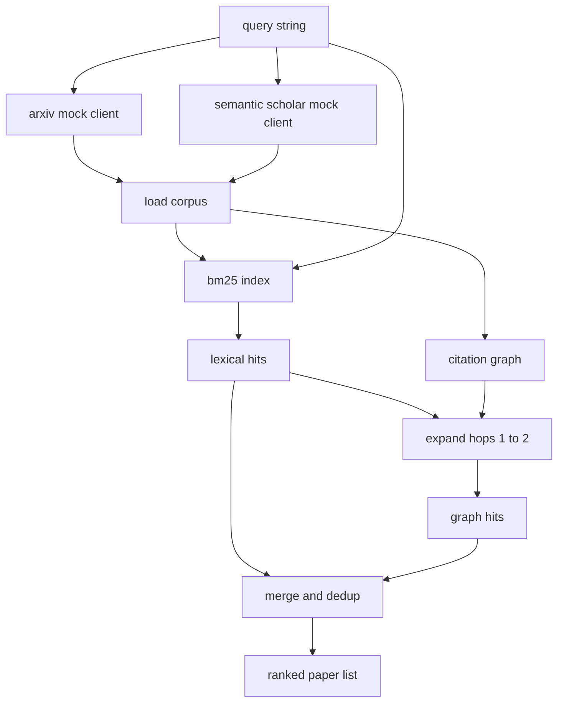

# بازیافت ادبیات

> فرضیه ای ارزان است. دانستن اینکه آیا کسی قبلاً آن را اثبات کرده است، بخش گران است. لایه بازیافت را بسازید که قبل از اینکه دوچرخه یک جعبه شن را به بالا ببرد، پاسخ به این سوال را بدهد.

**Type:** Build
**Languages:** Python
**Prerequisites:** Phase 19 Track A lessons 20-29
**Time:** ~90 minutes

## اهداف یادگیری
- یک پرونده کاغذی کوچک با زمینه هایی که حلقه به پایین می خواند، مدل کنید.
- یک شاخص BM25 را بر روی خلاصه ها با ساختار داده های stdlib ایجاد کنید.
- يه گراف نقل قول رو به روي کاغذ هاي سطح بريد که جستجو در لغات از دست داده
- ضربات تخفیف در لغت و نمودار از طریق یک سند کاغذی ثابت عبور می کند.
- دو API خارجی ساختگی را پشت یک مشتری بسته کنید تا سایت تماس های بالا در زمان فرود نقاط نهایی یکسان بماند.

## چرا دو بار بازيافت

جستجوی کلمات کلیدی در خلاصه ها مقالات را باز می گرداند که ذخایر لغاتی را با سوال مشترک می کند. که بیشتر سطح رو پوشش میده دو پرونده رو از دست داده اولین زمانی است که مقاله پایه از لغات مختلف استفاده می کند؛ به عنوان مثال یک سوال برای "انتباه کمی" مقاله ای با عنوان "انتخاب بلوک در مسیر ترانسفارمر" را از دست می دهد. دوم زمانی است که مقاله مربوطه یک دنباله است که یک لنگر شناخته شده را ذکر می کند؛ پیدا کردن لنگر و حرکت به جلو موثرتر از زور کردن استخر است.

درس هر دو پاس را ایجاد می کند. BM25 بر روی خلاصه ها ضربه های لغوی را می گیرد. یک گراف نقل قول یک دانه را به جلو و عقب با یک یا دو هپ گسترش می دهد. اتحاد توسط کاغذ id تخفیف داده می شود و با یک امتیاز کوچک ترکیب شده رتبه بندی می شود.

## شکل کاغذ

```text
Paper
  id          : str           (stable identifier, "p001" for the mock corpus)
  title       : str
  abstract    : str
  year        : int
  authors     : list[str]
  references  : list[str]     (paper ids this paper cites)
  citations   : list[str]     (paper ids that cite this paper)
  source      : str           (which mock api supplied it, "arxiv" or "s2")
```

زمینه های مرجع و نقل قول نمودار اشاره ای را تشکیل می دهند. دو API ساختگی به سمت یکدیگر باز می گردند اما زمینه های یکسان نیستند، بنابراین بارنده corpus آنها را در یک`id`. .

```figure
cg-citation-hops
```

## معماری



مشتری بازیافت هر دو گذر و ادغام را دارد. تماس گیرنده یک سوال را به آن می دهد و یک لیست رتبه بندی شده را به دست می آورد که هر ورودی دارای هر زمینه امتیاز کاغذی است (`bm25_score`،`graph_distance`،`recency_score`،`final_score`) که رتبه بندی را توضیح می دهد.

## BM25 از ابتدا

پیاده سازی استاندارد Okapi BM25 با پارامترهای پیش فرض است `k1=1.5`،`b=0.75`. شاخص دو فرهنگ لغت است:`term -> doc_frequency`و`term -> list of (doc_id, term_count)`طول سند تعداد نماد خلاص است. طول متوسط سند یک بار در زمان ساخت شاخص محاسبه می شود. امتیاز یک سوال مجموعه ای از اصطلاحات سوال است `idf * tf_norm`کجا`tf_norm`فرکانس استاندارد BM25 طول استاندارد اصطلاح است.

. نشان دهنده اش`lower`سپس به غیر الفنومریک تقسیم می شود. این است که نه است. یک سیستم تولید به یک voter کوچک تبدیل می شود. رابط باقی می ماند همان.

```text
idf(t)      = log((N - df + 0.5) / (df + 0.5) + 1.0)
tf_norm(t)  = (f * (k1 + 1)) / (f + k1 * (1 - b + b * dl / avgdl))
score(d, q) = sum over t in q of idf(t) * tf_norm(t)
```

## عبور نمودار نقل قول

گراف یک بار از کورپوس ساخته می شود. لبه های جلو از یک کاغذ به مرجع آن می روند. لبه های عقب از یک کاغذ به نقل قول آن می روند. عبور یک جستجوی පළل است که توسط ضربه های بالای BM25 تخم ریزی شده است.

دو هپ یک سقف عمدی است. یک هپ بیش از حد سطحی است؛ عامل اغلب می خواهد اجداد یا نسل فوری. سه هپ اندازه نتیجه را در یک نمودار متصل می کند و تمایل به خارج شدن از موضوع دارد. درس محدودیت هپ را به عنوان یک دکمه پیکربندی نشان می دهد تا یک حلقه پایین جریان بتواند آن را محکم کند.

## کاهش و رتبه بندی

دو پاس مجموعه های متداول را باز می کنند. کلید های ادغام در کاغذ ID. برای هر کاغذ نمره نهایی یک ترکیب وزن شده است.

```text
final_score = w_bm25 * bm25_score_norm
            + w_graph * graph_score
            + w_recency * recency_score
```

`bm25_score_norm`نمره BM25 به نمره حداکثر BM25 در مجموعه ادغام شده تقسیم می شود (پس میدان در صفر به یک زندگی می کند). `graph_score`پس اونم يه نفر براي ضربه هاي الکتريکي`0.6`برای یک پرش`0.3`اگه دو تا هپ بزنم صفر`recency_score`یک رمپ خطی از صفر در سال حداقل corpus تا یک در حداکثر است.

وزن های پیش فرض`0.5`،`0.3`،`0.2`وزن ها مرتب هستند؛ یک موضوع قدیمی ممکن است به سرعت حرکت کند در حالی که یک موضوع سریع آن را بالا می برد.

## جعلي بدن

اين مجموعه 100 مقاله اي هست که توسط`build_corpus()`هر مقاله دارای عنوان و خلاصه ای از پنج موضوع: توجه کمیاب، افزایش بازیافت، آداپتورهای درجه پایین، لوله سازی مجموعه داده ها و استفاده از ارزیابی است. مرجع و نقل قول ها به گونه ای متصل شده اند که هر موضوع یک زیرگراف مرتبط با چند لبه موضوع را تشکیل می دهد.

دو مشتری API ساختگی (`ArxivMockClient`،`SemanticScholarMockClient`) از همان کورپوس خوانده می شود اما زمینه های مختلف را نشان می دهد. آرکسیو عنوان، انتزاع، سال، نویسندگان را باز می دهد. سیمنتک اسکالر مرجع و نقل قول ها را اضافه می کند. اتحادیه های مشتری در ID بازیافت می کنند؛ مدیریت اختلافات بین زمینه های مشتری به یک درس پیگیری باز می گردد.

## چه درس 52 و 53 میخواد

دوچرخه در درس 52 مي خواد`paper.id`،`paper.title`در درس 53، ارزیابی کننده می خواند:`paper.year`و`paper.references`برای نسبت دادن یک خط پایه به یک مقاله خاص.

مشتری بازیافت یک `RetrievalResult`با هر دو لیست رتبه بندی شده و متریک هر سوال: تعداد ضربه، میانگین امتیاز، بالاترین امتیاز، کل زمان دیوار. رنده این را ثبت می کند تا یک گذر قابل مشاهده پایین تر بتواند کیفیت را در طول زمان نشان دهد.

## چطور کد رو بخونيم

`code/main.py`تعریف می کند`Paper`،`ArxivMockClient`،`SemanticScholarMockClient`،`BM25Index`،`CitationGraph`،`RetrievalClient`در مورد این موضوع، ما می خواهیم به شما بگویم که در مورد یک کلاس، 60 خط، یک کلاس، یک کلاس، یک کلاس، یک کلاس، یک کلاس، یک کلاس، یک کلاس، یک کلاس، یک کلاس، یک کلاس، یک کلاس، یک کلاس، یک کلاس، یک کلاس، یک کلاس، یک کلاس، یک کلاس، یک کلاس، یک کلاس، یک کلاس، یک کلاس، یک کلاس، یک کلاس، یک کلاس، یک کلاس، یک کلاس، یک کلاس، یک کلاس، یک کلاس، یک کلاس، یک کلاس، یک کلاس، یک کلاس، یک کلاس، یک کلاس، یک کلاس، یک کلاس، یک کلاس، یک کلاس، یک کلاس، یک کلاس، یک کلاس، یک کلاس، یک کلاس، یک کلاس، یک کلاس، یک کلاس، یک کلاس، یک کلاس، یک کلاس، یک کلاس، یک کلاس، یک کلاس، یک کلاس، یک کلاس، یک کلاس، یک کلاس، یک کلاس، یک کلاس، یک کلاس، یک کلاس، یک کلاس، یک کلاس، یک کلاس، یک کلاس، یک کلاس، یک کلاس، یک کلاس، یک کلاس، یک کلاس، یک کلاس، یک کلاس، یک کلاس، یک کلاس، یک کلاس، یک کلاس، یک کلاس، یک کلاس، یک کلاس، یک کلاس، یک کلاس، یک کلاس، یک کلاس، یک کلاس، یک کلاس، یک کلاس، یک، یک کلاس، یک کلاس، یک، یک، یک کلاس، یک کلاس، یک، یک، یک، یک، یک کلاس، یک، یک، یک، یک، یک، یک، یک، یک، یک، یک، یک، یک، یک، یک، یک، یک، یک، یک، یک، یک، یک، یک، یک، یک، یک، یک، یک، یک، یک، یک، یک، یک، یک، یک، یک، یک، یک، یک، یک، یک، یک، یک، یک، یک، یک، یک، یک، یک، یک، یک، یک، یک، یک، یک، یک، یک، یک، یک، یک، یک، یک، یک، یک، یک، یک، یک، یک، یک، یک، یک، یک، یک، یک، یک، یک، یک، یک، یک، یک، یک، یک، یک، یک، یک، یک، یک، یک، یک، یک، یک، یک، یک، یک، یک، یک، یک، یک، یک، یک، یک، یک، یک

`code/tests/test_retrieval.py`مسیر لغوی، مسیر نمودار، ادغام، حذف و سوال خالی را پوشش می دهد.

## جایی که این سوراخ ها

درس پنجاه فرضیه ای تولید می کند. درس پنجاه و یک در ادبیات جستجو می کند تا ببیند آیا این فرضیه قبلاً حل شده است یا خیر. درس پنجاه و دو آزمایش را اجرا می کند اگر این اتفاق نیفتد. درس پنجاه و سه هم نتیجه بازیافت و هم معیارهای آزمایش را برای نوشتن حکم می خواند. مشتری بازیافت ارزان ترین چهار مرحله است و در آرکیسترتر اولین بار اجرا می شود.
