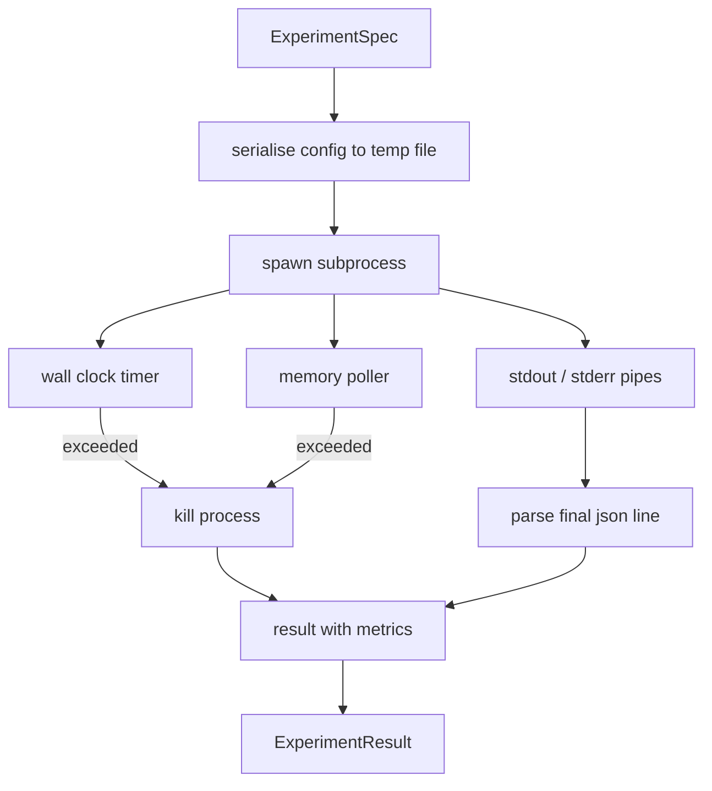

# دوچرخه تجربی

> حلقه فقط به اندازه اندازه گیری های آن صادق است. راه اندازی رانر که یک مشخصات می گیرد، آن را در یک فرعی عمل sandboxed اجرا می کند، و یک نقطه متریک json را که ارزیابی کننده می تواند اعتماد کند.

**Type:** Build
**Languages:** Python
**Prerequisites:** Phase 19 Track A lessons 20-29
**Time:** ~90 minutes

## اهداف یادگیری
- یک آزمایش را به عنوان یک مشخصات تایپ شده کدگذاری کنید که رانر می تواند به یک فرعی عمل سریالیز کند.
- یک فرعی فرآیند با یک ساعت سخت دیوار وقت و یک کیپ حافظه نرم را راه اندازی کنید و هر دو را به عنوان شرایط نهایی ظاهر کنید.
- گرفتاری stdout، stderr، و متریک های ساختار یافته را به یک رکورد نتیجه واحد.
- یک جدول آبلاسیون بسازید که یک دکمه پیکربندی را در یک زمان بر روی یک مشخصات پایه ثابت پاک کند.
- هر نتیجه را به عنوان یک دانه تعیین کننده نگه دارید تا ارزیابی کننده اعداد مشابه را در همه راه ها ببیند.

## چرا فرعی

یک حلقه تحقیقاتی کد غیرقابل اعتماد را اجرا می کند. فرضیه از یک نمونه گیر آمده است، اسکریپت آزمایش از همان مسیر آمده است؛ با درمان هر یک از آنها به عنوان ایمن در فرآیند به دنبال یک تصادف است که آرژستر را پایین می آورد. فرعی فرآیندها ساده ترین انزوا هستند که زبان می فرستد: یک فرآیند جداگانه، فضای آدرس مستقل، یک دستی سیگنال در طرف مادر.

در اینجا دوچرخه کار را انجام نمی دهد. هیچ cgroup، هیچ فلتر seccomp، هیچ نامگذاری نام. آنچه که دارد یک ساعت دیوار زمان، یک حلقه رای گیری برای رشد حافظه، و یک مسیر قتل است که فرآیند را در هر دو حد پایان می دهد. این قرارداد زمان اجرا هر چند sandbox پیچیده تر گسترش می یابد. درس قرارداد را به اندازه کافی کوچک نگه می دارد تا در یک نشست خوانده شود.

## شکل ExperimentSpec

```text
ExperimentSpec
  spec_id        : str            (stable id, "exp_001")
  hypothesis_id  : int            (link back to the queue from lesson 50)
  script_path    : str            (path to the python script to run)
  config         : dict           (passed to the script as one json arg)
  seed           : int            (deterministic seed for the experiment)
  wall_timeout_s : float          (hard timeout, killed on exceed)
  memory_cap_mb  : int            (soft cap, polled; killed on exceed)
  metric_keys    : list[str]      (which fields the evaluator will read)
```

اسکریپت روی دیسک زندگی می کند؛ رانر پیکربندی را به یک مسیر فایل موقت می نویسد که اسکریپت می خواند. انتظار می رود اسکریپت یک خط json واحد را در stdout چاپ کند که کلید آن یک سوپر مجموعه از`metric_keys`هر چيزي که در مورد "استود" هست ضبط ميشه ولي توسط "مترس پارسر" نادیده گرفته ميشه

```figure
cg-runner-limits
```

## معماری



رنده یک کلاس با یک روش اصلی است. رابرنده یک رشته کوچک است که یک بار در هر فاصله نظرسنجی بیدار می شود و فرعی را می خواند.`psutil`معادل از سیستم فایل های proc در صورت وجود، به هیچ عملی در صورت عدم افشای این سیستم باز می گردد.

## چرا یک کیپ حافظه نرم

کلاه حافظه سختي نياز داره`resource.setrlimit`درسی یک رویکرد قابل حمل را ارائه می دهد: اندازه مجموعه مقیم را از پلتفرم بررسی کنید و فرعی را بکشید اگر از حد بالاتر باشد. این حد نرم است زیرا رابرنده دارای فاصله غیر صفر است؛ یک فرآیند می تواند بالاتر از حد بین نظرسنجی ها باشد و سپس عقب برود. رابرنده حداکثر مشاهده RSS را ثبت می کند تا ارزیابی کننده بتواند ببیند که چگونه نزدیک به حد رسید.

در سیستم هایی که از پشتیبانی از بازرسی فرآیند برخوردار نیستند، سروکار یک بار هشدار را ثبت می کند و خود را غیرفعال می کند. زمان زمان ساعت دیوار هنوز هم اعمال می شود. آزمون های درس هر دو مسیر را پوشش می دهد.

## گرفتن و گرفتن

دوچرخه ای هر دو لوله را که در پایان آن تخلیه شده است می خواند. Stdout خط به خط اسکن می شود. آخرین خط که به عنوان json با تمام موارد مورد نیاز تجزیه می شود.`metric_keys`خط های قبلی json در نتیجه به عنوان`intermediate_metrics`; ارزیابی کننده می تواند از این موارد برای منحنیات یادگیری استفاده کند.

Stderr به طور لفظی در نتیجه ثبت می شود. راننده هرگز روی کد خروج غیر صفر بالا نمی برد؛ در عوض کد را در نتیجه ثبت می کند. هر خروج غیر صفر برچسب گذاری می شود `"crash"`حتی وقتی اسکریپت متریکها را چاپ می کند، بنابراین ارزیابی کننده اجراهای جزئی را به عنوان شکست به طور پیش فرض می شناسد.

## جدول حذف

```python
def ablate(base: ExperimentSpec, knob: str, values: list[Any]) -> list[ExperimentSpec]:
    ...
```

با توجه به مشخصات پایه و نام دکمه، کمک کننده یک مشخصات در هر مقدار را با `config[knob]`هر نوعي که در موردش ميگيره`spec_id`(`f"{base.spec_id}_{knob}_{value}"`. راننده يه کشتی مياره`AblationRunner`که آنها را به ترتیب اجرا می کند و به آنها یک`AblationTable`با ارزش تخته ها مشخص شده

چرا یک تکه در یک زمان. تکه های فاکتوری کامل به صورت نمایی منفجر می شوند و نتایج را که ارزیابی کننده نمی تواند تفسیر کند، تولید می کنند. یک تکه در یک زمان یک محور پاک را تولید می کند که ارزیابی کننده می تواند نقشه برداری کند. درس فقط از تکه های چند تکه پشتیبانی می کند.

## تعیین کننده

هر نمونه ای دانه ای را حمل می کند. راننده دانه را از طریق دستور ترتیب به متن می فرستد (`config["__seed"] = spec.seed`) نسخه هاي آزمايش ساختگي در`code/experiments/`در درس 53 ارزیابی کننده بستگی به این دارد؛ بدون تعیین گرایی یک "بازگشت" ممکن است یک ابتدایی تصادفی متفاوت باشد.

## اسکریپت آزمایش جعلی

درسي يه سري اسكندري آزمايش ميده:`code/experiments/sparsity_experiment.py`این یک اسکریپت واقعی است که فایل پیکربندی خود را می خواند، یک تمرین کوچکی را با یک گذرگاه تصادفی نومیزی شبیه سازی می کند و یک نقطه متریک json را چاپ می کند. اسکریپت به یک`sleep_s`دکمه برای تست زمان بندی و یک`allocate_mb`دکمه براي تستي ازرسي حافظه

شبیه سازی چیزی واقعی نیست. این یک محاسبات عددی است که شکل یک حلقه آموزشی را تقلید می کند: منحنی از دست دادن، یک پیچیدگی نهایی، یک زمان دیوار. نکته درس راننده است، نه شبیه سازی. یک اسکریپت آزمایش واقعی یک مدل را وارد می کند.

## شکل نتیجه

```text
ExperimentResult
  spec_id              : str
  hypothesis_id        : int
  exit_code            : int
  terminal             : "ok" | "timeout" | "oom" | "crash"
  wall_time_s          : float
  peak_rss_mb          : float | None
  metrics              : dict
  intermediate_metrics : list[dict]
  stdout_tail          : str
  stderr_tail          : str
```

ارزیابی کننده میخواد`metrics`و`terminal`اول اگه ترمینال چیزی دیگه باشه`"ok"`آزمایش به عنوان یک اجرا شکست خورده حساب می شود و حکم ارزیابی کننده خودکار است. در غیر این صورت متریکها از آزمون اهمیت عبور می کنند.

## چطور کد رو بخونيم

`code/main.py`تعریف می کند`ExperimentSpec`،`ExperimentResult`،`ExperimentRunner`،`AblationRunner`، و یک دمو تعیین کننده است. مدیریت فرعی فرآیند یک کلاس است. مدرس حافظه یک رشته کوچک است. کمک کننده حذف یک تابع واحد است.

`code/experiments/sparsity_experiment.py`این آزمایش در آزمایش ها استفاده می شود. مسیر فایل پیکربندی خود را از argv می خواند و در هنگام تکمیل یک خط متریک json را می نویسد.

`code/tests/test_runner.py`مسیر موفقیت، مسیر زمان بندی، مسیر تصادف، جدول تخفیف و چک تعیین گرایی در دو رنده را پوشش می دهد.

## جایی که این سوراخ ها

درس پنجاه فرضیه را تولید می کند. درس پنجاه و یک هر چیزی را که ادبیات قبلاً حل کرده است فیلتر می کند. درس پنجاه و دو آزمایش را برای آنچه باقی مانده است انجام می دهد. درس پنجاه و سه نتیجه را می خواند، آزمون معنی را انجام می دهد و حکم را که گروه سازنده در برابر فرضیه id ذخیره می کند، می نویسد.
