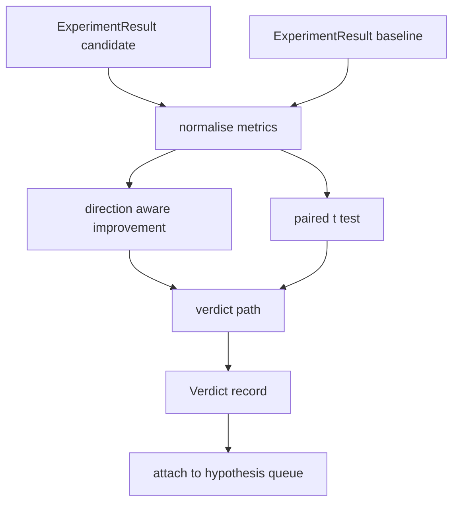

# ارزیابی کننده نتیجه

> دوچرخه تعداد تولید کرد. ارزیابی کننده تصمیم می گیرد که آیا این اعداد یک بهبود، بازگشت یا شور هستند. مسیر حکم را بسازید که متریک را به یک نتیجه گیری یک خط تبدیل می کند.

**Type:** Build
**Languages:** Python
**Prerequisites:** Phase 19 Track A lessons 20-29
**Time:** ~90 minutes

## اهداف یادگیری
- مقایسه یک کاندیدای در حال اجرا با یک خط پایه با استفاده از بهبود آگاهانه جهت و یک حد ثابت.
- یک تست جفت t را از ابتدا برای هر تخم میترک اجرا کنید و مقدار p حاصل را بخوانید.
- معیارهای مقیاس بندی را عادی سازی کنید تا یک گزارش پایین تر بتواند آنها را با معیارهای خطی ترکیب کند.
- هر فرضيه اي که گروه سازي مي تواند به صف از درس پنجاه متصل کنه، تصميم بده
- هر قدم رو پاک نگه دار تا همون ورودی ها همیشه حکم مشابه رو به دست بیاره

## چرا یک آزمایش جفت

تعداد واحد از راننده نمی گوید که آیا تغییر واقعی است. همان ساختار با دانه های مختلف باعث پیچیدگی های متفاوتی می شود. تغییر ممکن است صدا باشد. مقایسه درست همبستگی است: همان دانه ها با داده های مشابه، یک بار با کاندید و یک بار با خط پایه اجرا می شود. هر دانه کمک کننده ای برای تفاوت است. متوسط این تفاوت ها، اثر است. اشتباه استاندارد این تفاوت ها، کف شور است.

درس از ابتدا تست رو اجرا ميکنه`scipy.stats`ریاضیات به اندازه کافی کوچک است تا در یک صفحه نمایش بخواند.

```text
diffs    = [a_i - b_i for i in seeds]
mean     = sum(diffs) / n
variance = sum((d - mean) ** 2 for d in diffs) / (n - 1)
t_stat   = mean / sqrt(variance / n)
df       = n - 1
p_value  = two_sided_p(t_stat, df)
```

ارزش p دو طرفی از یک تابع بتا نامکمل منظم استفاده می کند. درس یک پیاده سازی کوچک را ارسال می کند که از کسری ادامه Lentz استفاده می کند. کل چیز ششصد خط از ریاضی stdlib است.

## بهبود آگاهی از جهت

برخی از معیارهای با افزایش (درست بودن، تولید) بهبود می یابند، برخی دیگر با کاهش (خسارت، پیچیدگی، زمان دیوار) بهبود می یابند. ارزیابی کننده یک `direction`در هر متریک

```text
if direction == "higher_is_better":
    improvement = (candidate - baseline) / abs(baseline)
elif direction == "lower_is_better":
    improvement = (baseline - candidate) / abs(baseline)
```

بهبود امضا شده. بهبود منفی در یک متریک بالاتر بهتر است به معنی کاندید بدتر است. مسیر حکم نشان و اندازه را به هم می خواند.

یک حد ثابت (`improvement_threshold=0.02`در زیر این حکم "رسانه" بدون توجه به ارزش p است؛ حلقه علاقه مند به تغییرات نیست که کاربر نمی تواند اندازه گیری کند.

```figure
cg-paired-verdict
```

## معماری



ارزیابی کننده سه محاسبه مستقل را اجرا می کند و آنها را در مسیر حکم ترکیب می کند. هر محاسبه یک تابع خالص بدون حالت مشترک است.

## عادی سازی روزنامه

کمال شکلی در خسارت است. کاهش 0.1 در خسارت کاهش بسیار بزرگتر در کمال شکلی است. مقایسه کمال شکلی مستقیماً بین دو پیکربندی خوب است، اما ترکیب آن با متریک های خطی در یک گزارش واحد نیاز به عادی سازی دارد.

درس هر متريک رو که`scale`این میدان`"log"`با گرفتن Log طبیعی قبل از محاسبه بهبود. بعد از آن، آستانه اعمال می شود در فضای Log. یک کاهش پیچیدگی از 32 به 28 است`log(28) - log(32) = -0.133`در یک پایین تر است بهتر است متریک که بسیار بالاتر از حد دو درصد است.

```text
if scale == "log":
    a = log(candidate)
    b = log(baseline)
else:
    a = candidate
    b = baseline
```

متریک با `scale="linear"`(به طور پیش فرض) از تغییر عبور کنید. همان مسیر کد هر دو را اداره می کند.

## آزمایش جفت در هر دانه

دوچرخه ای از درس پنجاه دو یک نقطه متریک نهایی را در هر راندن منتشر می کند. برای آزمون جفت، ارزیابی کننده به یک نقطه در هر دانه برای کاندید و یک نقطه در هر دانه برای خط پایه نیاز دارد. آرژانتور آزمایش مشابه را تحت هر دو پیکربندی در یک لیست دانه اجرا می کند و به ارزیابی کننده دو لیست از دانه ها می دهد.`ExperimentResult`پرونده ها

ارزیابی کننده آنها را به اساس دانه ها (بذر در`result.metrics["seed"]`) و متریک مورد نیاز را اجرا می کند. اگر دانه ها در دو لیست مطابقت نداشته باشند، ارزیابی کننده یک `PairingError`. آرکستر بايد دوباره اجرا کنه

## شکل حکم

```text
Verdict
  hypothesis_id          : int
  metric                 : str
  direction              : "higher_is_better" | "lower_is_better"
  scale                  : "linear" | "log"
  candidate_mean         : float
  baseline_mean          : float
  improvement            : float       (signed, fraction; see direction rules)
  p_value                : float | None  (None if n < 2)
  significance_threshold : float
  improvement_threshold  : float
  verdict                : "improved" | "regressed" | "noise" | "failed"
  rationale              : str
```

راه حکم یک جدول تصمیم گیری کوچک است:

```text
1. If any candidate result has terminal != "ok": verdict = "failed"
2. else if |improvement| < improvement_threshold:  verdict = "noise"
3. else if p_value is None or p_value > significance: verdict = "noise"
4. else if improvement > 0:                          verdict = "improved"
5. else:                                             verdict = "regressed"
```

منطق یک جمله یک خط است که انسان می تواند بخواند و سازنده می تواند در برابر فرضیه ID ثبت کند.

## چطور کد رو بخونيم

`code/main.py`تعریف می کند`MetricSpec`،`Verdict`،`Evaluator`تست t در ریاضیات خالص stdlib اجرا می شود؛ numpy تنها برای خواندن لیست متریک و ابزار محاسبه و متغیرات استفاده می شود.

`code/tests/test_evaluator.py`مسیر بهبود یافته، مسیر عقب نشینی، مسیر شور (ترویج کوچک) ، مسیر شور (ن کم) ، مسیر پایانی شکست خورده، مسیر عادی سازی روزنامه، آزمایش t در برابر یک مقدار مرجع شناخته شده و خطا جفت گیری را پوشش می دهد.

## جایی که این سوراخ ها

درس پنجاه تا یک صف فرضیه را تولید کرد. درس پنجاه تا یک هر چیزی را که ادبیات حل کرده است فیلتر کرد. درس پنجاه دو آزمایش را تحت تنظیمات کاندید و خط پایه در میان دانه ها انجام داد. درس پنجاه و سه این اجراها را می خواند و حکم را می نویسد. آرکیستراتور چهار را به هم می پیوندد:

```text
for hypothesis in queue:
    literature = retrieval.search(hypothesis.text)
    if literature_settles(hypothesis, literature):
        attach(hypothesis, verdict="settled")
        continue
    candidates = runner.run_all(specs_for(hypothesis))
    baselines  = runner.run_all(baseline_specs_for(hypothesis))
    metric_spec = MetricSpec("perplexity", direction=LOWER, scale=LOG)
    verdict = evaluator.evaluate(hypothesis.id, metric_spec, candidates, baselines)
    attach(hypothesis, verdict)
```

این گروه سازنده در این درس نیست؛ چهار درس بدون هیچ چسب فراتر از کلاس های داده که هر یک تعریف می کند، به آن ترکیب می شوند.
