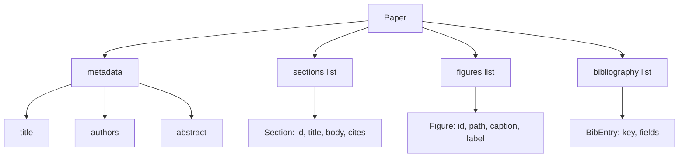
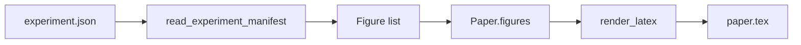
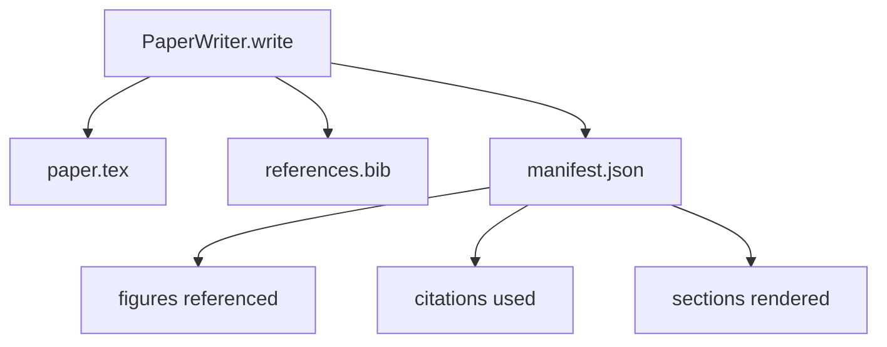

# نویسنده کاغذی

> اسکلت لاتکس یک قرارداد بین محقق و تایپتر است. اگر قرارداد شکسته شود، سند مرتب نمی شود و شکست بلند است. اسکلت را ابتدا بسازید، سپس آن را پر کنید.

**Type:** Build
**Languages:** Python
**Prerequisites:** Phase 19 lessons 50-53
**Time:** ~90 minutes

## اهداف یادگیری

- یک مقاله تحقیقاتی را به عنوان یک اثر ساختاری با یک نمودار بخش شناخته شده، نه یک سند آزاد، رفتار کنید.
- یک اسکلت لاتکس تولید کنید که قبل از نوشتن هر گونه پروز، خلاصه، بخش ها، قطعات شکل و کلید های کتابنامه را اعلام می کند.
- ارقام از خروجی آزمایش (راه ها و عنوانات) را از طریق مکانیسم حاشیه تعیین کننده به اسکلت تزریق کنید.
- یک ژنراتور پروزه مسخره ای را سیم کنید که هر بخش را از یک طرح ساختاری پر می کند تا هنیز بدون مدل قابل آزمایش باشد.
- يه تا پخش کن`paper.tex`+ یک`references.bib`و همچنین یک مانیست که هر ارقام مورد اشاره و هر نقل قول مورد استفاده را فهرست می کند.

```figure
ch-paper-skeleton
```

## چرا يه اسکلت اول

یک مسود که با نثر شروع می شود، بدهی ساختاری را جمع می کند. مقدمه سه پاراگراف را که باید در کار مرتبط باشد، افزایش می دهد. یک ارقام قبل از تعریف آن مرجع می شود. کتابنامه با سه کلید برای همان مقاله به پایان می رسد. تا زمانی که نویسنده متوجه می شود، هزینه نوشتن مجدد بالاتر از هزینه نوشتن است.

يه اسکلت اينو معکوس ميکنه ساختار به عنوان داده ها اعلام می شود. بخش ها سلايت هاي با نام و ترتيب هستند ارقام سلايت هاي با شناسه ها و عنوانات هستن کلید های کتاب شناسی در بالای صفحه با ورودی که به آن اشاره می کنند اعلام می شوند. پروز به این قسمت ها یک به یک تولید می شود. این آستین قبل از نوشتن هر مقاله ای می تواند تایید کند که هر شکل دارای یک نقطه است، هر نقل قول دارای یک ورودی است و هر بخش در جدول محتوا ظاهر می شود.

این همان رشته ای است که دروس قبلی برای برنامه ها، ابزارها و ردیاب ها اعمال می شد. ساختار قرارداد است.

## شکل کاغذ



هر فیلدی داده های ساده پایتون است. رندر یک تابع خالص از `Paper`به یک رشته LaTeX. هنیس می تواند قبل از ارائه کاغذ را در نظر بگیرد: بخش ها را بشمارید، فایل های ارقام گمشده را لیست کنید، هر`\cite{key}`همت داره`BibEntry`. .

## قرارداد بازپرداخت

رندر سه خصوصیت را تضمین می کند. اول، هر شکاف شکل در اسکلت یک`\begin{figure}`بلوک با برچسب ثابت فرم `fig:<id>`دوم، هر بخش يک`\section{}`با برچسب ثابت فرم `sec:<id>`بنابراین مرجع های متقابل کار می کنند. سوم، کتابنامه یک`\bibliography`بلوک کي`references.bib`دقیقاً نوشته هایی را که در کاغذ اعلام شده اند، شامل نمی شود، نه بیشتر و نه کمتر.

نقض هر یک از این موارد یک خطا نمایش است نه یک هشدار. اسکلت قرارداد است؛ یک نمایش که به طور ساکت یک شکل را کاهش می دهد، شکستن قرارداد است.

## تزریق صورت از آزمایشات

درسی های قبلی در این آهنگ نتایج آزمایش را به عنوان JSON نشان می دهد. هر نشاننامه دارای یک لیست از آثار با مسیرها و عنوانات کوتاه است. نویسنده کاغذ می خواند که نشان می دهد و تولید می کند `Figure`پرونده ها



تزریق تعیین کننده است. آدرس های شکل از نام آزمایش به علاوه یک شمارنده یکسردی گرفته شده است. عنوان ها از مانیست آمده است. مسیرها نسبت به دایرکتوری خروجی کاغذ عادی می شوند بنابراین LaTeX حتی زمانی که خروجی آزمایش در جای دیگری در دیسک قرار دارند، مرتب می کند.

## ژنراتور پروزه مسخره

درسي به مدل نياز نداره`MockProseGenerator`شکل خط را به صورت مشخصی می خواند و پروسه را منتشر می کند. شکل خط یک رشته کوتاه در هر بخش است. ژنراتور آن رشته را به دو پاراگراف کوتاه با عنوان بخش بافت شده گسترش می دهد. اعداد نام و نقل قول های تولید شده دقیقا زمانی که خط آنها را اعلام می کند.

این برای آزمایش هر رفتار نویسنده کافی است. یک پیاده سازی واقعی ژنراتور را با یک تماس مدل عوض می کند. آستین اطراف آن تغییر نمی کند. این ارزش اعلام ژنراتور پروزه به عنوان یک تماس است: آزمایش جایگزین یک تعیین کننده می شود، تولید جایگزین یک مدل می شود، بقیه خط لوله یکسان است.

## تولید آشکار

نویسنده سه فایل را به دایرکتوری خروجی ارسال می کند.



این مانیفست چیزی است که یک ارزیابی کننده یا حلقه نقدینگی به پایین می خواند. این لا تیکس را تجزیه و تحلیل نمی کند؛ آن را می خواند. درس بعدی، حلقه نقدینگی، این مانیفست را به عنوان ورودی می گیرد و یک لیست بازخورد تولید می کند. به همین دلیل مانیفست بخشی از قرارداد است و لا تیکس نیست.

## دروازه های اعتبار

نویسنده قبل از نوشتن هر پرونده چهار دروازه را اجرا می کند.

1. هر شماره ي شناسايي در داخل کاغذ منحصر به فرد است.
2. هر بخش از`cites`در این زمینه، یک کلید کتاب شناسی که در کاغذ اعلام شده است، اشاره می شود.
3. خلاصه اش خالی نیست.
4. عنوانش خالی نیست

دروازه ای شکست خورده بلند می شود`PaperValidationError`با یک دلیل دقیق. هنیز دلیل را به عنوان حالت شکست ظاهر می کند. هیچ نوشته ای جزئي وجود ندارد: یا هر سه فایل منتشر می شوند، یا هیچ یک از آنها.

## چطور کد رو بخونيم

`code/main.py`تعریف می کند`Paper`،`Section`،`Figure`،`BibEntry`،`PaperValidationError`،`MockProseGenerator`،`PaperWriter`، و یک`render_latex`عملکرد`write`روش یک دایرکتوری خروجی را می گیرد و ارسال می کند `paper.tex`،`references.bib`و`manifest.json`.`read_experiment_manifest`کمک کننده يه ليست از آزمايش هاي تجريبي را به`Figure`پرونده ها

`code/tests/test_paper_writer.py`پوشش: نمایش اسکلت بدون بخش ها، نمایش کامل با دو بخش و دو شکل، دروازه نقل قول گم شده، دروازه هویت دوگانه، محتوای آشکار و قرارداد رشته LaTeX (هر بخش یک `\section{}`، هر ارقامي يه`\begin{figure}`)

## . به جلوتر می رسیم

دو تمدید یک پیاده سازی واقعی نیاز دارد. اول، چند فرمت رندر: همان `Paper`شکل برای پست های وبلاگ و HTML برای پیش نمایش ها به Markdown مرتب می شود. رندر به یک استراتژی در `Paper`دوم، غنی سازی نقل قول: نویسنده ورودی های BibTeX را از یک کلید نقل قول می گیرد، با توجه به یک کش محلی از DOI ها. هر دو ارزش افزوده هستند، هر دو می توانند بدون لمس قرارداد اسکلت اضافه شوند.

اسکلت شرط است. بخش ها، اعداد و نقل قول ها به عنوان داده ها اعلام می شوند، نثر به صورت سلاوت تولید می شود، manifest همراه با LaTeX منتشر می شود. هر پیشرفت دیگری در بالای آن است.
