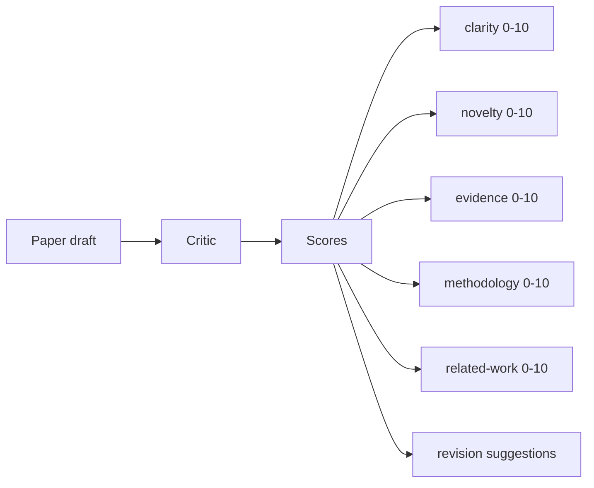
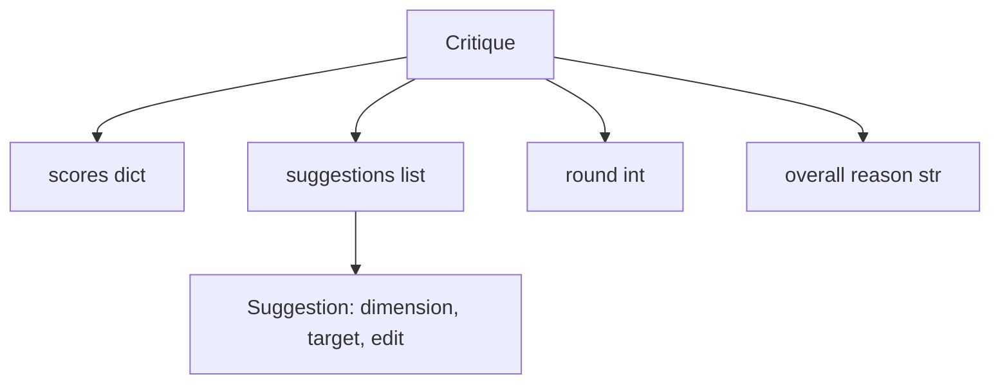
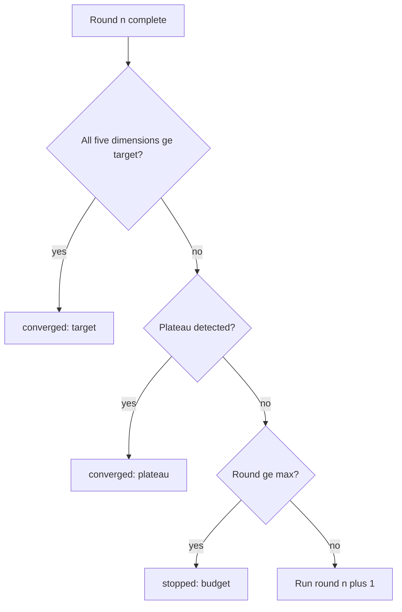
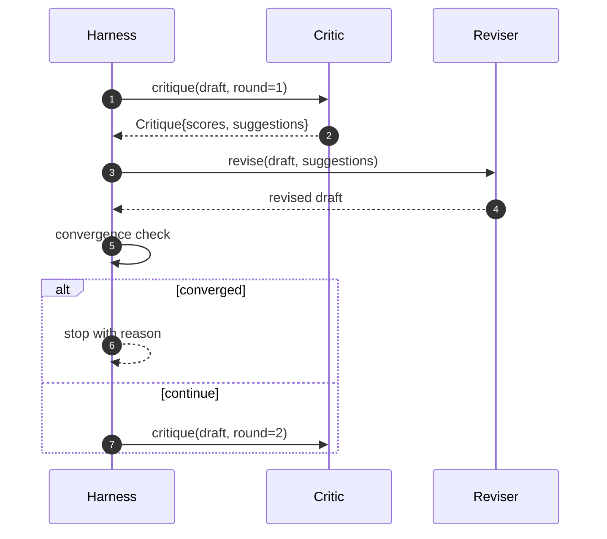

# حلقه انتقادی

> یک منتقد که اولین بار "به نظر خوب" می رسد شکست خورده است. منتقد که همیشه "به کار نیاز دارد" را می دهد شکست خورده است. منتقد جالب همان است که به هم می پیوندد، و شما باید به هم می پیوندید.

**Type:** Build
**Languages:** Python
**Prerequisites:** Phase 19 lessons 50-53
**Time:** ~90 minutes

## اهداف یادگیری

- یک طرح کاغذ را در پنج ابعاد ثابت: شفافیت، نوینیت، شواهد، روش، کار مرتبط، ارزیابی کنید.
- انتقاد هر دور را به عنوان یک تغییر ساختار یافته به جای یک تغییر شکل آزاد اعمال کنید.
- با مقایسه امتیاز در میان دور ها، تعادل را تشخیص دهید؛ توقف در سطح بالا، هدف برآورده شده یا بودجه تمام شده.
- با بودجه ی زیاد تکرار، یک منتقد غیر متناوب برای همیشه کار نمی کند.
- یک ردیابی در هر دور را منتشر کنید تا داشبورد یا مرحله بعدی بتواند مسیر امتیاز را نشان دهد.

```figure
ch-critic-converge
```

## چرا پنج ابعاد ثابت

یک منتقد آزاد یک مدل است که یک پاراگراف از پیشنهادات را باز می گرداند. بازبینی دور بعدی به پاراگراف به عنوان زمینه محیطی برخورد می کند. آیا بازنویسی به انتقاد خطاب می کند، قابل تأیید نیست زیرا انتقاد هرگز ساختار نداشته است.

پنج ابعاد به بنداز قرارداد میده



نمره یک متری است. هرنس هر ابعاد را در سراسر دورها مشاهده می کند. یک بازبینی که شفافیت را افزایش می دهد اما شواهد را ذخیره می کند بازپسین بر روی شواهد است، و بررسی تقارب آن را می بیند. یک منتقد فقط مدل نمی تواند این تضمین را ارائه دهد.

## شکل انتقاد



هر پیشنهاد دارای ابعاد بهبود یافته، بخش مورد هدف و یک`edit`دستورالعمل که بازرس می تواند اعمال کند. بازرس نیز قابل تماس است. درس یک بازرس تعیین کننده را ارسال می کند که دستورالعمل ویرایش را به عنوان یک عملیات ضمیمه به بخش تفسیر می کند. بازرس مبتنی بر مدل همان زمینه را به عنوان یک پرامپت تفسیر می کند. قرارداد تغییر نمی کند.

## قوانین تقارب، به ترتیب

حلقه انتقادی وقتی یکی از سه حالت آتش می زند، پایان می یابد.



هدف سخت ترین مورد است: هر یک از پنج ابعاد (وضوح، نوینیت، شواهد، روش، مرتبط_کار) باید به دست آید `>= target_score`(به طور پیش فرض)`8.0`) قبل از اینکه حلقه موفقیت را برگرداند. یک متوسط بالا با یک ابعاد ضعیف کافی نیست. تشخیص سطح بالا متوسط دور فعلی را با متوسط دور قبلی مقایسه می کند. اگر بهبود کمتر باشد `plateau_epsilon`(به طور پیش فرض)`0.1`) برای دو دور متوالی، حلقه با `plateau`بودجه یک حد سخت برای دورها است (به طور پیش فرض)`5`) و با `budget`. .

ترتیب مهم است. هدف بر سطح بالا برنده می شود. اگر دور سوم به هدف در همان تکرار که همچنین یک سطح بالا را تحریک می کند، نتیجه است`target`نه`plateau`. .

## چرا تشخیص سطح بالا به دو دور طول می کشد

یک سطح بلند یک دور شور است. یک منتقد واقعی هر تکرار را حتی در یک طرح ثابت نیز با یک امتیاز کمی متفاوت باز می گرداند، زیرا امتیاز تعیین کننده هنوز هم بستگی به آن دارد که کدام پیشنهادات و در چه ترتیب اعمال شده است. نیاز به دو دور بالا به ترتیب به فیلترهای این صدا است. اگر هرنس گزارش یک سطح بلند، طرح واقعاً بهبود را متوقف کرده است.

## منتقد تعیین کننده در این درس

درسی به یک مدل نمی خواند. منتقد ارسال شده یک کالبل است که بر اساس سه سیگنال یک مسودۀ را نمره می دهد: طول بدن متوسط بخش (وضوح) ، تعداد ارقام و تعداد نقل قول (دليل) و یک`originality_tag`در مورد این موضوع، در مورد این موضوع به نظر می رسد که در مورد این موضوع چه چیزی در مورد این موضوع می گوید.

```text
clarity      grows when the average section body length increases
novelty      grows when originality_tag is set to "high"
evidence     grows when a section's figure_refs is non-empty
methodology  grows when a section titled "Method" exists with body
related-work grows when a section titled "Related Work" exists with body
```

بازبینی کننده هر پیشنهاد را به عنوان یک ضمیمه هدفمند تفسیر می کند. پس از دور اول، هنیس می تواند نمره را مشاهده کند که بالا می رود. آزمایش ها از این ویژگی برای تأیید حلقه کاهش شکاف استفاده می کنند.

## قرارداد کامل حلقه



هرنس مالک کنتر گرد، ردیابی و چک کنورژانس است. منتقد مالک سکتور است. اصلاح کننده مالک تفاوت است. هیچ یک از سه لمس حالت دیگران است.

## تولید ردیابی

هر دور یک رویداد ردیابی را با شماره دایره، ویکتور نمره، شمارش پیشنهاد و حکم کنورژن منتشر می کند. ردیابی کامل در کنار مسودۀ نهایی بازگردانده می شود. یک داشبورد پایین جریان می تواند نمودار نمره را در هر دور ارائه دهد. درس بعدی، برنامه نویس تکرار، ردیابی را برای تصمیم گیری در مورد اینکه آیا شاخه ارزش نگهداری دارد، می خواند.

## بودجه هایی که از منتقدان بد محافظت می کنند

یک منتقد که پیشنهاداتی را ارائه می دهد که هرگز نمره را بهبود نمی بخشد، حلقه را در سقف حداکثر تکرار بسته می کند.`budget`. کاربر میخواد که به عنوان یک نقاد خطا، نه یک مسودات خطا. جایگزین، که فقط مسودات نهایی ظاهر می شود، تشخیص را پنهان می کند. طراحی ردیابی اول آن را ظاهر می کند.

## چطور کد رو بخونيم

`code/main.py`تعریف می کند`Critique`،`Suggestion`،`Critic`پروتکل`Reviser`پروتکل`CriticLoop`، و یک`make_deterministic_critic_pair`کارخانه ای که منتقد تعیین کننده و یک اصلاح کننده مطابقت پذیر را به دست می آورد.`Paper`شکل هم در این جا قرار گرفته تا درس به تنهایی باقی بماند.

`code/tests/test_critic_loop.py`پوشش: بهبود یکم بعد از دور اول، نزدیک شدن هدف در یک طرح تنظیم شده، تشخیص سطح بالا پس از دو دور مسطح، کاهش بودجه در صورت عدم بهبود پیشنهاد، درخواست پیشنهاد توسط بازتویزی کننده و شکل ردیابی.

## . به جلوتر می رسیم

دو تمدید یک اجرای واقعی نیاز دارد. اول، وزن ابعاد: یک مقاله برای یک کارگاه وزن نوینتی بالاتر از روش است؛ یک مجله وزن برعکس است. بررسی تقارب به یک متوسط وزن شده تبدیل می شود. دوم، منتقدان جفت: یک منتقد امتیاز می دهد، منتقد دوم پیشنهادات را قبل از اینکه نظرسنجی آنها را ببیند قضاوت می کند. هر دو ارزش اضافه می کنند، هر دو بر اساس همان ترکیب می شوند.`Critique`شکل

شرط این است که ویکتور نمره است. هنگامی که انتقاد ساختار یافته است، هر پیشرفت دیگری، قانون تقارب، داشبورد، منتقد جفت، بدون تغییر حلقه وارد می شود.
