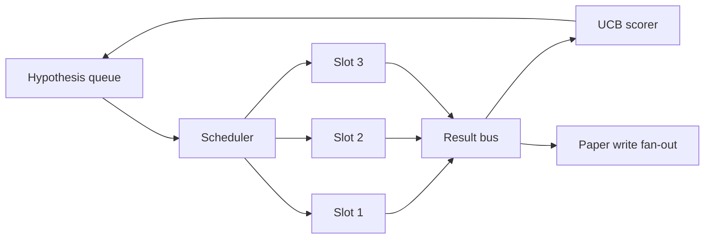
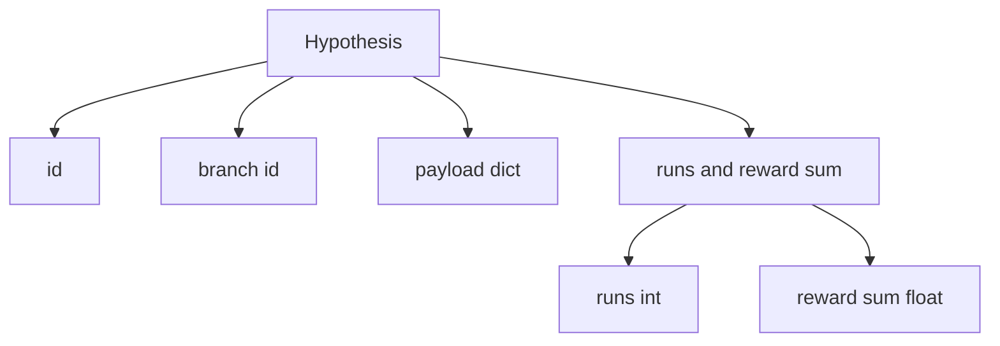
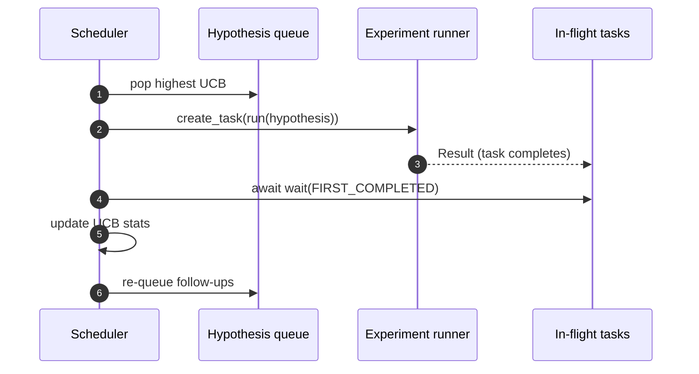

# برنامه ریزی تکرار

> یک حلقه تحقیقاتی بدون برنامه نویس یک صف با توهم است. برنامه نویس جایی است که حلقه تصمیم می گیرد چه چیزی را که باید کشف کند را متوقف کند، و این تصمیم کل بازی است.

**Type:** Build
**Languages:** Python
**Prerequisites:** Phase 19 lessons 50-53
**Time:** ~90 minutes

## اهداف یادگیری

- یک جریان کار تحقیقاتی را به عنوان یک فرضیه به عنوان یک قطار فرعی که به سمت نقاط آزمایش موازی تغذیه می کند که نتایج آن به عقب می آید.
- چند تا آزمایش همزمان با asyncio اجرا کنید تا برنامه نویس بتواند تمام اسلات ها را مشغول نگه دارد.
- هر شاخه فرضیه را با UCB نمره دهید تا برنامه نویس بتواند بدون ترک اکتشاف شاخه های کم بهره را برش دهد.
- نتایج نهایی را به مرحله ی کاغذی و مرحله ی قطار مجدد پخش کنید تا شاخه ای با بهره وری بالا فرضیه های پیگیری را تولید کند.
- یک ردیابی تکرار با امتیاز شاخه ها، شغل حاشیه ها و تصمیمات برش را روی زمین قرار دهید.

```figure
ch-ucb-scheduler
```

## چرا یک برنامه نویس، نه یک لیست کار

یک لیست کار مسطح، وظایف را به ترتیب ارسال انجام می دهد. این خوب است اگر هر شغل مستقل باشد. تحقیقات مستقل نیستند: یافته از آزمایش سه اولویت آزمایش های چهار و پنج را تغییر می دهد. یک برنامه نویس که نتیجه را می خواند و صف را تنظیم می کند، کار مفید تری را در هر واحد محاسبات انجام می دهد.

یک امتیازگر طمع آمیز همیشه رهبر فعلی را انتخاب می کند و هرگز جستجو نمی کند. یک امتیازگر یکسره هرگز بهره برداری نمی کند. UCB (تعهد بالا) راه میانگین است: بهره برداری از رهبر در حالی که ظرفیت را برای شاخه هایی که کمتر آزمایش شده اند ذخیره می کند.

## شکل سیستم



قطار فرضیه ها را نگه می دارد. برنامه نویس فرضیه بالاترین UCB را هنگام آزاد شدن یک اسلات انتخاب می کند. هر اسلات یک آزمایش را به صورت غیرمسلح انجام می دهد. آزمایش های نهایی نتیجه خود را بر روی اتوبوس پخش می کنند. اتوبوس آمار UCB را در مورد شاخه اصلی به روز می کند و در مرحله نوشتن کاغذی را به صورت فانت می رساند.

## شکل فرضیه



`branch`این موضوع در مورد آمار UCB مهم است. فرضیه های متعدد ممکن است یک شاخه را به اشتراک بگذارند (شروع جهت تحقیق است؛ فرضیه یک آزمایش در آن است). `runs`تعداد آزمایش های انجام شده برای این شاخه است.`reward_sum`اين پاداش تجميعي است.

## امتیازات UCB

فرمول UCB که در این درس استفاده می شود، UCB1 کلاسیک است.

```text
ucb(branch) = mean_reward(branch) + c * sqrt( ln(total_runs) / runs(branch) )
```

`total_runs`شمارش تمام آزمایش های انجام شده در تمام شاخه ها است.`c`وزن اکتشاف است؛ درس به طور غیر قابل توجهی به `sqrt(2)`. شاخه اي که صفر رين داره مياد`+inf`بنابراین شاخه های آزمایشی نشده همیشه اول برنامه ریزی می شوند. شاخه ای که پاداش متوسط بالایی دارد نمره بالایی را تا زمانی که شاخه های دیگر به آن ها برسند نگه می دارد؛ شاخه ای که بارها بدون پاداش زیادی اجرا می شود، توسط گزینه های کمتر اجرا شده پوشانده می شود.

دروازه برش از گیرنده جدا است. برش شاخه را از برنامه ریزی آینده حذف می کند وقتی پاداش متوسط آن کمتر از یک طبقه مطلق (به طور پیش فرض) می افتد.`0.2`) حداقل پس از`prune_after_runs`آزمایشات (به طور پیش فرض)`3`این باعث می شه صف محدود باشه

## سلاٹس موازی با asyncio

برنامه نویس آزمایشات را با `asyncio.create_task`هر کار رو اجرا ميکنه`async def`که به ارجاع می دهد`Result`. حلقه اصلي منتظر مجموعه ي وظایف در پرواز است`asyncio.wait(..., return_when=asyncio.FIRST_COMPLETED)`و به روز رسانی امتیاز را در هر تکمیل پخش می کند.



سه سلاوت همزمان اجرا می شود. حلقه اصلی هرگز در یک آزمایش واحد مسدود نمی شود. برنامه نویس به محض اینکه یک سلاوت آزاد شود، کارهای جدیدی را شروع می کند، تا هر دو صف خالی باشد و هیچ کاری در پرواز نباشد.

## پخش: پرتاب کننده های کاغذی

وقتي که پاداش متوسط شاخه اي عبور ميکنه`paper_threshold`(به طور پیش فرض)`0.7`) و این شاخه هنوز یک مقاله را تولید نکرده است، برنامه نویس طرفدار یک `paper.trigger`در این درس، تگگگرا به عنوان یک لیست ضبط می شود تا آزمایشات بتواند آن را تأیید کند.

## گسترش: فرضیه های پیگیری

وقتی یک نتیجه با بهره وری بالا فرود می آید، برنامه نویس می تواند به کاربر ارائه شده تماس بگیرد `expander`برای تولید یک یا چند فرضیه پیگیری در همان شاخه.`Result`به`list[Hypothesis]`درس یک وسعت دهنده تعیین کننده را ارسال می کند که دو پیگیری برای هر نتیجه ای که پاداش آن بالاتر از حد کاغذی باشد، تولید می کند.

## بودجه

دو بودجه از برنامه نویس از حلقه های فرار محافظت می کند.

```text
max_experiments    : total count of experiments run across all branches
max_seconds        : wall-clock cap (asyncio time)
```

وقتی هر یک از این آتش ها می سوزند، برنامه نویس برنامه ریزی وظایف جدید را متوقف می کند، منتظر آن ها در پرواز است و ردیابی نهایی را باز می گرداند.`stop_reason`. .

## گزارش نهایی و ردیابی

هر تصمیم برنامه ریزی (انتخاب، ارسال، نتیجه، برش، فان-آو) یک رویداد را منتشر می کند. گزارش نهایی آمار هر شاخه، کل اجرا، کل ساعت دیوار و محرک های کاغذ را خلاصه می کند. درس بعدی، نمایش پایان به پایان، این گزارش را برای رانندگی نویسنده کاغذ می خواند.

## چطور کد رو بخونيم

`code/main.py`تعریف می کند`Hypothesis`،`Result`،`BranchStats`،`IterationScheduler`، و یک`make_deterministic_runner`کارخانه ای که یک دوچرخه آزمایشی غیر متناظر را با پاداش قابل پیش بینی باز می گرداند. دوچرخه برای یک ساعت ثابت می خوابد`delay_ms`(به طور پیش فرض)`5ms`) بنابراین هم زمان قابل مشاهده است.

`code/tests/test_scheduler.py`پوشش: UCB ابتدا شاخه های آزمایش نشده را انتخاب می کند، محل سکونت موازی، زمانی که حد عبور می شود، کاغذ را تحریک می کند، بعد از آزمایش های کم بهره، فرضیه های پیگیری و خروج بودجه (هم تعداد آزمایش و هم ساعت دیوار) را انتخاب می کند.

## . به جلوتر می رسیم

سه تمدید به یک اجرای واقعی نیاز خواهد داشت. اول، آمار UCB مداوم در طول جلسات: آمار فعلی در حافظه زنده است؛ یک برنامه نویس واقعی آنها را کنترل می کند تا یک بازخورد بودجه اکتشافاتی را که قبلا مصرف شده است حفظ کند. دوم، امتیاز چند هدف: به جای پاداش اسکالر، هر نتیجه یک ویکتور را منتشر می کند و UCB به یک انتخاب کننده سبک پارتو تبدیل می شود. سوم، دزدان زمینه ای: شرایط انتخاب کننده بر روی ویژگی های فرضیه (مدد، پیچیدگی) بنابراین فرضیه های مشابهی اکتشاف را به اشتراک می گذارند.

برنامه ریزی کننده جایی است که تحقیقات بیش از یک لیست کار می شود. هنگامی که UCB به طور متوازی و سلائت ها در موازی اجرا می شوند، هر پیشرفت دیگری در بالای آن ترکیب می شود.
