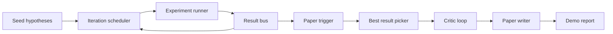
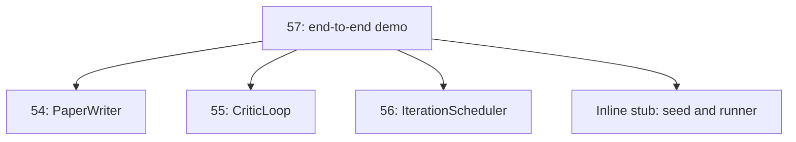
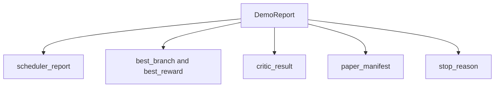

# دمو تحقیق آخر تا آخر

> یک دمو جایی است که هر قراردادی که قبلاً نوشته اید باید نوشته شود. اگر یکی از آنها به طور پراکنده منتشر شود، دمو درس است که آن را می گیرد.

**Type:** Build
**Languages:** Python
**Prerequisites:** Phase 19 lessons 50-53
**Time:** ~90 minutes

## اهداف یادگیری

- حلقۀ تحقیق خودکار را از پایان به آخر متصل کنید: تخم فرضیه، دوچرخه آزمایش، برنامه نویس، حلقۀ منتقد، نویسنده کاغذ.
- ابتدایی ها را از چهار درس قبلی Track D از طریق واردات ساده پایتون ترکیب کنید، نه یک چارچوب.
- این حلقه را به یک پایان خود پایان دهید و یک گزارش دمو را منتشر کنید که فهرست تولید هر مرحله را نشان می دهد.
- نماد دمو را تعیین کننده نگه دارید تا مجموعه آزمایش بتواند شکل نهایی را تأیید کند.
- حالت شکست واضح را در هنگام شکستن قرارداد هر مرحله ای ایجاد کنید، بنابراین مرحله بعدی با ورودی شکسته اجرا نمی شود.

```figure
ch-research-pipeline
```

## چه چیزی در اینجا ترکیب می شود



پنج مرحله. بیج یک لیست از سه فرضیه است. برنامه نویس شش آزمایش را با سه نقطه موازی انجام می دهد. اتوبوس یک یا چند محرک کاغذ را گزارش می دهد. انتخاب کننده بهترین نتیجه را انتخاب می کند. حلقه انتقادی بر روی یک مسود ساخته شده از آن نتیجه تکرار می کند. نویسنده کاغذ آخرین LaTeX ، BibTeX و مانیف را منتشر می کند.

## چرا واردش ميکني نه کپي

هر درس اولي يه خطري ميده`main.py`با کلاس ها و عملکردهای عمومی داده ها.`sys.path`این یک برنامه ی چارچوبی نیست، این همان وارد کردن فایل های تست در درس های قبلی است که قبلاً استفاده می شود.



این استوب برای درس پنجاه تا پنجاه و سه است: یک ژنراتور کوچک فرضیه های تخم و یک عملکرد پاداش همغږي. کاربر می تواند با تنظیم دو واردات استوب را با primitives واقعی از آن درس ها عوض کند.

## تضمین های تعیین کننده

در این مرحله، یک برنامه نویس به عنوان یک مدیر در حال انجام آزمایش است. در این مرحله، یک مدیر در حال انجام آزمایش است. در این مرحله، یک مدیر در حال انجام آزمایش است. در این مرحله، یک مدیر در حال انجام آزمایش است. در این مرحله، یک مدیر در حال انجام آزمایش است. در این مرحله، یک مدیر در حال انجام آزمایش است. در این مرحله، یک مدیر در یک مرحله ای در مرحله ای در مرحله ای در مرحله ای در مرحله ای در مرحله ای در مرحله ای در مرحله ای در مرحله ای در مرحله ای در مرحله ای در مرحله ای در مرحله ای در مرحله ای در مرحله ای در مرحله ای در مرحله ای در مرحله ای در مرحله ای در مرحله ای در مرحله ای در مرحله ای در مرحله ای در مرحله ای در مرحله ای در مرحله ای در مرحله ای در مرحله ای در مرحله ای در مرحله ای در مرحله ای در مرحله ای در مرحله ای در مرحله ای در مرحله ای در مرحله ای در مرحله ای در مرحله ای در مرحله ای در مرحله ای در مرحله ای در مرحله ای در مرحله ای در مرحله ای در مرحله ای در مرحله ای در مرحله ای در مرحله ای در مرحله ای در مرحله ای در مرحله ای در مرحله ای در مرحله ای در مرحله ای در مرحله ای در مرحله ای در مرحله ای در مرحله ای در مرحله ای در مرحله ای در مرحله ای در مرحله ای در مرحله ای در مرحله ای در مرحله ای در مرحله ای در مرحله ای در مرحله ای در مرحله ای در مرحله ای در مرحله ای در مرحله ای در مرحله ای در مرحله ای در مرحله ای در مرحله ای در مرحله ای در مرحله ای در مرحله ای در مرحله ای در مرحله ای در مرحله ای در مرحله ای در مرحله قرار می گیرد.

با داده کردن همان دانه، دیمو گزارش مشابهی را منتشر می کند. تست این ویژگی را با اجرا کردن دیمو دو بار و مقایسه مانیست تأیید می کند.

## شکل گزارش دمو



هر میدان به معنای واقعی کلمه از مرحله بالا می آید. دمو هیچ محصول را تغییر نمی دهد؛ آن را ترکیب می کند. این آزمون دیمو است.

## کنترل حالت شکست

هر مرحله یا موفق می شود یا یک خطای تایپ شده را ایجاد می کند.

```text
Scheduler ........ returns SchedulerReport with stop_reason
                   in {queue_empty, max_experiments, deadline}
Best-result pick . raises NoTriggerError if no paper trigger fired
Critic loop ...... returns LoopResult with status converged or stopped
Paper writer ..... raises PaperValidationError on contract break
```

شکست در هر مرحله ای، نمایش را با یک استثنا تایپ می کند. آزمایش ها این قرارداد را مشخص می کنند:`test_no_triggers_raises_typed_error`و`test_best_picker_raises_when_no_triggers`ادعا کن که جمع کننده بالا میره`NoTriggerError`-`BestResultError`و هیچ شاخه ای از آن ها به آن ها نیفتاد و نویسنده ای به آن ها دعوت نمی شود.

## بهترین انتخاب کننده

برنامه نویس در هر شاخه تگ ها را منتشر می کند. انتخاب کننده شاخه را با بالاترین پاداش متوسط در تمام تگ ها انتخاب می کند. ربط ها به صورت الفبایی با عنوان شاخه شکسته می شوند بنابراین دمو تعیین کننده است. انتخاب کننده یک تابع کوچک خالص است؛ آزمایش آن را بر روی یک گزارش برنامه نویس ثابت می کند.

## سیم کشی حلقه انتقادی

حلقه انتقادي در درس پنجاه و پنجم بر روي يك`MiniPaper`. نمایشگاه ساخت یک`MiniPaper`از شاخه انتخاب شده با پر کردن انتزاع با ID شاخه، تخم دو بخش (تاریخ و نتایج) و تنظیم `originality_tag`از متوسط پاداش شاخه (و بالا اگر `>= 0.8`، متوسط اگر`>= 0.6`، در غیر این صورت کم)

سپس بازبینی کننده طرح را به تقارب تکرار می کند. محصول به نویسنده کاغذ می رود.

## کابل نوشتن روزنامه

نویسنده مقاله در درس 54 کار می کنه`Paper`شکل با اعداد و کتابنامه.`MiniPaper`از طریق`mini_to_full_paper`، که یک ارقام برای شاخه انتخاب شده و یک کتابچه مصنوعی کوچک ساخته شده از اتحاد کلید های نقل قول که منتقد پیشنهاد کرد، را متصل می کند. هر نقل قول که در نمایش اضافه می شود به لیست کتابچه اضافه می شود، بنابراین اعتبار عبور می کند.

## چطور کد رو بخونيم

`code/main.py`تعریف می کند`BestResultError`،`NoTriggerError`،`DemoReport`،`pick_best_branch`،`build_mini_paper`،`mini_to_full_paper`و`run_demo`واردات در بالا تنظیم شده است`sys.path`یک بار و بکش`PaperWriter`،`CriticLoop`و`IterationScheduler`از درس هايشان

`code/tests/test_e2e.py`پوشش: نمایش از پایان به پایان اجرا می شود و گزارش را با تمام پنج زمینه پر شده، تعیین گرایی در دو اجرا، NoTriggerError هنگامی که هیچ شاخه از حد عبور نمی کند، PaperValidationError هنگامی که قرارداد نویسنده شکسته می شود، کاغذی شامل اعداد شاخه انتخاب شده است و دلیل توقف برنامه نویس یکی از ارزش های انتظار می رود.

## . به جلوتر می رسیم

سه تا افزونه که ارزش داره بعد از اينکه ديمو سبز بشه اول، حالت مداوم: نتیجه هر مرحله به یک ذخیره JSON کوچک می نویسد تا یک بار دیگر بدون اجرای مجدد مراحل ارزان، شروع مجدد شود. دوم، یک داشبورد: رویدادهای ردیابی از برنامه نویس و حلقه انتقادی به عنوان یک خط زمانی واحد ارائه می شود. سوم، تماس های واقعی مدل: ژنراتور پروزه مورد تمسخر و منتقد تعیین کننده را با مدل های هدایت شده عوض کنید؛ سیم کشی تغییر نمی کند.

کار نمایش ثابت کردن این است که ترکیب معماری است پنج درس، چهار واردات، یک گزارش دفعه بعد که مرحله ای اضافه می کنید، سیم کشی دقیقاً یک خط رشد می کند.
