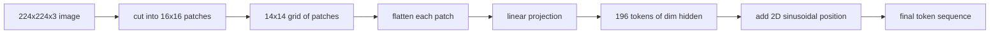

# پیچ های کدرسانی بینایی

> یک مدل دید که پیکسل ها را می خواند به یک توکنایزر برای پیکسل ها نیاز دارد. پیوند پیوند این توکنایزر است. تصویر را به یک شبکه از مربع ها برش دهید، هر مربع را صاف کنید، آن را از طریق یک لایه خطی پیش بینی کنید، سپس یک سیگنال موقعیت 2D اضافه کنید تا ترانسفورماتور بداند هر مربع در تصویر اصلی کجا قرار دارد.

**Type:** Build
**Languages:** Python
**Prerequisites:** Phase 19 lessons 30-37 (Track B foundations)
**Time:** ~90 minutes

## اهداف یادگیری

- یک تصویر را به یک سلسله ی طولانی با پیوند های پیچ تبدیل کنید.
- اجرای یک`Conv2d`-بنياد بر تيراندازي تيراندازي که با رياضي "پيشر" خطي مطابقت داره
- یک موقعیت دو بعدی تعیین کننده را بسازید که به ترتیب رمزنگاری موقعیت فضایی را شامل کند.
- تعداد پشه ها رو چک کن، شکل داخلش رو چک کن و`Conv2d`/در یک دستگاه مصنوعی تعادل را فاش کنید.

## مشکل

یک ترانسفورماتور یک سری از متری ها را می خورد. یک تصویر یک شبکه سه کانال است. خواندن هر پیکسل به عنوان یک توکن طول ردیف را منفجر می کند: یک تصویر RGB 224x224 150,528 توکن است که یک ترانسفورماتور 12 لایه نمی تواند توجه را تحمل کند. خواندن تصویر به عنوان یک ویکتور بزرگ صاف محل را از بین می برد که لایه توجه نمی تواند از آن بهبود یابد. کار این کدگر این است که شبکه پیکسل را به چند صد توکن که هر کدام یک منطقه مربع را خلاصه می کنند، فشرده کند.

پیوند پیوند با یک پروژکتور خطی این مسئله را حل می کند. یک تصویر 224x224 که به پیچ های 16x16 برش داده شده است یک شبکه 14x14 از 196 پیچ تولید می کند. هر پیچ از `(3, 16, 16) = 768`پیکسل ها به یک ویکتور تبدیل می شوند، سپس یک لایه خطی آن را به ابعاد پنهان مدل نقشه می زند. ترانسفورماتور 196 توکن ابعاد را می بیند`hidden`(معمولا 768) + یک توکن CLS. این یک دنباله است که بقیه شبکه می توانند آن را چک کنند.

## مفهوم



### چرا پکسل ها و نه پیچ ها

توجه در طول دنباله مربع است. یک دنباله 196 توکن هزینه دارد `196 * 196 = 38,416`توجه در هر صفحه در هر لایه، هزینه های 150,528 توکن`150,528 * 150,528 = 22.6 billion`. پیچ ها کاهش 590,000x در محاسبه توجه را خریداری می کنند و یک منطقه 16x16 واحد سیگنال کافی برای وظایف بینایی سطح بالا را حمل می کند. هزینه از دست دادن جزئیات فضایی نازک در داخل یک پیچ است، به همین دلیل است که استیک های چندرنگه پایین اغلب شاخه دوم با وضوح بالا را در هنگام موقعیت دقیق اجرا می کنند.

### چرا یک پروژکتور خطی کافی است

هر پیچ به عنوان یک ویکتور مستقل مورد استفاده قرار می گیرد. پروژکتور پایه ای را یاد می گیرد: آشکارگر لبه، فیلترهای رنگ، بافت های ساده. یک لایه خطی کوچک است (`768 * 768 = 589,824`پارامترهای ViT-Base) و قطار های سریع وجود دارد. ساقه های پیچیدگی عمیق تر وجود دارد (ViT "هائبرید"), اما یک طرح خطی صاف استاندارد است و اکثر کدرهای مدرن با وزن باز با این شکل دقیق می آیند.

### .`Conv2d`ترفند

A`Conv2d(in_channels=3, out_channels=hidden, kernel_size=patch_size, stride=patch_size)`بدون پوشاندن، نتیجه عددی مشابهی را با فولډ آن لاینر به دست می آورد، زیرا هر موقعیت خروجی نقطه پیکسل های پیچ را در برابر یک فیلتر تولید می کند. پیچ پروژکتور پیچ است و اکثر پایگاه های کد تولید آن را به این طریق ارسال می کنند زیرا در GPU سریع تر است و از یک تغییر شکل کمتری استفاده می کند.

### ورق های موقعیت

توکن ها هیچ نظم را از پروژکتور خارج نمی کنند. 2D sinusoidal embedding به هر توکن یک سیگنال ثابت می دهد که رمزگذاری آن را`(row, col)`موقعیت. نیمی از ابعاد گنجانده شدن موقعیت صف را با syn / cos در فرکانس های متعدد رمزگذاری می کند؛ نیمی دیگر موقعیت ستون را رمزگذاری می کند. رمزگذاری تعیین کننده است بنابراین شما می توانید قطعنامه ها را بدون آموزش مجدد تغییر دهید و به طور تمیز به شبکه هایی که مدل هرگز در زمان آموزش ندیده است، مداخله می کند.

| Component | Shape | Parameters |
|-----------|-------|------------|
| Patch projection (`Conv2d`) | `(hidden, 3, patch, patch)` | `3 * P * P * hidden + hidden` |
| Position embedding (fixed) | `(num_patches, hidden)` | 0 (computed, not learned) |
| CLS token (learned) | `(1, hidden)` | `hidden` |

برای ViT-Base/16 با وضوح 224: 590,592 پارامتر در پروژکتور، 768 در توکن CLS، و صفر برای موقعیت سینوساید. درس بعدی (59) یک ترانسفورماتور 12 لایه را روی بالای این انتهای جلو جمع می کند.

### معادلیت به عنوان یک بررسی عقل

مرحله ی پیچ دو جور املاست دارد: a `Conv2d`در این درس تست ها این معادلات را اعمال می کنند. در این درس، تست های موجود در این درس، معادلات را نشان می دهند.

```figure
ch-patch-tokenizer
```

## آن را بسازید

`code/main.py`ابزار:

- `PatchEmbed`، یک`nn.Module`بسته بندی`Conv2d`برای پروژکتور پیچ
- `sinusoidal_2d(grid_h, grid_w, dim)`، یک تابع بی دولتی که جدول موقعیت 2D را ایجاد می کند.
- `VisionFrontEnd`, که شامل پیوند پیچ، CLS prepend و اضافه کردن موقعیت در یک گذرگاه جلو است.
- A`synthesize_image(seed)`کمک کننده ای که یک فکسچر تعیین کننده 224x224x3 را از `numpy.random`. .
- یک نمایشگاه که یک تصویر ثابت را از طریق انتهای جلو اجرا می کند و شکل خروجی، استاندارد رمز CLS و یک ردیف قرار دادن موقعیت را چاپ می کند.

اجرا کن

```bash
python3 code/main.py
```

خروجی: دستگاه 224x224 به یک ترتیب شکل نشان داده می شود `(1, 197, 768)`. اولین توکن CLS است؛ 196 بعدی توکن های پیچ هستند. قوانین گنجانده شدن موقعیت در یک ردیف یکسان است که امضای سینوساید است.

## ازش استفاده کن

همان پیچ در هر مدل مدرن زبان دید ظاهر می شود: CLIP ViT-L/14, SigLIP, DINOv2, خانواده Qwen-VL, و InternVL همه از یک `Conv2d`پروژکتور پیچ به علاوه یک سیگنال موقعیت. تفاوت بین خانواده ها در جریان پایین زندگی می کند (CLS در مقابل جمع بندی بدون CLS، توکن های ثبت، اندازه پیچ های مختلف 14 در مقابل 16 ، رزولوشن پویا از طریق موقعیت های متمایز). فرونتند در این درس زیربنایی است که هر یک از این مدل ها بر روی آن ایستاده اند.

## آزمایشات

`code/test_main.py`پوشش:

- تعداد پچ ها هم می شه`(image_size / patch_size) ** 2`
- شکل تولید مطابقت دارد`(batch, num_patches + 1, hidden)`
- .`Conv2d`پروژکتور برابر با دستی فولډ-then-linear روی یک فکسچر کوچک است
- جدول موقعیت سینوسوائید در تمام تماس ها تعیین کننده است
- پخش توکن CLS در دسته های کم بدون لیک

ازشون استفاده کن

```bash
python3 -m unittest code/test_main.py
```

## تمرینات

1. موقعیت سینوسوائدی را با یک دانشمند جایگزین کنید`nn.Parameter`و از دست دادن دوران اول در یک کار طبقه بندی مصنوعی کوچک مقایسه کنید. موقعیت های آموخته در رزولوشن ثابت برنده می شوند؛ سینوسوائید برنده می شود وقتی شما رزولوشن را پس از تمرین تغییر دهید.

2. . عوضش کن`Conv2d`برای یک توضیح واضح`nn.Unfold`و اضافه`nn.Linear`و ثابت کنیم که خروجی ها با تحمل شناور مطابقت دارند.

3. اضافه کردن پشتیبانی برای اندازه های پچ غیر مربع (به عنوان مثال 32x16 برای ورودی های گسترده) و تأیید کنید که جدول موقعیت شبکه های غیر مربع را اداره می کند.

4. مرحله پیچ را در اندازه های دسته 1, 8, 64 نمایش دهید.

5. پیش پای را به عنوان یک استخراج کننده ویژگی های منجمد در یک مجموعه داده های شکل مصنوعی 4 کلاس ( دایره ها، مربع ها، مثلث ها، ستاره ها) آموزش دهید. تولید توکن CLS باید خطی جدا شود.

## اصطلاحات کلیدی

| Term | What it means |
|------|---------------|
| Patch | A square sub-region of the image, typically 14x14 or 16x16 |
| Patch embedding | Linear projection of one flattened patch to the hidden dim |
| Sequence length | Number of tokens after patch tokenization, usually plus CLS |
| Sinusoidal position | Fixed sin/cos signal that encodes 2D grid coordinates |
| CLS token | Learned vector prepended to the sequence as the pooling head |

## خواندن بیشتر

- یک تصویر ارزش 16 × 16 کلمه (ViT، 2021) برای چارچوب اصلی پیچ های داخلی است.
- توجه تنها چیزی است که شما نیاز دارید (2017) برای فرمول موقعیت سینوسایدی که در اینجا به 2D سازگار شده است.
- کاغذ DINOv2 برای توکن های ثبت، یک تمدید که می توانید به عنوان تمرین 6 اضافه کنید.
