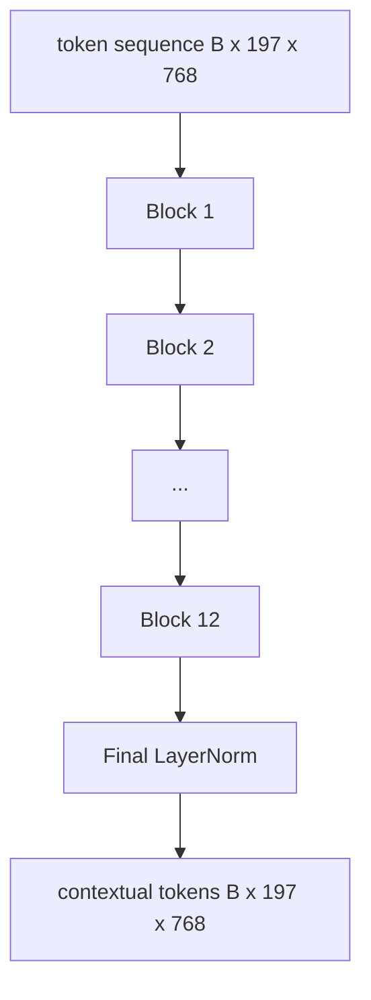
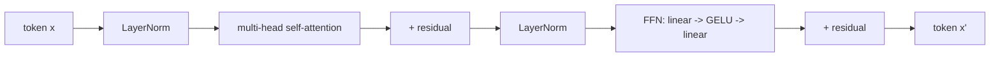

# کدگر ترانسفورمتر بینایی

> یک ترانسفارمر 12 لایه ای پیش از LN با 12 سر توجه، ردیف توکن های تکه را به یک ردیف توکن های زمینه ای تبدیل می کند، با توکن CLS که ویژگی های کل تصویر را در حالت پنهان نهایی خود جمع می کند. این درس اتاق موتور هر مدل مدرن زبان دید است.

**Type:** Build
**Languages:** Python
**Prerequisites:** Phase 19 lessons 30-37 (Track B foundations)
**Time:** ~90 minutes

## اهداف یادگیری

- یک بلوک ترانسفارمر پیش از LN با توجه به خود چند سر و یک فرعی فرعی برای ارسال ارسال را پیاده سازی کنید.
- 12 بلوک با 12 سر را جمع کنید تا یک کدرس ViT-Base بسازید.
- پشت قسمت جلو پیچ از درس 58 رو به کدر ببند و یک پاس جلو رو اجرا کن
- بررسی کنید که سی ایل اس توکن اطلاعات را از هر پیچ جمع آوری می کند.

## مشکل

پیوند پیوند یک سری از 197 توکن تولید می کند، هر کدام یک بردار بدون آگاهی از هیچ پیوند دیگری. یک عکس گربه به هر تکه نیاز دارد تا بداند کدام تکه ها دارای چنگال هستند، کدام ها دارای پس زمینه هستند و کدام ها دارای چشم هستند. ترانسفورماتور مکانیسم است که آگاهی را ایجاد می کند، یک لایه توجه در یک زمان. بدونش، قسمت جلو پیچ یک توکنيزر هوشمند بدون درک است.

دستورالعمق استاندارد 12 بلوک عمق و 12 سر عرض با قرار دادن قبل از لایه نورم، فعال کردن GELU و گسترش 4x این دستور کار ستون فقرات CLIP ViT-L، SigLIP، DINOv2، خانواده Qwen-VL، InternVL، و هر کدگر دید با وزن باز دیگر از سال 2025-2026 است. این دستور کافی است که شما می توانید هر یک از این مقاله ها را بخوانید و این شکل بلوک را فرض کنید مگر اینکه به طور صریح خلاف آن گفته شود.

## مفهوم





### پیش از LN در مقابل پس از LN

ترانسفارمر اصلی بعد از باقی مانده LayerNorm قرار داد. Pre-LN (LayerNorm قبل از هر لایه زیر) نسخه ای است که هر مدل مدرن زبان دید استفاده می کند، زیرا بدون ترانسفر کردن حیرانه های یادگیری است. تفاوت یک خط در گذر جلو است و جریان گرادینت در عمق 12+ شب و روز است.

### توجه به خود چند سر

هر سر متری نماد را به سمت خودش نشان می دهد`(query, key, value)`سه برابر با ابعاد`head_dim = hidden / num_heads`. با`hidden = 768`و`heads = 12`، هر سر داره`dim = 64`. 12 سر به طور موازی حضور دارند، سپس خروجی آنها به بعد 768 بر می گردد و از طریق یک پروژکتور خروجی عبور می کنند. نکته ی چند سر این است که یک سر می تواند بدون مداخله "به چشم گربه توجه کند" و دیگری "به گرادینت پس زمینه توجه کند".

### چرا 4x گسترش پیشروی

. . . . . . . . . . . . . . . . . . . . . . . . . . . . . . . . . . . . . . . . . . . . . . . . . . . . . . . . . . . . . . . . . . . . . . . . . . . . . . . . . . . . . . . . . . . . . . . . . . . . . . . . . . . . . . . . . . . . . . . . . . . . . . . . . . . . . . . . . . . . . . . . . . . . . . . . . . . . . . . . . . . . . . . . . . . . . . . . . . . . . . . . . . . . . . . . . . . . . . . . . . . . . . . . . . . . . . . . . . . . . . . . . . . . . . . . . . . . . . . . . . . . . . . . . . . . . . . . . . . . . . . . . . . . . . . . . . . . . . . . . . . . . . . . . . . . . . . . . . . . . . . . . . . . . . . . . . . . . . . . . . . . . . . . . . . . . . . . . . . . . . . . . . . . . . . . . . . . . . . . . . . . . . . . . . . . . . . . . . . . . . . . . . . . . . . . . . . . . . . . . . . . . . . . . . . . . . . . . . . . . . . . . . . . . . . . . . . . . . . . . . . . . . . . . . . . . . . . . . . . . . . . . . . . . . . . . . . . . . . . . . . . . . . . . . . . . . . . . . . . . . . . . . . . . .`hidden -> 4 * hidden -> hidden`عامل 4 تجربی است و از سال 2017 در تمام ترانسفارمرهای زبان و بینایی برقرار شده است. کوچکتر (2x) زیرنویسنده است؛ بزرگتر (8x) بیش از بودجه داده های ثابت. مدل MLP جایی است که اکثر حقایق آموخته شده را ذخیره می کند، و وسط گسترده تر جایی است که آنها می نشینند.

| Component | Parameters at ViT-Base scale |
|-----------|------------------------------|
| qkv projection per block | `3 * 768 * 768 = 1.77M` |
| output projection per block | `768 * 768 = 590K` |
| FFN per block (4x expansion) | `2 * 768 * 4 * 768 = 4.72M` |
| LayerNorm per block | `4 * 768 = 3K` |
| Total per block | about 7.1M |
| 12 blocks | about 85M |
| Plus front end | about 86M total |

ViT-Base یک کدگر 86M است. این در استاندارد 2026 کوچک است (SigLIP-So400M 400M است، Qwen-VL ViT 675M است) ، اما معماری تا به عرض و عمق یکسان است.

### ماسک علتي يا نه؟

ترانسفورماتور هاي چشم فقط با کدر و دو طرفه هستند:`i`ممکنه به توکن شرکت کنه`j`در درس 61، توجه متقابل در کنار دیکودر از یک ماسک علت استفاده می کند، اما در داخل کدر بینایی، توجه به طور کامل متصل است.

### آنچه که سی سی اس توکن یاد می گیرد

توکن CLS به عنوان یک پارامتر آموخته آغاز می شود، محتوای پیچ خود را ندارد و اطلاعات را از طریق توجه در هر بلوک جمع می کند. توسط لایه نهایی، ردیف CLS خلاصه ویکتور کل تصویر است؛ سرای پایین این ویکتور را به لوگیت های کلاس، گنجانده های متناقض یا کلید های توجه متقابل برای یک کدرس متن پرتاب می کند.

```figure
ch-cls-funnel
```

## آن را بسازید

`code/main.py`ابزار:

- `MultiHeadSelfAttention`، با`qkv`و پیش بینی های خروجی، ریاضیات توجه نقطه-محصول مقیاس، و ادعاهای شکل.
- `FeedForward`، 4x گسترش GELU MLP.
- `Block`، یک بلوک قبل از LN که شامل لایه های زیر توجه و ارسال مواد غذایی با باقیمانده است.
- `ViT`، یک دسته از 12 بلوک با یک LayerNorm نهایی.
- `VisionEncoder`، کدام سیم ها`VisionFrontEnd`از درس 58 تا کلاس`ViT`جمع و جمع و افشا کردن یک`forward()`بازگردانیدن ترتیب زمینه ای و متری CLS جمع شده.
- یک نمایشگاه که یک تصویر ثابت 224x224 را از طریق کدر کامل اجرا می کند و شکل ورودی، شکل خروجی، تعداد پارامتر و استاندارد CLS را در هر لایه دیگر چاپ می کند.

اجرا کن

```bash
python3 code/main.py
```

خروجی: دستگاه به یک  کدگذاری شده است`(1, 197, 768)`تنسور. نورم CLS با ترکیب لایه ها به سمت بالا حرکت می کند، سپس در سطح نهایی ثابت می شود. پارامترهای کل در حدود 86M گزارش می کنند.

## ازش استفاده کن

کدگر تعریف شده در اینجا، تا به عرض و عمق، همان بلوک است که در داخل هر VLM با وزن باز در سال های 2025-2026 ارسال می شود. تفاوت ها در:

- **Width and depth.**ويت-لارج`hidden=1024, depth=24, heads=16`؛ سیگلپ سو 400 می`hidden=1152, depth=27, heads=16`همون بلوک
- **Pooling head.**جمع بندی CLS (این درس) در مقابل جمع بندی متوسط (SigLIP) در مقابل جمع بندی توجه (بعد VLMs).
- **Position handling.**ساینوسوائید ثابت (درسه 58) در مقابل آموخته شده 1D در مقابل ALiBi در مقابل 2D RoPE.
- **Register tokens.**DINOv2 4 تا توکن اضافی یاد گرفته شده رو پیش میره

این بلوک استک زیربنایی است. درس های بعدی (60-63) بر روی آن ایستاده اند.

## آزمایشات

`code/test_main.py`پوشش:

- یک بلوک شکل را حفظ می کند و با اندازه دسته ورودی غیر متغیر است
- امتیاز توجه در طول محور کلیدی (دست هوشیاری نرم)
- مسیرهای باقیمانده به سیم متصل می شوند (درآمدی صفر هنوز از طریق توکن CLS خارج از صفر تولید می کند)
- یک گذرگاه چهار لایه ای که به جلو بسته شده است شکل درست را تولید می کند
- جریان گرادینت ها به پروژکتور پیچ از خروجی CLS

ازشون استفاده کن

```bash
python3 -m unittest code/test_main.py
```

## تمرینات

1. اضافه کردن توکن های ثبت (4 متری آموخته که پس از CLS پیش روی آن قرار دارند) و تکرار.

2. تغییر قبل از LN برای پس از LN و قطار برای یک دوره در یک طبقه بندی شکل مصنوعی. مشاهده کنید که کدام یک بدون گرمایش LR پایدار است.

3. استفاده از ماسک علت به عنوان یک`attn_mask`این روش برای استفاده مجدد از یک بلوک به عنوان یک بلوک دیکودر است. شکل ماسک`(seq, seq)`، مثلث پایین

4. پروفایل یک گذرنامه پیش رو در اندازه دسته 1, 8, 64 با `torch.profiler`لایه MLP زمان دیوار را تسلط می دهد، نه توجه.

5. پروژکتور های یک سر توجه را با یک آداپتور LoRA پایین جایگزین کنید، بقیه را منجمد کنید و بررسی کنید که گرادینت فقط به جایی که انتظار دارید جریان می کند.

## اصطلاحات کلیدی

| Term | What it means |
|------|---------------|
| Pre-LN | LayerNorm applied before each sub-layer instead of after |
| Self-attention | Each token attends to every other token in the same sequence |
| Multi-head | The hidden dim is split across `H` independent attention heads |
| FFN expansion | The feed-forward layer widens to `4 * hidden` before contracting |
| CLS pooling | Use the first token's final hidden state as the image summary |

## خواندن بیشتر

- یک تصویر ارزش 16 × 16 کلمه (ViT، 2021) برای نسخه کدرها است.
- DINOv2 (2023) برای توکن های ثبت و هدف خود نظارت قبل از آموزش.
- SigLIP (2023) برای ویرانت میانگین جمع بندی و ضایعات متناقض sigmoid مورد استفاده در درس 62.
