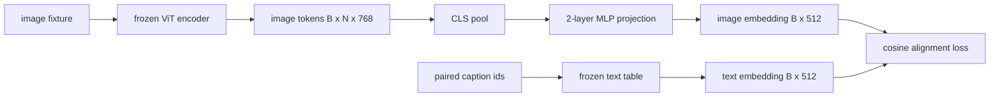

# لایه پیش بینی برای هماهنگی حالت

> یک کدگر تصویری توکن های تصویر تولید می کند. یک کدگر متن توکن های متن مصرف می کند. این دو در فضاهای ویکتور مختلف زندگی می کنند. یک MLP دو لایه کوچک توکن های تصویر را به فضای گنجانده متن پرتاب می کند و از دست دادن تعادل کوسین در برابر یک عنوان جفت دو فضای را به توافق می رساند. این پروژکتور کوچکترین قطعه یک مدل زبان دید است و برای انتقال مهم ترین است.

**Type:** Build
**Languages:** Python
**Prerequisites:** Phase 19 lessons 30-37 (Track B foundations)
**Time:** ~90 minutes

## اهداف یادگیری

- یک پروژکتور MLP دو لایه ای بسازید که ویژگی های تصویر را به فضای ورودی متن نقشه برداری کند.
- ساخت یک جدول ورودی متن جعلی (هیچ توکنایزر پیش از آموزش، هیچ corpus واقعی).
- یک از دست دادن تعادل کوسین بین توکن های تصویر پیش بینی شده و یک پیوند عنوان جفت را محاسبه کنید.
- پروژکتور را تنها با یک کدر بینایی منجمد و یک جدول متن منجمد تمرین کنید.

## مشکل

شما یک کدر بینایی (درسه 58-59) دارید که نشانه های ابعاد را تولید می کند`vision_hidden = 768`شما يه رمزگشایی متن داريد که مي خوايد با ابعاد داخلش بر روي آن قرار بگيريد`text_hidden = 512`(هر شماره دیگری هم قابل قبول است). رمزگشایی از توکن های شکل متن انتظار می برد. توکن های تصویر شکل متن نیستند: آنها در یک پایه زندگی می کنند که رمزگشایی در طول آموزش پیش از دیدن فقط یاد گرفته است، بدون هیچ ارتباطی با متری کلمات رمزگشایی.

پروژکتور MLP دو لایه (خطی، GELU، خطی) شکاف را می پوشاند.`768 * 1024 + 1024 * 512 = 1.3M`این نسخه LLaVA در سال 2023 ارسال شد که BLIP-2 به عنوان Q-Former بازسازی شد و هر VLM با وزن باز از آن زمان به نوعی اتخاذ کرده است.

## مفهوم



### جمع کردن قبل از طرح

کدگر بینایی 197 توکن را منتشر می کند. طرف متن دارای یک ورق واحد سطح عنوان است. برای هماهنگ کردن آنها شما نیاز به یک ویکتور سطح تصویر در هر نمونه دارید. جمع بندی CLS ساده ترین روش است: اولین توکن را از کدگر بگیرید و آن را پرژکتور کنید. جمع آوری میانگین در تمام 197 توکن گزینه دیگری است و این چیزی است که SigLIP استفاده می کند. هر دو 197 ویکتور را به یک جمع می کنند.

### چرا دو لایه و نه يک

یک طرح خطی واحد می تواند چرخش و مقیاس مجدد کند اما نمی تواند پایه را ثابت کند اگر دو فضای دارای ناهملاسی منحنی باشند. GELU بین دو لایه خطی به پروژکتور یک خم غیر خطی می دهد که به طور تجربی برای هماهنگی ویژگی های سبک CLIP با مدله های زبان کافی است. پروژکتورهای عمیق تر (LLaVA-NeXT از GLU استفاده می کند؛ Qwen-VL از یک دسته لایه های توجه استفاده می کند) گسترش هستند؛ MLP دو لایه پایه کانونیک است و آنچه که کشتی های پیشرو پروژکتور Q-Former BLIP-2 تحت کاپ است.

| Layer | Shape | Parameters |
|-------|-------|------------|
| fc1 | `(vision_hidden, projection_hidden)` | `768 * 1024 + 1024` |
| activation | GELU | 0 |
| fc2 | `(projection_hidden, text_hidden)` | `1024 * 512 + 512` |

حدود 1.3 میلیون پارامتر برای یک`768 -> 1024 -> 512`سرش رو

### از دست دادن تعادل کوسین

تعادل به معنی نیست`image_emb == text_emb`. تعادل يعني`image_emb`در همان جهت که`text_emb`در فضا مشترک.`1 - cos_sim(image, text)`آموزش این را به سمت صفر در هر جفت هدایت می کند. درس 62 به یک دسته متناقض (InfoNCE) عمومی می کند که هر تصویر باید به عنوان خود نزدیک تر از هر عنوان دیگر در دسته باشد. این درس از نسخه هر جفت استفاده می کند تا پویایی قابل مشاهده باشد.

### کدگر منجمد اون ترفنديه

کدور بینایی دارای پارامترهای 86M است. جدول متن چند میلیون نفر دیگه داره آموزش همه ی اونا از یک جسم ساختگی یک شروع نیست. منجمد کردن هر دو به این معنی است که پارامترهای 1.3M پروژکتور تنها چیزی است که تغییر می کند و چند صد گام روی جفت های مصنوعی برای کاهش خسارت کافی است. این دقیقاً شکل عملیاتی هر VLM مبتنی بر آداپتور است: قطعات سنگین منجمد می مانند، قطعات پل سبک.

```figure
ch-projection-bridge
```

## آن را بسازید

`code/main.py`ابزار:

- `MLPProjector(in_dim, hidden_dim, out_dim)`، دو لایه خطی MLP با فعال شدن GELU
- `MockTextEmbedding(vocab_size, dim)`, یک جدول گنجانده ی منجمد با تعیین کننده ای از یک دانه
- `make_pair(seed, vocab_size)`، که یک نمونه جفت (تصاویر، عنوان) را ترکیب می کند. عنوان ها دنباله های کوتاه id هستند؛ ادغام عنوان ها به طور متوسط بر روی ادغام های رمزگذاری شده است.
- `cosine_alignment_loss(image_emb, text_emb)`، هر جفت`1 - cos_sim`هدفمند
- یک حلقه آموزشی که پیش بینی را برای 200 مرحله در 32 جفت مصنوعی (تکثیر) اجرا می کند، با کدر بینایی و جدول متن منجمد شده و هر 25 مرحله از دست دادن را چاپ می کند.

اجرا کن

```bash
python3 code/main.py
```

تولید: گزارش های آموزش از کاهش اولیه حدود 1.07 به حدود 0.80 در عرض 200 مرحله کاهش می یابد، نشان می دهد که تنها پروژکتور می تواند توکن های تصویر را به سمت فضای متن بکشد. شباهت نهایی کوسین در هر جفت نیز چاپ می شود.

## ازش استفاده کن

این الگوی در هر VLM با وزن باز ظاهر می شود:

- **LLaVA 1.5.**پروژکتور دو لایه GELU MLP از CLIP-ViT-L پنهان شده به LLaMA اندام اندام. کدگر بینایی منجمد، LLM منجمد، فقط پروژکتور را تمرین کنید (پس LLM را در مرحله دوم از یخ زد).
- **BLIP-2.**Q-Former 32 توکن سوال آموخته را با توجه به توکن های تصویر به صورت متقابل می گیرد، سپس به LLM در قالب امبیدینگ dim پروژه می کند. سر پروژکتور در پایان Q-Former آنالوگ MLP این درس است.
- **MiniGPT-4.**پروژکتور خطی واحد از BLIP-2 Q-Former به ویکونا اندام است.
- **Qwen-VL.**آداپتور توجه متقاطع با چند لایه، اما قطعه آخر دوباره یک پروژکتور به LM اندام اندام است.

شکل متفاوت است اما نقش یکسان است: توکن های تصویر جمع آوری، پروژه به متن شامل اندام، قطار تنها.

## آزمایشات

`code/test_main.py`پوشش:

- شکل خروجی پروژکتور با شکل پیکربندی مطابقت دارد`out_dim`
- جدول گنجانده شدن متن منجمد صفر دارد `requires_grad`پارامترهای
- از دست دادن کوسین در متریزهای یکسان صفر و در متریزهای ضد متوازی 2 است
- جریان گرادینت پروژکتور پس از یک گذر به عقب
- حلقه آموزش کاهش خسارت بین مرحله 0 و مرحله 200

ازشون استفاده کن

```bash
python3 -m unittest code/test_main.py
```

## تمرینات

1. جمع بندی CLS را با جمع بندی متوسط در طول 196 توکن پچ جایگزین کنید و پس از 200 مرحله از دست دادن نهایی را مقایسه کنید. جمع بندی متوسط معمولاً در داده های مصنوعی سریعتر حرکت می کند؛ CLS در تصاویر طبیعی نمونه کارآمدتر است.

2. اضافه کردن یک دمای سکالر آموخته شده به از دست دادن کوسین (`cos / tau`) و مشاهده کنید که چه اتفاقی می افتد وقتی`tau`خیلی کوچک (ضوضای گرادینتی) یا خیلی بزرگ (هویات از دست دادن بالا) است.

3. MLP دو لایه را برای یک لایه خطی تغییر دهید و شکاف از دست دادن را مقداری کنید. غیر خطی بودن بیشتر در ویژگی های تصویر طبیعی و کمتر در ویژگی های مصنوعی اهمیت دارد.

4. یک مجازات کوچک L2 را روی وزنه های پروژکتور اضافه کنید و ببینید که چگونه با خط خط کش کش کش کش کش کش کش کش کش کش کش کش کش کش کش کش کش کش کش کش کش کش کش کش کش کش کش کش کش کش کش کش کش کش کش کش کش کش کش کش کش کش کش کش کش کش کش کش کش کش کش کش کش کش کش کش کش کش کش کش کش کش کش کش کش کش کش کش کش کش کش کش کش کش کش کش کش کش کش کش کش کش کش کش کش کش کش کش کش کش کش کش کش کش کش کش کش کش کش کش کش کش کش کش کش کش کش کش کش کش کش کش کش کش کش کش کش کش کش کش کش کش کش کش کش کش کش کش کش کش کش کش کش کش کش کش کش کش کش کش کش کش کش کش کش کش کش کش کش کش کش کش کش کش کش کش کش کش کش کش کش کش کش کش کش کش کش کش کش کش کش کش کش کش کش کش کش کش کش کش کش کش کش کش کش کش کش کش کش کش کش کش کش کش کش کش کش کش کش کش کش کش کش کش کش کش کش کش کش کش کش کش کش کش کش کش کش کش کش کش کش کش کش کش کش کش کش کش کش کش کش کش کش کش کش کش کش کش کش کش کش کش کش کش کش کش کش کش کش کش کش کش کش کش کش کش کش کش کش کش کش کش کش کش کش کش کش کش کش کش کش کش کش کش کش کش کش کش کش کش کش کش کش کش کش کش کش کش کش کش کش کش کش کش کش کش کش کش کش کش کش کش کش کش کش کش کش کش کش کش کش کش کش کش کش کش کش کش کش کش کش کش کش کش کش کش کش کش کش کش کش کش کش کش کش کش کش کش کش کش کش کش کش کش کش کش کش کش کش کش کش کش کش کش کش کش کش کش کش کش کش کش کش کش کش کش کش کش کش کش کش کش کش کش کش کش کش کش کش کش کش کش کش کش کش کش کش کش کش کش کش کش کش کش کش کش کش کش کش کش کش کش کش کش کش کش کش کش کش کش کش کش کش کش کش کش کش کش کش کش کش کش کش کش کش کش کش کش کش کش کش کش کش کش کش کش کش کش کش کش کش کش کش کش کش کش کش کش کش کش کش کش کش کش کش کش کش کش کش کش کش کش کش کش کش کش کش کش کش کش کش کش کش کش کش کش کش کش کش کش کش کش کش کش کش کش کش کش

5. وزن پروژکتور را حفظ کنید، سپس بارگذاری مجدد و نتیجه گیری را بدون گذراندن کدر بینایی به عقب اجرا کنید تا تأیید کنید که در زمان انتشار فقط پروژکتور مورد نیاز است.

## اصطلاحات کلیدی

| Term | What it means |
|------|---------------|
| Modality alignment | The act of making image and text embeddings comparable in one shared space |
| Projection head | The small module that maps one space to another, usually a 2-layer MLP |
| Cosine similarity | Dot product divided by the product of L2 norms |
| Frozen encoder | The vision (or text) model has all parameters with `requires_grad=False` |
| Mock corpus | Synthetic pairs used so training has no dataset download dependency |

## خواندن بیشتر

- کاغذ LLaVA برای قطار دو مرحله ای (مجموعه، سپس LM یخ زد).
- کاغذ BLIP-2 برای Q-Former به عنوان یک جایگزین قابل یادگیری برای پروژکتور.
- گزارش فنی Qwen-VL برای آداپتورهای توجه متقابل به عنوان سر های پیش بینی عمیق تر.
