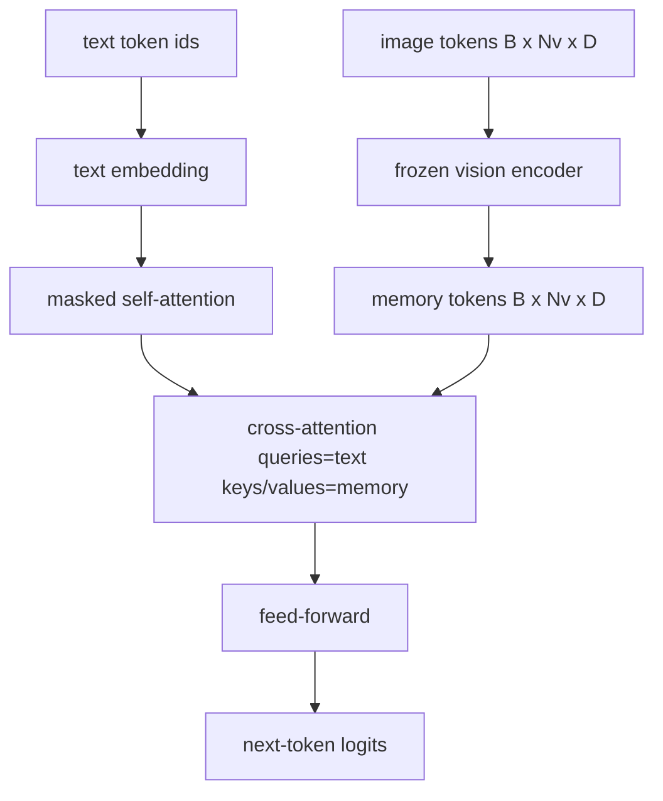
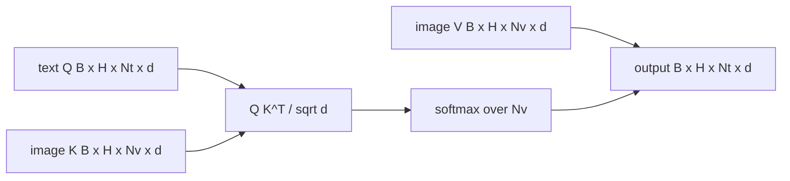

# فیوژن بین توجه ها

> لایه پروژکتور یک ویکتور تصویر را با یک ویکتور عنوان هموار می کند. یک دیکودر واقعی از زبان بینایی نیاز به هر توکن متنی دارد تا به هر توکن پیچ توجه کند، بنابراین مدل می تواند هر کلمه را در یک منطقه زمین کند. توجه متقابل این است که چگونه این زمین گیری اتفاق می افتد. سوال متن، کلید و ارزش های دید پاسخ می دهند. این درس مانع توجه متقابل، توجه به خود متن، و شکل ماسک را ایجاد می کند که هر دو را قانونی نگه می دارد.

**Type:** Build
**Languages:** Python
**Prerequisites:** Phase 19 lessons 30-37 (Track B foundations)
**Time:** ~90 minutes

## اهداف یادگیری

- اجرای توجه چند سر در حالی که جریان سوال متن و جریان کلید/قیمت بینایی است.
- یک بلاک دیکودر را ترکیب کنید: توجه به خود علت + توجه متقابل + ارسال.
- شکل ماسک را درست کنید: ماسک عللاتی برای خود توجه، هیچ ماسک برای توجه متقابل.
- یک گذرنامه پیش رو را با توکن های متن دسته بندی شده و یک مجموعه ثابت از توکن های تصویر اجرا کنید.

## مشکل

ترکیب توکن های تصویر و توکن های متن به یک ردیف یک گزینه فیوژن است (فیوژن اولیه، مسیر که Chameleon و Emu3 می گیرند). توجه متقاطع دیگری است (فیوژن دیر، مسیر که Flamingo معرفی کرده است و هر دیکودر شکل Flamingo از آن زمان نقل کرده است). در فیوژن دیر، دیکودر متن فقط بر روی توکن های متن اجرا می شود و از طریق توجه متقاطع در هر لایه به جریان تصویر می رسد.

فیژن دیر دارای دو مزیت است. اول، جریان متن تمیز باقی می ماند و مدل قابلیت های فقط متن را حفظ می کند. دوم، جریان تصویر یک بار در هر تصویر محاسبه می شود و برای هر مرحله رمزگذاری دوباره استفاده می شود، بنابراین تولید حتی برای عناوین طولانی ارزان است. هزینه یک لایه زیر توجه اضافی در هر بلوک است.

## مفهوم





### شکل ماسک

دو تا توجه داخل یک بلاک دیکودر به ماسک های مختلف نیاز دارند:

| Attention | Query length | Key length | Mask | Why |
|-----------|--------------|------------|------|-----|
| Self-attention | `Nt` (text) | `Nt` (text) | Causal: lower-triangular `(Nt, Nt)` | Text tokens may not look ahead during autoregression |
| Cross-attention | `Nt` (text) | `Nv` (vision) | No mask | The whole image is visible to every text position |

درس شامل یک تابع اعتبار شکل است بنابراین اشتباه مخلوط کردن آنها به عنوان یک سطح ظاهر می شود`ValueError`به جای منحنی تلفات خاموش شکسته شده

### چرا ماسک روی توجه متقابل وجود نداره

قبل از اینکه هر متن تولید شود، تصویر به طور کامل مشاهده می شود.`t`برخی از فلامینگو انواع اضافه کردن یک الگوی ماسک هر نمونه هنگام ترک چندین تصویر و بخش های متن اما برای یک تصویر و یک عنوان، توجه متقابل همه چیز را می بیند.

### ذخیره سازی کلید/قیمت

کلید های تصویر و ارزش ها در آغاز رمزگذاری یک بار محاسبه می شوند و در یک کیش نگهداری می شوند. هر توکن متن جدید از کیش بدون بازتوسعه استفاده می کند. این چیزی است که باعث می شود زیرنویس سریع در نتیجه گیری شود: ViT سنگین یک بار اجرا می شود؛ توجه متقاطع کلیدها و ارزش های خود را برای هر مرحله دوباره استفاده می کند. درس کیش را نشان می دهد و مسیر ضربه به کیش را آزمایش می کند.

### ترکیب گروه

یک بلاک دیکودر اجرا می شود: pre-LN -> خود توجه -> باقیمانده -> pre-LN -> توجه متقابل -> باقیمانده -> pre-LN -> feed-forward -> باقیمانده. سه لایه زیر، هر یک با LayerNorm خود. کاغذ فلامینگو یک دروازه آموخته در توجه متقابل اضافه کرد تا مدل بتواند از مسیر تصویر با هزینه ثبات زمان آموزش خارج شود. خط پایه کانونیکی (که در اینجا استفاده می شود) هیچ دروازه ای ندارد.

```python
class DecoderBlock:
  def forward(self, text_tokens, image_tokens, text_mask, cross_mask):
      text_tokens = text_tokens + self.self_attn(self.ln1(text_tokens),
                                                 mask=text_mask)
      text_tokens = text_tokens + self.cross_attn(self.ln2(text_tokens),
                                                  image_tokens,
                                                  mask=cross_mask)
      text_tokens = text_tokens + self.ffn(self.ln3(text_tokens))
      return text_tokens
```

```figure
ch-crossattn-fan
```

## آن را بسازید

`code/main.py`ابزار:

- `CrossAttention(hidden, heads)`، چند سر به هم توجه کردن با جدا بودن`q`و`kv`پیش بینی ها
- `CausalSelfAttention(hidden, heads)`، توجه به خود را از یک کدگر استاندارد پنهان.
- `DecoderBlock`، که سه لایه زیر را با بقایای قبل از LN ترکیب می کند.
- `VisionLanguageDecoder`، چهار لایه ی دیکودر که توسط یک کدگر ساختگی و یک جدول کوچک ورودی متن تغذیه می شود.
- `causal_mask(length)`بازگشت یک`(length, length)`تنسور بولی مثلث پایین
- یک نمایش که یک دسته از دو دنباله متن با طول 10 با حافظه تصویر با طول 197 را تغذیه می کند و شکل خروجی، شکل ماسک خود توجه و استاندارد خروجی توجه متقاطع در هر موقعیت را چاپ می کند.

اجرا کن

```bash
python3 code/main.py
```

خروجی: دیکوتر تولید یک `(2, 10, text_vocab)`.گوشون ها تنسور ميکنن`(10, 10)`چک استفاده مجدد KV-cache، تراشه های مشابهی بین مسیرهای ذخیره شده و غیر ذخیره شده را تایید می کند.

## ازش استفاده کن

توجه متقابل در دو خانواده تولید ظاهر می شود:

- **Flamingo and IDEFICS.**هر بلوک مدل زبان K یک لایه زیر توجه متقابل را با LM منجمد وارد کنید. آداپتور زبان بینایی بلوک توجه متقابل و دروازه آن است.
- **BLIP-2.**Q-Former از توجه متقابل از مجموعه ثابت از 32 توکن سوال به ویژگی های تصویر استفاده می کند، سپس سوالات را به فضای گنجاندن LM نمایش می دهد.

شکل بلوک در این درس مستقیماً بر هر دو نقشه می کشد. نظم ماسک (تسبب در خود، هیچ یک در صلیب) یکسان است.

## آزمایشات

`code/test_main.py`پوشش:

- ماسک علتی مثلث پایین است و با شکل انتظار می رود
- شکل خروجی توجه متقابل `(B, Nt, hidden)`بدون توجه به طول کلید
- مسیر KV-cache با مسیر غیر cached با تحمل شناور مطابقت دارد
- تفاوت شکل بین جریان های متن و تصویر باعث می شود یک واضح `ValueError`
- یک گذرگاه کامل دیکودر به جلو شکل دسته و دنباله درست را تولید می کند

ازشون استفاده کن

```bash
python3 -m unittest code/test_main.py
```

## تمرینات

1. در این حالت، یک دروازه تان یاد گرفته شده را به باقی مانده توجه متقابل اضافه کنید (ترک فلامینگو) و بررسی کنید که تمرین از یک دروازه اولیه نزدیک به صفر به هم می رسد. دروازه از 0 شروع می شود؛ مدل قبل از مخلوط کردن جریان تصویر، رفتار فقط متن را بازیابی می کند.

2. توجه متقابل را در جایی اجرا کنید که یک دیکودر چندین تصویر و چندین بخش متن مصرف می کند. ماسک توجه متقابل را برای هر نمونه بسازید که از حضور بخش 2 متن به تصویر 1 جلوگیری می کند.

3. پروفایل توجه متقابل با خود توجه در `Nt=64, Nv=576`(شبکه 24×24 در رزولوشن بالاتر) هزینه توجه متقاطع`Nt * Nv`و با رزولوشن تصویر بالا تسلط دارد.

4. یک dropup در سمت سوال را در نقشه توجه متقابل اضافه کنید و تنوع عنوان را در نمایش اندازه گیری کنید (تغیر نمونه عنوان با dropup در نقشه متقابل افزایش می یابد).

5. لایه توجه متقابل را برای یک بلوک توجه به سبک Q-Former تغییر دهید که در آن یک مجموعه پرسش 32 توکن ثابت به ویژگی های تصویر یک بار در هر لایه توجه می کند.

## اصطلاحات کلیدی

| Term | What it means |
|------|---------------|
| Late fusion | Text and vision stay in separate streams; cross-attention bridges them at every block |
| Cross-attention | Q comes from one stream, K and V from another |
| Causal mask | Lower-triangular boolean mask that prevents looking ahead during autoregression |
| KV cache | Image keys and values stored once and reused for every decode step |
| Memory tokens | The frozen image tokens that the decoder reaches into |

## خواندن بیشتر

- فلامینگو (2022) برای طراحی دیر فیوژن کانونیک با توجه متقاطع دروازه ای.
- BLIP-2 (2023) برای Q-Former، که یک بلوک توجه متقابل به عنوان یک استخر پرسش های آموخته شده است.
- IDEFICS (2023) برای تولید مجدد با وزن باز از دستورات فلامینگو.
