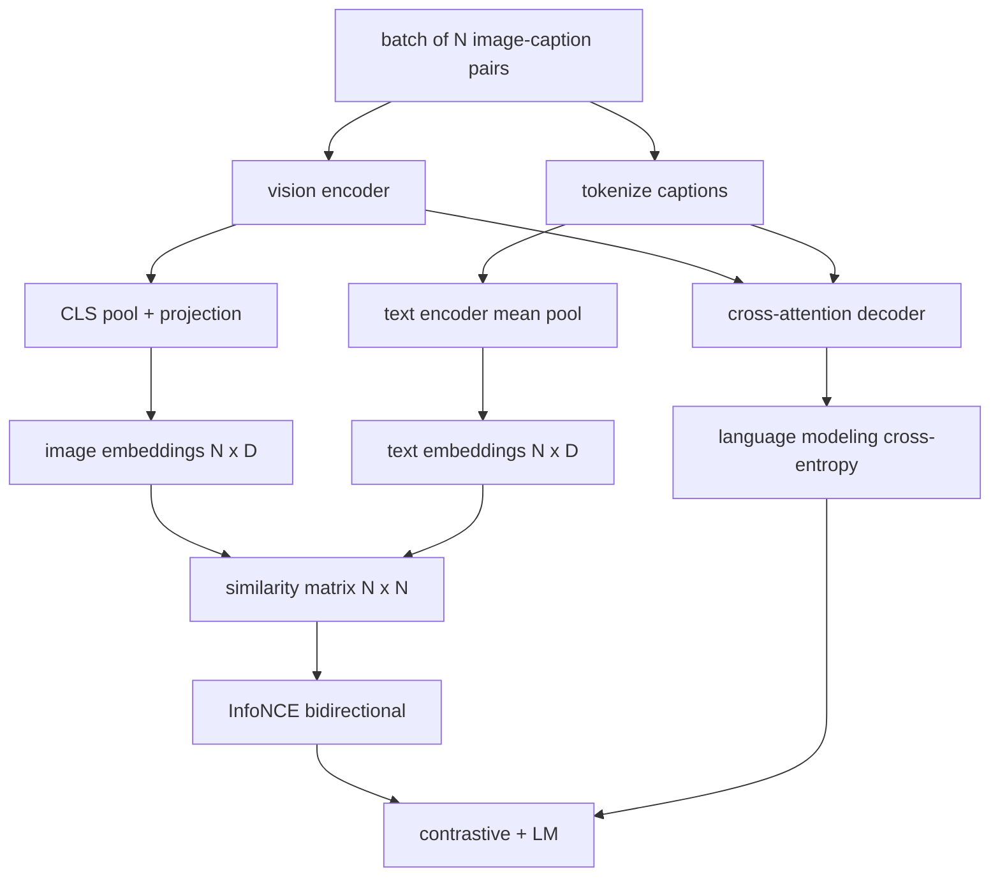

# آموزش زبان بینایی

> این کدگر، پروژکتور و دیکودر به طور سیمکاره ای متصل است. اکنون آنها را با هم آموزش دهید. دو هدف یادگیری را هدایت می کند: یک ضایعات متناقض تصویر-متن (InfoNCE) که جفت های تطابق را در فضای گنجان مشترک با هم می کشد و یک ضایعات مدل سازی زبان که از کدگر می خواهد هر تصویر را زیرنویس کند. در مجموع، آنها شبکه را آموزش می دهند که هم برای پیدا کردن تصویر مناسب برای یک عنوان و هم برای نوشتن یک عنوان برای تصویر.

**Type:** Build
**Languages:** Python
**Prerequisites:** Phase 19 lessons 30-37 (Track B foundations)
**Time:** ~90 minutes

## اهداف یادگیری

- پیاده سازی InfoNCE از دست دادن تعادل در یک دسته از زوج های تصویر- عنوان.
- از دست دادن متناقض را با از دست دادن مدل سازی زبان خودکشی ترکیب کنید.
- يک 200 جفت جعلي از صورت هاي تصويري بدون دانلود سيستم داده هاي واقعي را همگامي کنيم
- یک حلقه آموزش 50 مرحله ای را اجرا کنید و مشاهده کنید که هر دو ضرر کاهش می یابد.

## مشکل

یک مدل زبان دید به دو مهارت نیاز دارد. باید رتبه بندی کند: با یک عنوان، تصویر را در میان بسیاری پیدا کنید. باید تولید کند: با یک تصویر، یک عنوان بنویسید. آموزش پیش از یک مهارت به شما نیمی از سیستم را می دهد. رتبه بندی CLIP بسته شده اما نمی تواند عنوان کند. GPT-4V می تواند عنوان کند اما از سر بازیافت جداگانه برای رتبه بندی استفاده می کند. آموزش پیش از چند هدف هر دو را در یک گذر می کند.

InfoNCE، نصف رتبه بندی را اداره می کند. برای یک دسته از زوج های N، مدل، زوج های N را به عنوان مثبت و `N^2 - N`جفت های نامتناسب به عنوان منفی، سپس یک از دست دادن انتروپی کراس در نتیجه `(N, N)`ماترکس شباهت. از دست دادن LM نیمه نسل را اداره می کند: پیش بینی استاندارد توکن بعدی که بر روی تصویر مشروط است. هر دو از دست دادن قابل تفاوت هستند و می توانند وزن کدرها، پروژکتورها و کدرها را به اشتراک بگذارند.

## مفهوم



### InfoNCE در یک پاراگراف

N تصویر های داخلی را به عنوان ردیف و N متن های داخلی را به عنوان ردیف جمع کنید. L2- هر دو را عادی کنید. محاسبه `N x N`ماتریکس`S = I T^T / tau`کجا`tau`در این حالت، در حال بررسی این موضوع، یک درجه حرارت آموخته شده است. ورودی های قطبی جفت های تطابق هستند؛ ورودی های خارج از قطبی منفی هستند.`argmax`به سمت زاویه پایین می رود: ردیف`i`باید بالاترین ورودی را در ستون داشته باشد `i`.در طول ستون ها همکارانه انجام دهید . مجموع میانگین دو است . این از دست دادن CLIP در هشت خط است

### موضوع حرارت

درجه حرارت`tau`کنترل می کند که تا چه حد نرمترین مقدار آن بالاست.`tau = 0.01`) و گرادینت فقط از سخت ترین منفی می آید، آموزش شور است. بیش از حد بزرگ و نرمmax هموار و گرادینت ناپدید می شود. CLIP یاد می گیرد `tau`به عنوان یک پارامتر؛ در اینجا نمایش همان کار را می کند.

### از دست دادن مدل سازی زبان

کدگر از توکن های حافظه تصویر از طریق توجه متقابل استفاده می کند و توکن متن بعدی را در هر موقعیت پیش بینی می کند. از دست دادن یک توکن متقابل استاندارد با هدف موقعیت بعدی است. موقعیت های پوشاندن از از دست دادن پنهان می شوند.

### ترکیب خسارت ها

`total = contrastive + lm_weight * lm`کجا`lm_weight`این دو ضرر gradient را به کدگر و پروژکتور تقسیم می کنند؛ تنها کدگر gradient LM-loss را دریافت می کند. این دستور کار چند وظیفه ای است که مدل های CoCa، BLIP و SigLIP با وزن های مختلف استفاده می کنند.

| Component | Loss surface | Affects |
|-----------|--------------|---------|
| InfoNCE | Pair ranking in the joint space | Encoder + projection + text head |
| LM | Token prediction conditioned on image | Encoder + projection + decoder |
| Combined | Multi-task | Whole stack |

### چرا 50 مرحله برای یک نمایش کافی است

این جعله مجموعه ای از 200 جفت مصنوعی با تصاویر تصادفی و آدی عنوان تصادفی است. پس از 50 مرحله SGD با اندازه دسته 16, هر دو ضرر به طور قابل مشاهده کاهش می یابد حتی اگر ارزش های مطلق بالاتر از آنچه یک مدل داده واقعی می تواند به دست آورد. هدف از نمایش نشان دادن این است که تایید کند که کار های لوله کشی گرادینت پایان به پایان می رسد و اضافه کردن از دست دادن LM هدف متناقض را بی ثبات نمی کند.

```figure
ch-infonce-diagonal
```

## آن را بسازید

`code/main.py`ابزار:

- `MultimodalModel`، ترکیبی از یک کدگر کوچک ViT، پروژکتور MLP، یک کدگر کوچک در طرف متن (مجموعه متوسط از ID های داخلی) و کدگر توجه متقاطع از درس 61.
- `info_nce_loss(image_emb, text_emb, temperature)`، از دست دادن تعادل دو جهت به سبک CLIP
- `lm_loss(logits, target_ids, padding_id)`، توکن بعدی متقابل اینتروپی
- `make_mock_corpus(seed, n_pairs)`، به 200 جفت تعیین کننده (تصاویر، caption_ids) باز می گردد.
- یک حلقه آموزشی که 50 مرحله ای با اندازه دسته 16، بهینه سازی آدم و یک پارامتر درجه حرارت ثبت شده است. هر دو از دست دادن هر 5 مرحله چاپ می شود.

اجرا کن

```bash
python3 code/main.py
```

تولید: کاهش خسارت های متناقض از حدود `ln(16) = 2.77`به سمت 2.4 کاهش LM از یک خط پایه تصادفی یکسانی از `ln(512) ≈ 6.24`در حدود 4.7، هر دو کاهش ثابت می کند که گرادینت به درستی به کار گرفته شده است. مدل های واقعی برای میلیون ها قدم تمرین می کنند؛ دینامیک یکسان است.

## ازش استفاده کن

اين همون دستورات خسارته که فرستاده شد:

- **CLIP (2021).**فقط عکس متن متناقض با یک ساند فروریز کد بندی عنوان
- **CoCa (2022).**عکس-متن تعارضي + تخلفي LM در يک مدل
- **BLIP (2022) and BLIP-2.**برعکس + LM + عکس-متن مطابق سر 3 خسارت در مجموع
- **SigLIP (2023).**InfoNCE را برای یک ضایعات جفت sigmoid تغییر می دهد؛ نقش متناقض مشابه، شکل عملکردی متفاوت.
- **LLaVA family.**آموزش دو مرحله ای که مرحله اول هماهنگی است (کوسین بر روی LM منجمد) و مرحله دوم اضافه کردن از دست دادن LM با LM غیر منجمد. درس 60 نقشه مرحله اول؛ این درس نقشه مرحله دوم.

## آزمایشات

`code/test_main.py`پوشش:

- InfoNCE از دست دادن متقابل در سراسر خط های تصویر / متن است
- InfoNCE از دست دادن 0 را باز می آورد وقتی که ماتریس شباهت یک دیگالال کامل از اعداد مثبت بزرگ است
- از دست دادن LM به درستی موقعیت های پر کردن را پوشش می دهد
- مدل پیشرفت هر دو ضرر بدون خطا را تولید می کند
- 5 مرحله ی چرخه آموزش، کاهش تلفات ترکیبی را کاهش می دهد

ازشون استفاده کن

```bash
python3 -m unittest code/test_main.py
```

## تمرینات

1. InfoNCE را با ضایعات جفت سیگمائید سبک SigLIP جایگزین کنید و کنورژانس را در کورپوس ساختگی مقایسه کنید.

2. یک مرحله استخراج سخت منفی را اضافه کنید: هر دسته دیگر، سخت ترین جفت خارج از قطعه قبلی را انتخاب کنید و آن را اضافه کنید. آموزش و بررسی کنید که آیا ضایعات متناقض سریع تر کاهش می یابد.

3. اضافه کردن یک سر دوگانه تصویر-متن مطابق با ورق مشترک (حق / دروغ: آیا این ها مطابقت دارند؟) برای یک ضایع سوم، تکرار تنظیم سه سر BLIP.

4. جایگزین جعلي corpus با دنباله های عنوان-ID گرفته شده از یک زنجیره Markov که ماتریس انتقال آن بر روی تصویر hash است. از دست دادن عنوان باید کاهش یابد زیرا سیگنال قابل یادگیری واقعی وجود دارد.

5. با هم مدل رو آموزش بده`lm_weight = 0`و دوباره با`lm_weight = 1`.با کاهش در مقایسه با کاهش در LM مقایسه کنید.

## اصطلاحات کلیدی

| Term | What it means |
|------|---------------|
| InfoNCE | Noise contrastive estimation: cross-entropy on a similarity matrix |
| Temperature | Scalar that controls how peaked the contrastive softmax is |
| Hard negative | An off-diagonal pair the model finds confusing, useful for sampling |
| LM loss | Standard next-token cross-entropy on the captioning side |
| Joint embedding space | The shared space where image and text vectors live after projection |

## خواندن بیشتر

- کاغذ کلپ برای نسخه اصلی متناقض
- کاغذ CoCa برای تضاد و اضافه کردن زیرنویس در یک مدل
- کاغذ سیگلیپ برای نوع از دست دادن جفت سیگمائید و چرا مقیاس بهتر است.
