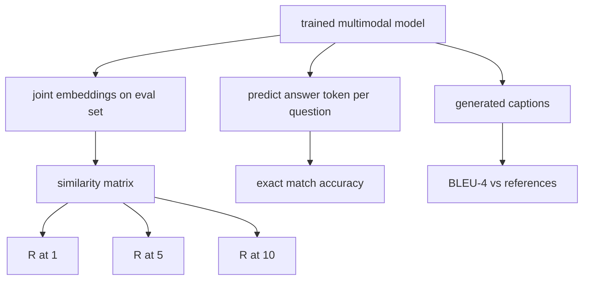

# ارزیابی چند مدل

> آموزش نیمی از حلقه است. نیمی دیگر اندازه گیری است. این درس سه سطح ارزیابی را از ابتدایی ها ایجاد می کند: بازیافت عنوان تصویر به عنوان R@1, R@5, R@10 گزارش شده است؛ پاسخ به سوالات بصری به عنوان دقت دقیق مطابقت گزارش شده است؛ و عنوان تصویر به عنوان BLEU-4 گزارش شده است. هر متریک یک تابع بر روی خروجی مدل و مجموعه ارزیابی مصنوعی است که در ثانیه اجرا می شود.

**Type:** Build
**Languages:** Python
**Prerequisites:** Phase 19 lessons 58-62 (Track E foundations: encoder, transformer, projection, cross-attention fusion, pretraining)
**Time:** ~90 minutes

## اهداف یادگیری

- Recall@K را از یک ماتریس شباهت بین تصویر و برچسب های گنجانده محاسبه کنید.
- دقت دقیق VQA را از یک مدل که جفت ها (تصاویر، سوال) را به یک لغت پاسخ ثابت نقشه می زند محاسبه کنید.
- محاسبه BLEU-4 از دنباله های توکن تولید شده و مرجع بدون هیچ کتابخانه خارجی.
- تمام سه تست رو با يه مجموعه مصنوعي که بر روي مدل آموزش داده شده درسي 62 ساخته شده اجرا کن

## مشکل

وسوسه این است که یک مدل چند مدل را در زمانی که سطح خسارت آموزش ها بالا می رود، به پایان رساند. اندازه گیری خسارت آموزش ها در توزیع آموزش ها مناسب است؛ این اندازه گیری نمی کند که آیا مدل می تواند زوج ها را در یک دسته طولانی رتبه بندی کند، به یک سوال پاسخ دهد یا یک عنوان را بنویسد که یک انسان بپذیرد. سه سطح ارزیابی استاندارد هستند:

- **Retrieval (R@1, R@5, R@10).**یک تصویر را با یک کوسین مرتب کنید، گزارش دهید که آیا تصویر مطابقت پذیر در بالای 1، بالای 5، بالای 10 قرار دارد. شکل همتایی (تصاویر به متن) به همان روش اجرا می شود.
- **Visual question answering (exact match).**داده شده (تصویر، سوال) ، مدل یک نماد پاسخ را تولید می کند. مطابقت دقیق یک بیت در هر نمونه است: آیا پاسخ پیش بینی شده برابر با پاسخ مرجع است؟ متوسط بیش از مجموعه ارزیابی.
- **Captioning (BLEU-4).**یک عنوان ایجاد کنید. متوسط هندسی از 1 گرم تا 4 گرم را با دقت با عنوانات مرجع محاسبه کنید، با مجازات کوتاه. چندین مرجع فرم استاندارد است (یک تصویر، چندین عنوان مرجع).

هر متریک یک تابع نازک است. درس همه آنها را در کد ساخته است بنابراین ریاضیات مشخص است و سطح تحت کنترل شما باقی می ماند. مجموعه های واقعی معیار (MS-COCO، VQA v2، GQA، OK-VQA) به شکل های عملکرد مشابه متصل می شوند.

## مفهوم



### یادآوری K از یک ماتریس شباهت

ساختش رو`(N, N)`ماتریس شباهت کوسین بین تصویر و برچسب های گنجانده شده. برای هر ردیف، ستون ها را با شبیه سازی پایین تر مرتب کنید. یادآوری@K بخش از ردیف هایی است که شاخص ستون های قطبی در موقعیت های بالای K قرار دارد. یادآوری متراکی (Call@K) (caption-to-image) بر روی ماتریس منتقل شده محاسبه می شود. هر دو شماره گزارش شده برای یک N=100 eval، R@1 = 0.6 به معنای 60 از 100 عنوان تصویر درست خود را به عنوان مطابقت بالا بازیابی کرد.

### مطابقت دقیق VQA

برای هر یک (تصاویر، سوال، پاسخ) ، تصویر را رمزگذاری کنید، سوال را گنجانید، از طریق کدگذاری، و نشانه بعدی را بخوانید. ID رمزنگاری شده پیش بینی شده با ID مرجع مقایسه می شود؛ درست اگر برابر باشد. متوسطي بر اساس مجموعه ارزیابی مجموعه داده های واقعی VQA با چندین پاسخ به هر سوال با اشاره های انسانی ارسال می شوند و از فرمول دقت نرم (1.0 اگر حداقل 3 از 10 نوتاژ موافق باشند، در مقیاس زیر استفاده می شود) استفاده می شود؛ درس از یک پاسخ دقیق برای شفافیت استفاده می کند.

### BLEU-4

```text
BLEU-4 = BP * exp(mean(log p1, log p2, log p3, log p4))
```

کجا`p_n`دقت n-گرام اصلاح شده است (تعداد کاهش یافته از n-گرام تولید شده که در هر مرجع ظاهر می شوند، به مجموع n-گرام تولید شده تقسیم می شود) و `BP`مجازات کوتاه مدت:

```text
BP = 1                if generated length > reference length
   = exp(1 - r/g)     otherwise, where r is reference length and g is generated
```

نرم کردن برای نمونه های کوچک مورد نیاز است که برخی از آنها`p_n`اجرای از روش "چن و چیری 1" (برای هر عدد صفر 1 را به شماره و نامگذاری اضافه کنید) استفاده می کند که امن ترین پیش فرض برای رژیم های کم شمار است.

### مجموعه ارزیابی مصنوعی

مجموعه ارزیابی 50 نمونه از همان الگوی جعلي corpus مورد استفاده در درس 62 ساخته شده است.

- `pairs`: 50 جفت (تصویر، caption_ids) برای بازیافت
- `vqa`: 50 (تصویر، سوال، پاسخ) سه برابر
- `caps`: 50 (تصویر، [reference_caption_ids، ...]) ورودی با حداکثر 3 مرجع در هر تصویر.

مجموعه از تخم تعیین کننده است و از کورپوس آموزش باز می گردد، بنابراین متریکها بر اساس داده هایی که مدل هرگز ندیده است محاسبه می شوند. ادامه مجموعه به JSON به عنوان یک تمرین باقی می ماند (در زیر ببینید).

| Metric | Range | Random baseline (N=50) |
|--------|-------|------------------------|
| R@1 | 0 to 1 | 0.02 (1 / N) |
| R@5 | 0 to 1 | 0.10 |
| R@10 | 0 to 1 | 0.20 |
| VQA EM | 0 to 1 | 1 / vocab |
| BLEU-4 | 0 to 1 | small but nonzero |

برای یک دوره آموزشی ۵۰ مرحله ای که بر اساس داده های مصنوعی انجام می شود، انتظار نمی رود که معیارها بالا باشند؛ انتظار می رود که بالاتر از خط پایه تصادفی باشند، که این چیزی است که در دیمو بررسی می شود.

```figure
ch-recall-window
```

## آن را بسازید

`code/main.py`ابزار:

- `recall_at_k(sim_matrix, k)`، بازگردانده ي يه شناور در`[0, 1]`برای هر دو جهت
- `vqa_exact_match(predictions, references)`، بازگردانده شدن متوسط`int`برابری
- `bleu4(generated, references, smoothing=True)`، با حمایت از مرجع های متعدد
- `build_eval_suite(seed, n_samples, vocab_size, max_len)`، بازگردانده سه لیست ارزیابی تعیین کننده
- `evaluate(model, suite)`، که تمام سه متریک رو اجرا می کنه و یک`dict`از اعداد
- یک نمایش که یک مدل چند مدل تازه از درس 62 شروع شده را بارگذاری می کند، آن را ارزیابی می کند، سپس آن را برای 50 مرحله آموزش می دهد و دوباره ارزیابی می کند، متریک قبل / بعد را چاپ می کند.

اجرا کن

```bash
python3 code/main.py
```

خروجی: جدول متریک قبل / بعد نشان می دهد که بازیافت از نزدیک تصادفی به سمت سیگنال آموخته شده مدل بهبود می یابد، VQA بالاتر از تصادفی و BLEU-4 بهبود می یابد (بنیادی ساختار برای یک بلند کردن دقیق 4 گرم کافی است).

## ازش استفاده کن

هر متریک مستقیماً بر روی یک معیار تولید نقشه برداری می کند:

- **Retrieval.**MS-COCO 5K val، Flickr30K، ImageNet صفر-shot همه مشکلات R@K در همان ماتریس شباهت هستند. ارزیابی مصنوعی را با فایل های واقعی جایگزین کنید و امضای عملکرد بدون تغییر است.
- **VQA.**VQA v2، GQA، OK-VQA از همان شکل مطابقت دقیق استفاده می کنند (با نرم acc به جای EM پاسخ واحد برای VQA v2).
- **BLEU-4.**نوشته های MS-COCO، NoCaps، Flickr30K همه از BLEU-4 به علاوه CIDER و METEOR استفاده می کنند. اضافه کردن CIDER یک عملکرد دیگر است.

برای معیارهای واقعی، تبادل`build_eval_suite`ریاضیات مقارنتی است.

## آزمایشات

`code/test_main.py`پوشش:

- recall@k 1.0 را در یک ماتریس مشابه هویت کامل و 0.0 را در یک متراکم برای k < N باز می کند
- یادتون باشه`k <= N`خط بالا
- bleu4 به 1.0 باز می گردد وقتی تولید شده به طور دقیق برابر با یکی از مرجع ها است
- bleu4 0.0 در لغات متفرق را باز می دهد
- vqa دقیقاً برابر با بخش جفت های برابر است
- build_eval_suite تعداد انتظار شده از جفت ها، آیتم های vqa و ورودی های عنوان را باز می کند

ازشون استفاده کن

```bash
python3 -m unittest code/test_main.py
```

## تمرینات

1. CIDEr از وزن TF-IDF در n-گرام استفاده می کند که نشان دهنده اطلاعات را پاداش می دهد.

2. پیاده سازی دقیق نرم VQA: پاسخ های متعدد انسانی در هر سوال، دقت `min(human_count / 3, 1)`اگه همچين چيزي با هم مطابقت داشته باشه

3. یک نوع NaN امن از  اضافه کنید`bleu4`که بدون سقوط، دنباله های تولید شده خالی را اداره می کند.

4. میانگین رتبه متقابل (MRR) را کنار R@K محاسبه کنید. MRR حساس است که نقطه صحیح در خارج از K بالا فرود آید؛ R@K حساس است که آیا در K بالا فرود آید.

5. ارزیابی را در مدل در پنج نقطه بازرسی در طول آموزش انجام دهید (خطای 0, 10, 20, 30, 40, 50) و منحنی یادگیری را نقشه برداری کنید. مسیرهای متریکی را بررسی کنید.

## اصطلاحات کلیدی

| Term | What it means |
|------|---------------|
| R@K | Fraction of queries where the correct match lands in the top K results |
| Exact match | The simplest VQA scoring: predicted answer equals reference |
| BLEU-4 | Geometric mean of 1- to 4-gram precisions, with brevity penalty |
| Multi-reference | A captioning metric accepts several reference captions per image |
| Held-out | The eval set is sampled from a seed disjoint from the training corpus |

## خواندن بیشتر

- ورق VQA v2 برای فرمول دقت نرم و آمار مجموعه داده ها.
- کاغذ CIDER برای نوشته های n-gram با وزن TF-IDF.
- BLEU اصلی (Papineni و همکارانش، 2002) برای انواع صاف کننده.
- اسکریپت های ارزیابی MS-COCO برای اجرای مرجع کنونیکی.
