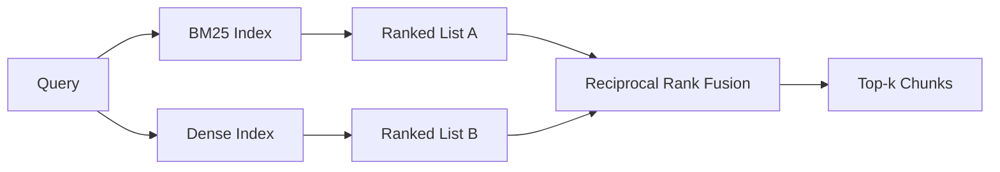

# بازیافت ترکیبی با BM25 و گنجانده های کثیف

> بازیافت لکسایی و معنوی در توزیع های متقابل جستجو شکست می خورد. بازیافت ترکیبی با ترکیب رتبه متقابل مداخله نمی کند، رای می دهد - و رای در هر کلاس جستجو برنده می شود.

**Type:** Build
**Languages:** Python
**Prerequisites:** Phase 11 lessons 04 (embeddings), 06 (RAG); Phase 19 Track B foundations (lessons 20-29); Phase 19 lesson 64 (chunking strategies)
**Time:** ~90 minutes

## اهداف یادگیری
- BM25 را از ابتدا از فرمول Robertson و Sparck Jones پیاده سازی کنید، با وزن میدان، نرمال سازی طول سند و تنظیم k1 و b.
- یک بازیافتگر کثیف روی یک فرضیه تعیین کننده بسازید تا حلقه غیر فعال شود.
- ترکیب رتبه متقابل را دقیقاً همانطور که کورمک، کلارک و بوتچر در سال 2009 منتشر کرده اند، پیاده سازی کنید و توضیح دهید که چرا این بر مداخله با وزن امتیاز غالب است.
- ثابت RRF k و وزنهای هر حالت را تنظیم کنید و تعادلات را در یک جسم کوچک فکسچر بخوانید.

## مشکل

جستجو در لغت برنده می شود وقتی که جستجو دارای یک شناسه حرفی است که corpus حاوی لفظی است.`AbortMultipartOnFail`عملکرد Go درست را از طریق BM25 در مایکرو ثانیه ها باز می گرداند. همان سوال، گنجانده شده، در مرز سه خوشه شباهت قرار دارد و یک بازیافتگر کثیف اولین فایل را رتبه بندی می کند.

جستجو کثیف برنده می شود وقتی که جستجو از توکن های واقعی کورپوس دور تر شود. یک کاربر که از "چگونه با آپلود های لغو شده برخورد می کنیم" می پرسد هرگز کلمه حذف یا چند بخش را تایپ نکرده است. BM25 قطعه اسناد را در "اپلود فایل های بزرگ" باز می گرداند زیرا این صفحه حاوی کلمه آپلود است. بازخواستن کثیف عملکرد حذف را پیدا می کند که خلاصه آن حذف را ذکر می کند.

انتخاب بین این دو یک استاتیک نیست. توزیع سوال متغیر است. یک سیستم تولید RAG هر دو کلاس را از همان نقطه پایان اداره می کند، بنابراین بازیافت باید هر دو را به یکباره اداره کند. این بازیافت ترکیبی است. مرحله ادغام بخش است که باید درست باشد.

## مفهوم



### BM25 در یک پاراگراف

BM25 یک جفت سوال و سند را با جمع کردن، بیش از شرایط سوال، یک فاکتور فرکانس سند معکوس به یک فاکتور فرکانس اصطلاح اشباع کننده که شامل یک اصلاح نرمال سازی طول است، ضرب می کند. دو دکمه. `k1`تعویض فرکانس اصطلاح را کنترل می کند. پیش فرض 1.5 توصیه منتشر شده است و شما نباید بدون یک معیار آن را حرکت دهید. `b`کنترل می کند که طول سند چقدر مهم است؛ پیش فرض 0.75 می گوید اسناد طولانی تر مجازات می شوند، اما خطی نیست.

فرمول ارتش اسرائيل از تعريف روبرتسون و اسپارک جونز استفاده ميکنه که`log((N - df + 0.5) / (df + 0.5) + 1)`. پلاس وان داخل دفترچه ارتش اسرائیل را مثبت نگه می دارد وقتی یک اصطلاح در بیش از نیمی از دفتر ظاهر می شود. این در ادارات کوچک که کلمات توقف فنی نادر هستند مهم است.

وزن میدان به شما اجازه می دهد به BM25 بگویید که یک مسابقه در نام نماد بیشتر از یک مسابقه در بدن است. پیاده سازی ضربگر در شمارش اصطلاح در هنگام شاخص سازی است، نه در زمان امتیاز. این باعث می شود ریاضیات یکسان باشد و از امتیاز جداگانه در هر زمینه جلوگیری شود.

### بازیافت فشرده در یک پاراگراف

هر قطعه را به یک ویکتور ابعاد ثابت با یک مدل ادغام کنید. در زمان جستجو، سوال را ادغام کنید، هر قطعه را با شباهت رتبه بندی کنید و top-k را بازگردانید. مدل متغیر است که کیفیت را تعیین می کند. الگوریتم بازیافت خود دو خط است: محصول نقطه و دسته بندی.

این درس از یک هاش مبتنی بر تعیین کننده استفاده می کند تا شما بتوانید ریاضیات فیوژن را بدون تماس شبکه ای بخوانید. هاش مبالغ تعویضات کلید توکن را به یک ویکتور 96 بعدی و عادی سازی می کند. صفات کوسین در میان اجراهای تعیین کننده هستند، که این چیزی است که مجموعه آزمایش نیاز دارد.

### ترکیب درجه متقابل، فرمول منتشر شده

دو لیست رتبه بندی شده. برای هر نامزد که در هر دو لیست ظاهر می شود، مشارکت های رتبه متقابل خود را جمع آوری کنید. مقاله 2009 استفاده شده است `1 / (k + rank)`با k برابر 60 به عنوان پیش فرض. به ترتیب با مجموع امتیاز. این کل الگوریتم است.

ثابت k = 60 منتشر شده تعسفی نیست. با k = 60 سهم رتبه 1 1 / 61 و سهم رتبه 10 1 / 70 است. سهم به آرامی کاهش می یابد تا کاندیداهای عمیق هنوز رای می دهند. k کوچکتر باعث می شود نتایج برتر غالب شوند. k بزرگتر منحنی سهم را صاف می کند.

دو تخته قابل تنظیم در اجرای ما`k`ثابت. یک جفت وزن هر حالت به طوری که شما می توانید BM25 را افزایش دهید یا کثافت را هنگامی که شما شواهد قبلی را دارید، یکی بهتر است در بدن شما. ضرب سهم رتبه با وزن ساده ترین اجرای اصول است؛ این شکل انحلال رتبه را حفظ می کند و بدون مقیاس باقی می ماند.

### چرا فیوزن از انترپولاسیون با وزن امتیاز بهتر است

نمرات BM25 بدون مرز و وابسته به corpus هستند. شباهت های کوسین با -1 تا 1 محدود شده است. یک ترکیب خطی `alpha * bm25 + (1 - alpha) * cosine`این کار به این معنی است که یک گروه از افراد در یک گروه از گروه های مختلف در یک گروه از گروه های مختلف در یک گروه از گروه های مختلف در یک گروه از گروه های مختلف در یک گروه از گروه های مختلف در یک گروه از گروه های مختلف در یک گروه از گروه های مختلف در یک گروه از گروه های مختلف در یک گروه از گروه های مختلف در یک گروه از گروه های مختلف در یک گروه از گروه های مختلف در یک گروه از گروه های مختلف در یک گروه از گروه های مختلف در یک گروه از گروه های مختلف در یک گروه از گروه های مختلف در یک گروه از گروه های مختلف در یک گروه از گروه های مختلف در یک گروه از گروه های مختلف در یک گروه از گروه های مختلف در یک گروه از گروه های مختلف در یک گروه از گروه های مختلف در یک گروه از گروه های مختلف در یک گروه از گروه های مختلف در یک گروه از گروه های مختلف در یک گروه از گروه های مختلف در یک گروه از گروه های مختلف در یک گروه از گروه های مختلف در یک گروه از گروه های مختلف در یک گروه از گروه های مختلف در یک گروه از گروه های مختلف در یک گروه از گروه های مختلف در یک گروه از گروه های مختلف در یک گروه از گروه از گروه های مختلف در یک گروه از گروه از گروه های مختلف در یک گروه از گروه از گروه از گروه های مختلف در یک گروه از گروه از گروه از گروه از گروه از گروه از گروه گروه گروه گروه های مختلف در گروه از گروه از گروه از گروه از گروه از گروه گروه گروه گروه گروه گروه از گروه گروه گروه گروه گروه گروه گروه گروه گروه گروه گروه گروه گروه گروه گروه گروه گروه گروه گروه گروه گروه گروه گروه گروه گروه گروه گروه گروه گروه گروه گروه گروه گروه گروه گروه گروه گروه گروه گروه گروه گروه گروه گروه گروه گروه گروه گروه گروه گروه گروه گروه گروه گروه گروه گروه گروه گروه گروه گروه گروه گروه گروه گروه گروه گروه گروه گروه گروه گروه گروه گروه گروه گروه گروه گروه گروه گروه گروه گروه گروه گروه گروه گروه گروه گروه گروه گروه گروه گروه گروه گروه گروه گروه گروه گروه گروه گروه گروه گروه گروه گروه گروه گروه گروه گروه گروه گروه گروه گروه گروه گروه گروه گروه گروه گروه گروه گروه گروه گروه گروه گروه گروه گروه گروه گروه گروه گروه گروه گروه گروه گروه گروه گروه گروه گروه گروه گروه گروه گروه گروه گروه گروه گروه گروه گروه گروه گروه گروه گروه گروه گروه گروه گروه گروه گروه گروه گروه گروه گروه گروه گروه گروه گروه گروه گروه گروه گروه گروه گروه گروه گروه گروه گروه گروه گروه گروه گروه گروه گروه گروه گروه گروه گروه گروه گروه گروه گروه گروه گروه گروه گروه گروه گروه گروه گروه گروه گروه گروه گروه گروه گروه گروه گروه گروه گروه گروه گروه گروه

این همان استدلال است که در مورد RankFusion vs RRF در اسناد Vespa و Weaviate می شنوید. آنها به همان نتیجه رسیدند: بر اساس رتبه باقی بمانید مگر اینکه شما شواهد بسیار قوی برای میانگویی نمرات داشته باشید.

```figure
rrf-fusion
```

## آن را بسازید

`code/main.py`ابزار:

- `tokenize(text)`- يه توکنيزر ريگکس سريع
- `BM25Index`- با وزن میدان، با `add`و`search`و تنظیم کننده k1، b.
- `mock_embed`،`DenseIndex`- همان ادغام تعیین کننده با درس 64 بنابراین قطعات قابل مقایسه هستند.
- `rrf(rankings, k, weights)`- ترکیب منتشر شده با وزن های چند حالت.
- `HybridRetriever`- همچين گروه BM25 و همچين گروه
- یه نمایش`main()`که یک کورپوس کوچک نصب می کند، سه سوال را اجرا می کند که به نقاط قوت و ضعف هر بازیافت کننده هدف قرار می دهد، و رتبه بندی هر روش تولید شده را به همراه لیست ادغام می کند.

اجرا کن

```bash
python3 code/main.py
```

جستجوگرهای واقعی در رتبه BM25، رتبه 1، رتبه 4، رتبه RRF قرار می گیرند. جستجوگرهای پارافرازی در رتبه BM25، رتبه 6، رتبه 1، رتبه RRF قرار می گیرند. جستجوگرهای مبهم در رتبه BM25، رتبه 3، رتبه 3، رتبه 3، رتبه RRF قرار می گیرند.

## تنظیم دکمه ها

| Knob | Default | Move it up when | Move it down when |
|------|---------|----------------|------------------|
| BM25 k1 | 1.5 | Terms repeat in documents and you want frequency to matter more | Documents are short and term repetition is noise |
| BM25 b | 0.75 | Long documents really do say less per word | Document length is uncorrelated with topic |
| RRF k | 60 | Deep candidates should keep voting | The top-1 should dominate |
| BM25 weight | 1.0 | Your corpus contains literal identifiers and queries match them | Your queries are user-paraphrased |
| Dense weight | 1.0 | Queries are paraphrased | Queries are literal |

با دوباره اجرا کردن تست ارزیابی درس 68 در مجموعه سوال های طولانی خود را تنظیم کنید، نه با هوش.

## حالت شکست در دیمو پنهان خواهد شد

**Out-of-vocabulary tokens.**IDF BM25 از corpus محاسبه می شود، بنابراین فقط اصطلاحات در جستجو صفر را به ارمغان می آورند. گنجانده های کثیف یک ویکتور برای همان اصطلاح را توهم می دهند. در شناسایی کننده های خارج از corpus، حالت کثیف همسایه های قابل قبول اما اشتباه را به ارمغان می آورد. فیژن این را جذب می کند زیرا BM25 هیچ چیزی را باز نمی آورد و سهم رتبه کاهش می یابد، اما فقط اگر شما با سند، نه با قطعه، دوگونی کنید.

**Stop-token domination.**BM25 در برابر کلمه "the" یک رتبه بندی یکسانی در corpus ایجاد می کند. توکن های توقف را در شاخص فیلتر کنید یا قبول کنید که اصطلاحات IDF بالا به طور طبیعی تسلط دارند.

**Identical content across modalities.**اگر جسم شما به اندازه کافی کوچک باشد که بالای 1 BM25 نیز بالای 1 کثافت باشد، RRF به شما همان بالای 1 با همسایگان مشابه می دهد. این رفتار درست است، نه شکست، اما باعث می شود که فیژن نامرئی به نظر برسد. یک جفت سوال مخالف را در ارزیابی خود اضافه کنید تا تایید کنید که فیژن واقعا کار می کند.

## ازش استفاده کن

الگوهای تولید:

- شاخص BM25 در حال اجرا؛ گلو شکنی لغت فرکانس اصطلاح است، نه متری.
- متری های تراکم شاخص در یک فروشگاه جداگانه (در این درس ما از یک لیست صاف استفاده می کنیم؛ در تولید شما HNSW را استفاده می کنید).
- هر دو سوال را موازی اجرا کنید؛ ادغام یک ادغام مداوم در اتحادیه است.
- روش هر ضربه بازيافتي رو ادامه بده تا يه رينکر پايين سير ببينه که چه روشي براي اون رأي داده

## -باده

درس 66 top-k مخلوط را از این درس گرفته و با یک کراس کودر را به هم می پیوندد. درس 68 کل خط لوله را با دقت، یادآوری، MRR و nDCG ارزیابی می کند. بازیابی ترکیبی در این درس اولین مرحله از سیستم انتهای انتهای در درس 69 است.

## تمرینات

1. جایگزینش کن`mock_embed`با یک مدل واقعی از ارائه دهنده شما. دوباره نمایش را اجرا کنید و گزارش دهید که چگونه رتبه بندی صرفاً کثافت در سوال مفروض تغییر می کند.
2. یک روش سوم اضافه کنید: خلاصه های قطعه ای که به طور جداگانه فهرست داده شده و به عنوان یک لیست رتبه بندی شده سوم ترکیب شده است.
3. RRF k را در طول 10, 30, 60, 100, 200 پاک کنید. منحنی یادآوری@k را از درس 68 نشان دهید. ارزش k را در جایی که منحنی در کورپوس شما اوج می گیرد گزارش کنید.
4. BM25F را به درستی پیاده سازی کنید (نورمال سازی طول هر زمینه به جای ترفند ضرب) و در یک کورپوس مقایسه کنید که مطابقت نماد بیشترین اهمیت را دارد.

## اصطلاحات کلیدی

| Term | What people say | What it actually means |
|------|-----------------|------------------------|
| BM25 | "Lexical search" | Probabilistic ranking with idf x saturating tf x length normalization |
| RRF | "Rank fusion" | Sum of 1 / (k + rank) across ranked lists; k = 60 default |
| k1 | "TF saturation" | Controls how fast a repeated term stops adding more score |
| b | "Length penalty" | 0 means ignore document length, 1 means full normalization |
| Field weighting | "Symbol boost" | Repeat tokens during indexing to boost matches in that field |
| Rank-based vs score-based fusion | "Why RRF beats linear" | Ranks are comparable across modalities; scores are not |

## خواندن بیشتر

- کورمک، کلارک، بوتچر، "مصاحب درجه متقابل از روش های یادگیری Condorcet و درجه فردی بهتر است"، SIGIR 2009
- رابرتسون، واکر، بولیو، گاتفورد، پاین، "اوکاپی در TREC-3" (ورق اصلی BM25)
- [Vespa: Hybrid Retrieval with BM25 and Embeddings](https://docs.vespa.ai/en/tutorials/hybrid-search.html)
- [Weaviate: Hybrid Search](https://weaviate.io/developers/weaviate/search/hybrid)
- مرحله 11 درس 06 - اصول RAG
- مرحله 19 درس 64 - شکاف هایی که تولید آنها در اینجا فهرست شده است
- مرحله 19 درس 66 - بازرس کراس کودر که مصرف top-k مخلوط
