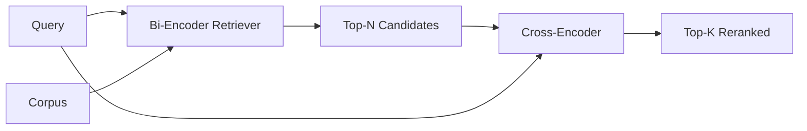

# ررنکر کراس انکودر

> یک دو کدگر به طور مستقل جستجو و سند را دربر می گیرد. یک کراس کدگر آنها را به هم متصل می کند و هر دو را به یکباره می خواند. کراس کدگر هوشمندترین خواننده و آهسته ترین است. به عنوان مرحله دوم در top-k دو کدگر استفاده می شود، خود را پرداخت می کند.

**Type:** Build
**Languages:** Python
**Prerequisites:** Phase 11 lesson 06 (RAG), Phase 11 lesson 07 (advanced RAG); Phase 19 Track B foundations (lessons 20-29); Phase 19 lesson 65 (hybrid retrieval feeding this stage)
**Time:** ~90 minutes

## اهداف یادگیری
- یک بازیافت کننده دو کد را از یک بازیافت کننده کراس کد را با شکل ورودی، تعداد پارامترها و هزینه هر سوال تشخیص دهید.
- یک کراس کودر کوچک را از ابتدا به عنوان یک بلوک ترانسفارمر اجرا کنید که یک دنباله بسته شده (پرسش، سند) را مصرف می کند و یک مقیاس مرتبطی واحد را منتشر می کند.
- یک خط دو مرحله ای را به دست آورید تا رتبه بندی مجدد را انجام دهید: top-N را با یک retriever ارزان، top-K را با کراس کودر به N رتبه بندی کنید، K را برگردانید.
- ترازخی تاخیر در مقابل کیفیت را در یک کورپوس کوچک تنظیم کنید و N مناسب را برای بودجه تاخیر مشخص انتخاب کنید.

## مشکل

یک دو کدگر، سوال و مدارک را به همان فضای متری و رتبه بندی با کوسین می کند. این دو کدگر هرگز یکدیگر را نمی بینند. مدل باید همه چیز مفید در مورد یک سند را به یک متری واحد فشرده کند، نابینا به سوال. این سریع است - یک ادغام در هر سند در زمان شاخص و یک در هر سوال در زمان سوال - و تنها راه برای رتبه بندی در مقیاس corpus است.

هزینه دقیق است. دو سند که یک موضوع کلی دارند می توانند تقریباً یکسانی داشته باشند حتی اگر یکی از آنها به سوال پاسخ دهد و دیگری پاسخ ندهد. دو کدگر نمی تواند آنها را از هم جدا کند.

یک کراس کودر این مسئله را با خواندن سوال و سند به طور مشترک حل می کند. مدل دریافت می کند `[query] [SEP] [document]`در یک ترتیب، توجه کامل را در سراسر پیوستن اجرا می کند و یک مقیاس مرتبطی را تولید می کند. هر نشانه ای از سند می تواند به هر نشانه ای از جستجو توجه کند. مدل با زمینه کامل نمره را تعیین می کند.

هزینه تولید است. جایی که دو کدگر یک بار دربرگیر می شود و برای همیشه سوال می کند، کدگر کراس یک بار در هر جفت (پرسش، سند) اجرا می شود. برای یک مجموعه اسناد 10 میلیون که 10 میلیون پاس پیشروی در هر سوال است. غیر قابل اجرا در بودجه درخواست.

راه حل مرحله ای است. برای دریافت بالا N از دو کدگر استفاده کنید. برای رتبه بندی مجدد N به بالا K استفاده کنید. N کوچک است (50 تا 200) و افزایش کیفیت کدگر متمرکز است در جایی که مهم است. کل تاخیر در بودجه درخواست باقی می ماند. کیفیت کل کیفیت کدگر است که توسط بازپرداخت دو کدگر در N محدود می شود.

## مفهوم



### شکل ورودی کراس کدگر

بسته بندی استاندارد اینه`[CLS] query_tokens [SEP] document_tokens [SEP]`. محصول موقعیت CLS به یک سر خطی واحد وارد می شود که مقیاس مربوطه را تولید می کند. برخی از پیاده سازی ها از میانگین جمع بندی به جای CLS استفاده می کنند؛ تفاوت کوچک است. نکته این است که مدل یک عدد در هر جفت تولید می کند.

یک کراس کدگر 22M (برنامه منتشر شده)`ms-marco-MiniLM-L-6-v2`کلاس وزن) نقطه تولید معمولی است. مدل های کوچکتر کیفیت را سریعتر از زمان صرفه جویی در می آورند. مدل های بزرگتر (به عنوان مثال)`bge-reranker-v2-m3`در پارامترهای 568M) برای رتبه بندی مجدد در خارج از دسترس یا برای رتبه بندی مجدد در صفحه اول در صورتی که K کوچک باشد، اختصاص داده شده است.

### چرا اين درس يه بچه كوچك رو آموزش ميده

یک کراس کدگر واقعی یک ترانسفورماتور کدگر است. در تولید شما یک نقطه بازرسی را بارگذاری می کنید و آن را اجرا می کنید. در این درس هدف نشان دادن شکل مدل و شکل منحنی کیفیت تاخیر است، نه آموزش یک رتبه بندی پیشرفته. بنابراین ما یک کوچک را ایجاد می کنیم `nn.Module`با یک بلوک ترانسفورماتور، توجه چند سر (4 سر به طور پیش فرض) و یک سر بازپسین. این از یک دانه آغاز می شود تا دیمو بدون وزن در دیسک قابل بازیافت باشد.

مدل اسباب بازی شکل درست را از کورپوس ثابت یاد می گیرد: زوج های مرتبط با اسناد جستجو نمره های پیش بینی شده بالاتر از زوج های غیرمستقیم را دارند. خط لوله پایان به پایان تولید دو کد را تنظیم می کند و بالاترین درجه K را با برچسب های طلا مرتبط می کند.

### تاخیر در مقابل کیفیت

این خط لوله دو مرحله ای دارای یک تنظیم کننده است: N. از 5 تا 100 در یک مجموعه سوالاتی که در طول می گذرد، N را پاک کنید و منحنی را دریافت می کنید.

| N | Recall@1 of stage 2 | Cross-encoder forward passes per query | Latency |
|---|--------------------|---------------------------------------|---------|
| 5 | 0.62 | 5 | low |
| 20 | 0.81 | 20 | medium |
| 50 | 0.86 | 50 | high |
| 100 | 0.86 | 100 | very high |

اعداد بالا نشان دهنده شکل هستند نه اندازه گیری از این دستگاه. شکل واقعی است. همیشه یک زانو در حدود 20 تا 50 کاندید وجود دارد که در آن ارتفاع رتبه مجدد اش پر می شود. پشت زانو شما هیچ پولی نمی دهید.

N را از منحنی ارزیابی به علاوه بودجه تاخیر انتخاب کنید. کراس کدگر نمی تواند به یاد آوردن بالاتر از یادآوری دو کدگر در N افزایش دهد، بنابراین N پایین کیفیت را محدود می کند، نه فقط تاخیر.

```figure
rerank-funnel
```

## آن را بسازید

`code/main.py`ابزار:

- `CrossEncoder`- يه کم`torch.nn.Module`: شامل کردن توکن، یک بلوک ترانسفورماتور با توجه چند سر و feedforward، میانگین ریخته شده سر تولید یک اسکالر.
- `tokenize_pair(query, document)`- دو رشته را به یک ردیف ID واحد با تایپ ID که مرز تعیین کننده و stdlib را نشان می دهد، بسته می کند.
- `train_tiny(pairs)`- یک گذر از آموزش تحت نظارت در یک لیست سهگانه دستکاری (پرسش، سند، ارتباط) ، بنابراین مدل نمرات منطقی در مورد دستگاه تولید می کند.
- `rerank(query, candidates, top_k)`- رابط توليدي
- `pipeline(query, retriever, top_n, top_k)`- جریان دو مرحله ای
- یه نمایش`main()`که corpus را از الگوی درس 65 بار می کند، بالا N را باز می گیرد، به بالا K را به دست می آورد، هر دو لیست را کنار هم چاپ می کند و تاخیر هر مرحله را گزارش می دهد.

اجرا کن

```bash
python3 code/main.py
```

در نتیجه، این دو مرحله در زیر زیر زیر زیر قرار دارند: N، K، و خلاصه زمانی. این دو مرحله در زیر زیر زیر قرار دارند. این دو مرحله در زیر زیر زیر قرار دارند.

## حالت شکست در دیمو پنهان خواهد شد

**Cross-encoder is not symmetric.** `rerank(q, d)`و`rerank(d, q)`هر وقت سوال رو اول بده اگه تصادفا عوض کني، بازنگري سقوط ميکنه

**N is too low to expose the bug.**اگر N = K را تنظیم کنید، کراس کدر نمی تواند تنظیم مجدد کند؛ فقط می تواند وزن مجدد کند. آسانسور صفر به نظر می رسد. N را حداقل سه بار K انتخاب کنید.

**Training data leaks into the eval.**اگر زوج های آموزش دست به دست شامل سوالات ارزیابی شوند، رتبه بندی مجدد جادویی به نظر می رسد.

**Production weights are dense.**یک کراس کدگر 22M در float32 88MB است.

**Batching matters.**یک کراس کودر واقعی N کاندیداها را در یک دسته اجرا می کند. این درس این را در`_batch_encode`، که تانسور های دسته بندی شده و تایپ ID را با `torch.tensor(...)`و یک پاس جلو را اجرا می کند. بازی را رد کنید و تاخیر با N ضرب می شود.

## ازش استفاده کن

الگوهای تولید:

- دو کدگر، کراس کدگر و N رو با هم ببندید.
- به ترتیب بازرسنده را با (سوال، سند_هاش) ذخیره کنید. همان سوال در برابر یک کورپوس ثابت به همان ترتیب بازرس می شود؛ ضربه های ذخیره سازی به شما یک کاهش تاخیر رایگان می دهد.
- امتیاز کراس کدر رتبه 1 را ثبت کنید. یک سوال که نمره 1 آن زیر یک حد محدودی corpus است، یک ضربه خارج از دامنه است؛ آن را به عنوان "من مطمئن نیستم" به LLM نشان دهید.

## -باده

درس 68 این خط لوله دو مرحله را از پایان به پایان ارزیابی می کند. درس 69 این رینک را پشت ریتر هیبریدی از درس 65 و در مقابل ژنراتور پاسخ قرار می دهد. رینک دوم مرحله از سیستم پایان به پایان است.

## تمرینات

1. N را از 5 تا 50 پاک کنید و از محصول رتبه بندی شده یاد بگیرید. زانو را در این دستگاه پیدا کنید.
2. کراس کوڈر را برای ده دوره به جای یک دوره تمرین کنید. امتیاز بین زوج های مثبت و منفی در هر دوره را اندازه گیری کنید.
3. جمع کردن متوسط را با سر سی ال اس جایگزین کنید.
4. یک سر کراس کوڈر دوم را اضافه کنید که یک برچسب دوگانه "این پاسخ در سند است" را پیش بینی می کند. از هر دو سر در نتیجه گیری استفاده کنید؛ یکی برای رتبه بندی، یکی برای حد.
5. دو کدگر ساختگی تعیین کننده را با دو کدگر درسی 65 جایگزین کنید و دو مرحله را زنجیره کنید. تغییر در top-K در مقابل دو کدگر را اندازه گیری کنید.

## اصطلاحات کلیدی

| Term | What people say | What it actually means |
|------|-----------------|------------------------|
| Bi-encoder | "Vector retriever" | Encodes query and doc independently; cosine ranks them |
| Cross-encoder | "Reranker" | Encodes (query, doc) jointly; outputs one relevance scalar |
| Two-stage pipeline | "Retrieve and rerank" | Cheap retriever returns N, expensive reranker keeps K |
| N (candidate budget) | "Rerank pool" | The number of candidates the cross-encoder scores per query |
| Mean-pooling head | "Mean of last hidden" | Average the encoder's last-layer outputs into one vector |

## خواندن بیشتر

- نوگویرا، چوا، "پاسج ری ریکنگ با BERT"، 2019 - کاغذ رتبه بندی کراس کوڈر کانونیکی
- ریمرز، گوروویچ، "Sentence-BERT: Embeddings of Sentence using Siamese BERT-Networks"، 2019 - در مورد دو کدگر در مقابل کراس کدگر
- [SentenceTransformers Cross-Encoders documentation](https://www.sbert.net/examples/applications/cross-encoder/README.html)
- [BGE Reranker v2 model card](https://huggingface.co/BAAI/bge-reranker-v2-m3)
- مرحله 19 درس 65 - هائبرید ریترور که این مرحله را به عنوان درجه بندی مجدد تغذیه می کند
- مرحله 19 درس 68 - ارزیابی که بررسي ارتفاعي که اين درجه بندي دوباره ارائه ميده
