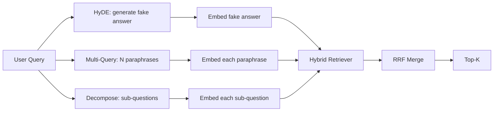

# بازنویسی سوال: HyDE، Multi-Query و تجزیه

> سوالی که کاربر می نویسد، سوالی نیست که بازیافت کننده شما می خواهد. بازیافت شکاف را قبل از بازیافت می پوشاند، بنابراین شاخص چیزی را نزدیک تر به آنچه پاسخ به نظر می رسد می بیند.

**Type:** Build
**Languages:** Python
**Prerequisites:** Phase 11 lessons 04 (embeddings), 06 (RAG); Phase 19 Track B foundations (lessons 20-29); Phase 19 lessons 64 and 65
**Time:** ~90 minutes

## اهداف یادگیری
- پیاده سازی متمایز سازی سند (HyDE): یک پاسخ جعلی را تولید کنید، آن را وارد کنید، در مقابل این ویکتور به جای ویکتور سوال بازیافت کنید.
- گسترش چند سوال را پیاده سازی کنید: یک سوال را به پارافرز های N دوباره بنویسید، با هر یک از آنها بازیافت کنید، اتحاد را با ترکیب رتبه متقابل ترکیب کنید.
- تجزیه سوال را پیاده سازی کنید: یک سوال پیچیده را به زیرسوال تقسیم کنید، هر زیرسوال را بازیافت کنید، ترکیب کنید.
- سه تا بازنویسی را با یک بازی مقایسه کنید و توضیح دهید که هر استراتژی چه زمانی برنده می شود.
- يه LLM ساختگي که در نتيجه هاي ثابت و ثابت پيدا ميکنه براي اينکه حلقه بازيکتابي از بين خط اجرا بشه

## مشکل

یک کاربر می نویسد " وقتی اپلود ها شکست می خورند و بودجه از دست می رود تیم ما چه می کند؟" این کارپوس حاوی یک سند است که می گوید "AbortMultipartOnFail یک بارگیری چند بخش S3 در پرواز را متوقف می کند و بودجه بارگیری هر سطل را کاهش می دهد وقتی بارگیری ناکام می شود". سوال و سند یک عبارت اسم مشترک ندارند. BM25 گمشده دو کدگر سند را در رتبه سوم یا چهارم قرار می دهد زیرا ویکتور جستجو در منطقه ای از فضای گنجانده شده قرار می گیرد که در مورد کارهای لغو شده، سند را ترجیح می دهد، نه در مورد اپلود های قطع شده. دو مرحله ای که در درس 66 به آن اشاره شده است می تواند پاسخ را نجات دهد اگر در بالا N قرار بگیرد، اما اگر حتی به بالا N نرسد، دوباره رتبه بندی کننده هرگز آن را نمی بیند.

راه حل اینه که قبل از اینکه به بازیافت کننده دست بزنه سوال رو دوباره بنویسی مقاله 2023 "حصول دقیق صفر شوت کثافت بدون برچسب های مرتبط" (Gao و همکاران) HyDE را معرفی کرد: از یک LLM بخواهید سندی را که به سوال پاسخ می دهد بنویسد، آن سند فرضیه را گنجانده و از گنجانده شدن آن به عنوان ویکتور بازیافت استفاده کند. سند فرضی در منطقه ی درست فضای گنجانده قرار دارد زیرا با صدای جسم نوشته شده است. وکتور سوال جواب نداده

دو روش پسر عموی با HyDE همکار میشن گسترش چند سوال (معرفی که Microsoft GraphRAG استفاده می کند) N پارافراسی از سوال را تولید می کند و با هر یک از آنها بازمی گیرد، سپس ادغام می شود. تجزیه (که به عنوان "شکستن زیر سوال" در کار DSPy استنفورد 2024 شناخته می شود) "چه کاری تیم ما می کند وقتی اپلود ها شکست می خورند و بودجه از بین می رود" را به دو سوال تقسیم می کند: "چه اتفاقی می افتد وقتی یک اپلود شکست می گیرد" و "چه اتفاقی می افتد وقتی بودجه دوباره از بین می رود". دو تا بازيابي، يک نتيجه ي ادغام، هر دو قسمت از پاسخ قابل رسيابي

این درس سه تا را اجرا می کند و آنها را در برابر یک جسم ثابت اجرا می کند.

## مفهوم



### HyDE به جزئیات

HyDE متری که توسط کاربر مورد استفاده قرار می گیرد را با متری که توسط LLM نوشته شده است جایگزین می کند.

```
You are a domain expert. Write a one-paragraph passage that answers the question
below. Use the same vocabulary and phrasing the documentation in this domain would
use. Do not refuse. Do not say you do not know.

Question: {user_query}

Passage:
```

پاسخ LLM به عنوان یک پاسخ واقعی اشتباه است زیرا LLM corpus شما را نمی داند. خوبه بازیافتگر به درست بودن حقایق اهمیت نمی دهد، فقط به توزیع رمزنگاری شده. این بخش فرضی شامل کلمات "استعمال سقط جنین"، "گروه بخش"، "باقی"، "بودج"، زیرا این چیزی است که یک بخش مستند در این موضوع می گوید. اون گذرگاه رو هم ببند متری در نزدیکی گذرگاه واقعی فرود می آید.

در تولید، شما سند فرضیه را به دو یا سه جمله محدود می کنید. فرضیه های طولانی تر صدا بیشتری جمع می کنند. کوتاه تر سیگنال های لغوی HyDE را از دست می دهند.

### گسترش چند درخواست به طور دقیق

N پارافرز از سوال کاربر را تولید کنید. ساده ترین پرامپرت:

```
Rewrite the following question in {N} different ways. Each rewrite must preserve
the original intent. Number them 1 to {N}. Do not add explanations.
```

برای هر پارافرز، top-k را بازپس بگیرید. لیست های رتبه بندی شده N را با RRF (الگواریسم مشابه از درس 65) ترکیب کنید. ارزان، موازی، تعیین کننده.

چند سوال برنده می شود وقتی که عبارت کاربر یکی از بسیاری از راه های معتبر برای پرسیدن سوال است و هر یک از بازنویسی ها بهتر از آن می پرسند. وقتی تمام بازنویسی ها به همان اندازه بد هستند زیرا اصلی به همان شیوه بد بود، از دست می دهد.

### تجزیه دقیق

یک بازیافت واحد نمی تواند یک سوال چندجانبه را برآورده کند. تجزیه از LLM می خواهد که سوال را به زیرسوالها تقسیم کند و سیستم هر زیرسوال را بازیافت می کند.

```
The following question may require information from multiple distinct topics.
Decompose it into a list of sub-questions. Each sub-question must be answerable
independently. If the question is already atomic, return it unchanged.

Question: {user_query}
```

بازیافت در هر زیر سوال. ادغام. تجزیه ابزار مناسب برای سوالات است که حاوی ترکیب، مقایسه چند بند، یا دو موضوع مرتبط نیست. ابزار اشتباه برای سوالات اتمی؛ کار تجزیه کننده در آنجا بازگشت یک سوال و ایجاد زیر سوال های جعلی است.

### چرا سه تا وجود دارند

این سه مورد مکمل هستند. HyDE شکاف توکن سوال-کارپوس را فرا می گیرد. چند سوال تفاوت پارافرز را پوشش می دهد. تجزیه سوالات چند موضوع را پوشش می دهد. یک سیستم تولید سه مورد را اجرا می کند و استراتژی را برای هر سوال انتخاب می کند (سیستم انتهای 69 نشان دهنده انتخاب کننده است).

## مدرک تحصیلی جعلی

درس غیر فعال می شود. LLM ساختگی یک جدول جستجوی کوچک است که بر روی سوال کاربر کلیدگذاری شده است، به علاوه یک بازپرداخت برای سوالات که مشاهده نکرده است. جدول جستجوی شامل:

- برای هر سوال ثابت: یک متن فرضیه نوشته شده، سه پارافرز و یک تجزیه.
- برای یک سوال ناشناخته: یک تحول تعیین کننده: کلمات محتوای سوال را بگیرید، آنها را از طریق یک نقشه مترادف گسترش دهید و نتیجه را برگردانید.

شکل ساختمون مهمه نه داده ها در تولید ساختمون رو با مدل واقعی عوض می کنی

```figure
cd-hyde-vector
```

## آن را بسازید

`code/main.py`ابزار:

- `MockLLM`- تعویض تعیین کننده ای که در بالا توضیح داده شده است.
- `HyDERewriter`- به LLM می گوید که سند فرضیه را بنویسد، بازپرداخت نسخه بازنویسی را به عنوان `RewriteResult`با متن فرضی و سوال که بازیافت کننده باید استفاده کند.
- `MultiQueryRewriter`- به استاد LLM برای N پارافرز می گوید، لیست سوالات را می دهد.
- `DecomposeRewriter`- به ماجراجويي ميگه که ازش ميخوره، سوال هاي فرعي رو ميگيره
- `retrieve_with_rewriter`- يه بازنویسنده و بازنویسنده رو ميگيره، بازنویسها رو ميگيره، نتيجه ها رو ميگيره
- یک نمایشگاه که سه نسخه ی بازنویسی را روی یک ابزار اجرا می کند و می چاپد که کدام استراتژی ابتدا سند جواب طلا را باز می گرداند.

شکل بازیافتگر از درس 65 (بی ام 25 + کثافت ترکیبی) استفاده می شود. فیژن همان RRF است. تنها شکل جدید رابط بازیافتگر است که کوچک است.

اجرا کن

```bash
python3 code/main.py
```

محصول یک رتبه بندی در هر استراتژی و خلاصه نهایی است. HyDE در سوال عبارت های نامتناسب برنده می شود. چند سوال در سوال فرز-فرز برنده می شود. تجزیه در سوال های چند موضوع برنده می شود. بازپسین (هیچ بازنویسنده) حداقل در یکی از سه سوال از دست می دهد.

## حالت شکست در دیمو پنهان خواهد شد

**HyDE hallucinates corpus-specific identifiers wrong.**مدل یک نام عملکرد را اختراع می کند. نمره BM25 فرضیه در دست اول دستاویز سقوط می کند زیرا نام اختراع شده اکنون یک نمره با وزن بالا است که در شاخص ظاهر نمی شود. طول فرضیه و وزن BM25 را در فیژن پایین تر قرار دهید.

**Multi-query rewrites all converge.**یک مدل ضعیف سه پارافرز تقریبا یکسان را تولید می کند. بازیافت N همان top-k را باز می گرداند. ادغام RRF بهتر از یک بازیافت نیست. یک دستورالعمل تنوع صریح را به پرامپت بازنویسی اضافه کنید و دوگونی ها را توسط جکارد تشخیص دهید.

**Decomposition over-splits.**تجزیه کننده یک سوال اتمی را به یک لیست تبدیل می کند. همه بازیافت ها همان سند را به دست می آورند اما با رتبه کاهش یافته است. ادغام بدتر از اصلی است. این را با یک "آیا این زیر سوالات به اندازه کافی متمایز هستند" قبل از فان-آو کشف کنید.

**Latency multiplies.**HyDE هزینه یک تماس LLM است. چند سوال هزینه یک تماس LLM برای تولید N نوسخه های مجدد، سپس N بازیافت. تجزیه هزینه یک تماس LLM برای تجزیه، سپس M بازیافت. بازیافت به طور موازی اجرا می شود؛ تماس LLM است طبقه.

## ازش استفاده کن

الگوهای تولید:

- انتخاب استراتژی در هر سوال با طول سوال: سوالات کوتاه اتم به سوالات چندگانه، سوالات پیچیده به سوالات چندگانه، تجزیه و تحلیل، سوالات سنگین جرگون به سوالات HyDE می رسند.
- بازنویسی محصول را با هش سوال ذخیره کنید. بسیاری از سوالات تکرار می شوند.
- هر سه را به طور موازی اجرا کنید و سه مجموعه نتیجه را با RRF به یک ترکیب کنید. هزینه سه تماس LLM و یک ترکیب است؛ کیفیت اتحاد سه استراتژی پوشش است.

## -باده

درس 69 این مرحله را قبل از بازیافت کننده از درس 65 و بازیافت کننده از درس 66 به کار می گیرد. درس 68 برآورد افزایش را که بازیافت کننده به بازیافت کردن اضافه می کند.

## تمرینات

1. پیاده سازی RAG-Fusion (فروشن 2024 از چند سوال) که در آن پارافرز های بازنویسی به طور عمدی متنوع هستند، سپس مرحله رتبه بندی مجدد (درس 66) لیست نهایی را انتخاب می کند.
2. یک استراتژی چهارم را اضافه کنید: درخواست بازگشت (به LLM از سوال عمومی تر بپرسید، در مورد آن بازگو کنید، سپس تنگ کنید).
3. به شکافگر آموزش دهید تا سوالات اتمی را با اضافه کردن سر "آیا سوال اتمی است" تشخیص دهد. میزان بیش از حد تقسیم قبل و بعد را اندازه گیری کنید.
4. اون مدرک جعلی رو با یک تماس مدل واقعی جایگزین کن.
5. به هر بار بازنویسی نمره اعتماد اضافه کنید، بازنویسی ها را زیر حد قرار دهید، تاثیر را بر بازپسین اندازه گیری کنید.

## اصطلاحات کلیدی

| Term | What people say | What it actually means |
|------|-----------------|------------------------|
| HyDE | "Fake-document retrieval" | LLM writes the answer; embed and retrieve on that instead of the query |
| Multi-query | "Paraphrase expansion" | N rewrites of the query; retrieve N times, merge by RRF |
| Decomposition | "Subquery split" | Multi-topic queries split into sub-questions, retrieved separately |
| Atomic query | "Single-topic" | Cannot be decomposed without inventing fake sub-questions |
| Step-back | "Abstract the query" | Ask the more general question, retrieve, then narrow |

## خواندن بیشتر

- گاو، ما، لین، کالان، "بازیافت دقیق صفر شات ضخیم بدون برچسب های مرتبط" (HyDE) ، 2023
- مایکروسافت ریسرچ، "موسع سازی چند سوال برای بازیافت"
- استنفورد DSPy، "شکستن زیر سوال برای QA چند هیپ"
- [LlamaIndex query transformations documentation](https://docs.llamaindex.ai/en/stable/optimizing/advanced_retrieval/query_transformations/)
- مرحله 11 درس 07 - الگوهای پیشرفته RAG
- مرحله 19 درس 65 - بازپرداخت کننده که این بازنویسی کننده تغذیه می کند
- مرحله 19 درس 68 - ارزیابی که ارتفاع نوسخه را اندازه گیری می کند
