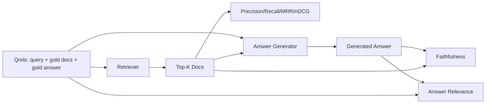

# ارزیابی RAG: دقت، یادآوری، MRR، nDCG، وفاداری، ارتباط پاسخ

> اگر نتوانید در همان زمان، پاسخ و بازخواهی خود را رتبه بندی کنید، نمی توانید سیستم را ارسال کنید. دو متریک یکسان نیستند و یک پیامک در محور های مختلف شکست می یابد.

**Type:** Build
**Languages:** Python
**Prerequisites:** Phase 11 lessons 06 (RAG), 10 (evaluation); Phase 19 Track B foundations (lessons 20-29); Phase 19 lessons 64, 65, 66, 67
**Time:** ~90 minutes

## اهداف یادگیری
- چهار متریک بازیافت از قریز طلا را محاسبه کنید: precision@k، recall@k، MRR (درجات متقابل متوسط) و nDCG@k.
- دو معیار درجه پاسخ را محاسبه کنید: وفاداری (هر ادعای مبتنی بر زمینه بازیافت شده) و ارتباط پاسخ (جواب به سوال پاسخ می دهد).
- یک فایل Qrels ثابت (سوال، اسناد طلا، متن پاسخ طلا) را بسازید که ارزیابی از پایان به آخر می خواند.
- ارزش های متریک را برای تشخیص جایی که یک خط لوله شکست خورده است بخوانید: بازیافت، رتبه بندی، تولید یا زمین گیری.

## مشکل

یک سیستم RAG حداقل چهار قسمت متحرک دارد: چانکر، ریترور، ریرنکر، ژنراتور. هر کدام از آنها می توانند علت پاسخ اشتباه باشند. بدون اندازه گیری هر مرحله ای شما کور پرواز می کنید.

آیا این به این دلیل است که یک کاربر پاسخ نادرست را گزارش می دهد. آیا این به این دلیل است که بخش جواب را کاهش می دهد؟ آیا این به این دلیل است که بازیافت کننده بخش را در top-k شامل نکرده است؟ آیا این به این دلیل است که بخش راست را از موقعیت یک جلوتر فشار داده است؟ آیا این به این دلیل است که ژنراتور بخش را نادیده گرفته و چیزی را اختراع کرده است؟ شما نمی توانید از تنها پاسخ بگویید. شما نیاز دارید:

- اندازه گیری بازیافت برای رتبه بندی آنچه از بازیافت کننده خارج شد.
- رتبه بندی متریک به درجه بندی جایی که بخش درست در ترتیب قرار گرفت.
- وفاداری برای ارزیابی اینکه آیا ژنراتور در چارچوب بازیافت شده باقی مانده است.
- پاسخ مربوطه به درجه بندی این است که آیا پاسخ به سوال پاسخ می دهد.

این درس تمام شش مورد را بر روی یک فایل Qrels ثابت می سازد. ارزیابی غیر فعال و تعیین کننده است؛ در تولید شما LLM جعلی به عنوان قاضی را به یک واقعی تبدیل می کنید.

## مفهوم



### Precision@k

از اسناد top-k که بازیافت کننده برگشت، چه کسری در مجموعه طلا هستند؟ اگر طلا سه سند دارد و top-3 دو سند را بازگردانده و یک اشتباه را، دقت@3 2 / 3 است. زمانی که هزینه یک قطعه بازیافت شده بی ربط بالا است دقت را استفاده کنید (جناتر توکن ها را روی آن می ریزد، یا قطعه به پاسخ زهر می دهد).

### یادآوری

از اسناد طلا چه فرقی در بالا-ک قرار دارند؟ اگر طلا سه سند دارد و 5 در بالا شامل سه سند است، recall@5 1.0 است. زمانی که هزینه پاسخ گم شده بالا باشد، از یادآوری استفاده کنید (شما ترجیح می دهید یک قسمت اضافی اشتباه را ببینید تا اینکه بخش پاسخ را کاملاً از دست بدهید).

در تولید RAG، متریک که مردم معمولاً می گویند، یادآوری است. نسل می تواند به راحتی قطعات بی ربط را رها کند؛ نمی تواند از قطعه ای که هرگز ندیده است، پاسخ ای اختراع کند.

### MRR (متوسط رتبه متقابل)

برای هر جستجو، موقعیت اولین سند مرتبط را در لیست رتبه بندی کنید. رتبه متقابل 1 / موقعیت است. میانگین در سراسر مجموعه جستجو. MRR خلاصه ای از یک عدد است که چگونه بازیافت کننده بهترین پاسخ را در بالا قرار می دهد.

MRR وزن موقعیت 1 را به شدت دارد. یک سوال که سند طلا در رتبه 1 است، به 1.0 کمک می کند. رتبه 2 به 0.5 کمک می کند. رتبه 10 به 0.1 کمک می کند. متریک توسط بالای لیست تسلط دارد.

### nDCG@k

دستاورد کمولی تخفیف شده عادی شده. فرمول کامل به هر سند بازیافت شده (معمولا 1 برای مرتبط، 0 برای غیر) ، تخفیف با ثبت موقعیت، مبلغ و تقسیم با DCG ایده آل (DCG شما اگر شما به طور کامل رتبه بندی می کنید) اختصاص می دهد. محدوده 0 تا 1.

nDCG دارای ارتباط درجه بندی شده است: طلا می تواند بگوید "doc A 3 است، doc B 2 است، doc C 1 است". MRR و recall@k همه چیز را به دوگانه صاف می کنند. از nDCG استفاده کنید زمانی که در corpus چندین سند جزئی مرتبط با هر سوال وجود دارد.

### وفاداری

برای هر ادعای در پاسخ تولید شده، بررسی کنید که آیا ادعای توسط زمینه باز یافت شده پشتیبانی می شود. پیاده سازی استاندارد از یک درخواست LLM به عنوان قاضی استفاده می کند که (دعای، زمینه) را می گیرد و بله یا نه را باز می گرداند. متریک بخشۀ ادعاهای عبور است.

وفاداری حالت شکست ژنراتور را می گیرد که در آن مدل محتوا را اختراع می کند. حتی اگر بازیافت کننده قطعات درست را برگرداند، ژنراتور که توهم می دهد شکسته می شود. وفاداری همچنین به عنوان زمینگیری، پشتیبانی، نسبت نامیده می شود.

این درس وفاداری را با یک قاضی جعلی تعیین کننده اجرا می کند که بررسی می کند آیا سیگنال های هر ادعا با یک حد بر محیط باز یافت شده تعادل می کنند. در تولید شما به یک تماس مدل واقعی تغییر می دهید. شکل متریک یکسان است.

### جواب دادن به موضوع

آیا پاسخ واقعاً به این سوال پاسخ می دهد؟ وفاداری می پرسد "آیا پاسخ در زمینه است؟" ارتباط پاسخ می پرسد "آیا پاسخ در سوال است؟" پاسخ وفادار اما غیر موضوعی امتیاز بالا در وفاداری و پایین در ارتباط. پاسخ کوتاه و در مورد موضوع که از زمینه نادیده می گیرد امتیاز بالا در ارتباط و پایین در وفاداری.

اجرای استاندارد همچنین از LLM به عنوان قاضی استفاده می کند: دریافت (سوالی، پاسخ) و بپرسید که آیا پاسخ به سوال پاسخ می دهد. این درس یک تعویض رمز و اکر به همراه قاضی را اجرا می کند.

## دستگاه

```python
{
  "qid": "q1",
  "query": "what is the abort threshold for multipart uploads",
  "gold_doc_ids": ["d1", "d3"],
  "gold_answer_substring": "three failed parts",
  "graded_relevance": {"d1": 3, "d3": 2},
}
```

هر سوال شامل:
- رشته سوال
- مجموعه ای از اسناد مستند طلا (برای دقت / بازپسین / MRR)
- یک حکم مربوطه درجه بندی شده (برای nDCG)
- زیر رشته پاسخ طلا (به عنوان متاداتا مرجع در هر qrel نگهداری می شود؛ وفاداری در این درس با قضاوت ادعاهای استخراج شده با زمینه باز یافت شده، نه با این زیر رشته محاسبه می شود).

در توليد اينها رو برچسب ميکني. اين درس يه دستگاه دست ساختي رو ميفرستد تا ارزیابی از جعبه خارج بشه.

```figure
ci-rag-metric-ladder
```

## آن را بسازید

`code/main.py`ابزار:

- `precision_at_k(retrieved, gold, k)`- تعريف حرفي
- `recall_at_k(retrieved, gold, k)`- تعريف حرفي
- `mean_reciprocal_rank(retrieved_list_of_lists, gold_list)`-مطالبات رو از دست بده
- `ndcg_at_k(retrieved, graded_relevance, k)`- DCG / IDCG با سود دوگانه یا درجه بندی شده
- `extract_claims(answer)`- جواب رو به ادعاي شکل جمله تقسيم ميکنه
- `faithfulness(claims, context_texts, judge)`- بخش کوچکی از مطالبات که تایید شده اند.
- `answer_relevance(question, answer, judge)`- قضاوت کنید که آیا پاسخ به سوال پاسخ می دهد یا خیر.
- `MockJudge`-حاکم تعريفگرفتي توکن ها پس ارزیابی از اینترنت خارج ميشه
- `evaluate_pipeline(pipeline_fn, qrels, ks)`-آرکستراتور که هر متريک رو اجرا ميکنه
- یک نمایش که سه نوع لوله (لاین پایه کنکر، بازیافت ترکیبی، ترکیبی + رتبه مجدد) را در برابر qrels اجرا می کند و یک جدول متریک را چاپ می کند.

اجرا کن

```bash
python3 code/main.py
```

محصول نشان می دهد دقت@k، یادآوری@k، MRR، nDCG@k، وفاداری و ارتباط پاسخ برای هر نوع در یک جدول متریک واحد. ردیف بازیافت ترکیبی از خط پایه chunker در یادآوری می شود. ردیف بازرسانی از هیبرید در MRR می شود.

## خواندن متریک برای تشخیص شکست ها

| Symptom | Likely cause | What to fix |
|---------|-------------|-------------|
| Low recall@k, low precision@k | Chunker cut the answer or retriever cannot find it | Chunker boundaries (lesson 64) or retriever modality (lesson 65) |
| Decent recall@k, low MRR | Right chunk is in top-k but not at position 1 | Reranker (lesson 66) |
| High MRR, low faithfulness | Generator invents content despite right context | Generation prompt; force-cite-or-refuse |
| High faithfulness, low relevance | Answer is grounded but off-topic | Query rewriter (lesson 67) or generation prompt |
| All four high, users still complain | Eval set is unrepresentative | Expand qrels with real user queries |

## حالت شکست در دیمو پنهان خواهد شد

**LLM-as-judge bias.**یک مدل محصول خود را از آنها وفادار تر می داند. از یک خانواده مدل متفاوت برای قاضی استفاده کنید یا نمونه را به دست رتبه بندی کنید.

**Qrels rot.**در ماه ژانویه 2024 ، یک سند که طلا برای Q1 بود ، دیگر پاسخ صحیح در اکتبر 2024 نیست زیرا تیم نامگذاری عملکرد را تغییر داد. یک بررسی سه ماهه ای qrels را برنامه ریزی کنید.

**Faithfulness micro-checks miss macro-claims.**وفاداری در هر جمله می تواند در حالی که ساختار کلی پاسخ گمراه کننده باشد، به بالای متریک خودکار بررسی کوالیتی سطح نمونه اضافه کنید.

**Recall@k masks per-query failures.**یک بازنگری متوسط 90٪ می تواند پنهان کند که یک کلاس سوال همیشه از دست می دهد. qrels را به طبقۀ سوال (حرفی، پارافرز، چند موضوع) برش دهید و به صورت قطعه گزارش دهید.

## ازش استفاده کن

الگوهای تولید:

- بر روی هر تغییر در بازیافت کننده یا ژنراتور، ارزیابی را اجرا کنید. بازگشت یادآوری@k را به عنوان شکست آزمون در نظر بگیرید.
- ردیابی متریکی را در هر جستجو حفظ کنید. وقتی یک کاربر شکایت می کند، به دنبال ورودی qrels که مطابقت دارد و ببینید که آیا آن را گرفته شده است.
- طبقه بندی قریل ها: مجموعه ای از دود 20 سوال که در CI اجرا می شود؛ مجموعه ای از رجسی 200 که هر شب اجرا می شود؛ مجموعه ای عمیق 2000 که هر هفته اجرا می شود.

## -باده

درس 69 تمام خط لوله (چانکر، ریترور، ریرنکر، ژنراتور) را سیم کشی می کند و این ارزیابی را با سیستم آخر به آخر اجرا می کند.

## تمرینات

1. یک متریک پنجم بازیافت را اضافه کنید: hit-rate@k. آن را با recall@k مقایسه کنید. توضیح دهید که چه زمانی متفاوت هستند.
2. یک اعتبار درجه بندی شده را اجرا کنید: 0 (غیر پشتیبانی شده) ، 1 (جزئيا پشتیبانی شده) ، 2 (به طور کامل پشتیبانی شده) ، متریک را به طور مناسب به روز کنید.
3. جوري جوري جوري را با يک تماس مدل واقعي عوض کن. اختلافات بين جوري و جوري واقعي در مورد دستگاه را اندازه بگيري.
4. یک قطعه کلاس سوال ("حرفی"، "پارافرز"، "برخی موضوع") اضافه کنید.
5. یک متریک "مدد پاسخ" اضافه کنید و آن را با وفاداری مرتبط کنید. منحنی را نقشه بزنید.

## اصطلاحات کلیدی

| Term | What people say | What it actually means |
|------|-----------------|------------------------|
| Precision@k | "Hit rate over retrieved" | Fraction of top-k that are gold |
| Recall@k | "Hit rate over gold" | Fraction of gold in top-k |
| MRR | "First-hit position" | Mean of 1 / rank of first relevant document |
| nDCG@k | "Graded ranking quality" | DCG over the top-k divided by ideal DCG |
| Faithfulness | "Groundedness" | Fraction of answer claims supported by retrieved context |
| Answer relevance | "Did it address the question?" | Whether the answer matches the question's intent |
| Qrels | "Gold labels" | The labeled set of queries and their gold documents and answers |

## خواندن بیشتر

- باکلی، ورهيز، "مقرر بودن اقدامات ارزیابی" SIGIR 2000 - مقاله کاینونیک در مورد معیارهای رتبه بندی
- Jarvelin, Kekalainen, "مقدره گذاری مبتنی بر سود جمع آوری شده از تکنیک های IR" - مقاله nDCG
- [Ragas: Automated Evaluation of RAG Pipelines](https://docs.ragas.io)
- [Anthropic, Introducing Contextual Retrieval](https://www.anthropic.com/engineering/contextual-retrieval)- امتیاز بازیافت با 1 - یادآوری@20
- مرحله 11 درس 10 - پایه های چارچوب ارزیابی
- مرحله 19 درس 64 تا 67 - اجزای مورد ارزیابی در اینجا
- مرحله 19 درس 69 - خط خط پای این ارزیابی نمرات
