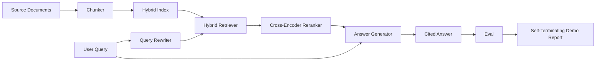

# سیستم RAG از پایان به پایان

> شش درس از اجزای، یک خط لوله، یک حلقه ارزیابی، یک دیمو خود پایان دهنده، این سیستم است که شما ارسال می کنید.

**Type:** Build
**Languages:** Python
**Prerequisites:** Phase 11 lessons 06 (RAG), 10 (evaluation); Phase 19 Track B foundations (lessons 20-29); Phase 19 lessons 64, 65, 66, 67, 68
**Time:** ~90 minutes

## اهداف یادگیری
- کُنکر، هائبرید ریترور، بازنویسی سوال، کراس کودر ریرنکر و ژنراتور پاسخ را به یک لوله پایانی واحد تبدیل کنید.
- یک ژنراتور پاسخ را اجرا کنید که ادعاهای خود را با لنگر قطعه ای به دست آورد، با رد در کم اعتماد به نفس.
- با مطالعه درس 68 با پایپلاين جمع شده برکنید و ثابت کنید که ساخت مرحله ای بر روی هر متریک بر روی همان قطعات به طور جداگانه برنده می شود.
- ساخت یک نمایش CLI خود پایان دهنده که یک corpus ثابت را جذب می کند، مجموعه ی سوال ثابت را اجرا می کند و با یک گزارش خلاصه از صفر خارج می شود.

## مشکل

شش عنصر در جداسازی هیچ چیز را ثابت نمی کنند. کشانکر می تواند در recall@5 در برابر corpus برنده شود و در recall@5 سیستم از دست بدهد زیرا بازیافت کننده نمی تواند آنچه را که کشانکر منتشر می کند را رتبه بندی کند. ررنکر می تواند MRR را در یک مجموعه کاندیداهای مصنوعی بالا ببرد و در کاندیداهای دو کدگر واقعی شکست بخورد زیرا بازپسین دو کدگر در بودجه رتبه مجدد بسیار کم است. بازنویسی سوال می تواند مستند طلا را در یک سوال تبلیغ کند و در سوال بعدی شکسته شود زیرا جعلی LLM یک فرضیه انحطاطی را باز می گرداند.

آزمون ادغام، تمام خط لوله را در برابر همان قطعات ثابت، با همان متریک، با یک فایل آرکیستراتور که همه چیز را به هم متصل می کند، انجام می دهد. این چیزی است که این درس ایجاد می کند. اگر متریک در خط لوله ادغام شده از متریک در هر مرحله ای از نمایش جداگانه، ثابت کرده اید که سیستم را ثابت کرده اید.

## مفهوم



### انتخاب های سیم کشی

خط لوله یک نمودار کوچک است. هر مرحله یک تابع با امضا واضح است.

| Stage | Input | Output |
|-------|-------|--------|
| Chunker | Document text | List of Chunk records |
| Retriever | Query string | Top-N Chunk records |
| Rewriter (optional) | Query string | List of rewrites + hypothetical |
| Reranker | Query, candidates | Top-K Chunk records with cross scores |
| Generator | Query, top-K Chunk records | Answer string with citations |

ترکیب ساده ست وقتي هر امضا مستحکم باشه`Pipeline`کلاس پنج مرحله و یک مرحله است`query`هر مرحله قابل تعویض است: یک کنکر، بازیافتگر، بازنویسی، ررنکر یا ژنراتور متفاوت را عبور کنید و لوله هنوز هم اجرا می شود.

### ژنراتور پاسخ با نقل قول

ژنراتور آخرین مرحله و آسان ترین مرحله برای شکستن است. درس یک ژنراتور ساختگی تعیین کننده را ارسال می کند که:

1. اون قسمت هاي بالا رو مياره
2. تا دو قطعه را انتخاب می کند که متن آن دارای بالاترین توکن محتوا با سوال بر هم قرار دارد.
3. پاسخ را می دهد که یک ترکیب یک جمله از هر قطعه انتخاب شده است، با هر جمله دنبال شده توسط یک`[doc_id:chunk_index]`لنگر
4. اگر هیچ قطعه ای از آن ها بیش از حد زباله ها همپوشیده نباشد، بدون اشاره ای "من نمی دانم" را منتشر می کند.

در تولید شما جعلی را با یک تماس واقعی LLM با قالب فوری عوض می کنید:

```
You are answering a question using only the snippets below.
Cite every claim with the anchor in parentheses.
If the snippets do not answer the question, say "I do not know".

Question: {query}

Snippets:
{enumerated chunks with anchors}

Answer:
```

مسیر رد در کم اعتماد به نفس دلیل ثبت امتیاز درجه 1 کراس کدر است. اگر زیر حد corpus قرار گیرد، ژنراتور رد می کند. این شیر ایمنی در برابر پاسخ های توهم است.

### نماد خودکشي

در این نمایش همه چیز را از پایان به پایان اجرا می کند. این یک تجزیه مرحله ای از یک سوال را چاپ می کند، ارزیابی را در چهار Qrels ثابت اجرا می کند، یک جدول متریک را چاپ می کند و با وضعیت صفر خارج می شود اگر تمام متریک درس 68 با حاشیه های تعیین شده در نمایش مطابقت داشته باشد. اگر هر متریک زیر حاشیه باشد، نمایش با وضعیت غیر صفر و یک پیام نامگذاری میترک شکست خورده خارج می شود.

این شکل تست سی آی دود است. لوله به سرعت، قطعیت آمیز، غیر فعال می شود. آستانه ها عمداً در دستگاه محدود هستند بنابراین بازگشت در هر یک از شش درس به نمایشگاه شکست می خورد.

```figure
rag-pipeline-flow
```

## آن را بسازید

`code/main.py`ابزار:

- `Chunk`- ثبت در تمام مراحل انجام شده (شکل درس 64 را با یک chunk_index و منبع doc_id گسترش می دهد).
- `Chunker`- استراتژی را از درس 64 (تفرقه تکراری پیش فرض) انتخاب می کند.
- `HybridIndex`- بسته هاي BM25 + کثافت + RRF از درس 65
- `Rewriter`(اختيار) - یکی از HyDE، چند سوال، تجزیه از درس 67 با طول سوال و حضور ترکیب.
- `Reranker`- کراس کودر آموزش دیده از درس 66 با یک مجموعه آموزش ثابت کوچکتر به طوری که در ثانیه ها به هم می رسد.
- `Generator`- ژنراتور ساختگی تعیین کننده با نقل قول و رد در کم اعتماد.
- `Pipeline`- پنج مرحله را با یک`query(question)`روش که باز می گردد`Result(answer, top_k, latency_ms_per_stage)`. .
- `run_demo()`- به صورت کامل به کار می رود، سه سوال از دستگاه را اجرا می کند، ارزیابی را اجرا می کند، نتایج را چاپ می کند، کد خروج را با حد قرار می دهد.

اجرا کن

```bash
python3 code/main.py
```

محصول یک ردیابی سوال چاپ شده، جدول ارزیابی کامل و وضعیت نهایی عبور / شکست است. کد خروج 0 را در تنظیمات باز می کند.

## حالت شکست در دیمو پنهان خواهد شد

**Chunker boundary drift.**اگر استراتژی چانکر را بین گزینش برچسب گذاری eval qrels و دمو تغییر دهید، شناسه های مستند طلا دیگر صف بندی نمی شوند. استراتژی چانکر را در فایل qrels قفل کنید. دمو شامل یک سرونی است که نام چانکر را می دهد.

**Reranker training set leaks into the eval.**در کلاس 66، 14 تست آموزش شامل سؤالات مشابه به سؤالات ارزیابی می شود. در تولید، سؤالات ارزیابی را به طور دقیق انجام دهید. سؤالات ارزیابی در نمایش عمداً از مجموعه آموزش رتبه مجدد جدا می شوند.

**Mock generator hides hallucination risk.**این جعلی نمی تواند حسی کند زیرا فقط متن را از قطعات بازیافت شده منتشر می کند. درس این را یادداشت می کند و مسیر تبادل تولید را به یک مدل واقعی نشان می دهد.

**No streaming.**خط لوله در پایان هر مرحله پاسخ کامل را باز می گرداند. یک سیستم تولید تولید تولیدات ژنراتور را جریان می دهد. جریان خارج از محدوده است؛ معیار درجه پاسخ در هر دو جهت کار می کند.

**Latency is offline.**تماس های جعلی LLM زمان ثابت هستند. تماس های LLM واقعی تسلط دارند. بودجه تاخیر در دامنه درخواست را برنامه ریزی کنید؛ زمان بندی هر مرحله درس فقط کار CPU را اندازه گیری می کند.

## ازش استفاده کن

الگوهای تولید:

- فایل لوله رو تحت يک آرکستر با رابط هاي مرحله اي صريح ارسال کنيد. از پخش سيم ها در سراسر repo اجتناب کنيد.
- قبل از هر ادغام که به مرحله ای دست پیدا کند، ارزیابی را اجرا کنید. اگر ارزیابی کاهش یابد، ادغام فرود نمی آید.
- ردیابی متریکی را در هر IC اجرا کنید تا بتوانید بازپسین ها را به یک مرحله تبادل نسبت دهید.
- مجموعه ای از دود از 20 سوال (تکلیف مجموعه بازپسین) را اضافه کنید که در کمتر از 30 ثانیه اجرا می شود؛ مجموعه بازپسین کامل شبانه اجرا می شود.

## -باده

فایل لوله در این درس شکل باقی درس های مرحله 19 در مسیر F است. در درس های بعدی شامل اتوماسیون مصرف، بازنویسی افزوده، تلهومتری و یک لایه خدمت در بالای آن می شود. نیمه های بازیافت، رتبه بندی مجدد، نوشتن مجدد و ارزیابی در اینجا کامل هستند.

## تمرینات

1. یک انتخاب کننده استراتژی در هر سوال را در داخل بازنویسی اضافه کنید: هوریستیک از درس 67 (مدد، ترکیب، نسبت جارگون) انتخاب HyDE، چند سوال یا تجزیه.
2. يه تماس واقعي براي ژنراتور پشت يه پرچم اين وي اضافه کنين به جعلي
3. و عرض نمايش رو براي گرفتن`--corpus path`يه پرچم که يه جسم واقعي رو بار ميکنه دوباره بررسي و بررسي كن
4. اضافه کنید`--strategy`نشان دادن به شکاف. اندازه گیری سهم هر استراتژی برای بازگشت از پایان به پایان.
5. یک رابط ژنراتور جریان اضافه کنید و آن را به eval وارد کنید. تایید کنید که وفاداری بر روی رشته نهایی محاسبه می شود و نه بر روی پیشگویی جریان.

## اصطلاحات کلیدی

| Term | What people say | What it actually means |
|------|-----------------|------------------------|
| Pipeline | "RAG pipeline" | The composed stages from ingestion to cited answer |
| Citation anchor | "Source link" | The (doc_id, chunk_index) reference attached to each claim |
| Refuse-on-low-confidence | "I do not know" | Generator returns no answer when the reranker top-1 score sits below threshold |
| Smoke set | "CI eval" | The minimal qrels subset that runs in every PR check |
| Stage interface | "Function signature" | The stable input and output type of each pipeline stage |

## خواندن بیشتر

- [Anthropic, Building search and retrieval](https://www.anthropic.com/news/contextual-retrieval)
- [Pinterest, MCP internal search](https://medium.com/pinterest-engineering)- معماری تولید مرجع
- [Ragas: Automated Evaluation of RAG Pipelines](https://docs.ragas.io)
- مرحله 11 درس 06 - اصول RAG
- مرحله 19 درس 64 تا 68 - اجزای موجود در اینجا
