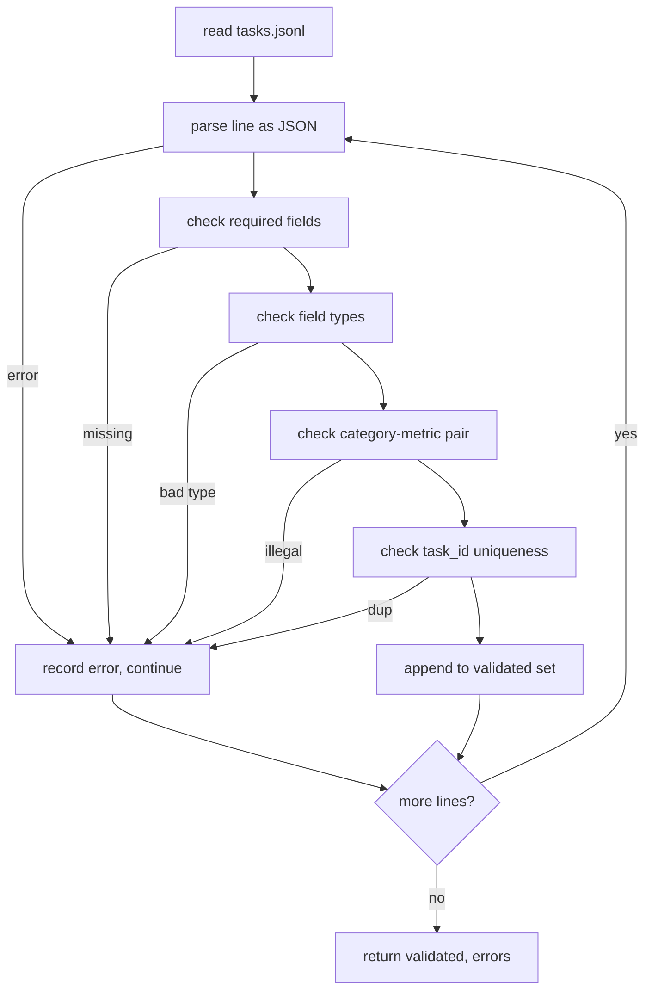

# فرمت مشخصات کار

> یک استفاده از ارزیابی فقط به اندازه ای که قرارداد وظایف آن را انجام می دهد خوب است. قبل از نوشتن یک تابع امتیاز واحد، شکل JSONL و لغت متریک را منجمد کنید.

**Type:** Build
**Languages:** Python
**Prerequisites:** Phase 19 Track B foundations
**Time:** ~90 min

## اهداف یادگیری

- یک طرح ثبت وظایف JSONL را تعریف کنید که شامل حساب، انتخاب چندگانه، اجرای کد، طبقه بندی و خلاصه سازی متن آزاد در یک شکل می شود.
- یک لغت بسته از نام های متریک را بنویسید تا درس های زیر (71-73) در یک زمینه واحد ارسال شوند.
- نمونه های چند عکس و قوانین پس از پردازش را به عنوان بخشی از کار مشخص کنید، نه رانر، بنابراین یک پرامپت مشابه در تمام مدل ها هدف مشابه را تولید می کند.
- یک اعتبارگر سختگیرانه را اجرا کنید که قبل از اینکه به رنده برسند، سوابق اشتباه را رد می کند.
- يه مجموعه 10تاژي براي استفاده از هر شاخه از مشخصات ارسال کن تا اعتبار دهنده چيزي واقعي داشته باشه که بهش چشنه

```figure
ci-task-spec-gate
```

## چرا يه نمونه منجمد

یک پایگاه کد تحقیقاتی اسکریپت های ارزیابی را سریعتر از آزمایشات جمع می کند. شش ماه بعد، هر نوت بوک شکل JSON خود را دارد، هر متریک دو بار دوباره اجرا می شود و هیچ چیز نمی تواند در میان اجراها مقایسه شود. اصلاح خسته کننده است. یک طرح را انتخاب کنید. یک اعتبار دهنده بنویسید. همه چیز دیگر را رد کنید. این همان چیزی است که این درس انجام می دهد.

شکل ایده هایی را از دسته های سبک BIG-bench، HELM و lm-eval قرض می گیرد، اما نام های زمینه ما هستند. هر میدان دارای یک مالک است. دوچرخه کار را می خواند. متریک اهداف را می خواند. مرحله پس از فرآیند نسل را عادی می کند. هیچ زمینه ای در میان پایپولین تغییر پذیر نیست.

## شکل رکورد

یک وظیفه یک شی JSON در یک خط است.`tasks.jsonl`و هر خط را مستقل تایید می کند. یک خط بد این رکورد را حذف می کند، نه اجرا.

```json
{
  "task_id": "arith_001",
  "category": "arithmetic",
  "prompt": "Compute the result. Question: 17 + 24\nAnswer:",
  "targets": ["41"],
  "metric_name": "exact_match",
  "few_shot_examples": [
    {"prompt": "Question: 2 + 2\nAnswer:", "completion": "4"}
  ],
  "post_process": "strip_whitespace",
  "metadata": {"difficulty": "easy"}
}
```

زمینه های مورد نیاز این هستند`task_id`،`category`،`prompt`،`targets`،`metric_name`،`post_process`.`few_shot_examples`و`metadata`.قطعات سطح بالا ناشناخته اعتباري شدن را شکست ميده

## قوانین زمینه

`task_id`یک رشته بدون فضای سفید است. اعتبارگر تک تکفیلی را در سراسر فایل اعمال می کند.

`category`یکی از`arithmetic`،`mcq`،`code_exec`،`classification`،`summary`. دسته بندی محدود می کند که کدام جفت متریک و بعد از فرآیند قانونی است.`code_exec`وظیفه باید استفاده کنه`metric_name = code_exec`و یک`mcq`وظیفه باید استفاده کنه`metric_name = exact_match`در مقابل يه هدف يک حرف

`prompt`یک رشته خالی نیست. اعتبار دهنده رد کردن فضای سفید را ممنوع می کند و سوابق را که قبلاً حاوی چند بلوک در بدن فوری هستند رد می کند. ارائه چند عکس در رانر اتفاق می افتد، نه نویسنده.

`targets`این یک لیست خالی از رشته ها است. برای`exact_match`، هر عنصر مشابهي شمارش ميکنه`f1`و`rouge_l`، بالاترين هدف برنده ميشه`mcq`، لیست دقیقاً یک عنصر را دارد.

`metric_name`یکی از`exact_match`،`f1`،`bleu_4`،`rouge_l`،`accuracy`،`code_exec`لغت بسته شده، یک متریک جدید نیاز به درس جدید و یک ورودی جدید دارد

`few_shot_examples`این لیست از`{prompt, completion}`.تائه ها .تائه کننده فهرست را به هشت ورودی محدود می کند تا پیام ها محدود شوند

`post_process`یکی از`none`،`strip_whitespace`،`lower`،`extract_letter`،`extract_code_block`،`extract_first_line`هر قاعده یک رفتار تعیین کننده دارد. اعتبارگر ترکیب قواعد را ممنوع می کند.

## رفتار اعتبار دهنده



اعتبارسنجی دو لیست را باز می گرداند: سوابق معتبر و سوابق خطا با خط مخالف، قانون نقض شده و میدان خطا. رانر از شروع کردن اگر لیست خطا خالی نباشد، مگر اینکه یک صریح است.`--allow-bad-tasks`پرچم آماده شده

## چند تا عکس

رانر چند نمونه شوت را با یک جداکننده خط خالی در مقابل پرامپت به هم متصل می کند. مسیر کد مشابه برای هر مدل اجرا می شود، بنابراین تنها منبع تفاوت خود مدل است. نویسندگان مثال ها را یک بار می نویسند، نه یک بار برای هر ارائه دهنده.

```python
def render(task):
    parts = []
    for ex in task.get("few_shot_examples", []):
        parts.append(ex["prompt"] + " " + ex["completion"])
    parts.append(task["prompt"])
    return "\n\n".join(parts)
```

## قوانین پس از پردازش

مرحله بعد از فرآیند بعد از نسل، قبل از متریک انجام می شود.

- `none`رشته را بدون تغییر می دهد.
- `strip_whitespace`خطوط پیش و عقب فضای سفید
- `lower`. به پایین تر انداختن رشته
- `extract_letter`اولین حرفی که با آن مطابقت دارد را باز می گرداند`[A-E]`، برای MCQ استفاده می شود
- `extract_code_block`جسم اولین بلوک با پشت سرپوشیده سه تا را که برای اجرای کد استفاده می شود، باز می کند.
- `extract_first_line`اولین خط خالی را که برای طبقه بندی خلاصه استفاده می شود بازمی گرداند.

یک کار که نیاز به یک قانون خارج از این لیست به یک درس جدید تعلق دارد.

## آنچه این درس انجام نمی دهد

نمره نمی گیرد، مدل نمی خواند، کد نمی زند، این ها در درس 71، 72 و 75 می آیند. این درس قرارداد را که همه آنها احترام می گذارند، منجمد می کند.

فکسچر ۱۰ وظیفه شامل دو عنصر ریاضی، دو عنصر MCQ، دو عنصر اجرای کد، دو عنصر طبقه بندی و دو عنصر خلاصه سازی می شود. اعتبارگر همه ۱۰ را منتقل می کند.`tasks_bad.jsonl`) هر قاعده را رد می کند و اعتبار دهنده دقیقاً همین تعداد خطاهای را باز می گرداند.

## چطور کد رو بخونيم

`main.py`تعریف می کند`TaskSpec`،`validate_task`،`validate_file`, و نقطه ورود CLI.`load_fixtures`. کمک کننده های رندر و پس از فرآیند در کنار اعتبارسنجی زندگی می کنند بنابراین راننده در درس 75 یک ماژول واحد وارد می کند.

بخون`main.py`از بالا تا پایین.`code/tests/test_spec.py`. تست ها هر قاعده تایید و هر رفتار پس از فرآیند را مشخص می کنند.`main.py`ثابت کننده ی بسته بندی شده را تایید می کند و خلاصه ای را چاپ می کند.

## . به جلوتر می رسیم

مجموعه های ارزیابی واقعی به همان شیوه ای که طرح ها به ستون ها رشد می کنند، دسته ها را رشد می دهند. حرکت هوشیار این است که بدون اضافه کردن یک متریک، یک قانون پس از فرآیند و حداقل یک کار ثابت، از اضافه کردن یک دسته خودداری کنید. مشخصات را مانند مهاجرت پایگاه داده ای رفتار کنید. هر تغییر بررسی، نسخه بندی و همراه با آزمایش ها است. اعتبار دهنده در این درس دروازه است.
