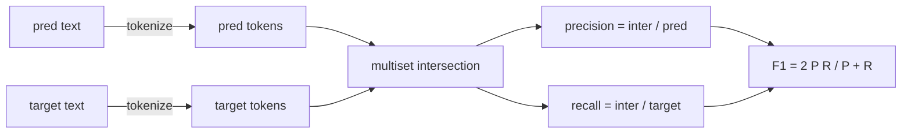
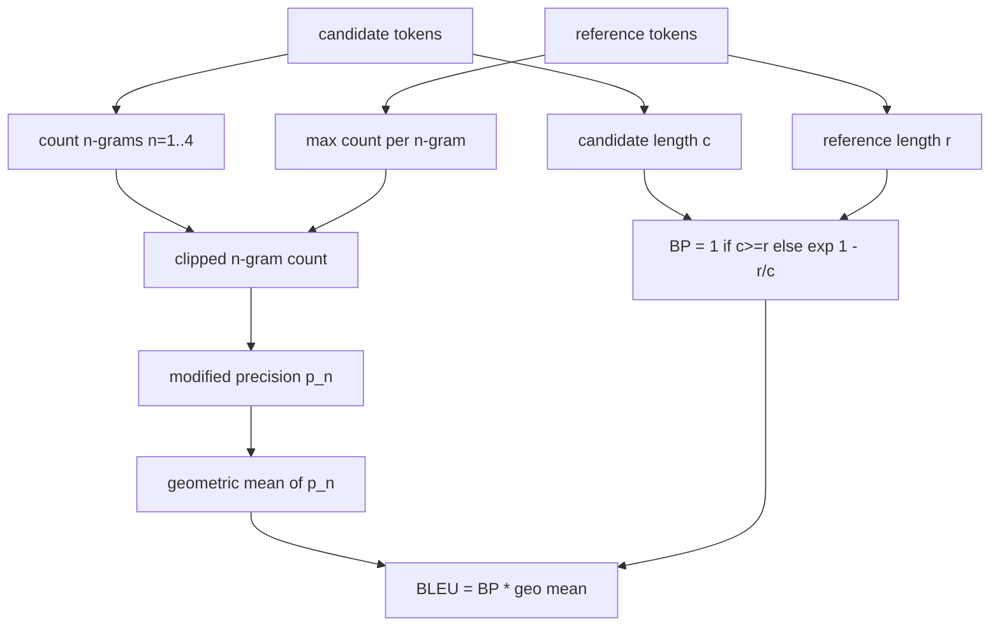

# متریک های کلاسیک

> BLEU، ROUGE-L، F1، مطابقت دقیق، دقت. پنج متریک که هنوز هم برای اکثر شماره های ارزیابی LLM منتشر شده حساب می کنند. هر یک را از اصول اول پیاده سازی کنید تا بدانید که این عدد چه معنایی دارد.

**Type:** Build
**Languages:** Python
**Prerequisites:** Phase 19 Track B foundations, lesson 70
**Time:** ~90 min

## اهداف یادگیری

- تطبیق دقیق سطح توکن، F1 و دقت با قوانین صریح توکن سازی.
- از ابتدا BLEU-4 را اجرا کنید: دقت n-گرام اصلاح شده، متوسط هندسی بیش از n برابر 1 تا 4، مجازات کوتاه.
- ROUGE-L را با استفاده از طولانی ترین فراتنهای مشترک، با ترکیب F-beta دقت و بازپس گرفتن اجرا کنید.
- در مورد "متریک_نام" از درس 70 ارسال کنید تا راننده متریک-آگنوستیک بماند.
- رفتار را با متریزهای مرجع که از نمونه های کار شده گرفته شده است، نه از کتابخانه شخص ثالث، پیک کنید.

```figure
cd-bleu-overlap
```

## چرا دوباره اجرا می شود

شما مقاله هایی را می خوانید که گزارش BLEU 28.3 و دیگری که گزارش BLEU 0.283 را می دهد. شما نمره های ROUGE-L را خواهید یافت که در دو کتابخانه با ده امتیاز متفاوت است زیرا یکی به کوچک تر و دیگری به کم تر می شود. سریع ترین راه برای متوقف کردن سردرگمی، نوشتن متریکها است، سپس به خطی که توکنایزر تصمیم گرفته و خطی که صاف کردن اعمال می شود اشاره کنید. بعد از آن، مقایسه اعداد در کاغذ ها تبدیل به یک مسئله خواندن تنظیمات متریک می شود، نه بحث در مورد کتابخانه ها.

Stdlib + numpy کافی است. BLEU شمارش و یک کلیمپ است. ROUGE-L برنامه نویسی پویا است. F1 یک تقاطع ثابت در توکن است. سخت ترین بخش انتخاب یک توکنایزر و تعهد به آن است.

## نشان دادن

توکنيزر`re.findall(r"\w+", text.lower())`. کم حرف، رونمایی الفانومری، خط خط خطی. هر متریک در این درس از این نشان دهنده استفاده می کند. رانر نمی تواند انتخاب کند. اگر شما نشان دهنده را عوض کنید، شما یک معیار متفاوت را اجرا می کنید.

```python
TOKEN_RE = re.compile(r"\w+", re.UNICODE)
def tokenize(text):
    return TOKEN_RE.findall(text.lower())
```

این یک ساده سازی عمدی است. تنظیمات تولید به CJK، انقباضات و شناسه های کد اهمیت می دهند. نکته درس این است که توکنایزر یک قرارداد است، نه یک دکمه.

## دقیقاً مطابقت داره

```python
def exact_match(pred, targets):
    return float(any(pred.strip() == t.strip() for t in targets))
```

این 1.0 یا 0.0 را به هر کار باز می آورد. مجموعی در یک مجموعه داده ها متوسط است. این کارزار برای وظایف ریاضی، MCQ و طبقه بندی کوتاه است.

## سطح توکن F1

تنظیم multiset توکن برای پیش بینی و هدف. دقت تقاطع multiset تقسیم شده توسط multiset از پیش بینی است. یادآوری همان تقاطع تقسیم شده توسط multiset از هدف است. F1 میانگین هماهنگ است. پیاده سازی در حال انجام پیش بینی خالی و خالی هدف حاشیه موارد است.



برای وظایف چند هدف، بهترین فول 1 را بر روی لیست هدف قرار می دهیم. این با رفتار سبک SQuAD که در ادبیات به طور گسترده گزارش شده مطابقت دارد.

## BLEU-4

BLEU متریک ترجمه ماشین کنونی است و هنوز هم در کارهای خلاصه سازی نشان داده می شود. فرمولی که ما استفاده می کنیم BLEU-4 است با مجازات کوتاهیت استاندارد و صاف کردن یک اضافه بر روی تعداد n-گرام اصلاح شده به طوری که یک گرام از دست رفته 4 گرام نمره را به صفر فشار نمی دهد.

برای هر جفت مرجع کاندید، ما دقت n-گرام اصلاح شده را برای n برابر با 1، 2، 3، 4 محاسبه می کنیم. دقت اصلاح شده تعداد n-گرام کاندید را با حداکثر تعداد این n-گرام در هر مرجع، بنابراین کاندید نمی تواند با تکرار یک عبارت، بلندی کند. متوسط هندسی در چهار دقت با مجازات کوتاهیت بسته می شود.



قانون صاف کردن این است که لین و اوچ روش 1: اضافه کردن یک به هر عدد و نامزدی از هر n-گرام دقت قبل از گرفتن log. این جلوگیری می کند`log 0`وقتی که یک مرجع 4 گرم مطابقت ندارد و نزدیک به ارزش بدون مسطح در کاندیداهای بلند است.

## رنگ قرمز

ROUGE-L طولانی ترین دنباله مشترک دنباله های کاندید و توکن مرجع را مقایسه می کند. LCS ترتیب کلمات را بدون مجبور کردن موازی را ضبط می کند، به همین دلیل است که متریک خلاصه سازی پیش فرض است. طول LCS را با یک جدول برنامه نویسی پویا محاسبه می کنیم، سپس به عنوان یادآوری را به عنوان `lcs / reference length`، دقت مثل`lcs / candidate length`, و با F-beta ترکیب شود که در صورت F1 متراکم، beta برابر با یک است.

```python
def lcs_length(a, b):
    n, m = len(a), len(b)
    dp = numpy.zeros((n + 1, m + 1), dtype=int)
    for i in range(n):
        for j in range(m):
            if a[i] == b[j]:
                dp[i+1, j+1] = dp[i, j] + 1
            else:
                dp[i+1, j+1] = max(dp[i+1, j], dp[i, j+1])
    return int(dp[n, m])
```

جدول numpy اجرای را قابل خواندن می کند؛ لیست های خالص پایتون نیز کار می کنند. وظایف که به ROUGE-L انتخاب می کنند هزینه O(n) در هر کار را پرداخت می کنند. برای طول خلاصه ای معمولی که کمتر از میلی ثانیه باقی می ماند.

## دقت

برای وظایف طبقه بندی چند هدف، دقت به مطابقت دقیق با یک هدف استاندارد واحد کاهش می یابد. ما آن را به عنوان یک تابع جداگانه نشان می دهیم تا فرستنده بتواند در`metric_name`بدون اینکه از طریق مقایسه های رشته ای در داخل رنده عبور کنید.

## قرارداد ارسال

نقطه ی ورود یگانه`score(metric_name, prediction, targets)`. اين يه پرنده رو به خونه مياد`[0, 1]`. راننده به نام متریک شاخه نمی گیرد. او تماس را می دهد و نتیجه را می نویسد. این سطح است که درس 75 به مشخصات کار از درس 70 متصل خواهد شد.

```python
def score(metric_name, pred, targets):
    if metric_name == "exact_match":
        return exact_match(pred, targets)
    if metric_name == "f1":
        return max(f1_score(pred, t) for t in targets)
    if metric_name == "bleu_4":
        return max(bleu4(pred, t) for t in targets)
    if metric_name == "rouge_l":
        return max(rouge_l(pred, t) for t in targets)
    if metric_name == "accuracy":
        return accuracy(pred, targets)
    raise ValueError(f"unknown metric_name: {metric_name}")
```

`code_exec`در درس 72 انجام شده و در دستگاه فرستنده قرار گرفته.

## آنچه این درس انجام نمی دهد

این مدل نمی خواند. این نسل ها را فراتر از آنچه که قوانین پس از فرآیند در درس 70 قبلا انجام داده است، عادی نمی کند. این فواصل اعتماد را محاسبه نمی کند. آن BLEURT یا BERTScore را انجام نمی دهد (آن ها به یک مدل نیاز دارند و در یک درس مختلف زندگی می کنند). نکته این است که طبقه: پنج متریک، یک توکن، یک جدول ارسال.

## چطور کد رو بخونيم

`main.py`هر متریک را به عنوان یک تابع آزاد به علاوه فرستنده تعریف می کند.`_reference_examples`در قسمت پایین فایل، دیمو دستگاه را با هشت نمونه و نمرات متریک پرینت می کند.`code/tests/test_metrics.py`متریزهای مرجع را بنویسید و هر مورد کناری را تاکید کنید (پیش بینی خالی، مرجع خالی، هیچ نشانه مشترک، مطابقت دقیق، برش تکرار عبارت).

بخون`main.py`از بالا تا پایین. عملکردها به ترتیب پیچیده هستند. exact_match و دقت هر یک یک خط هستند. F1 شش خط است. BLEU و ROUGE-L بخش های سنگین هستند و شامل نظرات دقیق در مورد قانون صاف کردن و تکرار LCS هستند.

## . به جلوتر می رسیم

متریک های کلاسیک ضروری هستند، کافی نیستند. آنها سطح را پوشش می دهند و معنی را از دست می دهند. راه حل این است که متریک های مبتنی بر مدل را در بالای (BLEURT، BERTScore، GEval) قرار دهید هنگامی که به طبقه کلاسیک اعتماد کنید. این یک درس بعدی است. برای حال: این پنج را کار کنید، آنها را با آزمایشات ثابت کنید، و شما یک ستک متریک دارید که قابل بررسی، سریع و قابل تکرار است.
