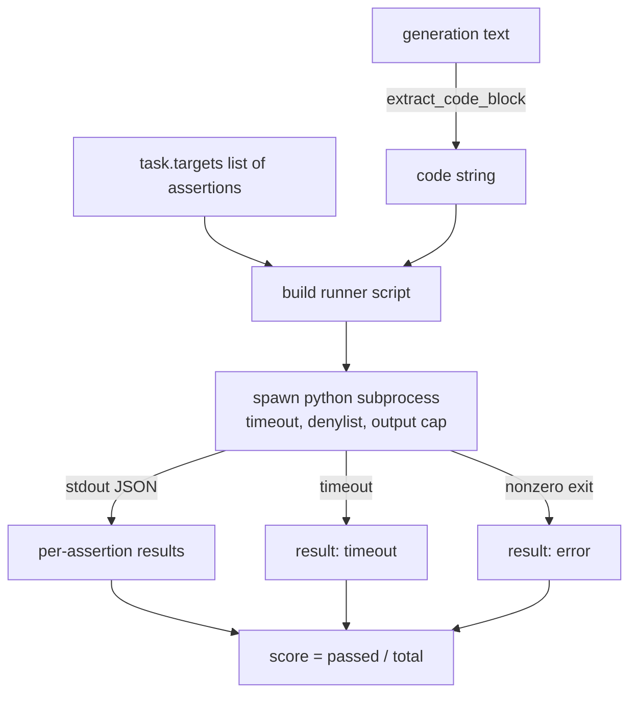
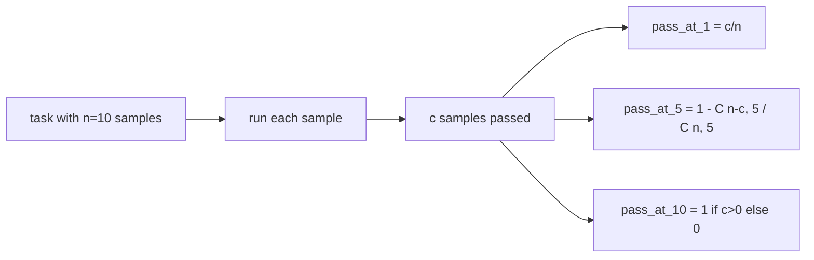

# کد متریک اجرا

> کد تولید شده درست است وقتی از تست ها عبور می کند. هرنس eval باید کد را استخراج کند، بدون اینکه میزبان را خراب کند، و نرخ عبور را صادقانه محاسبه کند. این درس سطح را می سازد.

**Type:** Build
**Languages:** Python
**Prerequisites:** Phase 19 Track B foundations, lessons 70 and 71
**Time:** ~90 min

## اهداف یادگیری

- یک بلوک کد را از یک نسل فرم آزاد به گونه ای استخراج کنید که با قانون پس از فرآیند درسی 70 مطابقت داشته باشد.
- کد کاندید را در فرعی جداگانه با یک زمان بندی ساعت دیواری، یک کیپ خروجی و یک فهرست وارداتی اجرا کنید.
- یک کار را به عنوان بخش از رشته های ادعا ارائه شده که در مقابل کاندید عبور می کنند، نمره دهید.
- محاسبه pass-at-k برای وظایف که نمونه چندین نسل از یک مدل را انجام می دهند.
- تصادفات جعبه شن، خطاهای نحوی و زمان بندی را به عنوان حالت های شکست کلاس اول با کد خروج مشخصی که راننده می تواند ثبت کند، درمان کنید.

```figure
sandbox-runner
```

## چرا یک فرعی از فرعی از فرعی از فرعی از فرعی از فرعی از فرعی از فرعی از فرعی از فرعی از فرعی از فرعی از فرعی از فرعی از فرعی از فرعی از فرعی از فرعی از فرعی از فرعی از فرعی از فرعی از فرعی از فرعی از فرعی از فرعی از فرعی از فرعی از فرعی از فرعی از فرعی از فرعی از فرعی از فرعی از فرعی از فرعی از فرعی از فرعی از فرعی از فرعی از فرعی از فرعی از فرعی از فرعی از فرعی از فرعی از فرعی از فرعی از فرعی از فرعی از فرعی از فرعی از فرعی از فرعی از فرعی از فرعی از فرعی از فرعی از فرعی از فرعی از فرعی از فرعی از فرعی از فرعی از فرعی از فرعی از فرعی از فرعی از فرعی از فرعی از فرعی از فرعی از فرعی از فرعی از فرعی از فرعی از فرعی از فرعی از فرعی از فرعی از فرعی از فرعی از فرعی از فرعی از فرعی از فرعی از فرعی از فرعی از فرعی از فرعی از فرعی از فرعی از فرعی از فرعی از فرعی از فرعی از فرعی از فرعی از فرعی از فرعی از فرعی از فرعی از فرعی از فرعی از فرعی از فرعی از فرعی از فرعی از فرعی از فرعی از فرعی از فرعی از فرعی از فرعی از فرعی از فرعی از فرعی است که فرعی از فرعی از فرعی از فرعی از فرعی از فرعی است که فرعی از فرعی از فرعی است که فرعی از فرعی است که فرعی از فرعی از فرعی است که فرعی از فرعی از فرعی است که فرعی از فرعی است که فرعی از فرعی است که فرعی است که فرعی است که فروردین است که فروردین است که فروردین است که فروردین است.

خط خط`exec`خطر امنیتی و ثبات است.`while True: pass`براي هميشه از اين ارز رو مسدود ميکنه`import shutil; shutil.rmtree('/')`درست درست مثل فاجعه بار به نظر می رسد. راه حل این است که یک مترجم جدید پایتون را برای هر نامزد تولید کنید، کد را در stdin منتقل کنید، نتایج ادعا را به stdout بنویسید و فرآیند را بکشید اگر از آن تجاوز کند. فرآیند ارزیابی میزبان ادامه می یابد.

ارزیابی های واقعی مانند HumanEval، MBPP، BigCodeBench و LiveCodeBench همه از یک جعبه قشنگ فرعی استفاده می کنند. برخی لایه های Docker در بالای آن هستند. ما در فرعی فرآیند به یک دلیل متوقف می شویم: قابل حمل است، stdlib است و حالت های شکست را که برای ارزیابی آموزشی مهم هستند، می گیرد. انتشار تولید شامل seccomp، انزوا شبکه و یک سیستم فایل فقط برای خواندن است. درس بعدی در مورد سخت کردن زندگی خارج از این مسیر است.

## شکل یک کار اجرای کد

A`code_exec`وظیفه رشته های ادعا را در `targets`. رانر یک بلوک کد احاطه شده را از نسل خارج می کند، یک هالن تست را در اطراف آن می سازد و نتیجه را اجرا می کند.



نمره اش بخش کوچکی از`[0, 1]`. یک کار با سه ادعا که دو پاس امتیاز 0.667 را دارد. رانر شکل مشابه را به هر گونه شکست باز می گرداند: تصادفات فرعی به یک کد خطای عادی نقشه برداری می شوند، نه یک ردیابی پایتون که به سمت هنیز می چرخد.

## "دانلست"

این فهرست مبتنی بر واردات است. قبل از اجرای کد کاندید، اسکریپت رانر واردات ماژول های خطرناک را به یک ستون که بالا می برد دوباره می نویسد`ImportError("denied")`. لیست عمداً محافظه کارانه است:`os.system`،`subprocess`،`socket`،`requests`،`urllib`،`urllib.request`،`urllib.error`،`urllib.parse`،`ctypes`،`shutil`،`http.client`،`asyncio.subprocess`. .

ما نمی گوییم این گلوله است. کد معکوس می تواند از هر جعبه قمر در حال فرآیند در پایتون فرار کند. دینیلست یک پشتیبان است. زمان زمان ساعت دیوار و کیپ خروجی کنترل های تحمل هستند.

```python
DENIED = {
    "os.system": True,
    "subprocess": True,
    "socket": True,
    "shutil": True,
    "requests": True,
    "urllib": True,
    "ctypes": True,
}
```

ما با تعليق مقدماتي به نامزدي مي رسيم`import sys`و نگهباني كه ميکينه ها را به دست مى آورد`os.system`تا بالا برسونم.`main.py`. .

## زمان بندی ساعت دیوار

هر فرعي عمل به طور پيش فرض سه ثانيه ساعت ديواري مياد`subprocess.run(..., timeout=t)`اگه زمان توقف آتش بزنه، رنده ميگيره`TimeoutExpired`، فرآیند رو می کشه و یک`timeout`دلیل خروج از کار، امتیاز برای این کار صفر است. دوچرخه حرکت می کند.

زمان توقف برای هر کار از طریق  قابل تنظیم است`task.metadata.timeout_s`. تست های طولانی مدت واحد می توانند درخواست بیشتری داشته باشند. اعتبارگر در درس 70 ارزش را در سی ثانیه محدود می کند تا مجموعه را محدود کند.

## کلاه تولید

این فرعی فرآیند می تواند از حافظه میزبان خسته کننده ای جلوگیری کند. راننده از حافظه میزبان به یک پوشه می رود و کودک را در همان لحظه که کل جریان 256 KB را عبور می کند، می کشد. نتیجه به عنوان `exit_code = error`با رشته جزئیات`"output overflow"`این در عمل وقتی ظاهر می شود که یک نسل تصادفی یک حلقه بی نهایت را می نویسد که چاپ می کند.

## - گذر - در -

Pass-at-k، تخمین دهنده غیر جانبدار است که توسط HumanEval و دوستانش استفاده می شود.`n`نمونه های مستقل در هر وظیفه و`c`از آنها عبور، احتمال است که یک نمونه از اندازه `k`از`n`حداقل یک محلول عبور را شامل می شود:

```
pass_at_k(n, c, k) = 1 - C(n - c, k) / C(n, k)
```

چه وقت`n - c < k`عدد نامشخص و ارزشش `1`. اجرای به طور مستقیم پرونده کناری را اداره می کند . ما افشا می کنیم`pass_at_k(n, c, k)`برای استفاده از لایه رنجربورد در درس 74



## کد خروج

دوچرخه یکی از پنج نتیجه را برای هر کار باز می کند:

- `pass`و هر گاه که هر گونه سخن از میان برود
- `assertion_fail`وقتی که کد اجرا شد ولی حداقل یک ادعا شکست خورد
- `syntax_error`وقتی کد وارد نشده یا یک SyntaxError داشته باشد.
- `timeout`وقتی ساعت دیواری به پایان رسید
- `error`برای هر تصادف دیگری، از جمله ضربه های دنیل و تخلیه خروجی (سطح های تخلیه با جزئیات `"output overflow"`)

نمره هنوز هم بخش کوچکی است. کد خروج متاداتا است. درس های زیر می توانند تصمیم بگیرند که آیا یک زمان توقف به عنوان صفر یا به عنوان داده های گم شده حساب شود.

## آنچه این درس انجام نمی دهد

این برنامه شما را به یک جعبه واقعی نمی دهد. این کد غیرقابل اعتماد را از وب باز اجرا نمی کند. این کار را با وظایف دولت مانند فایل I / O یا تماس های شبکه انجام نمی دهد. این ها به یک کانتینر یا یک microVM نیاز دارند. هدف این درس قرارداد است: یک فرعی جداگانه، یک فهرست دینیل، یک زمان بندی، یک کیپ خروجی، یک لغت پاک کد خروج و ریاضیات عبور از k.

## چطور کد رو بخونيم

`main.py`تعریف می کند`extract_code`،`run_candidate`،`score_code_exec`و`pass_at_k`. اسکریپت رانر فرعي پروسه به عنوان رشته ساخته شده و به عنوان `-c`به یک مترجم جدید پایتون.`code/tests/test_exec.py`استفاده از چهار کد خروج و همچنین گذرگاه k در مقابل نمونه های کار شده از سبک HumanEval.

بخون`main.py`از بالا تا پایین. قالب رانر قطعه حمل کننده است. به حلقه ادعا نگاه کنید تا بتوانید موشک JSON را پیش بینی کنید که به فرآیند اصلی باز می کند.

## . به جلوتر می رسیم

وقتی شکل فرعی عمل می کند، نگرانی بعدی حمل و نقل است. نسخه های مختلف پایتون در ویندوز با SIGKILL متفاوت کار می کنند. ساده ترين راه حل اينه که راننده رو به صورت دوکر قرار بده بعد از آن، جایگزین کردن رشته های ادعا با فایل های آزمون واحد واقعی است تا ارزیابی با آنچه که CI تولید انجام می دهد مطابقت داشته باشد. در آن نقطه از امتحانات رشته های ادعا کردن دست بردارید؛ آنها آزمایشات اسباب بازی هستند و آنها حالت شکست اسباب بازی را دارند.
