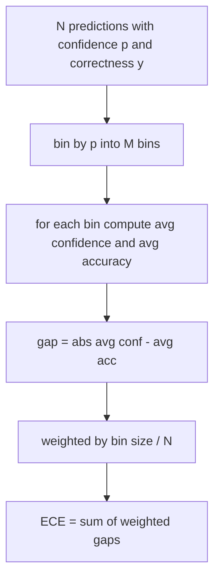
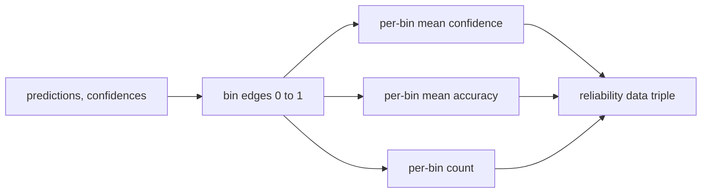

# پیچیدگی و کالیبراسیون

> اگر مدل شما ۹۰ درصد اطمینان از هزار پاسخ داشته باشد و ۶۰۰ جواب درست داشته باشد، آن را درست نمی کند. کالیبراسیون نیمی از ارزیابی قابل اعتماد است. نیمی دیگر از این که آیا مدل می داند که متن نگه داشته قابل قبول است.

**Type:** Build
**Languages:** Python
**Prerequisites:** Phase 19 Track B foundations, lessons 70 and 71
**Time:** ~90 min

## اهداف یادگیری

- پیچیدگی سطح توکن را در یک کورپوس بازدارنده از احتمالات توکن منفی ثبت شده توسط آداپتور مدل محاسبه کنید.
- خطای کالیبریشن انتظار می رود (ECE) یک طبقه بندی کننده یا ارزیابی چند انتخاب را از احتمالات پیش بینی شده محاسبه کنید.
- نمره بریر را محاسبه کنید (خطای متوسط مربع در برابر شاخص درستی) و توضیح دهید که چه زمانی آن را انجام می دهد که ECE انجام نمی دهد.
- داده های نمودار قابل اعتماد لازم برای نقشه برداری منحنی اعتماد در مقابل دقت را بسازید.
- سه تا رو به هارد ارز ببند تا راننده بتونه وصل بشه`perplexity`،`ece`و`brier`شماره هاي گزارش مدل

```figure
cd-reliability-diagram
```

## چه حيرانگاري به تو ميگه

پیچیدگی، احتمال منفی متوسط نمایی شده در هر توکن است. پایین تر بهتره یک پیچیدگی از یک به این معنی است که مدل احتمال یک را به هر نشانه واقعی اختصاص می دهد. یک پیچیدگی در اندازه لغات به این معنی است که مدل یکسانی است و چیزی یاد نگرفته است. اعداد واقعی در میان قرار دارند: یک مدل پایه قوی 2026 در ویکی متکس 103 حدود هشت تا دوازده است. يه نفر بد در همون متن 50+ مياد

هرنس احتمالات ثبت را در خود محاسبه نمی کند. این ها از آداپتور مدل می آیند. مجموعات هرنس: این یک لیست از احتمالات ثبت هر توکن، یک لیست از تعداد توکن ها در هر ردیف را می گیرد و پیچیدگی corpus را باز می گرداند.

```python
def perplexity(neg_log_probs, token_counts):
    total_nll = sum(neg_log_probs)
    total_tokens = sum(token_counts)
    return math.exp(total_nll / total_tokens)
```

اجرای این برنامه در موارد کناره ای صفر توکن عمل می کند و ادعا می کند که احتمالات منفی ثبت نام منفی نیستند. یک اشتباه رایج فراموش کردن منفی است: یک آداپتور که به بازگشت می آید `log p`به جای`-log p`این تابع این را به عنوان نقض قرارداد می گیرد.

## چه اقدامات ECE

خطای کالیبراسیون انتظار می رود پیش بینی ها را با اعتماد به تعداد ثابت سطل ها جمع آوری کند و سپس فاصله متوسط بین اعتماد و دقت در سطل ها را با وزن اندازه سطل اندازه می گیرد.



در فرمول استاندارد 10 سطل با عرض برابر استفاده می شود`[0, 1]`. اجرا هر عدد کامل مثبت را پشتیبانی می کند. ما یک`bins`پارامتر به طوری که دوچرخه ای بتواند بین کنوانسیون انتشار (10) و کنوانسیون مقایسه (15) انتخاب کند.

ECE با تعداد سطل و اندازه نمونه تحریف می شود. با ده سطل و صد پیش بینی، شما نمی توانید 0.02 ECE را از صدا تصادفی تشخیص دهید. پیاده سازی تعداد سطل های پرجمعیت را همراه با ECE باز می گرداند تا دوچرخه گیر بتواند از گزارش یک عدد واحد در چند نمونه انکار کند.

## چه نمره ای برایر داره که ECE نمیره

ECE تنها به شکاف های متوسط اهمیت می دهد. یک مدل که بیش از حد به نیمی از سطل ها اعتماد دارد و به نیمه دیگر اعتماد ندارد می تواند ECE کم داشته باشد در حالی که در سطح محلی ضعیف است. نمره بریر خطای مربع را با نتیجه واقعی هر پیش بینی اندازه می گیرد، بنابراین به طور مستقیم گسترش را مجازات می کند.

برای نتایج دوگانه، بریر `mean((p_i - y_i)^2)`. آن را به قابلیت اطمینان، وضوح و عدم اطمینان تجزیه می کند. ما نمره و تجزیه را محاسبه می کنیم. دوچرخه گزارش مقیاس را گزارش می دهد اما تجزیه را برای داشبورد ثبت می کند.

```python
def brier(p, y):
    return float(np.mean((p - y) ** 2))
```

## داده های نمودار قابل اعتماد

یک نمودار قابلیت اطمینان، اعتماد را در برابر دقت تجربی در هر بن پیش بینی می کند. دیگاکول کالیبریشن کامل است. تابع سه صف را باز می گرداند: اعتماد متوسط هرbin، دقت متوسط هرbin و تعداد هرbin. کد نقشه برداری در جریان زیر زندگی می کند؛ این درس در شکل داده ها متوقف می شود.



توپل برگشت داده شده چیزی است که یک لایه تماس نیاز دارد تا نقشه را رسم کند یا یک ویرانت ECE سفارشی را محاسبه کند (ECE سازگار، ECE پاک، و غیره). ما آرایه های numpy را باز می گردانیم تا کد زیر جریان مجبور نباشد تبدیل شود.

## منابع اعتماد

این آبروس به این باور نمیاد که اعتماد از softmax به دست آید.`[0, 1]`برای وظایف چند انتخاب، اعتماد طبیعی`softmax over option log-likelihoods`برای متن آزاد اعتماد طبیعی احتمال خود گزارش شده مدل است یا نمایی از احتمال متوسط ثبت. ارزیابی فقط مصرف اعداد. از کجا آمده است کار آداپتور است.

## جعبه های کناری

- همه پیش بینی ها اشتباه هستند: ECE اعتماد به نفس متوسط است، Brier بالا است، حیرانی هر چیزی است که مدل از متن فکر می کند.
- همه پيش بيني ها با اعتماد بالا درست هستند: ECE نزدیک صفر، Brier نزدیک صفر.
- پیش بینی کننده کاملاً نامشخص در p=0.5: ECE 0.5 ناقص دقت است، Brier 0.25 ناقص یک اصطلاح اصلاح است.
- ورودی خالی: ECE، Brier و بازگشت قابلیت اطمینان `0.0`(یا صف های پر صفر) بازده ی پیچیدگی`NaN`برای مورد صفر توکن هیچ یک از این مسیرها هشدار نمی دهند؛ راننده مقادیر را بررسی می کند و تصمیم می گیرد که آیا گزارش دهد یا از آن عبور کند.

این موارد در آزمایش ها پخته می شوند. یک مدل واقعی بر روی یک معیار واقعی به آنها نمی رسد، اما یک آداپتور بگی یا یک نمونه کوچک خواهد شد، و دوچرخه نباید سقوط کند.

## ارسال

کالیبراسیون یک متریک برای هر وظیفه نیست مثل F1 این یک گزارش برای هر مدل است.`(confidence, correct)`جفت ها در سراسر ارزیابی و محاسبه ECE، Brier و داده های قابل اعتماد یک بار. پیچیدگی بر روی یک متن نگه داشته محاسبه می شود، جدا از امتیاز وظیفه به وظیفه.

رابط اينه:

```python
report = CalibrationReport.from_predictions(confidences, correct)
report.ece          # float
report.brier        # float
report.reliability  # tuple of three numpy arrays
report.populated_bins  # int
```

`PerplexityResult.from_token_nll(neg_log_probs, token_counts)`بازگردانده شده است و متوسط احتمال منفی log-per token.

## آنچه این درس انجام نمی دهد

این مدل مدل را نمی خواند. این مدل softmax را اجرا نمی کند. این مدل اعتماد از توکن های خروجی را تخمین نمی زند؛ این کار آداپتور است. این مدل مقیاس دمای یا مقیاس Platt را انجام نمی دهد؛ اینها اصلاحات پس از عمل هستند که در یک درس مختلف زندگی می کنند. هدف این درس این است که سه عدد (مربوطیت، ECE، Brier) قابل اعتماد و قابل تکرار باشد.

## چطور کد رو بخونيم

`main.py`تعریف می کند`perplexity`،`expected_calibration_error`،`brier_score`،`reliability_diagram`و`CalibrationReport`-`PerplexityResult`در حال حاضر، این مدل در حال انجام است. در حال انجام این آزمایش، پیش بینی های مصنوعی انجام می شود که در آن حقیقت اصلی شناخته شده است: یک مدل که به خوبی کالیبر شده، یک مدل بیش از حد مطمئن و یک مدل که کمتر مطمئن است.`code/tests/test_calibration.py`هر قاب حاشيه و ارزش مرجعي براي پيش بيني هاي مصنوعي را ببينيد

بخون`main.py`از بالا تا پایین. ترتیب تابع از مقیاس به ویکتور برای گزارش می رود. هر تابع دارای یک سند کوتاه با ریاضیات و قرارداد است.

## . به جلوتر می رسیم

کالیبراسیون در ارزیابی منتشر شده، محور نادیده گرفته شده است. اکثر رتبه بندی ها یک شماره دقیق را گزارش می دهند و آن را انجام می دهند. یک مدل که بر روی دقت برنده می شود و بر روی بریر از دست می دهد، عملکرد تولید بدتر از مدل است که بر روی دقت چند امتیاز پایین تر است اما بی ثباتی را به طور قابل اعتماد گزارش می دهد. وقتی که لوله های کالیبریشن را در محل خود قرار داده اید، مقیاس دمایی را روی یک قطعه تایید شده اضافه کنید، ECE را دوباره محاسبه کنید و به کاهش شکاف نگاه کنید. این یک درس جداگانه است، اما کف اینجا زندگی می کند.
