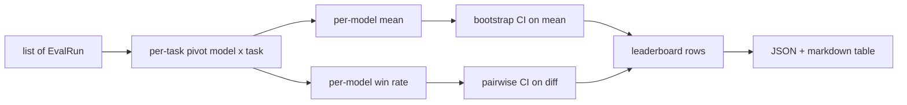
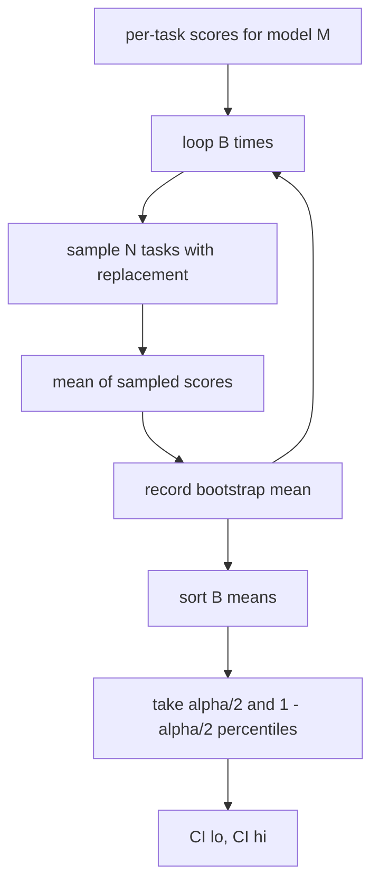

# جمع بندی جدول رتبه بندی

> نمرات هر کار آسان است. رتبه بندی هر مدل در وظایف مختلف سخت تر است. اهمیت آماری در یک جدول رتبه بندی پیش بینی هزاران بخش است که همه از آن عبور می کنند. این درس آن را از دست نمی دهد.

**Type:** Build
**Languages:** Python
**Prerequisites:** Phase 19 Track B foundations, lessons 70, 71, 73
**Time:** ~90 min

## اهداف یادگیری

- امتیازات هر کاری را در چندین مدل و چندین کار به یک ردیف مرتب در هر مدل جمع آوری کنید.
- نمرات مختلف را عادی سازی کنید تا نرخ عبور و ارزش های BLEU بر کل تأثیر بیش از حد نداشته باشند.
- مدل ها را با میانگین و نرخ برندهایی رتبه بندی کنید و توضیح دهید که هر کدام خلاصه مناسب است.
- فواصل اعتماد بوترپ را بر اساس میانگین نمره هر مدل و تفاوت های جفتی محاسبه کنید.
- جدول رتبه بندی را به عنوان یک گزارش JSON و به عنوان یک جدول نشان دادن، رانر در درس 75 می تواند به یک نظر سنجی CI پیوند دهد.

```figure
ci-leaderboard-ci
```

## شکل ورودی

جمع کننده یک لیست از `EvalRun`سوابق:

```python
@dataclass
class EvalRun:
    model_id: str
    task_id: str
    metric_name: str
    score: float          # in [0, 1]
    category: str
```

دوچرخه در درس 75 یک رکورد در هر ساعت پخش می کند`(model, task)`جفت: جمع کننده به این اهمیت نمی دهد که نمره چگونه تولید شده است. انتظار دارد که عادی سازی قبلاً اتفاق افتاده باشد: هر نمره در `[0, 1]`. .

## تولید

سه ميز از اينجا مياد:



خط جدول رتبه بندی شامل: `model_id`،`mean_score`،`mean_ci_lo`،`mean_ci_hi`،`win_rate`،`tasks_completed`، و اختیاری`categories`نقشه برای متوسط هر دسته

## عادی سازی

اگه یه کار نمره بزنه`[0, 1]`و یکی دیگه هم`[0, 100]`جمع کننده تایید می کند که هر نمره ورودی در`[0, 1]`و در غیر این صورت از اجرا رد می کند. ثابت به جلو زندگی می کند: متریک باید یک بخش از آن را به دست آورد. درس 71 تا 73 این قرارداد را اجرا می کند.

## متوسط و نرخ برنده

دو طرح رتبه بندی به اهداف متفاوت خدمت می کنند.

نمره متوسط، متوسط نمره های هر کار برای یک مدل است. این گزارش شماره های سرپرست است. این نسبت به غیر عادی و عدم تعادل کار حساس است.

نرخ پیروزی به شمار می رود که چگونه یک مدل در هر کار دیگری از هر مدل دیگر بر می گردد. برای هر کار، مدل با بالاترین امتیاز برنده می شود (تایز تقسیم). نرخ پیروزی برابر با برندهایی تقسیم شده با تعداد وظایف است که مدل دارای امتیاز است. آن کمتر نسبت به تفاوت های خارق العاده و مقیاس حساس است اما اطلاعات را از دست می دهد.

```python
def win_rate(model_id, runs_by_task, all_models):
    wins, total = 0, 0
    for task_id, runs in runs_by_task.items():
        scores = {r.model_id: r.score for r in runs if r.model_id in all_models}
        if model_id not in scores:
            continue
        total += 1
        best = max(scores.values())
        if scores[model_id] >= best:
            wins += 1
    return wins / total if total else 0.0
```

هنیس هر دو را گزارش می دهد. راننده در درس 75 به طور پیش فرض در میانگین رتبه بندی می شود؛ ستون بازبینی برای نرخ برنده در آنجا است در صورتی که کاربر آن را ترجیح دهد.

## فاصله های اعتماد Bootstrap

در هر مدل، یک فاصله اطمینان با شروع نمونه گیری مجدد در وظایف تخمین زده می شود. ما دوباره نمونه گیری ID وظایف با جایگزینی، محاسبه متوسط در مجموعه نمونه گیری مجدد، تکرار می کنیم `B`زمان ها و فاصله پرسنتیل را در سطح بگیرید`alpha`. .



برای مقایسه های جفتی ما تفاوت هر وظیفه را شروع می کنیم `score_A - score_B`، فاصله پرسنتیل را بگیرید و آن را گزارش کنید. کاربر می خواند که آیا فاصله صفر را خارج می کند. اگر این کار را انجام دهد، تفاوت در سطح الفا قابل توجه است. اگر این کار را انجام ندهد، جدول رتبه بندی مدل ها را به عنوان مساوی می داند.

کمک کنندگان سطح پایین (`bootstrap_mean_ci`،`bootstrap_pairwise_diff`) به خاطر عدم پرداخت`B=1000`؛ جمع آوری کنندگان عمومی (`aggregate`،`pairwise_diffs`) به خاطر عدم پرداخت`b=500`پس Demo و تست ها سریع باقی می مانند. الفا پیش فرض 0.05 است. درس باعث می شود بوترپ خالص نپپی، بدون اسکیپی باشد.

## دسته بندی ها

اگه`EvalRun.category`این ستون در هر جدول رتبه بندی است که می گوید `math`،`reasoning`،`code`،`safety`این اجازه می دهد تا راننده متوجه شود که آیا یک مدل به طور کلی خوب است اما در کد ضعیف است، که این اطلاعات در عنوان معنی پنهان می شود.

## ترجمه ی نشان

جدول رتبه بندی به عنوان یک جدول نشان داده شده است:

```text
| Rank | Model | Mean | 95% CI | Win rate | Tasks |
|------|-------|------|--------|----------|-------|
| 1    | gpt   | 0.78 | 0.74-0.82 | 0.62 | 50 |
| 2    | claude| 0.75 | 0.71-0.79 | 0.34 | 50 |
| 3    | random| 0.10 | 0.07-0.13 | 0.04 | 50 |
```

جدول با میانگین نمره مرتب می شود. CI به دو دسمال ارائه می شود. شناسه های مدل طولانی به بیست حرف کوتاه می شوند.

## آنچه این درس انجام نمی دهد

این مدل ها را اجرا نمی کند. این لایه متریک را نمی خواند. این ECE سازگار یا سایر انواع کالیبریشن را اجرا نمی کند. این درس 73 است. این وزن کاری را اجرا نمی کند. هر کار در اینجا یکسان است. جدول های رتبه بندی تولید وظایف وزن را انجام می دهند. ما این قوق را از طریق `weight`در یک درس پیگیری اگر نیاز دارید وزن اضافه کنید.

## چطور کد رو بخونيم

`main.py`تعریف می کند`EvalRun`،`LeaderboardRow`،`aggregate`،`bootstrap_mean_ci`،`bootstrap_pairwise_diff`و`render_markdown`در این نمایش مجموعه ای مصنوعی از سه مدل و دوازده وظیفه ساخته شده است، جمع آوری شده و جدول رتبه بندی و جدول تفاوت جفتی را چاپ می کند.`code/tests/test_leaderboard.py`بوترپ، رندرنگ مارک داون، موارد حاشیه نرخ برنده، و رفتار ورودی خالی را پین کنید.

بخون`main.py`شکل داده (EvalRun، LeaderboardRow) در اول، جمع کننده بعد، بوترسترپ سوم، رندر آخر است. هر تابع دارای قرارداد متمرکز است.

## . به جلوتر می رسیم

مرحله بعدی طبیعی، اهمیت کار جفت است به جای بوترپ غیر جفت. اگر مدل A و B هر دو یکصد کار را انجام دادند، آزمون مناسب، بوترپ جفتی در تفاوت های وظیفه به وظیفه است که ما اجرا می کنیم. فراتر از آن، شما می خواهید یک بوترپ سلسله مراتبی که به خانواده های وظایف احترام می گذارد (مشکل های ریاضی از یکدیگر مستقل نیستند؛ یک الگوی خطای ریاضی بر ده مورد آنها تأثیر می گذارد). این یک پیگیری است. هدف این درس اینه که کف درست بشه تا ارزیابی گزارش یک عدد رو که بتونی دفاع کنی
