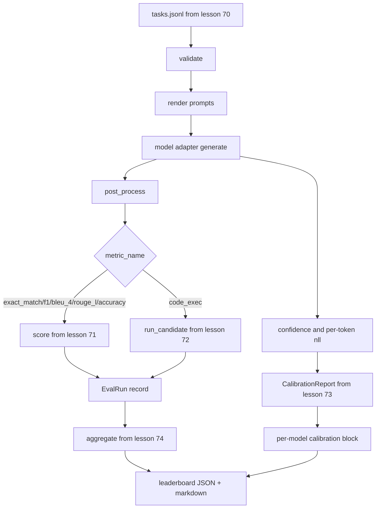

# دوچرخه ایوال آخر تا آخر

> پنج درس لوله کشی، یک درس برای چسبیدن آنها. دوچرخه کار مشخصه را از درس 70 می خواند، یک مدل را از طریق یک آداپتور می خواند، با درس 71 و 72 امتیاز می دهد، گزارش کالیبراسیون را از درس 73 متصل می کند و صفحه رتبه را از درس 74 منتشر می کند. دیمو خود را به پایان می رساند.

**Type:** Build
**Languages:** Python
**Prerequisites:** Phase 19 Track B foundations, lessons 70 through 74
**Time:** ~90 min

## اهداف یادگیری

- تعریف یک`ModelAdapter`رابطی که هر مدل (مستقیم، محلی، API) می تواند با یک سطح کوچک روش را برآورده کند.
- ارزیابی را در یک فایل JSONL ثابت با اجرای موازی کار در سراسر یک مجموعه کار اجرا کنید.
- لایه متریکی (exact_match، F1, BLEU-4, ROUGE-L، code_exec) را با لایه کالیبریشن در یک گذر ترکیب کنید.
- برآورد هر مدل`EvalRun`ضبط و به طور مستقیم به جمع کننده لیست رتبه بندی ارسال می شود.
- هر دو گزارش JSON و جدول نشان دادن را خارج کنید؛ خود پایان دادن با خروج صفر در یک اجرا تمیز، غیر صفر در اعتبار یا شکست زمان اجرا.

```figure
eval-grid
```

## خط لوله



دوچرخه نقطه ادغام است. هر درس 70 تا 74 دارای یک ماژول است که دوچرخه ساز می کند. دوچرخه هیچ منطق از آن ماژول ها را تکرار نمی کند: آنها را وارد می کند.

## رابط آداپتور

آداپتور هم بین رانر و هر مدل است. رابط عمداً کوچک است.

```python
class ModelAdapter:
    model_id: str

    def generate(self, prompt: str, task: TaskSpec) -> Generation: ...
```

`Generation`یک کلاس داده با:

- `text`: تولید شکل آزاد مدل
- `confidence`: يه شناور در`[0, 1]`نشان دهنده احتمال خود گزارش شده مدل برای پاسخ
- `token_nll`: مجموع اختیاری احتمالات منفی ثبت نسبت به توکن های تولید شده
- `token_count`: تعداد اختیاری توکن های تولید شده

آداپتورهای ساختگی در رانر سه طعم را ارائه می دهند: `RuleBasedAdapter`(تثبیت گرایی، نزدیک به کامل)`NoisyAdapter`(به خود اعتمادی زیاد، اغلب اشتباه) و`BiasedAdapter`(در یک دسته خوب، در یکی بد) نمایش تمام سه مورد را در کلاس 70 اجرا می کند.

## اجرا موازی

راننده ها استفاده ميکنن`concurrent.futures.ThreadPoolExecutor`برای اجرای وظایف به طور موازی در هر مدل. شمارش کارکن به طور پیش فرض به کوچکترین هشت و شمارش کار است. رشته ها کافی هستند زیرا گلو شکنی برای تماس های واقعی مدل شبکه I / O است. مسیر کد-exec فرعی خود را در داخل کار ایجاد می کند و اجرا کننده فقط زمان انتظار را برنامه ریزی می کند.

برای تست های تعیین کننده، دوچرخه باز می کند`run_eval(adapters, tasks, parallel=False)`پس تست ها ميتونن دستور اعدام رو مشخص کنن

## حلقه امتیاز یک گذر

برای هر وظیفه:

1. ارسال پیامک (پیشگویی چند شوت به همراه جسم پیامک)
2. به آداپتور زنگ بزن و وقت تماس رو بگير
3. بعد از پردازش نسل مطابق با قانون کار
4. به لایه متريک ارسال کنيد
5. ساخت یک`EvalRun`با نمره و متريک ميتا داده ها ثبت
6. اضافه کردن`(confidence, correct)`با باز کننده کالیبریشن جفت کنید.

.`correct`سیگنال اینه`score >= 1.0`برای متریک های سبک exact_match (`exact_match`،`accuracy`،`code_exec`) و `score >= 0.5`برای معیارهای درجه بندی شده.`_correct_from_score`و راننده یک سرزنش عمومی را نشان نمی دهد.

## جمع بندی

بعد از اينکه هر کار نتيجه اي داشته باشه، راننده زنگ مي زند`aggregate`و`pairwise_diffs`از درس 74 و`CalibrationReport.from_predictions`از درس 73، محصول یک پاکت JSON واحد است:

```json
{
  "leaderboard": [...],
  "pairwise": [...],
  "calibration": {
    "model_id_a": {"ece": 0.04, "brier": 0.10, "populated_bins": 8, ...},
    ...
  },
  "summary": {
    "tasks": 10,
    "models": 3,
    "wall_seconds": 1.2
  }
}
```

رانر همچنین یک جدول نشان دادن را به stdout می نویسد تا کاربر بتواند نتیجه را در بررسی روابط عمومی پیوند دهد.

## نماد خودکشی

در نمایشگاه سه آداپتور ساختگی در طول ده کار ثابت از درس 70 اجرا می شود. زمان دیوار باید کمتر از ده ثانیه باشد. کد خروج صفر در یک اجرا تمیز است.

معیارهای تمیز بودن عبارتند از:

- هر کاري که تحت درس 70 انجام ميده
- هر کار تحت درس 71 و 72 نمره گرفت
- گزارش کالیبراسیون بدون خطا در کلاس 73 جمع آوری شده است.
- در رتبه بندی رتبه بندی آداپتور مبتنی بر قوانین به طور دقیق بالاتر از آداپتور تصادفی است.

اگر یکی از این شکاف ها رخ دهد، رانر با یک خطا ساختاری در پاکت JSON از صفر خارج می شود.

## آنچه این درس انجام نمی دهد

این مدل یک مدل واقعی را نمی خواند. این یک جریان کلید API یا رفتار محدود کنترل را اجرا نمی کند. این جریان یا تولید جزئی را اجرا نمی کند؛ آداپتور یک نسل را به هر تماس باز می گرداند. این آزمایشات را تکرار یا ذخیره نمی کند. این نگرانی ها در لایه آداپتور زندگی می کنند؛ رانر متریک-آگنوستیک و ارائه دهنده-آگنوستیک است.

## چطور کد رو بخونيم

`main.py`این یکپارچه سازی است. از پنج ماژول درس دیگر از طریق یک`_load_sibling`کمک کننده ای که آنها را با مسیر نسبی حل می کند.`Generation`،`EvalReport`و`ModelAdapter`آداپتورهای ساختگی در پایین فایل هستند.

بخون`main.py`از بالا تا پایین واردات رو چک کن بعدش نگاه کن`run_eval`، پس`_score_one`، بعد از آن آداپتورها. نمایش در آخر نقطه ورود است.

آزمایشات در`code/tests/test_runner.py`رابط آداپتور، حلقه ی یک مرتبه، معادلیت موازی به مقابل دنباله دار، بازنده کالیبریشن و شکل پاکت JSON را پین کنید.

## . به جلوتر می رسیم

این رانر کف است. یک سیستم ارزیابی تولید اضافه می کند: یک کش نتایج که توسط `(task_id, model_id, model_version)`، یک دفتر هزینه که دلار و توکن ها را در هر اجرا ردیابی می کند، یک لایه بازجویی که محدودیت نرخ را پشت سر می گذارد، یک سیاست نمونه گیری برای وظایف عبور از k و یک قالب خروجی جریان برای مجموعه های طولانی است. هر یک از این موارد یک نگرانی منحصر به فرد است که بدون تغییر لایه های متریک یا جمع آوری را پوشش می دهد. این جداسازی نقطه قرارداد است.

بعد از اینکه جعله ها کار می کنند، یک آداپتور برای یک ارائه دهنده واقعی اضافه کنید. یکی را با یک لایه رایگان انتخاب کنید، سی خط چسب بنویسید، ببینید صفحه ی رتبه بندی روشن می شود. سپس ارائه دهنده دوم را اضافه کنید و اجازه دهید که هرنس کار را انجام دهد.
