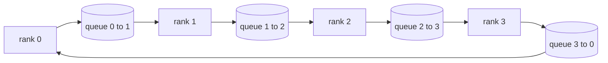

# عملیات جمعی از ابتدا

> چهار عملیات جمعی که آموزش توزیع شده را در کنار هم دارند، همه کاهش، پخش، همه جمع و کاهش_تراکنده هستند. هر یک از هر چهار چارچوب آموزشی ابتدایی دیگری ارائه می دهد یک بسته در اطراف آنها است. آنها را یک بار بر روی یک`multiprocessing.Queue`شبکه، آنها را با یک پیاده سازی مرجعیت بررسی کنید و بقیه مسیر به لوله کشی تبدیل می شود.

**Type:** Build
**Languages:** Python
**Prerequisites:** Phase 19 Track C lessons 42-49
**Time:** ~90 min

## اهداف یادگیری

- حلقه پیاده سازی allreduce در دو گذر (reduce-scatter سپس allgather) و ثابت کنید که حجم ارتباطات در هر رتبه 2 ((N-1) / N بایت ها در هر عنصر است.
- پخش بسازید، همه را جمع کنید و کاهش_تراکنده را در بالای ارسال های نقطه به نقطه ایجاد کنید `multiprocessing.Queue`. .
- هر نوع اوليه رو با يه`torch.distributed`برای همین ورودی، مرجع زیر
- از انتخاب حلقه در مقابل درخت در شکل کلستر، کف تاخیر و سقف عرض باند دفاع کنید.

## مشکل

یک همه کم کردن ساده بر روی N صف ها N بار تنسور را به ریشه ارسال می کند و N بار را به عقب منتقل می کند. عرض باند به عنوان O ((N) در هر رتبه، ریشه تبدیل به یک گلو شکنی می شود، و کف دیوار ساعت آهسته ترین لینک ضرب N است. حلقه تمام آن را به 2 ((N-1) قطعه اندازه T / N کاهش می دهد، بنابراین بائتهای هر رتبه به 2T ((N-1) / N مستقل از اندازه کلستر می افتد. درخت allreduce در لینک های کوچک N و تاخیر بالا برنده می شود زیرا عمق log2(N) به جای 2(N-1 هپ می شود. توپولوژی اشتباه رو برای شکل کلستر انتخاب کن و آهسته ترین GPU زمان قدم رو تعیین کنه

هر چارچوب آموزشی توزیع شده ای که این آهنگ را می خوانید به این چهار ابتدایی بستگی دارد. PyTorch DDP gradients را با یک allreduce در هر سطل پارامتر هم وقت می دهد. ZeRO حالت بهینه سازی را با کاهش_تراکنده کاهش می دهد و پارامترهای به روز شده را توسط allgather پخش می کند. FSDP تمام جلو را به allgather + reduce_scatter تبدیل می کند. نیاز های موازی لوله برای فعال سازی در سراسر گروه های مرحله ای پخش می شود. اگر نمی توانید چهار مجموعه را پیاده سازی کنید، نمی توانید درباره اینکه چرا تمرین متوقف می شود، چرا عدم مطابقت گرادینت در رتبه 3 ظاهر می شود، یا چرا حباب لوله زمانی که توپولوژی ها را عوض می کنید دو برابر می شود، استدلال کنید.

## مفهوم



### حلقه تمام در دو گذر

تنسور را به N برابر به قسمت های شاخص شده 0..N-1 تقسیم کنید. هر درجه دارای شاخص قطعه برابر با درجه خود است. گذرگاه 1، پخش کننده کم، راه N-1 در مرحله s، رتبه r بخش (r - s) mod N را به رتبه (r + 1) mod N ارسال می کند و بخش (r - s - 1) mod N را از رتبه (r - 1) mod N دریافت می کند و بخش دریافت شده را به نسخه محلی خود جمع می کند. پس از مراحل N-1، رتبه r مالک کل مبلغ برای قطعه r است. گذر 2، همه جمع، گام های N-1 دیگر را اجرا کنید و قطعات نهایی را در اطراف حلقه چرخش کنید تا هر رتبه مجموع کامل هر قطعه را نگه دارد.

| Primitive | Per-rank bytes | Steps | When to use |
|-----------|---------------|-------|-------------|
| Ring allreduce | 2T(N-1)/N | 2(N-1) | Large T, fat-pipe homogeneous cluster |
| Tree allreduce | T log2(N) | 2 log2(N) | Small T or high-latency links |
| Broadcast | T | log2(N) tree | Parameter init, scalar config |
| Allgather | T(N-1)/N | N-1 | Sharded forward, ZeRO unshard |
| Reduce_scatter | T(N-1)/N | N-1 | ZeRO gradient sharding |

### شبکه های صف به عنوان جایگزین NCCL

NCCL بر روی PCIe و NVLink با کاهش های بارگذاری سخت افزاری اجرا می شود.`multiprocessing.Queue`در هر حلقۀ حلقۀ به شما تحویل نقطه به نقطه سفارش داده شده با یک تولید کننده و یک مصرف کننده است. کاهش در فضای کاربر اتفاق می افتد، بنابراین شما پرداخت هزینه های عمومی پایتون، اما الگوی سیم یکسان با NCCL حلقۀ allreduce است. دلیل در مورد درست بودن در نسخه صف و رفتار کلستر دنبال می شود.

### با توجه به گلوو بررسی کنید

هر نوع ابتدایی با یک آزمون واحد که تولیدش را با مقایسه`torch.distributed`اگر حلقه ی شما از گلوو با بیش از یک فلوت32 ایپسایل متفاوت باشد، آزمایش شکست می خورد. تأیید با یک پیاده سازی مرجع قابل مذاکره نیست؛ بدون آن، اولیه تا مرحله 10000 یک تمرین واقعی درست به نظر می رسد.

```figure
ci-ring-allreduce
```

## آن را بسازید

`code/main.py`ابزار:

- `Mesh`کلاس که سیم N `multiprocessing.Queue`نمونه ها به حلقه و افشا کردن`send(dst, tensor)`و`recv(src)`به هر رتبه
- `ring_allreduce(mesh, rank, world_size, tensor)`دو پاس الگوریتم رو اجرا مي کنم
- `broadcast(mesh, rank, world_size, tensor, src)`بر روی یک درخت لوگاریتمیک.
- `allgather(mesh, rank, world_size, tensor)`با استفاده از چرخش N-1
- `reduce_scatter(mesh, rank, world_size, tensor)`به عنوان نیمه اول آلدرویدس
- `_gloo_reference(op, world_size, tensor)`که از طریق همان ورودی عبور می کند`torch.distributed`با گلوو برای مقایسه باایت برابر

اجرا کن

```bash
python3 code/main.py
```

خروجی: جدول تأیید اولیه که خروجی های قطار-شبک و گلو را مقایسه می کند، و بعد از آن یک شمارنده بایت در هر رتبه که مقیاس 2T(N-1) /N را اثبات می کند.

## الگوهای تولید در طبیعت

سه الگوي به اندازه ي کافي براي ارسال به ابتدايان سخت ميکنه

**Bucket gradients before allreduce.**یک مدل پارامتر 1B دارای ده ها هزار تنسور گرادینت است. یک allreduce به هر تنسور به سطح خستگی N بار پرداخت می کند. DDP سطل gradients را به ~ 25 MB قطعات و emit یک allreduce به هر سطل؛ تنسورهای کوچک در پشت بزرگ ها سوار می شوند. بدون سطل کردن هزینه خستگی بر مرحله تسلط دارد.

**Overlap communication with computation.**گریادینت های گریادینت را لایه به لایه در ترتیب برعکس محاسبه می کند. در لحظه ای که گریادینت آخرین لایه آماده است، تمام کاهش آن را شروع می کند در حالی که لایه بعدی محاسبه را ادامه می دهد. PyTorch DDP این را با هک های آماده سطل سیم می زند. تعادل زمان ارتباطی قابل مشاهده را در هنگام کاهش سرعت شبکه نصف می کند.

**Pick ring or tree by message size, not religion.**NCCL یک آشکارساز توپولوژی را ارسال می کند که برای پیام های بالای ~ 1 MB و درخت زیر حلقه را انتخاب می کند. کراسور بیندوت در مقابل تاخیر است: بالاتر از 1 MB ، اصطلاح بیندوت 2T(N-1) / N تسلط دارد و حلقه برنده می شود؛ پایین از 1 MB ، تعداد hop log2(N برنده می شود. سخت کدگذاری یک توپولوژی هزینه تولید در اندازه پیام اشتباه است.

## ازش استفاده کن

الگوهای تولید:

- **PyTorch DDP.**تماس ها`dist.all_reduce`در گرادیان بسته بعد از عقب. اندازه سطل تنظیم می شود؛ 25 MB پیش فرض برای 100Gbit Ethernet منطقی است.
- **DeepSpeed ZeRO.**مسائل کاهش_تفرق به gradients شارت و همه جمع آوری برای بازسازی پارامترهای کامل قبل از ادامه.
- **FSDP.**پیشروی با همه جمع آوری برای تجزیه لایه شروع می شود، محاسبه می کند، سپس با کاهش_تراکنده کاهش می یابد و شکاف را رد می کند. همان ابتدایی ها، برنامه های مختلف.

## -باده

استفاده از اولیاء قطار میش در درس 77-81. درس 77 سیم ها همه به DDP کاهش می یابد. درس 78 سیم ها کاهش_تراکنده به ZeRO. درس 79 سیم ها پخش به فعال سازی لوله. درس 81 همه چهار را در دموکراسی پایان به پایان تشکیل می دهد.

## تمرینات

1. یک درخت اضافه کنید و همه را کاهش دهید و بین حلقه و درخت با اندازه پیام تغییر دهید.
2. اضافه کنید`recv_timeout_ms`پس یک رتبه متوقف شده به جای برای همیشه به جای خطا زمان بندی ظاهر می شود.
3. جایگزینش کن`multiprocessing.Queue`با سوکت های TCP برای چهار ابتدایی.
4. یک ربط ابزار باند اضافه کنید تا بایت های هر رتبه به JSONL ثبت شوند.
5. زمان ساعت دیوار حلقه در مقابل درخت را در 4 صف برای تنسورهای اندازه 1KB، 1MB، 16MB مقایسه کنید. از کراسور به طور تجربی دفاع کنید.

## اصطلاحات کلیدی

| Term | What people say | What it actually means |
|------|----------------|------------------------|
| Allreduce | "Sum across ranks" | After the call every rank holds the same reduced tensor |
| Ring | "The fast topology" | N-1 chunks of size T/N flow around the cycle twice |
| Tree | "The log topology" | Reduction follows a binary tree; depth is log2(N) hops |
| Allgather | "Concatenate shards" | Every rank ends with every other rank's shard |
| Reduce_scatter | "Split the sum" | Each rank ends with the sum of one chunk only |
| Bucket | "Fuse small tensors" | Coalesce N small allreduces into one large one |

## خواندن بیشتر

- [PyTorch Distributed: NCCL collectives](https://pytorch.org/docs/stable/distributed.html#collective-functions)
- [Horovod ring allreduce paper](https://arxiv.org/abs/1802.05799)
- [NCCL topology and algorithm selection](https://docs.nvidia.com/deeplearning/nccl/user-guide/docs/index.html)
- [Patarasuk and Yuan, Bandwidth optimal allreduce algorithms](https://www.cs.fsu.edu/~xyuan/paper/09jpdc.pdf)
- مرحله 10 درس 05 - برآوردهای عمومی آموزش توزیع شده
- مرحله 19 درس 77 - DDP به بالای این ابتدایی ها متصل شده
