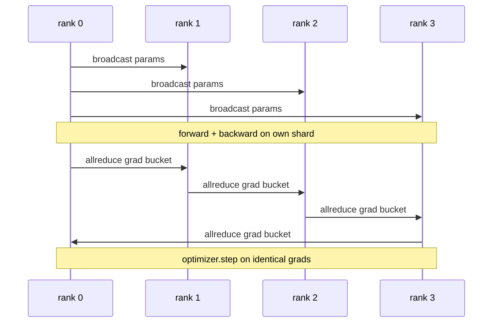

# داده های موازی DDP از ابتدا

> توزیع شده داده متوازنه یک هوک در بالای allreduce است. یک مدل را بسته کنید، پارامترهای اولیه را از رتبه 0 پخش کنید تا هر رتبه شروع به یکسان شود، یک هوک عقب بر روی هر پارامتر نصب کنید که یک allreduce از گرادیانت را صادر کند و بقیه کاهش گرادیانت است. کل الگوی 200 خط است.

**Type:** Build
**Languages:** Python
**Prerequisites:** Phase 19 Track C lessons 42-49
**Time:** ~90 min

## اهداف یادگیری

- .`DistributedDataParallel`-پوشه شکل ای که پارامترهای اولیه را پخش می کند و گرادینت ها را پس از عقب کاهش می دهد.
- اسپون N CPU با `torch.multiprocessing.spawn`با ملاقات هاي مبتنی بر پرونده
- ثابت کردن دقت همگام سازی گرادینت با آموزش یک مدل مشابه بر روی داده های مشابه به ترتیب و نشان دادن معادلات پارامتر در هر مرحله.
- از استفاده از سطل (آزاد گریادینت) و همپوشانی (تغییر در زمان عقب) به عنوان دو تغییر که یک DDP کار را به یک DDP تولید تبدیل می کند دفاع کنید.

## مشکل

یک مدل ۱ میلیارد پارامتر با ۱۲ گابایت فعال سازی در یک GPU مصرف کننده مناسب نیست. حتی زمانی که مناسب باشد، آموزش هفته ها طول می کشد. داده های موازی دسته را در میان N صف ها تقسیم می کند، هر صف بر روی شکه خود به جلو و عقب محاسبه می کند و در هر مرحله گرادینت هر صف جمع می شود تا همه N کپی یکسان باقی بمانند. گرادینت جمع شده چیزی است که بهینه کننده گام می برد.

بدون همگام سازی گرادینت، N رپلیک ها با مرحله 2 منحرف می شوند. مدل دیگر "یک مدل آموزش داده شده بر روی داده های بیشتر" نیست، این مدل های جداگانه N است که اتفاق می افتد وزن اولیه را به اشتراک بگذارند. با هم وقت سازی گرادینت بد انجام شده (یک allreduce در هر پارامتر، هیچ تعویض، هیچ سطل) شبکه گلو شکنی است و GPU ها منتظر سیم هستند. دستگاه DDP داره همگامي گرادينت رو نسبت به حساب تقريبا آزاد ميکنه PyTorch DDP کانونیکی با گرادینت های سطل، تعویض تمام کاهش با لایه بعدی به عقب و با استفاده از NCCL در NVLink این کار را انجام می دهد. ما می تونیم سه تا رو با گلوو در CPU انجام بدیم و درس های مشابهی یاد بگیریم.

## مفهوم



### سه عملیات که DDP نیاز دارد

| Stage | Collective | Why |
|-------|-----------|-----|
| Init | broadcast from rank 0 | Every rank starts with the same parameters |
| After backward | allreduce of each grad | The mean gradient is what the optimiser steps on |
| Sometimes | broadcast of buffers | Batchnorm running stats stay synchronised |

### چرا بد و نه جمع

Allreduce-SUM به اندازه world_size gradient متوسط را می دهد. متوسط به اندازه world_size نامتغیر است: نرخ یادگیری تنظیم شده در یک رتبه در چهار رتبه کار می کند زیرا میزان gradient هر مرحله تغییر نمی کند. Allreduce-SUM بدون تقسیم شما را مجبور می کند هر بار که اندازه کلستر را تغییر دهید سرعت یادگیری را تنظیم کنید. DDP SUM را بسته می کند و تقسیم می کند؛ در درس همین کار را انجام دهید.

### چرا گرادین های سطل

یک ترانسفورماتور دارای هزاران تنسور پارامتر است. یک allreduce در هر تنسور هزار بار کف تاخیر خیره کننده را پرداخت می کند. DDP گرادینت ها را به ~ 25 MB سطل و یک allreduce در هر سطل منتشر می کند. همان بائتهای کل در سراسر سیم حرکت می کنند اما تاخیر در سطل کاهش می یابد. برای مدل کوچک درس ما همه چیز را به یک سطل جمع می کنیم؛ ساختار چیزی است که حمل می کند.

### چرا بذره رو ببندم

هر رتبه بايد صداي کنه`torch.manual_seed(seed + rank)`براي مخلوط کردن ولي`torch.manual_seed(seed)`برای پارامتر init. یک دانه مشترک واحد به معنای هر رده به همان ترتیب دسته (موازح داده های شکست) می بیند؛ یک دانه خاص رتبه برای پارامتر ها به معنای پارامترهای اولیه با افق افق و همگام سازی گرادینت دیگر باعث شبیه سازی نمی شود.

```figure
ci-ddp-grad-sync
```

## آن را بسازید

`code/main.py`ابزار:

- `MiniMLP`: یک MLP سه لایه کوچک به اندازه کافی برای همگام شدن در ثانیه، بزرگ به اندازه کافی برای افشا کردن سیم.
- `DistributedDataParallel(model, world_size)`: پخش پارامای در زمان ساخت، بازگشت یک بسته بندی که `sync_grads`تمام درجه های جمع شده را با اندازه جهانی تقسیم می کند.
- `worker(rank, world_size, ...)`: کل چرخه آموزش با `torch.distributed`شروع به جلو، عقب، همگام سازی، مرحله
- `_reference_single_process_loop(...)`: در یک رده، یک مدل را به ترتیب بر روی داده های مشابه، در یک مرحله، در آزمایش معادلات پارامتر باایت برابر پس از هر مرحله، استفاده می کند.

اجرا کن

```bash
python3 code/main.py
```

خروجی: یک جدول آموزشی در هر مرحله که از دست دادن یک فرآیند و جمع چک پارامتر به DDP در 4 صف مقایسه می شود. دو مسیر منحنیات ضرر یکسان را برای شناور epsilon تولید می کنند، که ثابت می کند همگام سازی گرادینت درست است.

## الگوهای تولید در طبیعت

سه الگوي DDP رو به اندازه ي کافي سخت ميکنه تا ارسال بشه

**Find unused parameters.**برخی از مسیرهای پیش رو به صورت مشروط پارامترها را رد می کنند (خروج اولیه، مخلوط روتر متخصص). پارامترهای رد شده هیچ گرادینتی ندارند، اما هک آماده کدو DDP هنوز منتظر آنها است و همه قفل های متوقف را کاهش می دهد. `find_unused_parameters=True`به DDP می گوید که قبل از کاهش به نظر برسد که کدام پارامر گرادینت داشته باشد. هزینه یک گرافیک قدم در هر مرحله است، بنابراین آن را کنار بگذارید مگر اینکه شاخه های جلو شما باشد.

**Static graph optimisation.**وقتي که جلو در طول پله ها ثابت باشه`static_graph=True`DDP می تواند برنامه ی سطل را پیش محاسبه کند. بهینه سازی در مقیاس مهم است: پیش محاسبه چند ms در هر مرحله را ذخیره می کند که در 10000 مرحله ترکیب می شود.

**Gradient accumulation needs care.**جمع آوری گرادیون ها در مایکروباتش های K بدون همگام سازی هر میکروباتش یک پیروزی 10 برابر در تولید است.`no_sync()`به عنوان یک مدیر زمینه که توقف پس از عقب تمام کاهش.

## ازش استفاده کن

الگوهای تولید:

- **PyTorch DDP.**اجرای قانونی. `torch.nn.parallel.DistributedDataParallel(model)`سیم ها با هم می پیوندند، همپوشانی می کنند و زمینه no_sync
- **HuggingFace Accelerate.**يه پرتابي اضافه ميکنه که دستش رو نگه داره`torchrun`.تويج و مدل بسته همينه
- **Megatron-LM data parallel.**DDP را با متوازی تنسور برای مدل های بزرگ ترکیب می کند؛ قطعه متوازی داده همان الگوی تمام کاهش پس از عقب است.

## -باده

درس 78 (زرو شاردینگ) جایگزین هر پارامتر allreduce با reduce_scatter می کند بنابراین هر رتبه فقط شارت خود را از حالت بهینه سازی ذخیره می کند. درس 81 DDP را با ZeRO در دموکراسی پایان به پایان ترکیب می کند.

## تمرینات

1. سطل های گرادینت اندازه قابل تنظیم را اضافه کنید و سرعت را در مقایسه با یک تمام کاهش در هر پارامتر در یک مدل عمیق تر اندازه گیری کنید.
2. اجرا`no_sync()`به عنوان یک مدیر زمینه و تأیید تراکم گرادینت با یک خط پایه یک فرآیند در مورد میکروباتش های K مطابقت دارد.
3. اضافه کنید`find_unused_parameters`حالت که در آن پیشرو گاهی اوقات یکی از لایه های MLP را رد می کند؛ بدون پرچم، دویدن باید خنک شود.
4. گلوو رو با  عوض کن`torch.distributed.barrier()`- تنها همگام سازی برای درک تفاوت بین همگام سازی مبتنی بر تمام کاهش و همگام سازی مبتنی بر مانع.
5. هزینه های بالای هم وقت سازی گرادینت را به عنوان بخشی از زمان مرحله برای اندازه های دسته 1, 16, 256 اندازه گیری کنید و مقیاس را توضیح دهید.

## اصطلاحات کلیدی

| Term | What people say | What it actually means |
|------|----------------|------------------------|
| DDP | "Data parallel" | Wrapper that broadcasts params and allreduces grads each step |
| Bucket | "Fuse grads" | Group N small allreduces into one large one |
| Overlap | "Hide comm" | Issue allreduce while later layers still computing backward |
| no_sync | "Accumulate" | Skip the post-backward allreduce for gradient accumulation |
| find_unused | "Branchy forward" | Detect parameters with no grad before reducing |

## خواندن بیشتر

- [PyTorch DistributedDataParallel docs](https://pytorch.org/docs/stable/generated/torch.nn.parallel.DistributedDataParallel.html)
- [PyTorch DDP internals tutorial](https://pytorch.org/tutorials/intermediate/ddp_tutorial.html)
- [Li et al, PyTorch Distributed: Experiences on Accelerating Data Parallel Training](https://arxiv.org/abs/2006.15704)
- مرحله 19 درس 76 - کلکسیون DDP بر اساس
- مرحله 19 درس 78 - زرو شارت کردن جایگزین perparam allreduce با reduce_scatter می شود
