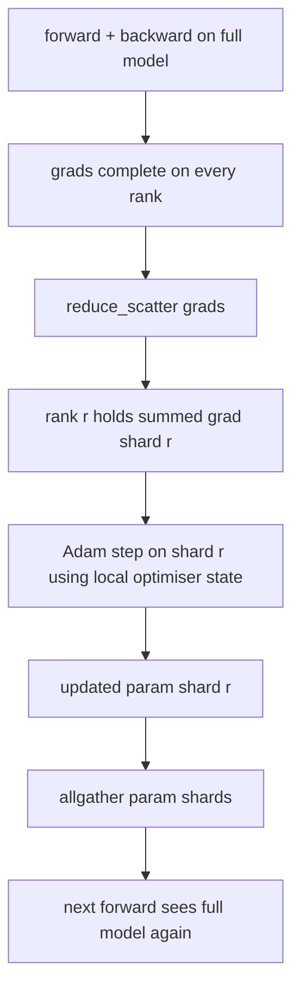

# زرو بهینه سازی حالت شاردن

> آدم دو تا از اندازه گیری لحظه ها رو در هر پارامتر ذخیره ميکنه، هر دو در float32 یک مدل 7B دارای 56 جی بی حالت بهینه تر است. مرحله 1 ZeRO از میان رتبه های N را پاره می کند؛ هر رتبه دارای 1/N از بهینه کننده است. بعد از مرحله محلی، پارامتر های به روز شده بازگردانده می شوند، هر رتبه مدل کامل را بازسازی می کند و مرحله بعدی شروع می شود. برنده شدن به عنوان کاهش خطی حافظه در بزرگترین واحد اختصاص در استیک آموزش است.

**Type:** Build
**Languages:** Python
**Prerequisites:** Phase 19 Track C lessons 42-49
**Time:** ~90 min

## اهداف یادگیری

- حالت بهینه سازی شارت (حظات اول، لحظه دوم، نسخه اصلی fp32) در صف های N به طوری که هر صف مالک 1/N است.
- از reduc_scatter برای ارائه هر درجه فقط مجموع گرادینت شارت آن استفاده کنید، سپس همه را جمع آوری کنید تا شارت های پارامتر به روز شده را به عقب پخش کنید.
- جدول ذخیره حافظه برای مرحله 1، مرحله 2، مرحله 3 را با DDP وانیل محاسبه کنید.
- از انتخاب مرحله 1 در مقابل مرحله 2 در مقابل مرحله 3 در مورد اندازه مدل و بودجه عرض باند دفاع کنید.

## مشکل

Vanilla DDP همه چیز را تکرار می کند: پارامترها، گرادیانت ها و حالت بهینه سازی در هر رده وجود دارد. برای یک مدل پارامتر 7B در fp16 که به معنای 14 جی بی پارامتر، 14 جی بی گرادیانت ها و 28 جی بی حالت بهینه سازی در هر رده است. حالت بهینه سازی بزرگترین اصطلاح و آسان ترین شکاف است زیرا فقط در طول مرحله لمس می شود، نه در طول پیش یا عقب.

مرحله اول زرو حالت بهینه سازی را کاهش می دهد. هر درجه 1 N از لحظه های آدم را نگه می دارد. پس از عقب، به جای کاهش تمام گرادینت و قدم زدن به صورت محلی، ZeRO کاهش_scatters را کاهش می دهد تا هر رتبه فقط گرادینت جمع شده شارت خود را دریافت کند. رتبه به بخش اصلی پارامترهای خود، مرحله بهینه کننده را اعمال می کند. پارامتر های به روز شده سپس همه را به هم می آورند تا هر رتبه مدل کامل برای آینده بعدی داشته باشد. حافظه مطلوب تر به N کاهش می یابد ترافیک سیم در هر مرحله مشابه DDP است: یک reduc_scatter به علاوه یک allgather برابر با یک allreduce با عرض باند است. حافظه برنده ميشه، تولید نگه داره

## مفهوم



### مراحل ZeRO

| Stage | What is sharded | Memory per rank | Comm per step |
|-------|----------------|------------------|---------------|
| DDP | nothing | params + grads + optim | 1x allreduce |
| ZeRO-1 | optimiser state | params + grads + optim/N | 1x reduce_scatter + 1x allgather |
| ZeRO-2 | optim + grads | params + grads/N + optim/N | 1x reduce_scatter + 1x allgather |
| ZeRO-3 | optim + grads + params | params/N + grads/N + optim/N | 1x allgather per layer + 1x reduce_scatter per layer |

مرحله 1 ارزان ترین پیروزی است زیرا حالت بهینه سازی بر بودجه تسلط دارد. مرحله 2 نیاز به منطق تراکم تراکم تراکم گرادینت دارد اما عرض باند یکسان است. مرحله 3 (FSDP) برای هر لایه به جلو و عقب پرداخت می کند و از کاهش حافظه پارامتر تراکم می کند. درس مرحله 1 را به طور کامل اجرا می کند.

### ریاضیات حافظه، اعداد واقعی

برای یک مدل با پارامترهای P که با دقت مخلوط با آدم آموزش دیده است:

| Term | Vanilla | ZeRO-1 | Why |
|------|---------|--------|-----|
| fp16 params | 2P bytes | 2P bytes | needed for forward |
| fp16 grads | 2P bytes | 2P bytes | needed for backward |
| fp32 master copy | 4P bytes | 4P/N bytes | only the optim uses it |
| fp32 first moment | 4P bytes | 4P/N bytes | only the optim uses it |
| fp32 second moment | 4P bytes | 4P/N bytes | only the optim uses it |
| Total | 16P bytes | 4P + 12P/N bytes |   |

در N=8: وانیل 16P، ZeRO-1 5.5P، ۶۵ درصد کاهش یافته است. در N=64: وانیل 16P، ZeRO-1 ۴.۱۹P، ۷۴ درصد کاهش یافته است.

### چرا reduc_scatter beat allreduce-then-shard

آلدروسی به هر درجه درجه ی کامل و جمع شده را می دهد. اگر فقط به شارت r نیاز دارید، (N-1) /N گرادینت که کاهش یافته است در رتبه r ضایع می شود. Reduce_scatter دقیقاً همان شیش را که هر رتبه مالک است ارائه می دهد؛ بائتهای هر رتبه با تمام کاهش یکسان هستند (از آنجا که allreduce reduce_scatter + allgather است) اما نیمه دوم با پارامتر-shard allgather در بعد جایگزین می شود. سیم شبکه با DDP یکسان است، حافظه تقسیم شده است.

```figure
cd-zero-shard
```

## آن را بسازید

`code/main.py`ابزار:

- `flatten_params(module)`و`unflatten_into(module, flat)`که پارامترهای یک مدل را به یک تنسور متصل بسته می کند و پس از آن باز می کند. طرح مسطح چیزی است که تکه تکه را به یک تکه ساده می کند.
- `ZeroOptimizer(model, world_size, rank, lr)`که صاحب بخش درجه ی کپی اصلی و لحظه های آدم است.
- `step()`که در gradient صاف reduce_scatter اجرا می کند، آدم را به کاشی رتبه اعمال می کند و تمام پارامترهای به روز شده را به عقب جمع می کند.
- یک نمایشگاه که یک MLP سه لایه را برای 20 مرحله آموزش می دهد و بودجه حافظه هر مرحله را در کنار یک خط پایه DDP وانیل چاپ می کند.

اجرا کن

```bash
python3 code/main.py
```

خروجی: از دست دادن هر مرحله و جدول حافظه که ZeRO-1 را نشان می دهد، 1/N حالت بهینه کننده را در هر رده در مقابل نسخه کامل DDP دارد.

## الگوهای تولید در طبیعت

سه طرح زرو رو به اندازه کافی سخت می کنه تا بفرستد

**Sharded checkpointing matters.**حالت بهینه سازی ZeRO-1 به میان صف ها تقسیم می شود؛ نقطه بازرسی باید ثبت کند که کدام رتبه مالک چه چیزی است. درس 80 مانیفست نقطه بازرسی را تشکیل می دهد که یک اجرای ZeRO را در همان اندازه جهانی ادامه می دهد. بدون آن حالت ذخیره شده در حالت بازخورد غیر قابل خواندن است.

**Mixed precision is the point.**ZeRO یک تکنیک دقیق مخلوط است؛ نسخه اصلی fp32 چیزی است که پاره شده است. اجرا ZeRO بدون دقت مخلوط مالیات حافظه را بر fp32 master بدون برنده شدن fp16 در جلو پرداخت می کند. اجرا تولید همیشه ZeRO را با وزن های اتوماتیک یا bf16 جفت می کند.

**Stage 1 is a near-free win.**کمیون با DDP در عرض باند یکسان است. ذخیره حافظه خطی در N است. تنها هزینه حسابداری برای شیرد بهینه سازی است. تولید به طور پیش فرض به مرحله 1 می رسد مگر اینکه حافظه شیرد پارامتر نیز یک مشکل باشد. سپس مرحله 2 یا 3 تجارت می کند.

## ازش استفاده کن

الگوهای تولید:

- **DeepSpeed ZeRO.**اجرای مرجع. `deepspeed_config.json`مرحله 1/2/3 و اندازه های پارتیشن را انتخاب می کند.
- **PyTorch FSDP.**معادل بومی پایتورچ`ShardingStrategy.SHARD_GRAD_OP`زرو-2 است. `FULL_SHARD`زرو-3 هست
- **HuggingFace Accelerate.**هم DeepSpeed و هم FSDP رو تحت یک ساختار یونیفارم بسته

## -باده

درس 79 (مواز خط لوله) محور تراش راست است: به جای تراش حالت بهینه کننده در سراسر یک مدل، خط لوله در میان صف ها را تراش می کند. درس 81 DDP + ZeRO را در دموکراسی پایان به پایان تشکیل می دهد.

## تمرینات

1. به ZeRO-2 با شکستن gradients گسترش دهید: هر رتبه تنها gradient برای شکسته خود را ذخیره می کند، که با صفر کردن بخش غیر شکسته پس از عقب به دست می آید.
2. یک پروفایلر حافظه را اضافه کنید که استفاده واقعی باایت fp32 را در رتبه 0 در مقابل پیش بینی فرمول چاپ می کند.
3. زمان ساعت دیواری وانیلا DDP در مقابل ZeRO-1 را اندازه گیری کنید و به جلو، عقب، ارتباطات تجزیه کنید.
4. کاهش گرادینت را تحت ZeRO-1 پیاده سازی کنید: استاندارد L2 باید از طریق تمام کاهش استاندارد محلی به مربع در تمام قطعات محاسبه شود.
5. یک "ZRO بی نقص" را با allreduce به جای reduce_scatter پیاده سازی کنید، تفاوت زمان سیم را اندازه گیری کنید. انتخاب reduce_scatter را با اعداد دفاع کنید.

## اصطلاحات کلیدی

| Term | What people say | What it actually means |
|------|----------------|------------------------|
| ZeRO-1 | "Shard the optimiser" | Each rank holds 1/N of fp32 master + Adam moments |
| ZeRO-2 | "Shard grads too" | Each rank also drops the non-shard gradients after reduce_scatter |
| ZeRO-3 | "Shard params" | Each rank holds 1/N of fp16 params; allgather per layer in forward |
| Master copy | "fp32 weights" | The high-precision parameter copy the optimiser updates |
| Reduce_scatter | "Split the sum" | Deliver each rank only its shard's summed gradient |

## خواندن بیشتر

- [Rajbhandari et al, ZeRO: Memory Optimizations Toward Training Trillion Parameter Models](https://arxiv.org/abs/1910.02054)
- [DeepSpeed ZeRO documentation](https://www.deepspeed.ai/tutorials/zero/)
- [PyTorch FSDP documentation](https://pytorch.org/docs/stable/fsdp.html)
- مرحله 19 درس 76 - کاهش_تفرق و جمع کردن این درس بر روی ایستاده است
- مرحله 19 درس 80 - تکه تکه تکه کنترل دولت زرو باید استفاده کند
