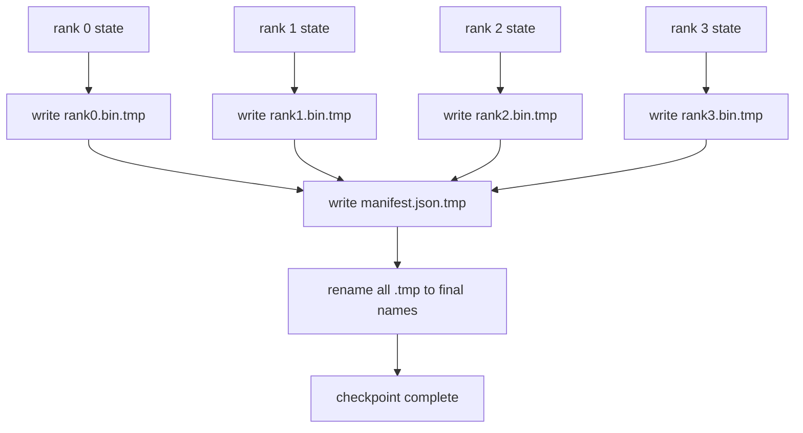

# نقطه بازرسی و رزومه اتمی

> یک کار آموزش پارامتر 70B هر چند ساعت به خاطر شکست گره متوقف می شود. فرمت نقطه بازرسی تصمیم می گیرد که آیا 30 دقیقه یا 30 ساعت از دست میدی. یک نقطه بازرسی پاره شده، پاره های هر رتبه را در موازی می نویسد و مالکیت را در یک مانیف ثبت می کند. ادامه بارز هر کليد درجه از پرونده خودش، بازسازی دولت در همان اندازه جهان، و گام های بهینه تر مانند هیچ اتفاقی نیفتاد. نوشتن اتميک باعث ميشه که يه نقطه بازي نصف تموم شده از مسموميت رزومه ي بعد جلوگیری بشه

**Type:** Build
**Languages:** Python
**Prerequisites:** Phase 19 Track C lessons 42-49
**Time:** ~90 min

## اهداف یادگیری

- يه نقطه ي بازرسي چند درجه رو به عنوان يک پرونده ي پاره اي در هر درجه به همراه يه فهرست ثبت ميکنه که چه درجه ي مالکي چه درجه اي هست
- از الگوی نوشتن اتم (از یک مسیر موقت بنویسید و سپس نامگذاری کنید) استفاده کنید تا یک نوشتن وسط تصادف هرگز یک نقطه بازرسی نیمه کامل را تولید نکند.
- خلاصه از مانیست، بررسی حالت بایت برابر برای هر دو پارامتر fp16 و حالت بهینه سازی ZeRO در هر رتبه.
- از طرح آشکار در برابر سه حالت شکست دفاع کنید: تغییر اندازه جهان، عدم مطابقت شمارش شارت ها و نوشتن جزئی.

## مشکل

یک نقطه بازرسی وانیل تمام پارامترها و حالت بهینه کننده را به درجه 0 می خواند، جمع آوری می کند و یک فایل واحد می نویسد. برای مدل 70B که 1.1 TB از حالت از طریق پورت شبکه یک رتبه است. اونها هر رتبه ي ديگري رو مسدود ميکنن چون بي کاره منتظر جمع شدن هستن عرض باند IO آهسته ترین اتصال شبکه GPU واحد است، نه کل. در یک کلستر واقعی، مرحله جمع آوری و سپس نوشتن می تواند بیشتر از ساعت آموزش قبلی طول بکشد، به این معنی که شغل کمتر از یک نقطه بازرسی در هر روز آموزش است.

نقاط بازرسی پاره شده الگوی را تغییر می دهند: هر رتبه پاره خود را به پرونده خود به طور موازی می نویسد. اسناد مشخصی که رتبه ی مالکیت کدام کاشی را دارند می توانند هر کاشی را به جایی که آمده برگردانند. مجموع مقیاس های عرض باند را با کلستر می نویسد. یک نقطه بازرسی 1 TB که 4 ساعت طول کشید تا یک رتبه را عبور کند 4 دقیقه طول می کشد تا 64 رتبه را عبور کند. علاوه بر این، مانیست شما را برای رزومه های نامناسب قرارداد می دهد: تغییر اندازه جهانی قابل تشخیص است، نوشته های جزئی قابل تشخیص است، و مسیر بارگذاری می تواند با استفاده از داده های قدیمی به جای خاموشی به صدای بلند شکست یابد.

## مفهوم



### طرح آشکار

```json
{
  "world_size": 4,
  "step": 1234,
  "wall_clock_seconds": 4521,
  "shards": [
    {"rank": 0, "path": "rank0.bin", "sha256": "...", "param_shard_offset": 0, "param_shard_numel": 65536},
    {"rank": 1, "path": "rank1.bin", "sha256": "...", "param_shard_offset": 65536, "param_shard_numel": 65536}
  ],
  "schema_version": 1
}
```

سه میدان باردار هستند`world_size`به جای اینکه به طور خاموش فاسد شود، رزومه ی اندازه ی متفاوتی به شدت شکست می خورد.`sha256`هر شارت نوشته های جزئی یا فاسد را می گیرد.`param_shard_offset`و`param_shard_numel`هر شارت اجازه دهید بارنده تنسور پارامتر مسطح را در موقعیت درست بازسازی کند.

### نوشتن اتم

الگوی استاندارد: هر قطعه را به `<name>.tmp`، دفترچه رو به`manifest.json.tmp`نامگذاری POSIX در داخل همان سیستم فایل اتمی است؛ یا فایل جدید به طور کامل موجود است یا قدیمی است. یک خرابی قبل از نامگذاری نهایی از نقطه کنترل قبلی به عنوان زنده خارج می شود. بدون نوشتن اتمی یک خرابی می تواند یک شکه جزئی را با یک مانیف موجود که به آن اشاره می کند، و بار را خراب می کند حالت بهینه کننده در ادامه.

### سه حالت شکست که اسکیما باید از آن دفاع کند

| Failure | Symptom | Defence |
|---------|---------|---------|
| World-size change | resume on N=8 with manifest from N=4 | world_size mismatch in manifest, fail loudly |
| Shard count mismatch | resume sees fewer rank*.bin files than shards in manifest | enumerate shards, verify every one exists |
| Partial write | shard file truncated mid-flush | sha256 verification on load |

هر دفاعی بار بد را زودتر رد می کند؛ جایگزین فساد سکوت است که 100 قدم بعد در هنگام از دست دادن به NaN ظاهر می شود.

### چرا پرونده هاي درجه ي يک، نه يک پرونده بزرگ

همزمان به یک فایل از طریق `O_APPEND`در POSIX برای نوشته های بایت متفق کار می کند، اما در عمل، تعویضات در یک شیرد در مناطق اندازه MB و قفل غالب است. فایل های درجه به هیچ وجه اختلاف ندارند و از ردیف شدن زمانی که سیستم فایل های زیربنایی موازی است (Lustre، GPFS) بهره مند می شوند. استیک های تولید (DeepSpeed، FSDP، NeMo) همه از فایل های درجه به همین دلیل استفاده می کنند.

```figure
ci-sharded-checkpoint
```

## آن را بسازید

`code/main.py`ابزار:

- `ShardManifest`کلاس داده با طرح بالا پلاس`to_json`-بله .`from_json`. .
- `save_sharded(state_dict_per_rank, dir, step)`که حالت دوگانه هر رتبه را به پرونده خودش با استفاده از الگوی اتم temp-then-rename می نویسد، سپس مانیفست را می نویسد.
- `load_sharded(dir, expected_world_size)`که دفترچه را می خواند، شکل 256 هر قطعه را تایید می کند و در هر رتبه ای، دستورات را می دهد.
- یک آزمایش برگشت: ایجاد حالت در هر رتبه، ذخیره، بارگذاری، ادعا باایت برابر.

اجرا کن

```bash
python3 code/main.py
```

خروجی: 4 فایل شارد به علاوه مانیست نوشته شده، سپس با تایید باایت برابر بارگذاری مجدد شده است.

## الگوهای تولید در طبیعت

سه الگوي که نقطه بازي رو به اندازه ي کافي سخت ميکنه تا از هواپيما خارج بشه

**Async write.**دسته های تولید نقطه کنترل را در یک رشته یا فرآیند جداگانه ارسال می کنند تا آموزش ادامه یابد. مانع در نقطه کنترل بعدی است: ذخیره بعدی را تا زمانی که قبلی کامل نباشد شروع نکنید. DeepSpeed `async_io`این دقیقاً همین کار را می کند. درس نوشتن را هم زمان نگه می دارد تا مراحل قابل مشاهده باشند.

**Local fast disk first, then async upload.**به NVMe محلی بنویسید (سرعتی) سپس به S3 یا GCS اپلود کنید. الگوی دو سطحی، نقطه چک داخل کلستر را برای ادامه کار سریع نگه می دارد در حالی که یک کپی پایدار را خارج از کلسٹر برای آرشیو ارسال می کند. مانیست مسیر محلی را حمل می کند؛ مانیست اپلود مسیر دور را حمل می کند.

**Rotation matters.**اجراهای تولید آخرین نقاط بازرسی K (معمولا 3-5) را حفظ می کنند و قدیمی ترین را به گردش می رسانند. بدون چرخش دیسک در نیمه اجرا پر می شود و نقطه بازرسی بعدی شکست می خورد. با چرخش بعدی، ذخیره قدیمی ترین را در ابتدا حذف می کند و بودجه را آزاد می کند.

## ازش استفاده کن

الگوهای تولید:

- **DeepSpeed checkpointing.** `deepspeed.save_checkpoint(tag=step)`پرونده های مرتب و یک`latest`پرونده ای که به برچسب فعال اشاره دارد.
- **PyTorch FSDP checkpointing.** `torch.distributed.checkpoint`حالت پاره شده را با یک `Planner`که ترتيب هر رتبه رو تصميم ميده
- **NeMo.**با يک لباس ، DeepSpeed و FSDP رو ببند`save_to_checkpoint`API که متاداتا اضافه می کند.

## -باده

درس 81 یک نقطه بازرسی پاره شده از DDP+ZeRO انجام شده و دوباره به اندازه جهانی برای اثبات قرارداد رزومه.

## تمرینات

1. اضافه کردن نوشتن async: شروع ذخیره کردن در یک موضوع و اجازه دهید آموزش ادامه یابد. ذخیره سازی بعدی را تا زمانی که ذخیره قبلی تکمیل شود مسدود کنید.
2. اضافه کنید`last_5_steps`چرخش: 5 نقطه بازرسی جدید را نگه دارید، قدیمی ترین را حذف کنید قبل از ذخیره یک نقطه جدید.
3. یک مسیر تأیید سریع فقط CRC را برای بارگذاری مجدد حلقه داخلی اضافه کنید (دوره یک نقطه بازرسی را به عنوان نقطه بازرسی جدید فعال بدون sha256 کامل تبدیل می کند).
4. اضافه کردن یک بار بین المللی: توازن مجدد شارت از N=4 به N=8 با خواندن مانیست، کنکاتین و دوباره شارت.
5. یک اپلود را به یک S3 جعلی (یک دایرکتوری دوم) اضافه کنید و مانیفرد اپلود را بنویسید. از سیاست ذخیره سازی دو سطحی دفاع کنید.

## اصطلاحات کلیدی

| Term | What people say | What it actually means |
|------|----------------|------------------------|
| Sharded checkpoint | "Per-rank save" | Each rank writes its own shard file in parallel |
| Manifest | "Index" | JSON file recording shard paths, offsets, and sha256 |
| Atomic write | "tmp then rename" | Write to .tmp then POSIX rename so a crash leaves the previous file live |
| Partial write | "Truncated shard" | A crash during write produces a corrupt shard; sha256 catches it |
| Rotation | "Keep last K" | Delete oldest checkpoint before writing new one to bound disk usage |

## خواندن بیشتر

- [DeepSpeed checkpointing](https://deepspeed.readthedocs.io/en/latest/model-checkpointing.html)
- [PyTorch torch.distributed.checkpoint](https://pytorch.org/docs/stable/distributed.checkpoint.html)
- [POSIX rename atomicity](https://pubs.opengroup.org/onlinepubs/9699919799/functions/rename.html)
- مرحله 19 درس 78 - زرو اعلام کرد که این نقطه بازرسی برای ذخیره سازی طراحی شده است
- مرحله 19 درس 81 - دمو آخر تا آخر سفر برگشت به حالت ذخیره شده
