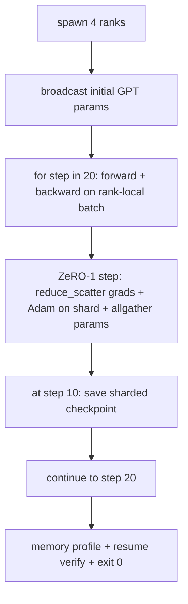

# آموزش های توزیع شده از پایان تا آخر

> دروس 76 تا 80 هر یک یک قطعه ساخته شده است. این مجموعه است: یک GPT کوچک آموزش داده شده در 4 صف شبیه سازی شده با DDP برای همگام سازی گرادینت، ZeRO-1 برای اصلاح کننده-حالت شارت، و یک نقطه چک شارت در نیمه راه نشان. دمو 20 مرحله را اجرا می کند، خود را پایان می دهد، منحنی از دست دادن به همراه یک پروفایل حافظه چاپ می کند و یک نقطه چک باز می نویسد.

**Type:** Build
**Languages:** Python
**Prerequisites:** Phase 19 Track C lessons 42-49
**Time:** ~90 min

## اهداف یادگیری

- DDP (درسه 77) + ZeRO-1 (درسه 78) + نقاط بازرسی قطعه قطعه قطعه ای (درسه 80) را در یک حلقه آموزشی ترکیب کنید.
- یک مدل دو لایه ی زبان ترانسفورماتور را روی یک جسم مصنوعی کوچک برای ۲۰ مرحله در چهار صف شبیه سازی کنید.
- یک جدول از دست دادن در هر مرحله، یک پروفایل حافظه در هر رتبه و یک مانیست نقطه بازرسی که باایت برابر را در همان اندازه جهانی ادامه می دهد چاپ کنید.
- از ترکیب دفاع کنید: هر قطعه در درس های قبلی به طور مستقل قابل آزمایش است و این درس ثابت می کند که آنها ترکیب می کنند.

## مشکل

سنگ پايين دليل اينه که قطعات با هم مي سازند درس 76 مجموعه های اجرا شده درس 77 آنها را به DDP بسته کرد. درس 78 حالت اصلاح کننده پاره شده با کاهش_تراکنده درس 79، خط لوله مورد تحلیل قرار گرفت. درس 80 يه نقطه بازي پاره شده رو نجات داد هر درس با امتحان خودش ایستاده بود یک تمرین واقعی از هر یک از ابتدایی ها به یکباره استفاده می کند؛ اگر ترکیب اشتباه باشد، از دست دادن متفاوت است، نقطه بازرسی از شروع مجدد انکار می کند، یا حافظه در هر رتبه زمانی که باید کوچک شود، رشد می کند.

این درس دمو پایان به پایان را اجرا می کند و چهار متغیر را تأیید می کند: (أ) از دست دادن به صورت یکسو در طول 20 مرحله در داخل صدا شناور کاهش می یابد، (ب) هر رتبه در هر مرحله یکپارچه است، (ج) حافظه بهینه سازی هر رتبه برابر با فارمول ZeRO-1 باط 12P/N است و (د) نقطه بازرسی در مرحله 10 باط برابر با بازخورد. نمایش خود پایان می یابد: 20 مرحله، یک فرمان، خروج 0.

## مفهوم



### مینی GPT

مدل به طور خاص کوچک است: 2 بلوک ترانسفورماتور، 32 امد، 4 سر توجه، 64 لغت، طول ردیف 16، دسته 4. چند هزار پارامتر به اندازه کافی بزرگ برای انجام هر تصمیم سیم کشی (اهتمام چند سر مسیر استاندارد ماسک شده را اجرا می کند؛ LayerNorm دارای وزنه هایی برای همگام سازی است؛ سر LM یک طرح خطی جداگانه به لغت است). به اندازه کافی کوچک که 20 مرحله در 4 درجه CPU در ثانیه تمام شود.

### قوانین ترکیب

| Lesson piece | What it owns | What it leaves to the loop |
|--------------|--------------|----------------------------|
| DDP broadcast | Initial parameter sync | One call at construct time |
| ZeRO-1 step | Gradient sync, master copy update, parameter broadcast | One call per step replacing optimiser.step |
| Sharded checkpoint | Persist per-rank state, manifest with sha256 | Called on rank 0 with state collected via allgather |
| Training loop | Forward, backward, loss logging | Calls the three above in order |

حلقه نمی داند در مورد فایل های reduce_scatter یا rendezvous. ماژول های ZeRO و نقطه بازرسی رابط های باریک را که حلقه تشکیل می دهد نشان می دهد.

### چرا يه GPT کوچولو و نه فقط يه MLP

MLP از درس 77 برای تایید همگامانی گرادینت کافی بود. یک GPT کوچک سه چیز را اضافه می کند: یک سر LM جداگانه بر روی لغت (در این درس، برای شفافیت، آزاد شده؛ GPT کامل معمولا سر را به ورودی توکن متصل می کند) ، نرمmax + کراس-انترپی به عنوان از دست دادن (مقام بیشتری از موارد کناره عددی از MSE) و یک پیشروی غیر متناظر (ورودی پس از توجه سپس MLP در هر لایه). با استفاده از یک MLP برای سنگ پای، پنهان می شود که آیا ترکیب LayerNorm یا شکل grad لایه های گنجانده شده را به درستی اداره می کند.

### خود پایان دادن به راه خروج 0

حلقه 20 مرحله اي ثابت و بيرون ميره`while True`،هیچ دخالت انسانی، هیچ رزومه از حالت خارجی. یک سنگ پایان شما می توانید بدون نظارت اجرا و پیدا کردن یک دفترچه کامل زمانی که آن را به پایان می رساند یک سنگ پایان است که ثابت می کند که سیستم به درستی سیمه شده است. اگر هر قطعه خنثی است، نمایش هرگز به بازگشت و دستگاه آزمایش آن را گرفتن.

```figure
ci-distributed-assembly
```

## آن را بسازید

`code/main.py`ابزار:

- `MiniGPT`: ترانسفورماتور دو لایه با خود توجه پوشیده و سر LM جداگانه.
- `make_corpus(seed, total_tokens)`: داده های تعیین کننده پیش بینی توکن بعدی
- `_train_worker`: تولید شده در هر رتبه؛ پخش init params، اجرا حلقه، زنگ زدن ZeRO قدم، نوشتن نقطه کنترل پاره شده در مرحله 10.
- `verify_resume`: پس از اجرا اصلی، مرحله 10 نقطه کنترل را در فرآیند بارگذاری می کند و ادعا می کند که شیش های اصلی ذخیره شده با عکس لحظه ای در حافظه بایت به بایت مطابقت دارند.
- `main`: تمام نمایش را اجرا می کند، جدول از دست دادن، پروفایل حافظه و نتیجه تأیید را چاپ می کند.

اجرا کن

```bash
python3 code/main.py
```

محصول: یک جدول 20 ردیف از دست دادن، یک پروفایل حافظه 4 ردیف در هر رتبه، یک مانیست نقطه بازرسی و یک خط "مطمئن مجدد" در موفقیت.

## الگوهای تولید در طبیعت

سه الگوي ساخت را براي اجراات واقعي به اتمام مي رسانند.

**Checkpoint every K minutes, not every K steps.**زمان مرحله با طول و تعداد میکروباتش متفاوت است. یک کادنس نقطه بازرسی 10 دقیقه ای حساب مشابه را بدون توجه به اندازه مدل ضبط می کند. درس از مرحله ای برای سادگی استفاده می کند؛ تولید از ساعت دیواری استفاده می کند.

**Detect divergence early.**در طول تولید، یک محافظ NaN پس از عقب و یک آشکارساز ذروه خروجی اضافه می شود؛ اگر خروجی بیش از 2 برابر در یک مرحله افزایش یابد، به جای اجازه دادن به اصلاح کننده به حالت انحطاطی حرکت کنید. منحنی خروجی درس صاف است بنابراین محافظ استفاده نشده است اما هوک باقی می ماند.

**Aggregate the memory profile across ranks.**حافظه در هر رده با درجه در اجراهای واقعی متفاوت است (در رتبه با بزرگترین مرحله لوله فعال سازی بیشتری دارد). تولید حداکثر را در میان رده ها به همراه متوسط ثبت می کند؛ درس برای نشان دادن تطابق فرمول ها در هر رده چاپ می کند.

## ازش استفاده کن

الگوهای تولید:

- **DeepSpeed.**ترکیب DDP + ZeRO + خط لوله + چکپوائنت فعال سازی تحت یک پیکربندی. ترکیب درس شکل DeepSpeed در نوع کوچک است.
- **PyTorch FSDP.**معادل بومی.`FullyShardedDataParallel`با`ShardingStrategy.SHARD_GRAD_OP`زرو-2 هست
- **NeMo and Megatron-LM.**برای مدل های بسیار بزرگ تر متوازی تنسور اضافه کنید؛ در غیر این صورت ترکیب همان شکل است.

## -باده

این مسیر کامل در اینجا پایان می یابد. 6 درس به همراه زیر سیستم آموزش توزیع شده است که یک تیم واقعی قبل از اتخاذ DeepSpeed ایجاد می کند؛ تجرید در برابر گلوو اثبات شده است و حالت های شکست انجام شده است. مرحله 17 (بنیادی و تولید) جایی است که این را به یک خوشه واقعی می برد.

## تمرینات

1. اضافه کردن یک تقسیم تنسور متوازد سر توجه و بررسی خسارت مطابق با خط اصلی یک رتبه دو رتبه: نیمی از سر ها در هر رتبه، تمام کاهش خروجی توجه.
2. اضافه کردن تراکم گرادینت در 4 میکروباتش و ثابت کردن گرادینت برابر گرادینت یک دسته بزرگ است.
3. یک مسیر رزومه از مرحله 10 را اضافه کنید که در واقع تمرین را به مرحله 20 ادامه می دهد و همان ضرر نهایی را به عنوان اجرا اولیه تولید می کند.
4. یک متریک صادرات (خسارت، استاندارد درجه، زمان مرحله) را به JSONL اضافه کنید تا پس از واقعیت، اجرا را مشاهده کنید.
5. یک محافظ NaN را اضافه کنید که در نقطه بازرسی قبلی در یک نقطه از دست دادن به عقب برگردد و یک نقطه را با یک ضرب LR یک مرحله ای مجبور کنید تا بازپسین را انجام دهد.

## اصطلاحات کلیدی

| Term | What people say | What it actually means |
|------|----------------|------------------------|
| End-to-end | "Wire it all up" | One run composes every piece, not a unit test per piece |
| Memory profile | "GB per rank" | Bytes held on each rank for params, grads, optimiser state |
| Resume contract | "Save and load" | Per-rank state byte-equal after a checkpoint round-trip |
| Self-terminating | "Bounded run" | Fixed step count, exit 0 on completion, no human in the loop |

## خواندن بیشتر

- [DeepSpeed end-to-end training tutorial](https://www.deepspeed.ai/getting-started/)
- [PyTorch FSDP advanced tutorial](https://pytorch.org/tutorials/intermediate/FSDP_advanced_tutorial.html)
- [Megatron-LM training script reference](https://github.com/NVIDIA/Megatron-LM)
- مرحله 19 درس 76 تا 80 - هر قطعه ای که این درس تشکیل می دهد
- مرحله 17 - انتقال ترکیب به یک خوشه واقعی
