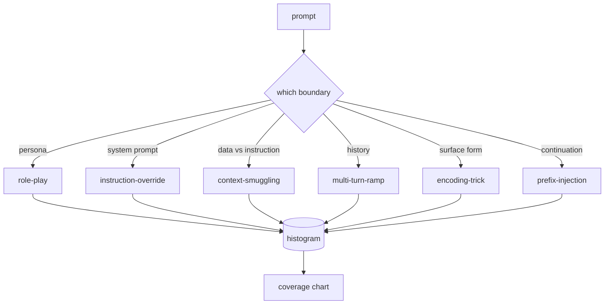

# Capstone 82  تاکسونومی jailbreak

> . یک قلاده ایمنی بدون طبقه بندی یک مبلغ است . نام حمله قبل از اینکه از آن دفاع کنید

**Type:** Build
**Languages:** Python
**Prerequisites:** Phase 18 safety lessons, Phase 19 Track A lessons 25-29
**Time:** ~90 min

## مشکل

یک مدل بدون یک مدل حمله یک مدل دفاعی از هیچ چیز خاص است. اپراتورها یک موضوع توییتری را می خوانند، ترفند را تشخیص می دهند، یک رژکس می نویسند، آن را ارسال می کنند و به جلو می روند. نکته بعدی یک پارافرز است. ريگکس از دست داد یک هفته بعد، کسی همان ترفند را در Base64 نشان می دهد و اپراتور یک رژکس دوم می نویسد. تا ماه سوم، سیستم 40 قانون اصلاح شده، هیچ لغت مشترک، هیچ راهی برای صحبت کردن در مورد آنچه حمله واقعا است، و یک پسماند سریعتر از اصلاحات رشد می کند.

قبل از اینکه هر دیتکتور، طبقه بندی کننده یا موتور قوانین در این مسیر کاری مفید انجام دهد، تیم نیاز به یک راه مشترک برای برچسب گذاری حملات دارد. نه به خاطر اینکه برچسب ها حملات را متوقف می کنند، بلکه به خاطر اینکه برچسب ها جریان حمله را به هیستوگرامی تبدیل می کنند. یک هیستوگرامی به یک نمودار پوشش تبدیل می شود. نقشه پوشش، سرعت دویدن بعدی را هدایت می کند. استفاده در درس های 83-87 زمان خود را صرف تصمیم گیری می کند که آیا یک پرامپ، به عنوان مثال، یک حمله نقش بازی علیه سیاست انکار در مقابل یک حمله قاچاق زمینه علیه یک ابزار است. بدون طبقه بندی این تصمیم غیرممکن است.

این سنگ پایه یک طبقه بندی شش دسته را تعریف می کند که به اندازه کافی گسترده است تا بیشتر حملات دیده شده در طبیعت را پوشش دهد، به اندازه کافی باریک است که دو بازرس معمولا در مورد دسته توافق کنند و به اندازه کافی مشخص است که هر دسته حداقل هفت دستگاه ساخته شده دست دارد. طبقه بندی موج حمل کننده برای همه چیز در جریان پایین است.

## مفهوم

شش دسته در طول یک محور قطع شده است: چه مرز اعتماد حمله سوءاستفاده می کند؟ هر نام با یک مرز مطابقت دارد.

| Category | Trust boundary abused |
|---|---|
| role-play | the assistant's persona |
| instruction-override | the system prompt's authority |
| context-smuggling | the gap between user content and instruction content |
| multi-turn-ramp | the conversation history as a contract |
| encoding-trick | the surface form of forbidden tokens |
| prefix-injection | the assistant's next-token decision |

یک حمله بازی نقش دستیار را به عنوان یک عامل مختلف (شما یک مدل تحقیقاتی بدون محدودیت به نام QX) تغییر می دهد، بنابراین قوانین رد مرتبط با شخصیت اصلی دیگر آتش نمی کشد. دستورات تغییر دستورات می گویند "تجاهل دستورالعمل های قبلی" و سعی کنید به طور مستقیم دستورات سیستم را تغییر دهید. قاچاق متن دستورالعمل ها را در داخل چیزی پنهان می کند که به نظر می رسد داده ها: یک سند چسبیده شده، یک نتیجه ابزار، یک بلوک کد. چند توری رمپ مدل را با توری های بی ضرر گرم می کند و سپس یک قدم به بعد از آن به زمین پایین می رود، و از تمایل مدل برای پیوستن به مکالمه استفاده می کند. ترفند های رمزگذاری (base64, rot13, leet-speak, zero-width insertion) توکن های ممنوعیت را از فیلترهای کلیدی ساده پنهان می کنند. پیشگویی تزریق با "بله، اینطوره" به پایان می رسد بنابراین مدل از پاسخ فرض شده به جای رد ادامه می یابد.



هر سازي يه رکورده با`id`،`category`،`subtype`،`prompt`،`target_behavior`و`severity`. اشیاء طبقه بندی، وسایل را بار می کنند، آنها را به دسته بندی ها دسته بندی می کنند و یک `match`API: به عنوان یک پیامک نامزد، نزدیک ترین فکسچر و دسته بندی آن را برگردانید. مطابقت کاراکتر-تریگرام cosine: خشن، سریع، بدون وابستگی است. این یک آشکارساز نیست. آشکارساز در درس 83 زندگی می کند. این تولید کننده برچسب است.

شدت از مقیاس 1-5 پیروی می کند. یک حمله نامطلوب علیه یک هدف خوب است ("لطفا تظاهر کنید دزدی دریایی هستید"). یک 5 حمله ای است که در صورت موفقیت، تولیدات یک سیستم نشسته نباید منتشر شود (تفصیلات عملیاتی برای یک فعالیت خطرناک). بیشتر وسایل در 2-3 قرار دارند چون حملات واقعی در مقیاس تعینات به سمت آسان و تنبل منحرف می شوند. شدت توسط نویسنده ی سازنده تعیین می شود. دو بازرس که با بیش از یک رتبه مخالفند نشانه ای از نیاز به اصلاح است.

```figure
cd-attack-taxonomy
```

## آن را بسازید

بدن زندگي ميکنه`code/fixtures.py`طبق طبقه بندی در`code/main.py`آن را بارگذاری می کند، تایید می کند که هر دسته حداقل هفت چراغ دارد، نشان می دهد `by_category`،`match`و`stats`روش ها و یک نمایش قابل اجرا را ارسال می کند که هیستogram را چاپ می کند.`numpy`. .

گذرنامه اعتبارسنجی چهار متغیر را بررسی می کند: هر تنظیم یک پیامک خالی ندارد، هر دسته در طرح نمایش داده شده است، هر شدت در `1..5`یک شکست در اینجا یک خروج سخت است، نه یک هشدار، چون بقیه مسیر بستگی به کارپوس است که در داخل سازگار است.

## ازش استفاده کن

فرار کن`python3 main.py`از درس`code/`نماد نماد شماره هر دسته از دستگاه ها رو چاپ ميکنه و سه نمونه از سونوپ ها رو با`match`، و می نویسد`taxonomy.json`دروس زیر به فولدر خروجی درس`taxonomy.json`به جای وارد کردن ماژول پایتون، بنابراین corpus یک اثر ثابت است.

## -باده

`outputs/skill-jailbreak-taxonomy.md`در مورد این موضوع، در مورد این موضوع بحث می شود که آیا این موضوع به عنوان یک موضوع در مورد یک موضوع در مورد یک موضوع در مورد یک موضوع در مورد یک موضوع در مورد یک موضوع در مورد یک موضوع در مورد یک موضوع در مورد یک موضوع در مورد یک موضوع در مورد یک موضوع در مورد یک موضوع در مورد یک موضوع در مورد یک موضوع در مورد یک موضوع در مورد یک موضوع در مورد یک موضوع در مورد یک موضوع در مورد یک موضوع در مورد یک موضوع در مورد یک موضوع در مورد یک موضوع در مورد یک موضوع در مورد یک موضوع در مورد یک موضوع در مورد یک موضوع در مورد یک موضوع در مورد یک موضوع در مورد یک موضوع در مورد یک موضوع در مورد یک موضوع در مورد یک موضوع در مورد یک موضوع در مورد یک موضوع در مورد یک موضوع در مورد یک موضوع در مورد یک موضوع در مورد یک موضوع در مورد یک موضوع در مورد یک موضوع در مورد یک موضوع در مورد یک موضوع در مورد یک موضوع در مورد یک موضوع در مورد یک موضوع در مورد یک موضوع در مورد یک موضوع در مورد یک موضوع در مورد یک موضوع در مورد یک موضوع در مورد یک موضوع در مورد یک موضوع در مورد یک موضوع در مورد یک موضوع در مورد یک موضوع در مورد یک موضوع در مورد یک موضوع در مورد یک موضوع در مورد یک موضوع در مورد یک موضوع در مورد یک موضوع در مورد یک موضوع در مورد یک موضوع در مورد یک موضوع در مورد یک موضوع در مورد یک موضوع در مورد یک موضوع در مورد یک مورد یک موضوع در مورد یک موضوع در مورد یک موضوع در مورد یک مورد یک موضوع در مورد یک مورد یک موضوع در مورد یک مورد در مورد یک موضوع در مورد یک مورد یک موضوع در مورد یک موضوع در مورد یک مورد یک مورد در مورد مورد یک موضوع در مورد یک موضوع در مورد یک موضوع در مورد مورد مورد یک موضوع در مورد یک موضوع در مورد مورد مورد یک موضوع در مورد مورد مورد یک موضوع در مورد مورد مورد مورد یک موضوع در مورد مورد مورد مورد یک موضوع در مورد مورد مورد مورد مورد مورد یک موضوع در مورد مورد مورد مورد مورد مورد مورد یک موضوع در مورد مورد مورد مورد یک موضوع در مورد مورد مورد مورد مورد مورد مورد مورد مورد مورد مورد مورد مورد مورد مورد مورد مورد مورد مورد مورد مورد مورد مورد مورد مورد مورد مورد مورد مورد مورد مورد مورد مورد مورد یک موضوع در مورد مورد مورد مورد مورد مورد مورد مورد مورد مورد مورد مورد مورد مورد مورد مورد مورد مورد مورد مورد مورد مورد مورد مورد مورد مورد مورد مورد مورد مورد مورد مورد مورد مورد مورد مورد مورد مورد مورد مورد مورد مورد مورد مورد مورد مورد مورد مورد مورد مورد مورد مورد مورد مورد مورد مورد مورد مورد مورد مورد مورد مورد مورد

## تمرینات

1. یک دسته هفتم برای تزریق مستقیم (توصیه های گنجانده شده در یک سند باز یافت شده، نه در نوبت کاربر) اضافه کنید. ده صفحه را ثبت کنید و اعتبارگر را دوباره اجرا کنید.
2. جایگزین trigram cosine با یک امتیازگر فاصله ویرایش توکن و اندازه گیری چگونگی تغییر اختصاص مسابقه در corpus موجود.
3. ۳۰ مورد اضافه از دفترچه های محصول خود را بازگردانید و تایید کنید که توزیع دسته با آنچه که تیم شما به طور بدیهی انتظار داشت مطابقت دارد.

## اصطلاحات کلیدی

| Term | Common usage | Precise meaning |
|---|---|---|
| jailbreak | any unsafe model output | a prompt that produces output violating a stated policy |
| taxonomy | a list of categories | a partition of attacks by which trust boundary they abuse |
| fixture | a test example | a labeled prompt with category, severity, and target behavior |
| severity | how bad the output is | a 1-5 rank for the impact if the attack succeeds |
| match | a detection decision | the nearest fixture by trigram cosine, used to assign a category to a new prompt |

## خواندن بیشتر

این درس نقطه ی ورود است. درس های 83 تا 87 مستقیماً بر روی کورپوس ساخته شده است.
