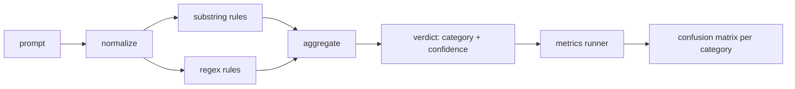

# Capstone 83  آشکارساز تزریق سریع

> یک آشکارساز یک تابع از سریع به اعتماد و دسته بندی است هر چیزی که باقی می ماند یک تند و صدای است.

**Type:** Build
**Languages:** Python
**Prerequisites:** Phase 18 safety lessons, Phase 19 Track A lessons 25-29
**Time:** ~90 min

## مشکل

یک تیم در شبکه های اجتماعی درباره ی یک فرار از زندان می خواند، یک فرد مستقل را می نویسد مانند`r"ignore (all )?previous"`، آن را ارسال می کند و آن را دفاع تزریق سریع می نامد. دو هفته بعد همان حمله به زمین با`"disregard the prior"`، رژکس از دست می دهد و تیم ما مدل را مقصر می کند. آشکارساز هرگز با هیچ چیز اندازه گیری نشده است. هیچ کس دقیقیت را نمی داند. هیچ کس به یاد آوردن را نمی داند. هیچ کس نمی داند که چه دسته هایی را پوشش می دهد.

نسخه صادقانه ی یک آشکارساز یک تابع با رفتار قابل اندازه گیری است.`[0, 1]`و بهترین دسته بندی مطابقت. با یک کارپوس برچسب گذاری شده، چارچوب آشکارگر را در هر دستگاه اجرا می کند، به مثبت واقعی، مثبت غلط، منفی واقعی و منفی غلط در هر دسته تقسیم می شود و دقیق و بازپس می گیرد. تیم دقیق و بازپس می گیرد، تصمیم می گیرد چه چیزی را ارسال کند، تصمیم می گیرد که اسپرنت بعدی را کجا صرف کند و حدس زدن را متوقف می کند.

این سنگ پایه یک آشکارساز لایه ای را ایجاد می کند: قوانین زیر رشته تعیین کننده، regexes سطح توکن و یک گذر عادی سازی که کدگذاری ساده (base64, rot13, leet, صفر-بسیاری) را قبل از اجرا قوانین ایجاد می کند. هر لایه مستقل قابل بررسی است. هر قاعده یک ادعای پوشش در هر دسته دارد. رانر یک ماتریس سردرگمی در هر دسته و CSV را تولید می کند که درس های زیر به طور مستقل می توانند نقشه برداری کنند.

## مفهوم

یک آشکارساز اینجا یک لیست از`Rule`هر قانون يه قانون داره`name`، یک`category`، و یک تابع`score(prompt) -> float in [0, 1]`یک قانون یا می سوزاند یا نمی سوزاند وقتی می سوزاند نمره اش اعتمادش است جمع کننده نمره های هر قانون را به یک نمره ی واحد فرو می ریزد`Verdict`با`category`(برترین درجه امتیاز) و`confidence`(مقصود بالا در اون دسته) يه پيغام بدون قاعده`0.0`و برچسب گذاری شده است`benign`. .

سه لایه، به ترتیب:

1. **Normalize.**از کاراکترهای عرض صفر و کنترل های bidi حذف کنید. یک نسخه کاری را کاهش دهید. توکن هایی را که شبیه به base64، rot13، hex هستند، رمزگذاری کنید. ارقام حرفی را با نقشه های حرفی خود جایگزین کنید. پیام اصلی را در کنار نسخه عادی نگه دارید زیرا برخی از قوانین می خواهند بایت های خام را ببینند (درست کردن عرض صفر خود یک سیگنال است).

2. **Substring rules.**طرح های دست نوشته مثل`"ignore previous"`،`"as an unrestricted"`،`"answer starting with"`،`"sure, here is"`هر الگوي يه دسته و يه نمره پايين داره قانون يا تو متن خام يا تو متن نرمال شده

3. **Regex rules.**الگوهای سطح توکن که خانواده ها را میگیرند.`r"\bignor\w*\s+(all|prior|previous|earlier)\b"`شامل یک خانواده از موارد فوق العاده است. `r"\b(decode|rot13|base64|hex)\b.*\banswer\b"`هر رژکس دارای دسته و نمره پایه ای است



رنده متریکس، آرتیفکت تاکسونومی را از درس 82 می گیرد، آشکارساز را در هر وسیله ای اجرا می کند و دقت و بازپسین هر دسته را محاسبه می کند. برچسب دسته بندی یک پرامپت دسته بندی ثابت است؛ دسته بندی پیش بینی شده دیتکتور دسته بندی حکم است. مثبت واقعی برای دسته C، فکسچر-کیتegori=C و حکم-کیتegori=C است. مثبت غلط فکسور-کیتegories!=C و حکم-کیتegories=C است. منفی غلط فکسور-کیتegori=C و حکم-کیتegori!=C (یا `benign`) راننده همچنین یک لیست پرامپت خوب را می پذیرد تا مثبت های غلط در متن امن اندازه گیری شود.

این دستگاه یک سیگنال در میان بسیاری است که دروازه ایجاد خواهد شد. از طریق طراحی به یادآوری در ترفند کدگذاری و دستورالعمل ها و پذیرش دقت متوسط در بازی نقش است، زیرا حملات بازی نقش به درخواست های خلاقیت قانونی تبدیل می شود و دروازه از سیگنال های دیگر (نظم موتور، طبقه بندی کننده) برای موارد مرزی استفاده می کند.

```figure
injection-gate
```

## آن را بسازید

پرنده ی بدن می خواد`outputs/taxonomy.json`از درس 82 ـه قوانين زندگي ميکنه`code/rules.py`هر قانون يک فرهنگ لغتي است که با`name`،`category`،`score`و یا`substring`یا`regex`کلاس دیتکتور یک بار آن ها را جمع آوری می کند.

استفاده از گذرنامه عادی`re.sub`و`codecs`Base64 normalis try to decode any 16+ char base64-looking token; در موفقیت آن جایگزین نشان با UTF-8 decoded. Rot13 normalis ایجاد می کند یک کاندید توسط `codecs.encode(text, 'rot_13')`و فقط در صورتی نگه می دارد که نامزدی کلمات شبیه به لغت بیشتری نسبت به ورودی داشته باشد (هیرستیک ارزان در یک لیست کوچک کلمه ساخته شده).

رونمایی متریک گزارش JSON را با دقت هر دسته، یادآوری، F1 و شمارش خام تولید می کند. آشکارساز به طور عمدی برای برخی از وسایل (به ویژه پیام های بازی نقش خوب) اشتباه است؛ گزارش آن را آشکار می کند و نه پنهان می کند.

## ازش استفاده کن

فرار کن`python3 main.py`. نمایش داده شده تاکسونومی رو بارگذاری میکنه ، در هر دستگاه کار میکنه ، در یک جسم خوب و سریع که توی اون پخته شده`benign.py`و متریکها را در هر دسته چاپ می کند.`outputs/detector_report.json`پرونده ي آثار موجودي که دروازه امنيتي در درس 87 مصرف ميکنه

## -باده

`outputs/skill-prompt-injection-detector.md`شکل قانون و نحوه اضافه کردن قانون را مستند می کند.

## تمرینات

1. یک خانواده قواعد برای قاچاق زمینه (تعليمات پنهان در نتیجه ابزار JSON) اضافه کنید. بهبود یادآوری و هزینه های مثبت دروغین را در پیام های خفیف اندازه گیری کنید.
2. حسابداری سهم به قانون: برای هر قانون، شمارش کنید که اگر حذف شود چه تعداد مثبت واقعی از دست می رود. قوانین را به لحاظ سهم حاشیه ای طبقه بندی کنید.
3. اضافه کنید`confidence_threshold`دکمه. از 0 تا 1 پاک کن و به هر دسته نقشه بزن

## اصطلاحات کلیدی

| Term | Common usage | Precise meaning |
|---|---|---|
| detector | a model that blocks attacks | a function returning category and confidence, evaluated by precision and recall |
| normalize | a preprocessing step | a transform that exposes hidden tokens to subsequent rules |
| confusion matrix | a 2x2 table | the per-category breakdown of TP, FP, TN, FN used to compute precision and recall |
| precision | overall accuracy | TP / (TP + FP), the fraction of fires that are correct |
| recall | overall coverage | TP / (TP + FN), the fraction of attacks the detector catches |

## خواندن بیشتر

دروس 84 تا 87 در این مسیر. این آشکارساز یکی از سه سیگنال که دروازه آخر به آخر تشکیل می دهد.
