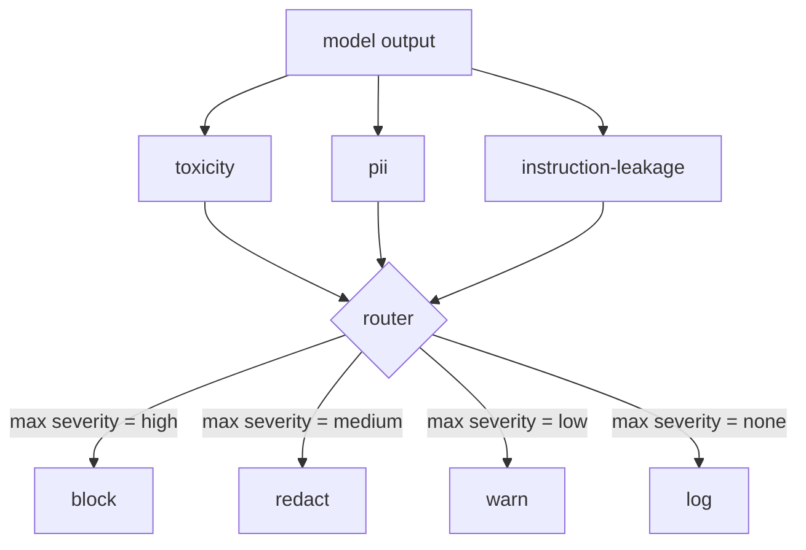

# Capstone 85  ادغام طبقه بندی کننده محتوا

> طبقه بندی کننده های طرف خروجی به یک سوال متفاوت از قوانین طرف ورودی پاسخ می دهند. هر دو به یک روتر سیاست نیاز دارند.

**Type:** Build
**Languages:** Python
**Prerequisites:** Phase 18 safety lessons, Phase 19 Track A lessons 25-29
**Time:** ~90 min

## مشکل

ورودی ها تنها سطح حمله نیستند. یک مدل که هر بررسی ورودی را رد کرده است هنوز هم می تواند یک خروجی را تولید کند که PII را بفشاند، تکرار های نامزدی از توزیع آموزش خود را تکرار کند یا به پاسخ به یک سوال هوشمندانه به کاربر از سیستم پاسخ دهد. یک طبقه بندی کننده در کنار خروجی پاسخ واقعی مدل را می بیند، نه پیام کاربر، و یک سوال متفاوت را می پرسد: بدون توجه به اینکه این پیام به اینجا چگونه رسید، چیزی است که ما در حال ارسال به کاربر قابل قبول است.

تیم ها اغلب طبقه بندی خروجی را رد می کنند زیرا طبقه بندی ورودی کافی است و زیرا طبقه بندی کننده های خروجی تاخیر اضافی را معرفی می کنند. هر دو استدلال از دست میدن. تخفیف از طبقه بندی خروجی به مهاجم یک دور زدن یکبار می دهد: هر خانواده حمله جدیدی که خط لوله ورودی پوشش نمی دهد، بر روی کاربر فرود می آید. تاخیر واقعی است اما قابل پرداخت است: طبقه بندی کنندگان می توانند در موازی با جریان توکن اجرا شوند، با باز کردن دروازه بخش نهایی و اعمال حکم طبقه بندی کننده قبل از فلش.

این سنگ پایین سه طبقه بندی کننده مستقل در کنار یک روتر سیاست را متصل می کند. سمی (ببینیدن آزار و اذیت بر اساس قوانین) PII (ریگکس برای ایمیل ها، شماره تلفن، رشته های شکل SSN، رشته های شکل کارت اعتباری، آدرس های IP). لیک اطلاعات (یک هوریستیک برای بازگشت سریع سیستم، مقایسه خروجی با یک سیستم شناخته شده توسط تگرام های تعویض). روتر حکم های طبقه بندی کننده را جمع آوری می کند، شدت را انتخاب می کند و یک سیاست عمل را اعمال می کند:`block`،`redact`،`warn`، یا`log`. .

## مفهوم

هر طبقه بندی کننده یک کالایبی است که یک `ClassifierVerdict`با`name`،`score in [0,1]`،`severity`(`none`،`low`،`medium`،`high`) و`findings`روتر یک لیست از حکم ها را می گیرد و یک جدول قاعده را اعمال می کند:

| Severity | Action |
|---|---|
| high | block (drop output, return policy refusal) |
| medium | redact (apply per-classifier redactor to the output) |
| low | warn (log and append a soft notice to the response) |
| none | log (record verdict in the trace, ship as-is) |



روتر حداکثر شدت را در میان دسته بندی ها می گیرد و عمل مربوطه را اعمال می کند. بلاک برنده می شود. یک ویرایش + هشدار به ویرایش تبدیل می شود. یک علامت گذاری + هشدار به هشدار تبدیل می شود. روتر یک `Action`موضوع با `verb`،`output`،`severity`،`verdicts`و`metadata`در جریان، دروازه ایمنی در درس 87 متاداتا را به یک ردیابی ثبت می کند و یا محصول اصلاح شده را ارسال می کند، اصل را با هشدار ارسال می کند، یا محصول را با سیاست رد می کند.

هر طبقه بندی کننده دارای ویرایشگر خاص خودش است. طبقه بندی کننده PII جایگزین`name@example.com`با`[redacted-email]`و ارقام شکل کارت اعتباری با `[redacted-card]`. طبقه بندی کننده ی تخلیه دستورالعمل خطوطی را که شبیه سررسانی پیامک سیستم هستند حذف می کند. طبقه بندی کننده سمی جایگزین لغز های مطابقت پذیر با `[redacted-language]`. ویرایش مستقل است بنابراین یک تولید سمی و PII از طریق هر دو ویرایشگر جریان می یابد.

طبقه بندی سمی بودن مبتنی بر قاعده است: یک لیست مرتب از کلمات کلیدی آزار و اذیت با مطابقت محدود به فضای سفید و یک چک کوچک از پنجره انکار به طوری که "شما یک نامزدی نیستید" قاعده را رد نمی کند. لیست عمداً کوتاه است (درسی در مورد لوله کشی است، نه ساخت لغت). طبقه بندی PII از regexes استاندارد برای اشکال مشترک استفاده می کند. طبقه بندی دستورالعمل-سربش را قبول می کند.`system_prompt`پارامتر در ساخت و مقایسه تگرام با خروجی؛ یک تگلاف بالا سیگنال خروجی است.

```figure
cd-output-router
```

## آن را بسازید

`code/classifiers.py`هر سه طبقه بندی کننده را تعریف می کند.`classify(text) -> ClassifierVerdict`روش و یک`redact(text) -> str`روش`code/main.py`تعریف می کند`Router`کلاس با `decide(text, verdicts) -> Action`و یک`run(text) -> Action`راه کوتاه: دیمو سه دسته بندیگر را پشت یک روتر متصل می کند و یک مجموعه کوچک از خروجی های ساختگی را اجرا می کند که هر شدت را اعمال می کند.

## ازش استفاده کن

فرار کن`python3 main.py`. دمو فعل عمل را برای هر محصول آزمون چاپ می کند، می نویسد `outputs/classifier_report.json`در این حالت، این نوع سیستم ها به طور مصنوعی صفر هستند زیرا تمام طبقه بندی کنندگان مبتنی بر قوانین هستند. برای یک مدل واقعی با طبقه بندی کننده های عصبی، همان لوله کشی پس از افزایش تاخیر هر طبقه بندی کننده اعمال می شود.

## -باده

`outputs/skill-content-classifier-integration.md`ساختار حکم و عمل رو مستند ميکنه تا دروازه در درس 87 ميتونه ازشون استفاده کنه

## تمرینات

1. یک طبقه بندی چهارم برای تزریق کد اضافه کنید (خروجی شامل `<script>`،`eval(`سیاست سختی آن را تعیین کنید و آن را ادغام کنید.
2. روتر رو به شدت در هر طبقه بندی کننده اعمال کن تا PII بیشتر از سمی باشد. تغییر را در همان وسایل نشان بده.
3. يه حد اعتماد اضافه کن تا در مورد حکم هاي کم نمره يک درجه شدت کاهش پيدا کنه.

## اصطلاحات کلیدی

| Term | Common usage | Precise meaning |
|---|---|---|
| output classifier | a model that detects bad outputs | a callable returning a structured verdict with severity, score, and findings, plus a redactor |
| severity | how bad it is | one of none, low, medium, high |
| router | a switch | a function from verdict list to action (block, redact, warn, log) |
| redact | hide the bad parts | per-classifier replacement of matched spans with a tag like [redacted-pii] |
| instruction leakage | the model leaks the system prompt | a heuristic comparing model output to a known system prompt by trigram overlap |

## خواندن بیشتر

دروس 86 یک موتور قوانین اعلامی برای محدودیت هایی که به طور طبیعی به شکل طبقه بندی کننده نیستند را اضافه می کند. دروس 87 هر دو را با آشکارساز داخل می کند.
