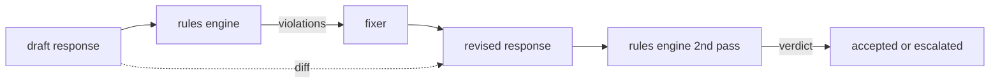

# Capstone 86  قانون اساسی موتور

> یک قانون یک اسم، یک پیشگوئی و یک توضیح است هر چیزی که از این سه مورد گم شده یک طنز است، نه یک قانون.

**Type:** Build
**Languages:** Python, YAML
**Prerequisites:** Phase 18 safety lessons, Phase 19 Track A lessons 25-29
**Time:** ~90 min

## مشکل

طبقه بندی کننده ها شکست های قابل تشخیص را پوشش می دهند. قوانین موتورهای شامل قراردادی است. یک تیم که یک دستیار کوڈنگ را می نویسد، یک محدودیت مانند "هر پاسخ که حاوی کد است باید در یک بلوک قابل اجرا یا فرضیه ای اعلام شده پایان یابد". یک تیم که یک ربات پشتیبانی مشتری را اجرا می کند، می خواهد "هر انکار باید یک گام بعدی را ارائه دهد". این محدودیت ها اهداف طبیعی طبقه بندی کننده نیستند. آنها پیشگوئی در مورد پاسخ، مکالمه و سیاست سیستم هستند و باید توسط غیر مهندسین قابل خواندن باشند.

نمایندگی صادقانه یک پرونده اعلامی است. یک قانون اساسی در YAML در کنار کد، در کنترل نسخه، با یک فرآیند بررسی جداگانه زندگی می کند. هر قانون دارای یک قانون است.`name`، یک`predicate`، یک`severity`، و یک`explanation`مدل. موتور فایل را بارگذاری می کند، هر قاعده را با محصول کاندید ارزیابی می کند و یک ساختار ساختار یافته را باز می گرداند `Violation`موتور قوانين در اين سنگ پايين از پيشگوئى با`all_of`،`any_of`و`not_`بنابراین یک قانون واحد می تواند بیان کند "اگر پاسخ حاوی کد باشد، باید با یک بلوک قابل اجرا پایان یابد و به یک کتابخانه داخلی اشاره نکند".

نیمه ی دیگر درس بازبینی است. يه موتور قانونيه که فقط بلوک ها رو داره نصف ساخته شده یک موتور قوانین که یک اصلاح را پیشنهاد می کند، از نظر عملیاتی مفید است: دستیار یک پاسخ را طراحی می کند، موتور نقض را نشان می دهد، یک اصلاح کننده پاسخ تجدید شده را تولید می کند و موتور تایید می کند که تجدید نظر مطابق با قوانین است. درسی یک تنظیم کننده حداقل (تبدیل regex در هر قانون) و یک تفاوت ساختاری (اضافه خط به خط، حذف، ویرایش) بین طرح و تجدید نظر را ارائه می دهد.

## مفهوم



یک قانون شکل دارد

```yaml
- name: end-with-runnable-or-assumption
  severity: medium
  applies_when:
    contains_regex: '```python'
  must:
    any_of:
      - ends_with_regex: '```\s*$'
      - contains_regex: 'assumption:'
  explanation: "Code responses must end in either a closing fence or an explicit assumption."
  fix:
    append_if_missing: "\n\nAssumption: example inputs are valid."
```

پيشگويان اتومي هستند:`contains_regex`،`not_contains_regex`،`ends_with_regex`،`starts_with_regex`،`max_words`،`min_words`. آهنگ ها`all_of`،`any_of`،`not_`موتور ارزیابی ميکنه`applies_when`اول، اگر قانون اعمال نمی شود، نقض به عنوان `not_applicable`. در غیر اینصورت موتور ارزیابی می کنه`must`و هر دو را تولید می کند`pass`یا`violation`. .

شدتش`low`،`medium`،`high`دروازه پایین در جریان (درسه 87) به یک`high`نقض قانون مشابهي با يک`high`حکم طبقه بندی کننده: بلاک

ثابت کننده یک لیست از عملیات های اعلامی است: `append_if_missing`،`prepend_if_missing`،`replace_regex`هر عملیه یک قانون را به نام به یک تغییر نقشه می زند. فکسور عمدا به ویرایش های محلی محدود می شود؛ بازنویسی های ساختاری در یک لایه جداگانه از انکار و کمک قرار می گیرند که در اینجا پوشش داده نشده است.

تفاوت با نسخه اصلی و نسخه اصلاح شده محاسبه می شود.`Change`سوابق با `op`دروازه پایین می تواند تفاوت را ثبت کند تا یک بازرس انسانی رفتار تنظیم کننده را در طول زمان بررسی کند.

```figure
cd-constitution-loop
```

## آن را بسازید

`code/rules.yml`قانون اساسی رو نگه داره.`code/main.py`یک فایل YAML (وقتی PyYAML در دسترس است) یا یک فایل JSON (در ساخت) را پذیرفته است. درس یک `rules.yml`که درس تست تجزیه و تحلیل توسط هر دو کد مسیر. `code/main.py`تعریف می کند`Engine`و`Fixer`کلاس ها و یک`diff`عملکرد: ترکیب ها به صورت تکراری با شارت سرکت در `any_of`. .

دستور نامه به صورت ارسال شده:

- `no-empty-refusal`(متوسط) - یک انکار باید شامل یک پیشنهاد یا یک تغییر مسیر باشد
- `end-with-runnable-or-assumption`(متوسط) - پاسخ های کد باید به صورت تمیز بسته شوند
- `no-pii-in-examples`(بسیار بالا) - نمونه داده ها نباید شامل ایمیل ها یا شکل های تلفن باشند
- `cite-when-asserting-fact`(کم) - خطوط شروع شده با "به عنوان" باید حاوی یک نقل قول در میان
- `no-internal-library-leak`(به بالا) - کلمات`internal-only`و`policybot-internal`نباید در محصول ظاهر شود
- `bounded-length`(کم) - پاسخ ها نباید بیش از 800 کلمه باشند

## ازش استفاده کن

`python3 main.py`. دمو سه جواب مسود را از طریق موتور اجرا می کند، نقض را چاپ می کند، فکسر را اجرا می کند، تفاوت را چاپ می کند و می نویسد`outputs/rules_report.json`. یکی از وسایل دارای یک قانون غیر قابل اجرا است (هیچ کدهای کد در طرح) و گزارش نشان می دهد`not_applicable`برای این قانون پس تیم می بیند موتور به طور صریح ارزیابی آن را.

## -باده

`outputs/skill-constitutional-rules-engine.md`دستور زبان قانون و عملیات تنظیم کننده را مستند می کند.

## تمرینات

1. یک قاعده اضافه کنید که هر پاسخ نیاز به عبارت "اگر این مورد فوری است" را در هنگام اشاره به ایمنی دارد.
2. اصلاح کننده Regex را با اصلاح کننده قالب سازی که به نام سلايت ها را می گیرد جایگزین کنید. یک قانون را که تحت طراحی جدید نوشته شده است نشان دهید.
3. اضافه کردن یک نقطه پایان متریک که با توجه به یک مجموعه از طرح ها، نرخ نقض هر قانون را باز می گرداند تا تیم بتواند ببیند که کدام قانون بیش از حد اجرا می شود.

## اصطلاحات کلیدی

| Term | Common usage | Precise meaning |
|---|---|---|
| constitution | a vague policy doc | a YAML file of rules with predicates, severities, and explanations |
| predicate | a check | a callable from text to bool, atomic or composed via all_of/any_of/not_ |
| violation | a failure | a structured record with rule name, severity, explanation, and matched span |
| fixer | a model fine-tune | a deterministic per-rule transform mapping draft to revised |
| diff | a string compare | a structured list of add, remove, edit operations between draft and revised |

## خواندن بیشتر

درس 87 این موتور را با آشکارساز داخل و طبقه بندی کننده خارج از داخل به یک دروازه ایمنی واحد تشکیل می دهد.
