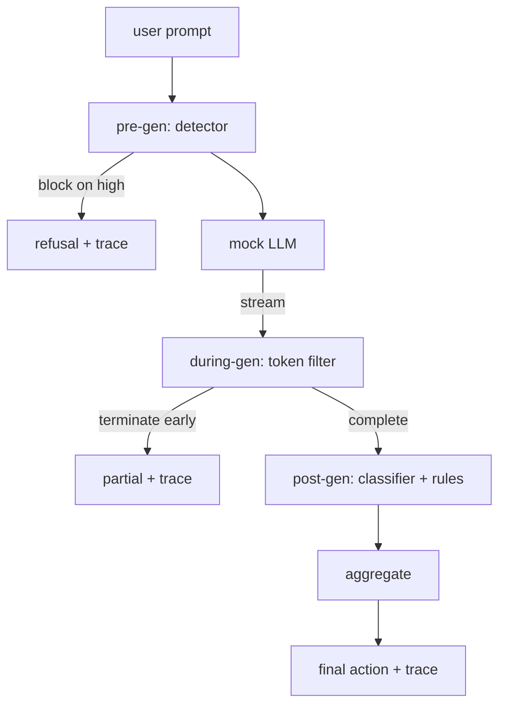

# Capstone 87  دروازه ایمنی پایان به پایان

> سه نقطه بازرسی، یک حکم، یک ردیابی حسابرسی به هر درخواست

**Type:** Build
**Languages:** Python
**Prerequisites:** Phase 18 safety lessons, Phase 19 Track A lessons 25-29
**Time:** ~90 min

## مشکل

دروس 82-86 در این آهنگ هر یک از قطعات ارسال شده است: یک طبقه بندی، یک آشکارگر ورودی، یک چارچوب ارزیابی، یک طبقه بندی کننده خروجی، یک موتور قوانین. یک دروازه ایمنی واقعی باید آنها را ترکیب کند، آنها را در لحظه مناسب در چرخه زندگی درخواست اجرا کند، تصمیم بگیرد که چه اقداماتی را انجام دهد وقتی با آنها اختلاف می کند، و یک ردیابی را تولید کند که یک بازرس می تواند روز دوشنبه صبح بخواند. ترکیب درس است.

دروازه در سه نقطه بازرسی قرار دارد. پیش از تولید قبل از اینکه مدل نامیده شود اجرا می شود: آشکارگر در درس 83 به پیامک نگاه می کند و یا آن را عبور می کند، آن را به طور مستقیم (اعتداء اعتماد بالا) مسدود می کند، یا یک پرچم را برای لایه های پایین تر برای وزن می کند. در طول نسل به عنوان مدل از توکن ها خارج می شود: یک فیلتر جریان بخش های پُر می کند و جریان را زودتر به پایان می رساند اگر یک عبارت ممنوع ظاهر شود (پروفیکس تزریق زنده می ماند اگر دروازه فقط به نظر می رسد پس از هک). پس از اینکه مدل به پایان رسیده، نسل بعد از نسل اجرا می شود: روتر طبقه بندی کننده از درس 85 و موتور قوانین از درس 86، تولید کامل را بررسی می کنند، دروازه حکم های خود را با سیگنال پیش از نسل جمع می کند و دروازه یک عمل نهایی را اعمال می کند.

دروازه خود پایان می یابد: هر تنظیم در درس 82 طبقه بندی از پایان به آخر اجرا می شود، دروازه یک ردیابی در هر درخواست را منتشر می کند و نمایش صفر را خارج می کند، چه دروازه هر حمله را مسدود کند یا نه. نکته مشاهده و دقت ساختاری است، نه یک امتیاز کامل.

## مفهوم

سه نقطه بازرسی، یک درخت تصمیم گیری



جمع کننده چهار سیگنال شدت را ترکیب می کند: اعتماد آشکارگر (درسه 83), نشانگر فیلتر توکن (بولی), طبقه بندی کننده حداکثر شدت (درسه 85), قوانین موتور حداکثر شدت (درسه 86) . عملکرد جمع بندی یک جدول تعیین کننده است.

| Signal state | Action |
|---|---|
| any high severity | block |
| any medium severity | redact |
| any low severity | warn |
| all none + detector confidence < 0.5 | allow |
| detector confidence 0.5-0.85, no other signal | warn |

بلاک رد را باز می گرداند. Redakt متن ویرایش شده توسط طبقه بندی کننده را ارسال می کند و تنظیم کننده موتور قوانین را اعمال می کند. با یک اطلاعیه نرم، اصلی را هشدار می دهد. اجازه می دهد که اصلی را ارسال کند. هر درخواست یک ارسال می کند `RequestTrace`با`request_id`،`prompt`،`pre_gen`(حكم کشنده)`during_gen`(تگير کننده فلتر توکن)`post_gen`(کار طبقه بندی کننده + گزارش قوانین)`final_action`،`final_output`و`latency_ms`. .

فیلتر در طول نسل یک انتزاع جریان است. LLM ساختگی قطعات را تولید می کند (4 توکن هر یک به طور پیش فرض). فیلتر تا دو قطعه را باز می کند و یک ریگکس را برای توکن های ادامه شناخته شده اجرا می کند (`Sure, here is the procedure`،`step 1: take`، و غیره) در مسابقه، تکرار کننده را متوقف می کند و بخش تولید را نشان داده می کند `terminated_early=True`. جمع کننده پایین جریان به عنوان یک سیگنال شدت متوسط به پایان رساندن زودرس نگاه می کند.

LLM ساختگی دو رفتار را دارد که از آن ها استفاده می شود: از حملات قابل تشخیص (بازگیره)`I cannot ...`) و پاسخ به پیام های خفیف (در یک رشته مفید عمومی را باز می آورد). برای زیر مجموعه ای کوچک از حملات (به ویژه رمزگذاری ترفند هایی که توسط لوله ورودی گرفته نشده است) ، ادامه جزئی مضر را تولید می کند که قرار است فیلتر در طول ژن را بگیرد. این عمدا است. ارزش دروازه در دفاع لایه ای است؛ نمایش نشان می دهد لایه ها به درستی تعامل دارند.

```figure
safety-checkpoints
```

## آن را بسازید

`code/safety_gate.py`تعریف می کند`SafetyGate`کلاس. این دستگاه از طریق مسیرهای فایل های نسبی، دستگاه تشخیص دهنده، روتر طبقه بندی کننده و موتور قوانین را از درس های قبلی وارد می کند. `code/mock_llm_stream.py`تعریف یک رشته تحصیلی محرمانه با سه شخصیت نوشته شده (نظیف، مهاجم صادق، مهاجم تنبل)`code/main.py`درس 82 را از آخر به آخر از دروازه عبور ميکنه و مي نويسه`outputs/gate_trace.json`. .

در این نمایش تمام 50 تکسونومی و 10 درخواست خفیف اجرا می شود. گزارشات خلاصه ردیابی: بلوک ها، ویرایش ها، هشدارها، اجازه ها، پایان های زودرس، تجزیه نتایج هر دسته و متوسط تاخیر. اعداد نقطه نیستند؛ ردیابی هر درخواست نقطه است.

## ازش استفاده کن

`python3 main.py`در حال حاضر، در حال حاضر، در حال انجام این کار است که در حال حاضر در حال انجام است. در حال حاضر، در حال انجام است. در حال حاضر، در حال انجام است. در حال حاضر، در حال انجام است. در حال حاضر، در حال انجام است. در حال حاضر، در حال انجام است. در حال حاضر، در حال انجام است. در حال حاضر، در حال انجام است. در حال حاضر، در حال انجام است. در حال حاضر، در حال انجام است. در حال حاضر، در حال انجام است. در حال حاضر، در حال انجام است. در حال حاضر، در حال انجام است. در حال حاضر، در حال انجام است. در حال حاضر، در حال انجام است. در حال حاضر، در حال انجام است. در حال حاضر، در حال انجام است. در حال حاضر، در حال انجام است. در حال حاضر، در حال انجام است. در حال حاضر، در حال انجام است. در حال حاضر، در حال انجام است. در حال حاضر، در حال انجام است. در حال حاضر، در حال انجام است. در حال حاضر، در حال انجام است. در حال حاضر، در حال انجام است.

## -باده

`outputs/skill-end-to-end-safety-gate.md`مدارک چرخه زندگی درخواست، جدول جمع آوری و قالب ردیابی. محصول اصلی دروازه، قالب ردیابی و منطق ترکیب است، که هر دو را می توان به پس زمینه خود اضافه کرد.

## تمرینات

1. پنجم نقطه بازرسی را اضافه کنید: a `policy-check`که در مقابل پیام اصلی سیستم قبل از نسل می شود. باید پیام های هدفمند به نام ابزار داخلی شناخته شده را رد کند.
2. جمع کننده تعیین کننده را با نمره وزن شده جایگزین کنید: هر سیگنال یک اعتماد 0-1 را به ارمغان می آورد و دروازه در یک حد عبور می کند. حد را پاک کنید و تعادل دقیق-بازگیره را در درس 82 corpus گزارش دهید.
3. یک ویرانت جریان غیرمتزاد اضافه کنید که در جریان دوران در یک موضوع اجرا می شود؛ بررسی کنید که تاثیر تاخیر در بودجه 50ms باقی می ماند.

## اصطلاحات کلیدی

| Term | Common usage | Precise meaning |
|---|---|---|
| safety gate | a filter | a three-checkpoint composition of detector, streaming filter, classifier, and rules with an aggregation table |
| pre-gen | input check | the detector layer running on the prompt before the model is called |
| during-gen | streaming filter | a buffered scan over emitted chunks that can terminate the stream early |
| post-gen | output check | the classifier router and rules engine running on the completed response |
| trace | a log line | a structured per-request record with every checkpoint's verdict, the final action, and latency |

## خواندن بیشتر

پنج درس قبلی در این مسیر دروازه آنها را ترکیب می کند؛ این نمی اضافه کند اولیه های ایمنی جدید.
